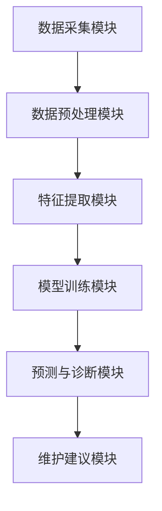

                 

# 智能汽车：AI Agent的预测性维护与故障诊断

## 关键词：智能汽车，AI Agent，预测性维护，故障诊断，机器学习，系统架构

## 摘要：  
本文深入探讨了AI Agent在智能汽车中的应用，重点分析了其在预测性维护与故障诊断中的核心作用。通过结合AI技术与汽车工程，本文详细阐述了预测性维护与故障诊断的原理、算法实现、系统架构设计以及实际应用案例。文章从理论到实践，系统性地展示了如何利用AI Agent提升智能汽车的维护效率和故障诊断能力，为智能汽车的发展提供了有价值的参考。

---

## 第一部分: 智能汽车与AI Agent的背景介绍

### 第1章: 智能汽车的定义与发展

#### 1.1 智能汽车的定义与特点
智能汽车是一种集成先进的传感器、计算平台、软件和网络通信技术，能够实现车辆与外部环境智能交互的新型汽车。其特点包括：
- **智能化**：通过AI技术实现自动驾驶、智能导航等功能。
- **网联化**：车辆能够与其他车辆、道路基础设施和云端系统进行实时通信。
- **电动化**：大多数智能汽车基于电动驱动系统。
- **共享化**：支持共享出行模式，优化资源利用。

#### 1.2 智能汽车的发展现状
全球智能汽车市场正处于快速发展阶段，各国纷纷加大对智能汽车的研发投入。目前，智能汽车的应用主要集中在自动驾驶、智能导航、智能泊车等领域。未来，随着5G、AI和物联网技术的进一步发展，智能汽车将更加普及。

#### 1.3 智能汽车与传统汽车的区别
智能汽车与传统汽车的主要区别在于：
- **技术基础**：智能汽车依赖于AI、大数据和物联网技术，而传统汽车主要依赖机械和电子技术。
- **功能**：智能汽车具备自动驾驶、智能交互等功能，而传统汽车主要依靠人工操作。
- **数据处理能力**：智能汽车能够实时处理大量数据，而传统汽车的数据处理能力有限。

### 第2章: AI Agent在智能汽车中的应用

#### 2.1 AI Agent的定义与特点
AI Agent是一种能够感知环境、自主决策并执行任务的智能体。其特点包括：
- **自主性**：能够在没有人工干预的情况下自主完成任务。
- **反应性**：能够实时感知环境变化并做出反应。
- **学习能力**：能够通过数据学习和优化自身性能。

#### 2.2 AI Agent在智能汽车中的作用
AI Agent在智能汽车中的主要作用包括：
- **预测性维护**：通过分析车辆运行数据，预测潜在故障，提前进行维护。
- **故障诊断**：当车辆出现故障时，AI Agent能够快速定位问题并提供解决方案。
- **优化性能**：通过数据分析和优化算法，提升车辆的运行效率和驾驶体验。

---

## 第二部分: AI Agent的预测性维护与故障诊断核心概念

### 第3章: 预测性维护的核心原理

#### 3.1 预测性维护的基本概念
预测性维护是一种基于数据分析和预测模型的维护策略，旨在通过预测设备的故障概率来优化维护计划。其核心在于通过实时数据采集和分析，提前发现潜在问题。

#### 3.2 AI Agent在预测性维护中的应用
AI Agent在预测性维护中的应用流程如下：
1. **数据采集**：通过传感器采集车辆运行数据，如温度、振动、压力等。
2. **数据预处理**：对采集的数据进行清洗、归一化等处理，确保数据质量。
3. **特征提取**：从数据中提取有助于故障预测的特征。
4. **模型训练**：利用机器学习算法训练预测模型。
5. **故障预测**：基于模型对潜在故障进行预测，并生成维护建议。

### 第4章: 故障诊断的核心原理

#### 4.1 故障诊断的基本概念
故障诊断是一种通过分析设备运行数据，识别和定位设备故障的技术。其核心在于通过数据分析和模型推理，确定故障的根本原因。

#### 4.2 AI Agent在故障诊断中的应用
AI Agent在故障诊断中的应用流程如下：
1. **数据采集**：通过传感器采集车辆运行数据。
2. **数据分析**：利用机器学习算法对数据进行分析，识别异常模式。
3. **故障定位**：通过推理和诊断算法，确定故障的具体位置和原因。
4. **解决方案建议**：基于诊断结果，生成修复建议或优化方案。

---

## 第三部分: AI Agent的预测性维护与故障诊断算法原理

### 第5章: 预测性维护的算法原理

#### 5.1 数据采集与预处理
- **数据采集**：通过车辆传感器采集运行数据。
- **数据清洗**：去除噪声数据和异常值。
- **特征提取**：提取有助于故障预测的特征，如振动频率、温度变化等。

#### 5.2 基于AI的预测模型
- **机器学习模型**：常用的模型包括随机森林、支持向量机（SVM）和神经网络。
- **模型训练**：利用历史故障数据训练模型，优化参数。
- **预测与评估**：基于训练好的模型对潜在故障进行预测，并评估预测的准确性。

### 第6章: 故障诊断的算法原理

#### 6.1 数据分析与特征提取
- **数据分析**：通过统计分析和可视化工具，识别数据中的异常模式。
- **特征提取**：提取有助于故障诊断的特征，如信号波形、频谱分析等。

#### 6.2 基于AI的诊断模型
- **诊断算法**：常用的算法包括决策树、逻辑回归和深度学习模型。
- **模型训练**：利用历史故障数据训练模型，优化诊断准确率。
- **故障定位与解决方案**：基于诊断结果，确定故障原因并生成修复建议。

---

## 第四部分: 系统架构与项目实战

### 第7章: 系统架构设计

#### 7.1 系统功能设计
- **数据采集模块**：负责采集车辆运行数据。
- **AI Agent处理模块**：负责数据分析、模型推理和决策。
- **诊断与维护模块**：负责故障诊断和维护计划生成。

#### 7.2 系统架构图

### 第8章: 项目实战

#### 8.1 项目背景
本项目旨在开发一个基于AI Agent的预测性维护与故障诊断系统，应用于智能汽车的发动机故障诊断。

#### 8.2 系统实现
- **环境配置**：安装Python、TensorFlow、Keras等开发工具。
- **数据采集与处理**：通过传感器采集发动机运行数据，进行预处理和特征提取。
- **模型训练**：利用随机森林算法训练故障预测模型。
- **故障诊断**：基于训练好的模型，对发动机故障进行诊断和定位。

#### 8.3 实验结果与分析
通过实验验证，基于AI Agent的预测性维护与故障诊断系统能够有效预测发动机故障，并快速定位故障原因。与传统方法相比，该系统具有更高的准确性和效率。

---

## 第五部分: 最佳实践与总结

### 第9章: 最佳实践

#### 9.1 数据质量管理
确保数据的准确性和完整性，是AI Agent预测性维护与故障诊断系统的关键。

#### 9.2 模型优化
通过不断优化模型参数和算法，提升系统的预测和诊断能力。

#### 9.3 系统集成
将AI Agent系统与车辆的其他系统进行无缝集成，提升整体性能。

### 第10章: 总结与展望

#### 10.1 总结
本文详细探讨了AI Agent在智能汽车预测性维护与故障诊断中的应用，展示了其在提升车辆维护效率和故障诊断能力方面的巨大潜力。

#### 10.2 展望
未来，随着AI技术的不断发展，智能汽车的预测性维护与故障诊断将更加智能化和高效化。同时，AI Agent在其他领域的应用也将进一步拓展，推动智能化技术的广泛应用。

---

## 作者：AI天才研究院/AI Genius Institute & 禅与计算机程序设计艺术 /Zen And The Art of Computer Programming

