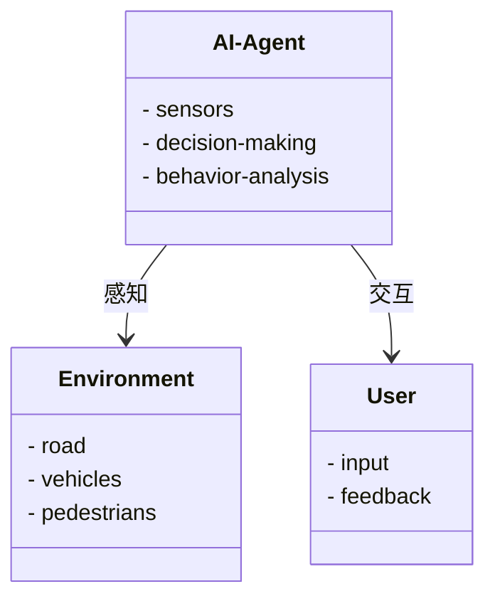
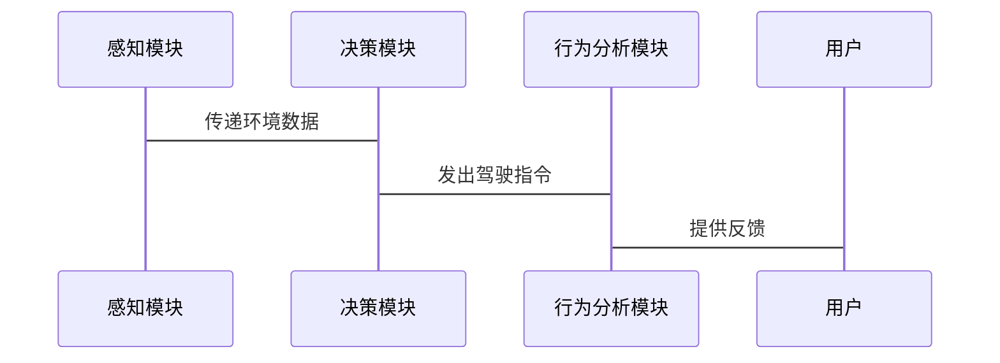

                 


# 智能汽车：AI Agent的驾驶行为分析

---

## 关键词
- 智能汽车
- AI Agent
- 驾驶行为分析
- 自动驾驶
- 人工智能
- 算法原理
- 系统架构

---

## 摘要
智能汽车作为未来出行的重要发展方向，AI Agent（人工智能代理）在其中扮演着关键角色。本文从AI Agent的定义、核心原理、算法技术、系统架构到实际应用案例，全面分析智能汽车中AI Agent的驾驶行为，探讨其在提升驾驶安全、效率和用户体验方面的重要作用。通过详细的技术解析和实际案例分析，本文为读者提供了一个从理论到实践的完整视角，帮助理解智能汽车AI Agent的驾驶行为分析技术及其未来发展趋势。

---

## 第一部分：智能汽车与AI Agent的背景介绍

### 第1章：智能汽车的发展与AI Agent的引入

#### 1.1 智能汽车的定义与发展趋势
##### 1.1.1 传统汽车到智能汽车的演进
传统汽车通过机械和电子技术实现基本的驾驶功能，而智能汽车则通过AI技术实现更高级的自动驾驶和智能交互。智能汽车不仅仅是交通工具，更是集成了传感器、计算平台和AI算法的智能终端。

##### 1.1.2 AI Agent在智能汽车中的角色
AI Agent作为智能汽车的核心，负责处理来自传感器的实时数据，分析环境信息，并做出相应的决策。它是连接车辆、环境和用户的桥梁。

##### 1.1.3 智能汽车的市场前景与挑战
智能汽车市场潜力巨大，但同时也面临技术、法规和伦理等多方面的挑战。AI Agent的技术成熟度和安全性是推动智能汽车发展的关键因素。

#### 1.2 AI Agent的核心概念
##### 1.2.1 AI Agent的定义与特点
AI Agent是一种智能实体，能够感知环境、自主决策并执行任务。在智能汽车中，AI Agent通过传感器数据、地图信息和用户输入来做出驾驶决策。

##### 1.2.2 AI Agent在智能汽车中的应用场景
- 自动驾驶：AI Agent通过深度学习和强化学习实现车辆的自动驾驶。
- 智能交互：AI Agent与用户进行自然语言交互，提供个性化的驾驶服务。
- 环境感知：AI Agent实时感知周围环境，避免交通事故。

##### 1.2.3 AI Agent与传统自动驾驶技术的对比
传统自动驾驶技术依赖于预设的规则和路径规划，而AI Agent通过学习和经验积累，能够更好地适应复杂的驾驶环境。

#### 1.3 智能汽车中的AI Agent技术基础
##### 1.3.1 传感器与数据采集技术
AI Agent通过激光雷达、摄像头和雷达等传感器采集环境数据，并通过融合技术处理多源数据。

##### 1.3.2 数据处理与分析技术
AI Agent利用深度学习和强化学习算法，对传感器数据进行处理和分析，提取有用的环境信息。

##### 1.3.3 AI算法在驾驶行为中的应用
AI算法如CNN、RNN和Transformer等，在驾驶行为分析中发挥重要作用。例如，CNN用于图像识别，RNN用于时间序列数据处理。

#### 1.4 AI Agent的应用价值
##### 1.4.1 提高驾驶安全性
AI Agent能够实时感知和预测潜在危险，显著降低交通事故的发生率。

##### 1.4.2 提升驾驶效率
通过优化路径规划和驾驶策略，AI Agent能够提高驾驶效率，减少能源消耗。

##### 1.4.3 优化用户体验
AI Agent通过智能交互和个性化服务，为用户提供更舒适的驾驶体验。

#### 1.5 本章小结
本章介绍了智能汽车的发展趋势、AI Agent的核心概念及其在智能汽车中的应用场景。AI Agent作为智能汽车的核心技术，正在推动驾驶行为分析进入新的阶段。

---

## 第二部分：AI Agent的驾驶行为分析核心概念

### 第2章：AI Agent的驾驶行为分析原理

#### 2.1 AI Agent的感知系统
##### 2.1.1 传感器数据的采集与处理
AI Agent通过激光雷达、摄像头和雷达等传感器采集环境数据，并利用数据融合技术处理多源数据。

##### 2.1.2 多源数据融合技术
多源数据融合技术（如加权融合）能够提高环境感知的准确性和可靠性。

##### 2.1.3 环境感知模型的构建
通过深度学习构建环境感知模型，AI Agent能够识别道路、车辆、行人等元素。

#### 2.2 AI Agent的决策系统
##### 2.2.1 基于规则的决策算法
基于规则的决策算法通过预设的规则实现简单的驾驶行为，适用于低复杂度场景。

##### 2.2.2 基于深度学习的决策模型
深度学习模型能够学习复杂的驾驶场景，做出更智能的决策。

##### 2.2.3 决策系统的优化与改进
通过强化学习和参数调优，AI Agent的决策系统能够不断提高决策的准确性和效率。

#### 2.3 AI Agent的行为分析模型
##### 2.3.1 行为分析模型的构建
行为分析模型通过学习驾驶数据，构建驾驶行为的数学模型。

##### 2.3.2 行为预测算法的实现
基于时间序列分析的行为预测算法，能够预测驾驶员的下一步动作。

##### 2.3.3 行为分析的评估指标
评估指标如准确率、召回率等，用于衡量行为分析模型的性能。

#### 2.4 本章小结
本章详细介绍了AI Agent的感知系统和决策系统，探讨了行为分析模型的构建与优化。AI Agent通过感知、决策和行为分析，实现对驾驶行为的全面分析。

---

## 第三部分：AI Agent驾驶行为分析的算法原理

### 第3章：基于深度学习的驾驶行为分析

#### 3.1 深度学习在驾驶行为分析中的应用
##### 3.1.1 CNN在图像识别中的应用
卷积神经网络（CNN）用于处理图像数据，识别道路标志和障碍物。

##### 3.1.2 RNN在时序数据处理中的应用
循环神经网络（RNN）用于处理时间序列数据，分析驾驶行为的时序特征。

##### 3.1.3 Transformer在行为预测中的应用
Transformer通过全局上下文建模，提升行为预测的准确性。

#### 3.2 基于强化学习的驾驶行为优化
##### 3.2.1 强化学习的基本原理
强化学习通过奖励机制优化AI Agent的决策策略。

##### 3.2.2 在驾驶行为优化中的应用
强化学习用于优化路径规划和驾驶策略，提升驾驶效率。

##### 3.2.3 策略网络的训练与调优
通过神经网络架构搜索（NAS）等技术，优化策略网络的性能。

#### 3.3 基于目标检测的驾驶行为分析
##### 3.3.1 目标检测算法的原理
目标检测算法（如YOLO）用于检测道路中的目标物，如车辆和行人。

##### 3.3.2 在驾驶场景中的应用
目标检测用于实时监测周围环境，提高驾驶安全性。

##### 3.3.3 行为分析的算法实现
通过目标检测和跟踪技术，实现对驾驶行为的实时分析。

---

## 第四部分：系统分析与架构设计方案

### 第4章：智能汽车AI Agent的系统架构设计

#### 4.1 问题场景介绍
智能汽车AI Agent需要在复杂的驾驶环境中实现感知、决策和行为分析。

#### 4.2 系统功能设计
##### 4.2.1 系统功能模块划分
- 感知模块：负责环境感知
- 决策模块：负责驾驶决策
- 行为分析模块：负责行为预测和优化

##### 4.2.2 系统功能设计的领域模型（Mermaid类图）


#### 4.3 系统架构设计
##### 4.3.1 系统架构设计（Mermaid架构图）
```mermaid
containerDiagram
    container 智能汽车系统 {
        component 感知模块 {
            uses 传感器
        }
        component 决策模块 {
            uses 神经网络
        }
        component 行为分析模块 {
            uses 数据库
        }
    }
```

#### 4.4 系统接口设计
##### 4.4.1 系统接口设计（Mermaid序列图）


#### 4.5 系统交互设计
系统通过传感器、用户输入和反馈实现与环境的交互，确保AI Agent能够实时感知和调整驾驶行为。

---

## 第五部分：项目实战与案例分析

### 第5章：智能汽车AI Agent的项目实战

#### 5.1 环境安装与配置
##### 5.1.1 开发环境
- 操作系统：Linux
- 开发工具：PyCharm
- 依赖库：TensorFlow、Keras、OpenCV

#### 5.2 系统核心实现源代码
##### 5.2.1 感知模块代码
```python
import tensorflow as tf
import cv2

def load_model():
    model = tf.keras.models.load_model('model.h5')
    return model

def感知处理(image):
    processed_image = cv2.resize(image, (224, 224))
    prediction = model.predict(processed_image)
    return prediction
```

##### 5.2.2 决策模块代码
```python
def 决策制定():
    # 通过强化学习优化决策策略
    pass
```

##### 5.2.3 行为分析模块代码
```python
def 行为分析(data):
    # 通过深度学习模型分析驾驶行为
    pass
```

#### 5.3 代码应用解读与分析
##### 5.3.1 代码实现细节
- 感知模块：使用深度学习模型处理图像数据。
- 决策模块：通过强化学习优化决策策略。
- 行为分析模块：分析驾驶行为，预测潜在危险。

#### 5.4 案例分析
##### 5.4.1 案例背景
在一个复杂的交通场景中，AI Agent需要实时感知并做出正确的驾驶决策。

##### 5.4.2 案例分析过程
- 数据采集：通过传感器获取环境数据。
- 数据处理：利用数据融合技术处理多源数据。
- 决策制定：基于深度学习模型做出驾驶决策。
- 行为分析：预测潜在危险并优化驾驶行为。

#### 5.5 项目小结
通过实际项目案例，展示了AI Agent在智能汽车中的应用。代码实现和案例分析帮助读者更好地理解驾驶行为分析的实现过程。

---

## 第六部分：最佳实践与总结

### 第6章：最佳实践与总结

#### 6.1 最佳实践
##### 6.1.1 技术实现
- 选择合适的算法和工具。
- 确保数据质量和多样性。
##### 6.1.2 项目管理
- 合理分配任务，确保项目进度。
- 定期测试和优化。

#### 6.2 小结
智能汽车AI Agent的驾驶行为分析是一个复杂的系统工程，需要结合多种技术实现。通过本文的分析，读者可以全面了解AI Agent在智能汽车中的应用，并为未来的研究和实践提供参考。

#### 6.3 注意事项
- 数据安全：确保驾驶数据的安全性。
- 伦理问题：关注AI Agent的伦理和法律问题。
- 技术创新：持续关注新技术的发展。

#### 6.4 拓展阅读
推荐读者阅读相关领域的书籍和论文，深入了解AI Agent和智能汽车的技术细节。

---

## 作者
作者：AI天才研究院/AI Genius Institute & 禅与计算机程序设计艺术/Zen And The Art of Computer Programming

---

通过本文的详细分析，读者可以深入了解智能汽车AI Agent的驾驶行为分析技术，从理论到实践，全面掌握其核心原理和应用。未来，随着技术的不断发展，AI Agent在智能汽车中的应用将更加广泛和深入。

