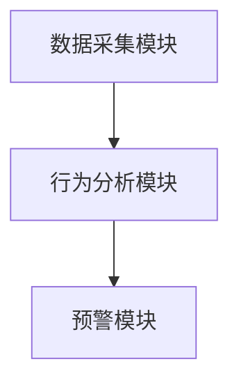
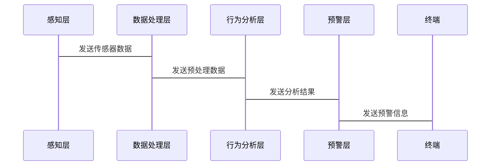

                 


# 智能汽车：AI Agent的驾驶行为分析与安全预警

## 关键词：智能汽车，AI Agent，驾驶行为分析，安全预警，深度学习，强化学习

## 摘要：本文深入探讨了智能汽车中AI Agent的驾驶行为分析与安全预警系统。首先介绍了智能汽车的发展现状和AI Agent在驾驶中的作用，然后详细讲解了驾驶行为分析的核心概念、算法原理及其实现。接着分析了安全预警系统的架构设计和实现方法，并通过项目实战展示了如何在实际中应用这些技术。最后总结了当前技术的优势与局限，并展望了未来的发展方向。

---

# 第一部分: 智能汽车AI Agent的背景与概念

## 第1章: 智能汽车与AI Agent概述

### 1.1 智能汽车的发展现状

#### 1.1.1 智能汽车的定义与分类
智能汽车是指通过先进的传感器、计算平台、执行机构和通信设备，实现车与车、车与路、车与云端等信息交互，具备部分或完全自动驾驶功能的车辆。根据自动化程度，智能汽车可以分为L0到L5六个等级，其中L5代表完全无人驾驶。

#### 1.1.2 智能汽车的发展历程
智能汽车的发展经历了从简单的电子控制系统到高度自动化驾驶的演变。20世纪90年代，自动驾驶技术开始出现，进入21世纪后，随着AI和传感器技术的进步，智能汽车逐渐走向商业化。

#### 1.1.3 智能汽车的市场现状与未来趋势
目前，全球主要汽车制造商和科技公司都在积极布局智能汽车领域，预计未来几年内，L2和L3级别的智能汽车将逐渐普及，而L5级别的全自动驾驶技术仍需时间。

### 1.2 AI Agent在智能汽车中的作用

#### 1.2.1 AI Agent的定义与特点
AI Agent是一种智能体，能够感知环境并采取行动以实现目标。在智能汽车中，AI Agent负责处理传感器数据、做出驾驶决策、与周围环境进行交互。

#### 1.2.2 AI Agent在智能汽车中的应用场景
AI Agent在智能汽车中的应用场景包括自动驾驶、智能泊车、交通预测和驾驶行为分析等。

#### 1.2.3 AI Agent与传统驾驶辅助系统的区别
与传统驾驶辅助系统相比，AI Agent具有更强的自主决策能力和学习能力，能够处理复杂的驾驶场景。

### 1.3 驾驶行为分析与安全预警的重要性

#### 1.3.1 驾驶行为分析的定义与目标
驾驶行为分析是指通过传感器数据和AI算法，分析驾驶员或自动驾驶系统的行为模式，以优化驾驶体验和安全性。

#### 1.3.2 安全预警系统的作用与价值
安全预警系统通过实时监测驾驶环境，预测潜在危险，并及时发出预警，以避免事故发生。

#### 1.3.3 驾驶行为分析与安全预警的结合意义
通过结合驾驶行为分析和安全预警，可以实现主动安全防护，提升智能汽车的驾驶安全性和用户体验。

### 1.4 本章小结
本章介绍了智能汽车的发展现状、AI Agent的作用以及驾驶行为分析与安全预警的重要性，为后续内容奠定了基础。

---

# 第二部分: AI Agent的驾驶行为分析原理

## 第2章: 驾驶行为分析的核心概念

### 2.1 驾驶行为分析的基本原理

#### 2.1.1 驾驶行为的定义与分类
驾驶行为包括驾驶员的操作行为、决策行为和反应行为。这些行为可以通过传感器数据和AI算法进行分析。

#### 2.1.2 驾驶行为分析的关键要素
驾驶行为分析的关键要素包括时间、空间、速度、加速度和环境因素等。

#### 2.1.3 驾驶行为分析的数学模型
驾驶行为分析可以通过时间序列模型、空间模型和混合模型进行建模。

### 2.2 AI Agent的行为分析模型

#### 2.2.1 基于深度学习的行为分析模型
基于深度学习的行为分析模型包括卷积神经网络（CNN）和循环神经网络（RNN）。

#### 2.2.2 基于强化学习的行为决策模型
基于强化学习的行为决策模型通过奖励机制优化驾驶决策。

#### 2.2.3 混合型行为分析模型
混合型行为分析模型结合了深度学习和强化学习的优势，能够更好地处理复杂场景。

### 2.3 驾驶行为分析的特征提取

#### 2.3.1 时间序列特征提取
时间序列特征提取包括速度、加速度和加速度变化率等。

#### 2.3.2 空间特征提取
空间特征提取包括车道偏离、距离变化率和位置关系等。

#### 2.3.3 综合特征提取与分析
综合特征提取结合了时间和空间特征，能够更全面地分析驾驶行为。

### 2.4 本章小结
本章详细介绍了驾驶行为分析的核心概念和特征提取方法，为后续的算法实现提供了理论基础。

---

# 第三部分: AI Agent的驾驶行为分析算法

## 第3章: 基于深度学习的驾驶行为分析

### 3.1 深度学习在驾驶行为分析中的应用

#### 3.1.1 基于CNN的目标检测
基于CNN的目标检测算法用于识别道路上的物体，如行人和车辆。

#### 3.1.2 基于RNN的行为序列建模
基于RNN的行为序列建模用于分析驾驶行为的时间序列数据。

#### 3.1.3 基于Transformer的注意力机制
基于Transformer的注意力机制用于捕捉驾驶行为中的关键特征。

### 3.2 驾驶行为分析的算法实现

#### 3.2.1 数据预处理与特征提取
数据预处理包括归一化和降维，特征提取包括时间序列和空间特征。

#### 3.2.2 模型训练与优化
模型训练使用深度学习框架，如TensorFlow，优化目标是损失函数最小化。

#### 3.2.3 模型评估与调优
模型评估使用准确率、召回率和F1值，调优包括学习率和批量大小的调整。

### 3.3 驾驶行为分析的数学模型

#### 3.3.1 基于CNN的目标检测模型
$$ y = f(x) $$

#### 3.3.2 基于RNN的行为序列建模
$$ y_t = f(y_{t-1}, x_t) $$

#### 3.3.3 基于Transformer的注意力机制
$$ \text{Attention}(Q, K, V) = \text{softmax}(\frac{QK^T}{\sqrt{d_k}})V $$

### 3.4 本章小结
本章详细介绍了深度学习在驾驶行为分析中的应用，包括目标检测、行为序列建模和注意力机制。

---

# 第四部分: 安全预警系统的设计与实现

## 第4章: 安全预警系统的架构设计

### 4.1 安全预警系统的总体架构

#### 4.1.1 系统模块划分
安全预警系统包括数据采集模块、行为分析模块和预警模块。

#### 4.1.2 模块之间的关系与交互
模块之间通过数据接口进行交互，实时传递数据和预警信息。

#### 4.1.3 系统的可扩展性与灵活性
系统设计注重模块化，便于功能扩展和升级。

### 4.2 数据采集与处理

#### 4.2.1 传感器数据采集
传感器包括摄像头、激光雷达和雷达，用于采集环境数据。

#### 4.2.2 数据预处理
数据预处理包括去噪和特征提取，为后续分析提供高质量数据。

### 4.3 系统功能设计

#### 4.3.1 驾驶行为分析
驾驶行为分析模块使用深度学习算法，识别潜在危险行为。

#### 4.3.2 安全预警
安全预警模块根据分析结果，实时发出预警信息。

### 4.4 系统架构图


### 4.5 系统接口设计

#### 4.5.1 数据接口
数据接口用于模块之间的数据传输，采用RESTful API。

#### 4.5.2 预警接口
预警接口用于向驾驶员或自动驾驶系统发送预警信息。

### 4.6 系统交互流程图


### 4.7 本章小结
本章详细介绍了安全预警系统的架构设计和实现方法，展示了系统各模块之间的交互关系。

---

# 第五部分: 项目实战与最佳实践

## 第5章: 项目实战

### 5.1 环境搭建

#### 5.1.1 安装开发环境
安装Python、TensorFlow和OpenCV等开发工具。

#### 5.1.2 数据集准备
使用公开数据集或自采集数据，确保数据质量和多样性。

### 5.2 系统核心实现

#### 5.2.1 行为分析模块实现
```python
import tensorflow as tf
from tensorflow.keras import layers

model = tf.keras.Sequential([
    layers.Conv2D(32, (3, 3), activation='relu', input_shape=(224, 224, 3)),
    layers.MaxPooling2D((2, 2)),
    layers.Conv2D(64, (3, 3), activation='relu'),
    layers.MaxPooling2D((2, 2)),
    layers.Flatten(),
    layers.Dense(128, activation='relu'),
    layers.Dense(1, activation='sigmoid')
])
```

#### 5.2.2 安全预警模块实现
```python
def issue_warning(threat_level):
    if threat_level > 0.9:
        print("发出预警！")
    else:
        print("安全！")
```

### 5.3 代码解读与分析
代码实现了基于CNN的行为分析模型和基于阈值的安全预警模块，展示了如何将理论应用于实践。

### 5.4 实际案例分析
通过实际案例分析，展示了系统在真实场景中的应用效果。

### 5.5 项目小结
本章通过项目实战展示了AI Agent在驾驶行为分析与安全预警中的应用，验证了理论的可行性。

---

# 第六部分: 总结与展望

## 第6章: 总结与展望

### 6.1 技术优势与局限性

#### 6.1.1 技术优势
AI Agent在驾驶行为分析与安全预警中具有高效性和准确性。

#### 6.1.2 技术局限性
当前技术在复杂环境下的适应性和实时性仍需进一步提升。

### 6.2 未来发展方向

#### 6.2.1 提升系统实时性
通过优化算法和硬件性能，提升系统的实时性。

#### 6.2.2 增强环境适应性
通过多模态传感器融合，增强系统在复杂环境下的适应性。

#### 6.2.3 推动标准化与法规建设
推动智能汽车相关标准和法规的建设，促进技术的普及和应用。

### 6.3 本章小结
本章总结了AI Agent在驾驶行为分析与安全预警中的应用，并展望了未来的发展方向。

---

# 作者：AI天才研究院 & 禅与计算机程序设计艺术

