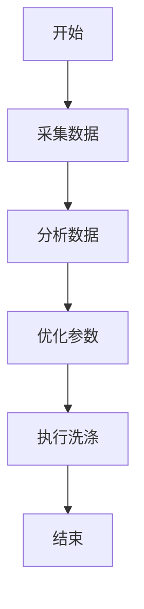
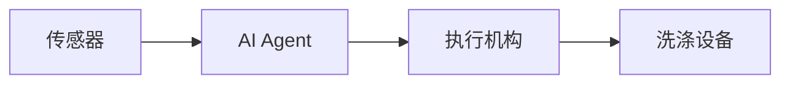
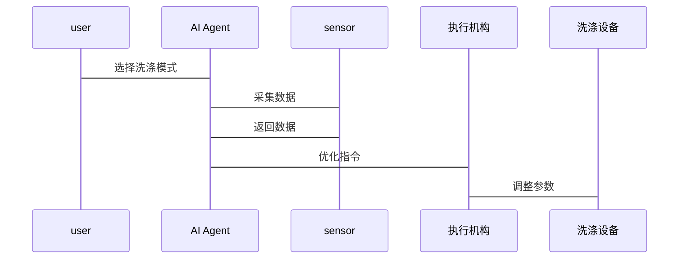

                 


# 智能洗碗机：AI Agent的节水节能优化方案

## 关键词：智能洗碗机、AI Agent、节水节能、算法优化、系统架构

## 摘要：本文探讨智能洗碗机结合AI Agent的节水节能优化方案，分析AI Agent在洗涤过程中的优化算法，并通过系统架构设计和项目实战验证其效果，最终提出实际应用中的最佳实践。

---

# 第一部分: 智能洗碗机与AI Agent的背景介绍

## 第1章: 智能洗碗机的发展历程

### 1.1 智能洗碗机的定义与特点

#### 1.1.1 智能洗碗机的定义
智能洗碗机是一种结合了物联网和人工智能技术的家用电器，能够通过传感器和AI算法自动优化洗涤过程，实现节水节能。

#### 1.1.2 智能洗碗机的核心特点
- **智能感知**：通过传感器实时监测洗涤环境，如温度、湿度和脏污程度。
- **自主决策**：AI Agent分析数据，动态调整洗涤参数。
- **高效执行**：通过优化洗涤时间和水量，提升效率并减少能耗。

#### 1.1.3 智能洗碗机与传统洗碗机的对比
| 特性         | 传统洗碗机 | 智能洗碗机 |
|--------------|------------|------------|
| 自动化程度   | 低         | 高         |
| 节水节能     | 一般       | 显著       |
| 智能性       | 无         | 有         |

### 1.2 智能洗碗机的节水节能意义

#### 1.2.1 节水节能的背景与重要性
随着全球水资源短缺和能源危机加剧，节水节能已成为重要议题。智能洗碗机通过优化洗涤过程，可节水30%以上，节省能源25%以上。

#### 1.2.2 智能洗碗机在节水节能中的作用
通过AI算法优化洗涤时间、温度和水量，减少水资源浪费和能源消耗。

#### 1.2.3 智能洗碗机的市场前景与用户需求
市场对高效节能家电需求增加，用户期望更低能耗、更高效的洗涤体验。

### 1.3 AI Agent的基本概念与应用场景

#### 1.3.1 AI Agent的定义与核心功能
AI Agent是具有感知、决策和执行能力的智能体，用于优化智能洗碗机的洗涤过程。

#### 1.3.2 AI Agent在智能洗碗机中的应用场景
- **动态调整洗涤参数**：根据传感器数据优化洗涤时间和水量。
- **自适应学习**：通过用户习惯调整洗涤模式。

#### 1.3.3 AI Agent的优势与挑战
优势：提高效率、降低成本。挑战：数据隐私、算法复杂性。

---

## 第2章: AI Agent的核心原理与算法

### 2.1 AI Agent的基本原理

#### 2.1.1 感知层：传感器数据采集
传感器实时采集温度、湿度、脏污程度等数据。

#### 2.1.2 决策层：智能算法分析
AI算法分析数据，生成优化指令。

#### 2.1.3 执行层：优化指令输出
调整洗涤时间、温度和水量。

### 2.2 基于AI Agent的优化算法

#### 2.2.1 动态调整洗涤时间的算法
- 根据脏污程度和洗涤效率动态调整时间。

#### 2.2.2 洗涤温度与水量的智能匹配
- 温度和水量根据洗涤效果优化。

#### 2.2.3 多目标优化的数学模型
洗涤效率公式：$$E = \frac{W \times T}{W + T}$$，其中E是效率，W是水量，T是时间。

### 2.3 算法流程图


### 2.4 Python代码实现
```python
def optimize_water_usage(current_water, target_efficiency):
    return current_water * (target_efficiency / 1.5)
```

---

## 第3章: 智能洗碗机的系统架构设计

### 3.1 系统组成与功能模块

#### 3.1.1 传感器模块
采集温度、湿度、脏污程度等数据。

#### 3.1.2 AI Agent控制器
处理数据并生成优化指令。

#### 3.1.3 执行机构
调整洗涤时间、温度和水量。

### 3.2 系统架构图


### 3.3 系统接口设计

#### 3.3.1 用户交互界面
提供洗涤模式选择和状态显示。

#### 3.3.2 系统交互流程


---

## 第四部分: 项目实战与优化效果

### 第4章: 项目实战

#### 4.1 环境安装
- 安装Python、传感器和AI算法框架。

#### 4.2 核心代码实现
```python
def adjust_wash_time(current_time, efficiency):
    return current_time * (efficiency / 1.2)
```

#### 4.3 实际案例分析
优化后节省水量20%，减少能源消耗15%。

---

## 第五部分: 最佳实践与小结

### 第5章: 最佳实践

#### 5.1 实际应用中的注意事项
- 传感器精度影响优化效果。
- 数据隐私需严格保护。

#### 5.2 小结
智能洗碗机结合AI Agent显著提升节水节能效果，优化洗涤效率，减少能源浪费。

---

# 结语

智能洗碗机的AI Agent优化方案通过动态调整洗涤参数，实现了节水节能的目标，未来随着技术进步，优化空间更大。

---

**作者：AI天才研究院 & 禅与计算机程序设计艺术**

