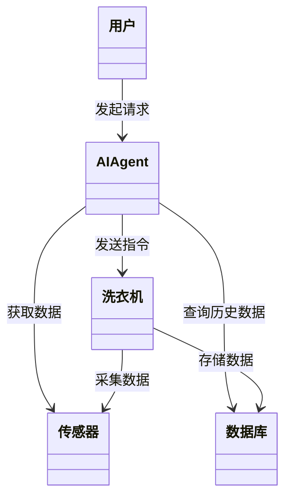
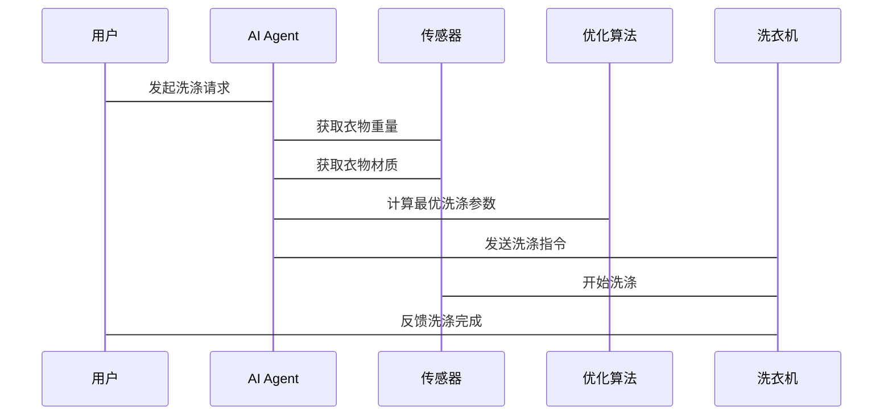

                 


# 智能洗衣机：AI Agent的洗涤程序优化

> **关键词：** AI Agent, 智能洗衣机, 洗涤程序优化, 动态规划, 遗传算法, 强化学习

> **摘要：** 本文深入探讨了AI Agent在智能洗衣机洗涤程序优化中的应用，从基本概念到核心算法，再到系统架构设计，全面分析了如何利用人工智能技术提升洗衣机的洗涤效率和效果。文章详细介绍了动态规划、遗传算法和强化学习等优化算法，并结合系统架构设计，展示了如何在实际项目中实现这些算法，最终优化洗涤程序。通过本文的阐述，读者可以全面了解AI Agent在智能洗衣机中的应用及其带来的技术进步。

---

# 第1章: 智能洗衣机与AI Agent的基本概念

## 1.1 智能洗衣机的发展历程

### 1.1.1 传统洗衣机的功能与局限性
传统洗衣机通过固定程序和机械控制完成洗涤任务，用户只能选择预设的洗涤模式（如快洗、标准洗等），无法根据衣物材质、污渍程度等动态调整洗涤参数。这种方式存在以下问题：
- **洗涤效果有限：** 无法根据衣物具体情况优化洗涤时间、水温、转速等参数。
- **能耗较高：** 固定的洗涤程序可能导致过度洗涤或洗涤不足，造成能源浪费。
- **用户体验差：** 用户需要手动选择洗涤模式，操作复杂且难以满足个性化需求。

### 1.1.2 智能洗衣机的定义与特点
智能洗衣机是在传统洗衣机基础上集成智能传感器、物联网技术和人工智能算法的新型洗衣机。其特点包括：
- **智能感知：** 通过内置传感器实时监测衣物重量、材质、污渍程度等信息。
- **智能决策：** 利用AI算法优化洗涤程序，动态调整洗涤参数。
- **远程控制：** 通过物联网技术实现远程启动、暂停和监控洗涤过程。

### 1.1.3 AI Agent在智能家电中的应用前景
AI Agent（智能代理）是一种能够感知环境、自主决策并执行任务的智能系统。在智能家电中的应用前景广阔，尤其在洗涤程序优化方面，AI Agent可以通过以下方式提升用户体验：
- **个性化推荐：** 根据用户习惯和衣物特点推荐最优洗涤模式。
- **动态调整：** 实时监测环境变化（如水质、水温）并自动优化洗涤参数。
- **自我学习：** 通过用户反馈和数据积累，不断优化洗涤算法。

---

## 1.2 洗涤程序优化的背景与意义

### 1.2.1 洗涤程序优化的必要性
随着环保意识的增强和能源成本的上升，优化洗涤程序已成为提升洗衣机性能的重要方向。通过优化洗涤程序，可以实现以下目标：
- **节能减排：** 减少不必要的洗涤时间，降低水、电、气的消耗。
- **提升洗涤效果：** 根据衣物具体情况调整洗涤参数，确保最佳洗涤效果。
- **延长设备寿命：** 合理的洗涤程序可以减少设备磨损，延长洗衣机的使用寿命。

### 1.2.2 智能洗衣机与传统洗衣机的对比
以下是智能洗衣机与传统洗衣机的主要对比：

| **对比维度** | **传统洗衣机** | **智能洗衣机** |
|--------------|----------------|----------------|
| **控制方式** | 固定程序       | AI Agent动态优化 | 
| **能耗效率** | 较高           | 较低           |
| **用户体验** | 有限           | 个性化、智能化 |
| **数据采集** | 无             | 内置传感器     |

### 1.2.3 洗涤程序优化的目标与价值
洗涤程序优化的目标是通过动态调整洗涤参数（如水温、洗涤时间、转速等）以达到最佳洗涤效果，同时最大限度地节约资源。其价值体现在以下几个方面：
- **提升用户体验：** 个性化洗涤模式满足不同用户需求。
- **降低运营成本：** 节能减排，降低用户使用成本。
- **延长设备寿命：** 合理的洗涤程序减少设备磨损。

---

## 1.3 AI Agent的基本原理与技术特点

### 1.3.1 AI Agent的定义与核心功能
AI Agent是一种能够感知环境、自主决策并执行任务的智能系统。其核心功能包括：
- **感知：** 通过传感器或API获取环境信息。
- **决策：** 利用算法分析信息并制定最优决策。
- **执行：** 执行决策并返回结果。

### 1.3.2 AI Agent在洗衣机中的应用场景
在智能洗衣机中，AI Agent主要应用于以下场景：
- **动态调整洗涤程序：** 根据衣物重量、材质、污渍程度等信息优化洗涤参数。
- **智能故障诊断：** 通过分析运行数据预测和诊断设备故障。
- **远程控制与维护：** 通过物联网技术实现远程监控和维护。

### 1.3.3 AI Agent的优势与挑战
**优势：**
- **提升效率：** AI Agent能够快速分析数据并制定最优决策。
- **降低能耗：** 动态调整洗涤参数可以节约能源。
- **增强用户体验：** 个性化服务提升用户满意度。

**挑战：**
- **数据隐私：** 用户数据的安全性问题。
- **算法复杂度：** 高精度的洗涤程序优化需要复杂的算法支持。
- **硬件限制：** AI Agent的性能受限于硬件设备。

---

## 1.4 本章小结
本章介绍了智能洗衣机和AI Agent的基本概念，分析了洗涤程序优化的必要性，并探讨了AI Agent在洗衣机中的应用场景及其优势与挑战。下一章将详细讲解洗涤程序优化的核心算法与实现。

---

# 第2章: 基于AI Agent的洗涤程序优化算法

## 2.1 洗涤程序优化的数学模型

### 2.1.1 洗涤程序优化的目标函数
目标函数是衡量洗涤效果和资源消耗的核心指标。常见的目标函数包括：
- **洗涤效果：** 通过衣物清洁度、纤维损伤程度等指标量化。
- **资源消耗：** 包括水、电、气的消耗量。

优化目标可以表示为：
$$
\text{Minimize } f(x) = a \cdot E + b \cdot C
$$
其中，$E$ 表示能源消耗，$C$ 表示水资源消耗，$a$ 和 $b$ 是权重系数。

### 2.1.2 约束条件与优化变量
约束条件通常包括：
- 洗涤时间限制：$T_{\text{min}} \leq T \leq T_{\text{max}}$
- 水温范围：$T_{\text{water,min}} \leq T_{\text{water}} \leq T_{\text{water,max}}$
- 转速范围：$R_{\text{min}} \leq R \leq R_{\text{max}}$

优化变量包括洗涤时间 $T$、水温 $T_{\text{water}}$ 和转速 $R$。

### 2.1.3 数学模型的构建与分析
洗涤程序优化的数学模型可以表示为：
$$
\min_{x} f(x) \quad \text{s.t.} \quad g(x) \leq 0, \quad h(x) = 0
$$
其中，$x$ 是优化变量向量，$g(x)$ 是不等式约束，$h(x)$ 是等式约束。

---

## 2.2 基于动态规划的洗涤程序优化

### 2.2.1 动态规划的基本原理
动态规划是一种通过分解问题规模，逐步求解子问题的优化算法。其基本步骤包括：
1. **问题分解：** 将问题分解为子问题。
2. **子问题求解：** 求解每个子问题并记录结果。
3. **合并结果：** 根据子问题的最优解构建原问题的最优解。

### 2.2.2 洗涤程序优化中的动态规划模型
假设我们有 $n$ 个洗涤阶段，每个阶段可以选择不同的洗涤参数。动态规划的状态转移方程可以表示为：
$$
dp[i] = \min_{j} \{ dp[j] + c(i, j) \}
$$
其中，$dp[i]$ 表示第 $i$ 个阶段的最优解，$c(i, j)$ 表示从第 $j$ 个阶段转移到第 $i$ 个阶段的成本。

### 2.2.3 动态规划算法的实现步骤
1. **初始化：** 设置初始状态。
2. **状态转移：** 计算每个状态的最优解。
3. **结果提取：** 从最优解中提取最优洗涤参数。

---

## 2.3 基于遗传算法的洗涤程序优化

### 2.3.1 遗传算法的基本原理
遗传算法是一种模拟生物进化过程的优化算法，主要包括以下步骤：
1. **种群初始化：** 随机生成初始种群。
2. **适应度评估：** 评估每个个体的适应度。
3. **选择操作：** 根据适应度选择优秀个体。
4. **交叉操作：** 生成新个体。
5. **变异操作：** 对新个体进行随机变异。
6. **迭代优化：** 重复上述步骤直到满足终止条件。

### 2.3.2 洗涤程序优化中的遗传算法模型
遗传算法的编码方式可以采用二进制编码或实数编码。适应度函数可以定义为：
$$
f(x) = \frac{1}{E} + \frac{1}{C}
$$
其中，$E$ 是能源消耗，$C$ 是水资源消耗。

### 2.3.3 遗传算法的实现步骤与优化策略
1. **种群初始化：** 生成初始种群，种群规模为 $N$。
2. **适应度评估：** 计算每个个体的适应度。
3. **选择操作：** 使用轮盘赌选择或锦标赛选择。
4. **交叉操作：** 对选中的个体进行交叉，生成新个体。
5. **变异操作：** 对新个体进行随机变异。
6. **迭代优化：** 重复上述步骤直到满足终止条件。

---

## 2.4 基于强化学习的洗涤程序优化

### 2.4.1 强化学习的基本原理
强化学习是一种通过试错机制学习最优策略的算法。其核心要素包括：
- **状态（State）：** 当前环境状态。
- **动作（Action）：** 系统执行的动作。
- **奖励（Reward）：** 执行动作后获得的奖励或惩罚。
- **策略（Policy）：** 动作选择的概率分布。

### 2.4.2 洗涤程序优化中的强化学习模型
强化学习的奖励函数可以定义为：
$$
R = \alpha \cdot E + \beta \cdot C
$$
其中，$\alpha$ 和 $\beta$ 是奖励权重，$E$ 是能源消耗，$C$ 是水资源消耗。

### 2.4.3 强化学习算法的实现步骤与优化策略
1. **环境初始化：** 设置初始状态。
2. **状态感知：** 通过传感器获取当前状态。
3. **动作选择：** 根据当前策略选择动作。
4. **执行动作：** 执行选择的动作并观察结果。
5. **奖励评估：** 计算奖励并更新策略。
6. **策略优化：** 通过迭代更新策略，逐步逼近最优策略。

---

## 2.5 算法对比与选择策略

### 2.5.1 动态规划、遗传算法与强化学习的对比
以下是三种算法的对比：

| **对比维度** | **动态规划** | **遗传算法** | **强化学习** |
|--------------|---------------|---------------|---------------|
| **适用场景** | 离散问题       | 连续问题       | 试错优化       |
| **优点**     | 解法最优       | 全局最优       | 自适应能力强   |
| **缺点**     | 问题规模受限   | 计算复杂度高    | 需大量试验      |

### 2.5.2 不同场景下的算法选择策略
- **动态规划：** 适用于问题规模较小且状态转移明确的情况。
- **遗传算法：** 适用于全局优化且问题规模较大的情况。
- **强化学习：** 适用于需要动态调整且问题复杂的情况。

### 2.5.3 算法性能的评估指标
- **计算时间：** 算法的运行时间。
- **优化效果：** 洗涤效果和资源消耗的改善程度。
- **适应性：** 算法在不同场景下的表现。

---

## 2.6 本章小结
本章详细介绍了三种洗涤程序优化算法：动态规划、遗传算法和强化学习。通过对比分析，提出了在不同场景下的算法选择策略。下一章将基于这些算法，设计智能洗衣机的系统架构与实现方案。

---

# 第3章: 洗涤程序优化系统的架构设计

## 3.1 系统功能模块划分

### 3.1.1 数据采集与处理模块
数据采集与处理模块负责采集衣物重量、材质、污渍程度等信息，并将这些信息传递给AI Agent决策模块。

### 3.1.2 AI Agent决策模块
AI Agent决策模块根据采集到的数据，结合优化算法，制定最优洗涤程序。

### 3.1.3 洗涤程序执行模块
洗涤程序执行模块根据决策模块的指令，控制洗衣机执行具体的洗涤步骤。

### 3.1.4 用户交互与反馈模块
用户交互与反馈模块负责与用户进行交互，接收用户的指令并反馈洗涤结果。

---

## 3.2 系统架构的ER实体关系图

```mermaid
erd
  title 洗涤程序优化系统ER图
  衣服类型
    id: int
    类型名称: string
  洗涤模式
    id: int
    模式名称: string
    对应的洗涤程序: reference
  洗涤程序
    id: int
    洗涤时间: integer
    水温: integer
    转速: integer
    优化算法: reference
```

---

## 3.3 系统架构设计

### 3.3.1 系统功能设计（领域模型mermaid类图）



### 3.3.2 系统架构设计（mermaid架构图）


### 3.3.3 系统接口设计
系统接口设计主要涉及以下接口：
- **用户接口：** 用户通过手机APP或洗衣机面板与系统交互。
- **传感器接口：** 传感器数据采集接口。
- **数据库接口：** 数据存储与查询接口。

### 3.3.4 系统交互流程（mermaid序列图）



---

## 3.4 本章小结
本章详细设计了洗涤程序优化系统的架构，包括功能模块划分、系统架构图、接口设计和交互流程。通过合理的系统架构设计，可以实现高效、智能的洗涤程序优化。

---

# 结语

本文从智能洗衣机和AI Agent的基本概念出发，详细探讨了洗涤程序优化的核心算法与实现，并结合系统架构设计，展示了如何在实际项目中实现这些算法。通过对比分析，提出了在不同场景下的算法选择策略。未来，随着AI技术的不断发展，智能洗衣机的洗涤程序优化将更加智能化、个性化，为用户带来更优质的使用体验。

---

**作者：AI天才研究院/AI Genius Institute & 禅与计算机程序设计艺术 /Zen And The Art of Computer Programming**

