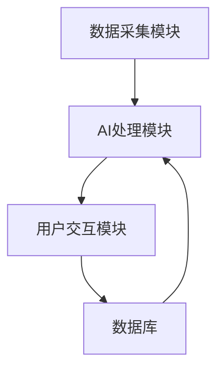

                 


# 智能洗衣机：AI Agent的衣物护理专家系统

---

## 关键词  
智能洗衣机, AI Agent, 衣物护理, 专家系统, 系统架构, 算法原理, 项目实战  

---

## 摘要  
本文深入探讨了智能洗衣机中AI Agent的衣物护理专家系统的原理与实现。通过分析AI Agent的核心概念、算法原理、系统架构以及实际项目案例，本文详细介绍了如何利用AI技术提升洗衣机的智能化水平，实现衣物护理的智能化与个性化。从背景介绍到系统实现，再到项目实战，本文为读者提供了全面的技术解读。

---

## 第一部分: 背景与概述  

### 第1章: 智能洗衣机与AI Agent的背景  

#### 1.1 智能洗衣机的发展历程  
- **1.1.1 传统洗衣机的功能与局限性**  
  传统洗衣机仅能提供固定的洗涤模式，无法根据衣物材质和污渍程度自动调整洗涤参数。  
- **1.1.2 智能洗衣机的定义与特点**  
  智能洗衣机通过传感器、物联网技术与智能算法实现衣物分类、洗涤模式推荐等功能。  
- **1.1.3 AI Agent在智能家电中的应用背景**  
  AI Agent作为一种智能决策系统，能够通过学习和推理优化家电的操作流程。  

#### 1.2 AI Agent的基本概念与特点  
- **1.2.1 什么是AI Agent**  
  AI Agent是一种能够感知环境、自主决策并执行任务的智能实体。  
- **1.2.2 AI Agent的核心特征**  
  - 感知环境  
  - 自主决策  
  - 学习优化  
- **1.2.3 AI Agent与传统软件的区别**  
  AI Agent具备自我学习和适应能力，能够根据环境变化动态调整行为。  

#### 1.3 智能洗衣机中的AI Agent应用现状  
- **1.3.1 当前市场上的智能洗衣机产品分析**  
  当前市场上的智能洗衣机主要通过传感器和简单算法实现基础的智能洗涤功能。  
- **1.3.2 AI Agent在洗衣机中的具体应用案例**  
  AI Agent可以通过分析衣物材质和污渍程度，自动推荐最优洗涤模式。  
- **1.3.3 智能洗衣机与AI Agent的未来发展**  
  未来的智能洗衣机将更加智能化，AI Agent将实现更复杂的衣物护理功能。  

### 第2章: 智能洗衣机中的衣物护理专家系统  

#### 2.1 衣物护理专家系统的定义  
- **2.1.1 衣物护理的定义与重要性**  
  衣物护理是指通过适当的洗涤和维护延长衣物使用寿命的过程。  
- **2.1.2 专家系统的基本概念**  
  专家系统是一种基于知识和推理的智能系统，能够提供专业的决策支持。  
- **2.1.3 衣物护理专家系统的特殊性**  
  衣物护理专家系统需要结合材料科学、洗涤技术和用户需求进行综合决策。  

#### 2.2 衣物护理专家系统的功能模块  
- **2.2.1 智能识别与分类**  
  通过图像识别和传感器数据，自动识别衣物材质和污渍程度。  
- **2.2.2 洗涤模式推荐**  
  根据衣物特性推荐最优洗涤模式，如强洗、快洗等。  
- **2.2.3 故障诊断与维护**  
  通过传感器和历史数据，诊断洗衣机故障并提供维护建议。  

#### 2.3 衣物护理专家系统的实现原理  
- **2.3.1 数据采集与处理**  
  通过传感器和图像识别技术采集衣物信息，进行数据预处理。  
- **2.3.2 知识库构建**  
  构建包含衣物材质、洗涤参数等信息的知识库，支持专家系统的推理过程。  
- **2.3.3 推理与决策机制**  
  基于知识库和当前数据，通过推理算法生成最优决策。  

---

## 第二部分: AI Agent的核心原理  

### 第3章: AI Agent的基本原理  

#### 3.1 AI Agent的核心概念  
- **3.1.1 知识表示**  
  知识表示是AI Agent理解世界的基础，通常采用符号逻辑或概率模型。  
- **3.1.2 逻辑推理**  
  逻辑推理是AI Agent基于知识库进行决策的过程。  
- **3.1.3 行为决策**  
  行为决策是AI Agent根据推理结果执行具体操作的过程。  

#### 3.2 AI Agent的分类与选择  
- **3.2.1 基于规则的AI Agent**  
  基于预定义规则的AI Agent，适用于规则明确的场景。  
- **3.2.2 基于机器学习的AI Agent**  
  通过学习数据生成规则的AI Agent，适用于复杂场景。  
- **3.2.3 基于深度学习的AI Agent**  
  通过神经网络进行深度学习的AI Agent，适用于高度复杂的场景。  

#### 3.3 AI Agent的工作流程  
- **3.3.1 信息感知**  
  通过传感器和数据接口获取环境信息。  
- **3.3.2 知识推理**  
  基于知识库和当前数据进行推理，生成决策建议。  
- **3.3.3 行为决策**  
  根据推理结果选择最优行为，并执行。  

### 第4章: 智能洗衣机中的AI Agent实现  

#### 4.1 智能洗衣机中的数据流分析  
- **4.1.1 用户输入与数据采集**  
  用户通过触摸屏或手机APP输入衣物信息，洗衣机通过传感器采集数据。  
- **4.1.2 数据预处理与特征提取**  
  对采集的数据进行清洗和特征提取，为后续分析做准备。  
- **4.1.3 数据存储与管理**  
  将处理后的数据存储在本地数据库或云端。  

#### 4.2 AI Agent的知识库构建  
- **4.2.1 衣物材质数据库**  
  包含常见衣物材质的特性信息，如棉、麻、羊毛等。  
- **4.2.2 洗涤模式数据库**  
  包含不同衣物材质的最佳洗涤参数。  
- **4.2.3 故障诊断数据库**  
  包含常见故障的诊断方法和解决措施。  

#### 4.3 AI Agent的推理与决策机制  
- **4.3.1 推理算法**  
  使用基于规则的推理或机器学习模型进行推理。  
- **4.3.2 决策逻辑**  
  根据推理结果生成最优决策，并执行。  

---

## 第三部分: 算法与数学模型  

### 第5章: 算法原理与实现  

#### 5.1 支持向量机（SVM）算法  
- **5.1.1 算法原理**  
  SVM是一种监督学习算法，用于分类和回归问题。  
- **5.1.2 算法流程**  
  数据预处理 → 核心化 → 建立支持向量 → 分类。  
- **5.1.3 算法实现**  
  使用Python的sklearn库实现SVM分类。  

#### 5.2 神经网络算法  
- **5.2.1 算法原理**  
  神经网络是一种模仿人脑结构的深度学习算法。  
- **5.2.2 算法流程**  
  数据预处理 → 网络构建 → 训练 → 预测。  
- **5.2.3 算法实现**  
  使用Keras框架搭建卷积神经网络（CNN）模型。  

---

## 第四部分: 系统架构与设计  

### 第6章: 系统架构设计  

#### 6.1 系统功能设计  
- **6.1.1 数据采集模块**  
  负责采集衣物信息和环境数据。  
- **6.1.2 AI处理模块**  
  负责数据处理和AI推理。  
- **6.1.3 用户交互模块**  
  负责与用户进行交互，显示结果和接收输入。  

#### 6.2 系统架构图  


#### 6.3 系统接口设计  
- **6.3.1 数据接口**  
  提供RESTful API接口，供外部系统调用。  
- **6.3.2 用户接口**  
  提供友好的用户界面，支持触摸屏和手机APP。  

---

## 第五部分: 项目实战  

### 第7章: 项目实战  

#### 7.1 环境搭建  
- **7.1.1 系统要求**  
  需要安装Python 3.6以上版本、Jupyter Notebook、sklearn库等。  
- **7.1.2 安装依赖**  
  `pip install numpy scikit-learn matplotlib`  

#### 7.2 核心代码实现  
```python
from sklearn.svm import SVC
from sklearn.model_selection import train_test_split
from sklearn.metrics import accuracy_score

# 数据加载
data = [...]  # 加载衣物数据集
target = [...]  # 加载标签

# 数据分割
X_train, X_test, y_train, y_test = train_test_split(data, target, test_size=0.2)

# 模型训练
model = SVC()
model.fit(X_train, y_train)

# 模型预测
y_pred = model.predict(X_test)
print("准确率：", accuracy_score(y_test, y_pred))
```

#### 7.3 实际案例分析  
- **7.3.1 案例一**  
  一件棉质衬衫，污渍较轻，推荐使用轻柔洗涤模式。  
- **7.3.2 案例二**  
  一件羊毛大衣，污渍较重，推荐使用手洗模式。  

---

## 第六部分: 总结与展望  

### 第8章: 总结与展望  

#### 8.1 项目总结  
- 本文详细介绍了智能洗衣机中AI Agent的衣物护理专家系统的实现过程。  
- 通过算法和系统设计，展示了如何利用AI技术提升洗衣机的智能化水平。  

#### 8.2 未来展望  
- 随着AI技术的不断发展，未来的智能洗衣机将更加智能化，能够实现更复杂的衣物护理功能。  
- 可能的方向包括更精准的衣物识别、更智能的洗涤模式推荐以及更高效的故障诊断。  

---

## 作者：AI天才研究院/AI Genius Institute & 禅与计算机程序设计艺术 /Zen And The Art of Computer Programming  

---

这篇文章从背景介绍到系统实现，再到项目实战，全面解读了智能洗衣机中的AI Agent技术。通过详细的技术分析和实际案例，帮助读者深入理解衣物护理专家系统的原理与实现方法。希望这篇文章能够为相关领域的研究和实践提供有价值的参考。

