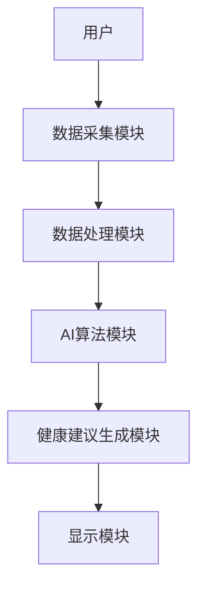

                 


# 智能浴室秤：AI Agent的身体成分分析与健康建议

> **关键词**：人工智能、身体健康、AI算法、身体成分、健康建议  
> **摘要**：智能浴室秤通过AI技术实现身体成分分析，并根据个人数据提供个性化的健康建议。本文详细探讨了智能浴室秤的核心技术、算法原理、系统架构以及实际应用，帮助读者全面理解其工作原理和价值。

---

## 第1章 智能浴室秤的背景与核心概念

### 1.1 智能浴室秤的发展历程

#### 1.1.1 传统浴室秤的功能与局限性
传统的浴室秤仅能测量体重，无法提供身体成分的详细信息。这种单一的功能限制了其在健康管理中的应用范围，用户无法通过传统浴室秤获得肌肉量、脂肪含量等关键数据。

#### 1.1.2 AI技术在健康监测领域的应用趋势
随着人工智能技术的快速发展，健康监测设备逐渐智能化。AI技术能够通过大量数据的分析，提供个性化的健康建议，成为现代健康管理的重要工具。

#### 1.1.3 智能浴室秤的市场现状与未来展望
智能浴室秤结合了生物电阻抗测量和AI算法，逐渐成为家庭健康管理的核心设备。未来，随着AI技术的不断进步，智能浴室秤的功能将更加智能化，数据的准确性也将进一步提升。

### 1.2 智能浴室秤的核心功能与应用场景

#### 1.2.1 身体成分分析的基本原理
身体成分分析主要通过测量人体的肌肉量、脂肪含量、水分含量等指标，帮助用户了解自身身体状况。智能浴室秤通过生物电阻抗测量法，结合AI算法，提供精准的身体成分数据。

#### 1.2.2 健康建议生成的逻辑与方法
智能浴室秤根据用户的身体成分数据，结合用户的年龄、性别、身高、运动习惯等信息，生成个性化的健康建议，包括饮食建议、运动计划等。

#### 1.2.3 智能浴室秤在家庭健康管理中的应用
智能浴室秤可以帮助用户实时监测身体成分变化，评估健康状况，并根据数据调整生活习惯，从而实现科学的健康管理。

---

## 第2章 智能浴室秤的核心技术与AI算法

### 2.1 生物电阻抗测量法

#### 2.1.1 生物电阻抗的基本原理
生物电阻抗测量法通过向人体发送微小电流，测量电流在人体中的流动情况。根据电流遇到的阻力（即电阻），可以推断出人体的水分含量、肌肉量和脂肪含量等信息。

#### 2.1.2 测量过程中的关键参数
- 电阻（Resistanc
- 电导（Conductance）
- 人体成分模型（如人体被划分为脂肪、肌肉、水分等部分）

#### 2.1.3 数据采集与处理的技术细节
智能浴室秤通过传感器采集人体电阻数据，结合AI算法进行数据处理和分析，最终得出身体成分的详细信息。

### 2.2 AI算法在身体成分分析中的应用

#### 2.2.1 机器学习模型的构建与训练
AI算法通过机器学习模型对大量人体数据进行训练，建立数学模型，从而实现对身体成分的精准预测。

#### 2.2.2 神经网络在健康建议生成中的作用
神经网络能够根据人体成分数据，结合用户的生活习惯，生成个性化的健康建议。例如，通过分析用户的饮食习惯和运动量，提供针对性的改善建议。

#### 2.2.3 数据特征提取与模型优化方法
- 特征提取：从原始数据中提取有用的特征，如年龄、性别、身高、体重等。
- 模型优化：通过交叉验证和超参数调优，提升模型的预测准确率。

### 2.3 算法原理与数学模型

#### 2.3.1 生物电阻抗测量的数学公式
$$ I = \frac{V}{R} $$

其中：
- \( I \) 表示电流
- \( V \) 表示电压
- \( R \) 表示电阻

#### 2.3.2 机器学习模型的训练流程
$$ y = f(x) $$

其中：
- \( y \) 表示预测的身体成分
- \( x \) 表示输入的特征数据
- \( f \) 表示机器学习模型

---

## 第3章 系统架构设计

### 3.1 系统功能模块划分

#### 3.1.1 数据采集模块
- 负责采集人体电阻数据
- 通过传感器获取电压和电流信号

#### 3.1.2 数据处理模块
- 对采集的数据进行预处理
- 提取特征数据

#### 3.1.3 AI算法模块
- 使用机器学习模型进行数据分析
- 生成身体成分报告

#### 3.1.4 健康建议生成模块
- 根据身体成分报告和用户生活习惯，生成个性化健康建议

### 3.2 系统架构图


---

## 第4章 系统实现与代码解析

### 4.1 环境搭建与工具安装

#### 4.1.1 Python环境的配置
- 安装Python 3.8及以上版本
- 安装必要的库，如numpy、pandas、scikit-learn

#### 4.1.2 必要库的安装
```bash
pip install numpy pandas scikit-learn
```

### 4.2 核心代码实现

#### 4.2.1 数据采集与预处理代码
```python
import numpy as np

def preprocess_data(data):
    # 数据清洗与标准化
    data = data.dropna()
    data = (data - data.mean()) / data.std()
    return data
```

#### 4.2.2 机器学习模型的训练
```python
from sklearn.linear_model import LinearRegression

# 训练模型
model = LinearRegression()
model.fit(X_train, y_train)

# 预测结果
y_pred = model.predict(X_test)
```

### 4.3 算法实现与优化

#### 4.3.1 算法优化
- 使用交叉验证评估模型性能
- 调整模型超参数（如学习率、正则化系数等）

---

## 第5章 项目实战与案例分析

### 5.1 项目实战

#### 5.1.1 项目环境搭建
- 搭建开发环境
- 安装必要的库和工具

#### 5.1.2 核心代码实现
- 数据采集与预处理
- 模型训练与预测
- 健康建议生成

### 5.2 案例分析

#### 5.2.1 用户数据采集与分析
- 采集用户的身体数据
- 使用AI算法进行分析
- 生成健康建议

#### 5.2.2 实际案例解读
- 某用户的身体成分数据
- 根据数据生成的健康建议
- 建议的实施与效果评估

---

## 第6章 最佳实践与总结

### 6.1 小结

智能浴室秤通过AI技术实现了身体成分的精准分析，并提供个性化的健康建议。本文详细探讨了智能浴室秤的核心技术、算法原理和系统架构，帮助读者全面理解其工作原理和实际应用。

### 6.2 注意事项

- 数据采集时确保准确性
- 模型训练时选择合适的算法
- 健康建议生成时考虑用户的生活习惯

### 6.3 拓展阅读

- 《人工智能在健康监测中的应用》
- 《机器学习算法与健康管理》
- 《生物电阻抗测量技术详解》

---

## 作者信息

**作者：AI天才研究院/AI Genius Institute & 禅与计算机程序设计艺术 /Zen And The Art of Computer Programming**

---

以上是《智能浴室秤：AI Agent的身体成分分析与健康建议》的完整目录和内容概要。

