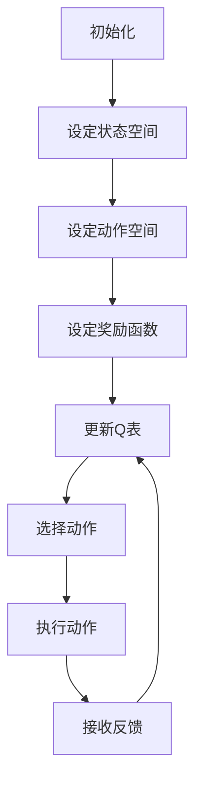
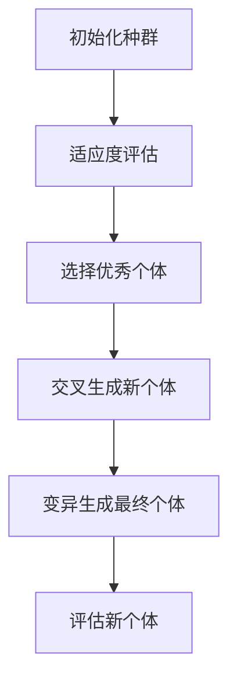
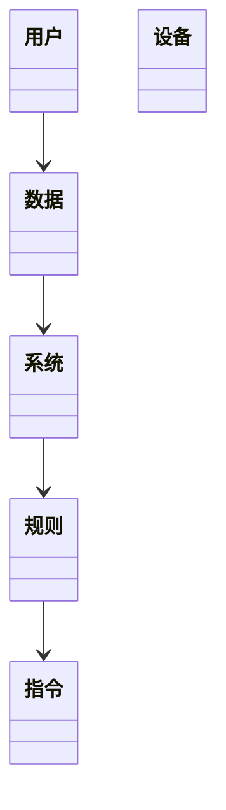
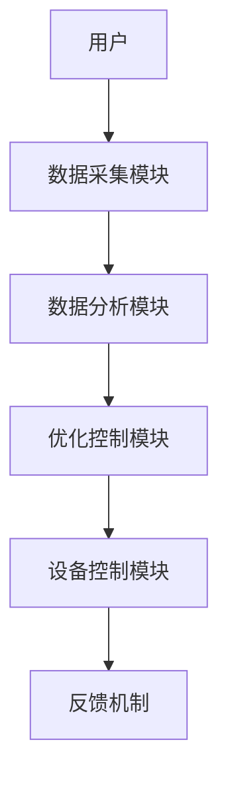

                 


# 智能浴室系统：AI Agent的用水习惯优化

> 关键词：智能浴室系统、AI Agent、用水习惯优化、强化学习、遗传算法、物联网技术

> 摘要：本文详细探讨了AI Agent在智能浴室系统中的应用，重点分析了如何通过AI技术优化用户的用水习惯。从系统背景、核心概念、算法原理到系统设计、项目实战和优化与维护，本文全面阐述了智能浴室系统的实现过程和优化策略。

---

## 第一部分: 背景介绍

### 第1章: 问题背景与系统概述

#### 1.1 用水习惯优化的背景
- 1.1.1 水资源浪费的现状
  - 全球水资源短缺问题日益严重，节约用水已成为全球关注的焦点。
  - 浪费水的现象在家庭和公共场所普遍存在，尤其是在浴室中。
  - 智能化技术为解决水资源浪费提供了新的可能性。

- 1.1.2 智能化浴室设备的发展趋势
  - 传统浴室设备的局限性：无法实时监测和优化用水习惯。
  - 智能化设备的特点：集成传感器、物联网技术和AI算法，实现智能化控制。

- 1.1.3 AI技术在智能家居中的应用潜力
  - AI技术的核心优势：数据采集、分析、预测和自动化控制。
  - 智能浴室系统作为智能家居的重要组成部分，具有广阔的应用前景。

#### 1.2 智能浴室系统的构成
- 1.2.1 浴室设备的智能化改造
  - 智能水龙头、智能花洒、智能马桶等设备的改造。
  - 设备间的互联互通与协同工作。

- 1.2.2 用户行为数据的采集与分析
  - 数据采集：使用传感器记录用户的用水行为，如用水时间、水量、水温等。
  - 数据分析：通过机器学习算法分析用户行为模式，识别浪费行为。

- 1.2.3 系统的集成与协调工作
  - 系统整体架构：传感器、AI算法、执行机构的协同工作。
  - 系统的功能模块：数据采集模块、数据分析模块、优化控制模块。

### 第2章: AI Agent在智能浴室系统中的作用

#### 2.1 AI Agent的基本概念
- 2.1.1 什么是AI Agent
  - AI Agent的定义：具备感知、决策、执行能力的智能体。
  - AI Agent的核心功能：数据采集、行为分析、决策优化、自动化控制。

- 2.1.2 AI Agent的核心功能
  - 数据采集：实时采集用户的用水行为数据。
  - 行为分析：分析用户的行为模式，识别浪费行为。
  - 决策优化：根据数据分析结果，制定优化策略。
  - 自动化控制：根据优化策略，自动调整设备的运行状态。

- 2.1.3 AI Agent与传统控制系统的区别
  - 传统控制系统：基于预设规则进行控制，缺乏灵活性和适应性。
  - AI Agent：基于实时数据和动态优化算法，实现智能化控制。

#### 2.2 AI Agent在用水习惯优化中的应用
- 2.2.1 数据采集与分析
  - 数据采集：通过传感器采集用户的用水行为数据。
  - 数据分析：使用机器学习算法分析用户行为模式，识别浪费行为。

- 2.2.2 用户行为预测与优化
  - 用户行为预测：基于历史数据，预测用户的用水需求。
  - 优化策略：根据预测结果，制定最优的用水计划。

- 2.2.3 自动化控制与反馈机制
  - 自动化控制：根据优化策略，自动调整设备的运行状态。
  - 反馈机制：实时监测系统运行状态，根据反馈结果动态调整优化策略。

### 第3章: 智能浴室系统的应用场景与技术趋势

#### 3.1 智能浴室系统的应用场景
- 3.1.1 家庭用户
  - 家庭用户的用水习惯优化：减少浪费，降低水费开支。
  - 智能浴室设备的普及：通过智能化控制实现节水目标。

- 3.1.2 公共场所
  - 公共场所的用水管理：学校、医院、商场等场所的用水优化。
  - 智能浴室系统的优势：实时监测、动态调整、高效管理。

- 3.1.3 商业建筑
  - 商业建筑的节水需求：星级酒店、高档住宅等场所的用水优化。
  - 智能浴室系统的技术优势：高效管理、降低成本、提升用户体验。

#### 3.2 技术发展趋势
- 3.2.1 AI技术的不断进步
  - AI算法的优化：强化学习、遗传算法等技术的应用。
  - 数据处理能力的提升：更大规模的数据采集与分析。

- 3.2.2 物联网技术的深度融合
  - 物联网技术的应用：设备间的互联互通与协同工作。
  - 智能化管理：通过物联网技术实现系统的智能化管理。

- 3.2.3 用户隐私与数据安全的挑战
  - 用户隐私保护：如何在数据采集和分析过程中保护用户隐私。
  - 数据安全：防止数据泄露和恶意攻击。

---

## 第二部分: 核心概念与联系

### 第4章: 核心概念与联系

#### 4.1 核心概念原理
- 4.1.1 AI Agent的决策机制
  - 数据采集：传感器实时采集用户的用水行为数据。
  - 数据分析：通过机器学习算法分析用户行为模式。
  - 决策优化：基于数据分析结果，制定优化策略。
  - 自动化控制：根据优化策略，自动调整设备的运行状态。

- 4.1.2 用户行为分析模型
  - 数据预处理：清洗和归一化处理。
  - 数据分析：使用机器学习算法分析用户行为模式。
  - 模型优化：基于分析结果，优化模型的准确性。

- 4.1.3 智能浴室系统的优化算法
  - 优化目标：最小化用水量，同时满足用户需求。
  - 约束条件：设备的运行状态、用户的用水需求、环境条件等。
  - 算法选择：强化学习和遗传算法的应用。

#### 4.2 概念属性特征对比
- 4.2.1 AI Agent与传统控制系统的对比
  - AI Agent：具备感知、决策、执行能力，能够动态调整系统运行状态。
  - 传统控制系统：基于预设规则进行控制，缺乏灵活性和适应性。

- 4.2.2 智能浴室系统与传统浴室系统的对比
  - 智能浴室系统：具备智能化控制功能，能够优化用户的用水习惯。
  - 传统浴室系统：不具备智能化控制功能，无法优化用户的用水习惯。

- 4.2.3 数据驱动优化与规则驱动优化的对比
  - 数据驱动优化：基于实时数据和机器学习算法进行优化。
  - 规则驱动优化：基于预设规则进行优化，缺乏灵活性和适应性。

#### 4.3 ER实体关系图
```mermaid
er
  actor: 用户
  system: 智能浴室系统
  device: 浴室设备
  data: 用户行为数据
  rule: 优化规则
  action: 控制指令
  actor --> data
  data --> system
  system --> rule
  rule --> action
  action
```

---

## 第三部分: 算法原理讲解

### 第5章: 强化学习算法

#### 5.1 强化学习算法的原理
- 强化学习的基本概念：通过试错学习，学习策略以最大化累积奖励。
- 算法流程：
  1. 初始化：设定初始状态和参数。
  2. 环境交互：根据当前状态，选择动作，与环境交互。
  3. 反馈接收：接收环境反馈的奖励和下一个状态。
  4. 策略更新：根据反馈更新策略，优化动作选择。

#### 5.2 强化学习算法的实现
- 使用Q-learning算法实现强化学习。
- 状态定义：用户的用水行为数据。
- 动作定义：设备的控制指令。
- 奖励机制：奖励节约用水的行为，惩罚浪费水的行为。



#### 5.3 强化学习算法的代码实现
```python
import numpy as np

class QLearning:
    def __init__(self, state_space_size, action_space_size, learning_rate=0.1, gamma=0.9):
        self.Q = np.zeros((state_space_size, action_space_size))
        self.learning_rate = learning_rate
        self.gamma = gamma

    def choose_action(self, state, epsilon=0.1):
        if np.random.random() < epsilon:
            return np.random.randint(0, action_space_size)
        else:
            return np.argmax(self.Q[state, :])

    def update_Q(self, state, action, reward, next_state):
        self.Q[state, action] += self.learning_rate * (reward + self.gamma * np.max(self.Q[next_state, :]) - self.Q[state, action])
```

---

### 第6章: 遗传算法

#### 6.1 遗传算法的原理
- 遗传算法的基本概念：模拟生物进化过程，通过选择、交叉和变异生成新的个体。
- 算法流程：
  1. 初始化：生成初始种群。
  2. 适应度评估：评估每个个体的适应度。
  3. 选择：根据适应度值选择优秀的个体。
  4. 交叉：将优秀个体的基因进行交叉，生成新的个体。
  5. 变异：对新个体进行随机变异，增加多样性。

#### 6.2 遗传算法的实现
- 使用遗传算法优化用户的用水习惯。
- 个体表示：用户的用水行为数据。
- 适应度函数：节约用水的程度。
- 选择策略：轮盘赌选择。
- 交叉策略：单点交叉。



---

## 第四部分: 系统分析与架构设计方案

### 第7章: 系统分析与架构设计

#### 7.1 问题场景介绍
- 系统目标：优化用户的用水习惯，实现节水目标。
- 系统范围：家庭用户、公共场所、商业建筑。

#### 7.2 系统功能设计
- 领域模型类图：


#### 7.3 系统架构设计
- 系统架构图：


#### 7.4 系统接口设计
- 接口1：用户与系统交互接口。
- 接口2：系统与设备的通信接口。

#### 7.5 系统交互流程图
- 交互流程：
  1. 用户触发用水设备。
  2. 设备采集用户行为数据。
  3. 系统分析数据，生成优化策略。
  4. 系统根据优化策略，控制设备运行。
  5. 设备反馈运行状态，系统更新优化策略。

---

## 第五部分: 项目实战

### 第8章: 项目实战

#### 8.1 环境安装
- 硬件设备：智能水龙头、智能花洒、传感器、控制器。
- 软件环境：Python、机器学习库（如TensorFlow、Scikit-learn）、物联网开发平台。

#### 8.2 系统核心实现源代码
```python
import numpy as np
from sklearn import linear_model

class WaterUsageOptimizer:
    def __init__(self):
        self.model = linear_model.LinearRegression()

    def train_model(self, X, y):
        self.model.fit(X, y)

    def predict_usage(self, X):
        return self.model.predict(X)
```

#### 8.3 代码应用解读与分析
- 代码功能：基于用户行为数据，训练机器学习模型，预测用户的用水量。
- 数据预处理：清洗和归一化处理。
- 模型训练：使用线性回归算法训练模型。
- 模型预测：根据当前状态，预测用户的用水量，制定优化策略。

#### 8.4 实际案例分析和详细讲解剖析
- 案例分析：某家庭用户一个月的用水数据。
- 数据分析：识别浪费行为，制定优化策略。
- 系统优化：根据优化策略，调整设备的运行状态。

#### 8.5 项目小结
- 项目总结：智能浴室系统的实现过程。
- 成果展示：优化后的用水数据对比。
- 经验分享：项目实施中的关键点和注意事项。

---

## 第六部分: 优化与维护

### 第9章: 优化与维护

#### 9.1 系统优化策略
- 数据优化：优化数据采集和分析的效率。
- 算法优化：改进AI算法，提高优化效果。
- 系统优化：优化系统架构，提高运行效率。

#### 9.2 系统维护方法
- 数据维护：定期清洗和更新数据。
- 系统维护：定期检查和维护设备。
- 数据隐私与安全：保护用户隐私，防止数据泄露。

#### 9.3 用户反馈与系统改进
- 用户反馈：收集用户的使用反馈。
- 系统改进：根据用户反馈，不断优化系统功能。
- 持续改进：建立持续改进机制，不断提高系统性能。

#### 9.4 未来趋势
- 技术发展趋势：AI技术的不断进步和物联网技术的深度融合。
- 应用场景扩展：智能浴室系统在更多领域的应用。
- 用户需求变化：用户对智能化、个性化需求的不断提升。

---

## 结语

智能浴室系统通过AI Agent优化用户的用水习惯，不仅能够有效节约水资源，还能提升用户的使用体验。本文从系统背景、核心概念、算法原理到系统设计、项目实战和优化与维护，全面阐述了智能浴室系统的实现过程和优化策略。未来，随着AI技术和物联网技术的不断发展，智能浴室系统将在更多领域得到广泛应用，为用户创造更加智能化和环保的用水体验。

---

**作者：AI天才研究院/AI Genius Institute & 禅与计算机程序设计艺术/Zen And The Art of Computer Programming**

