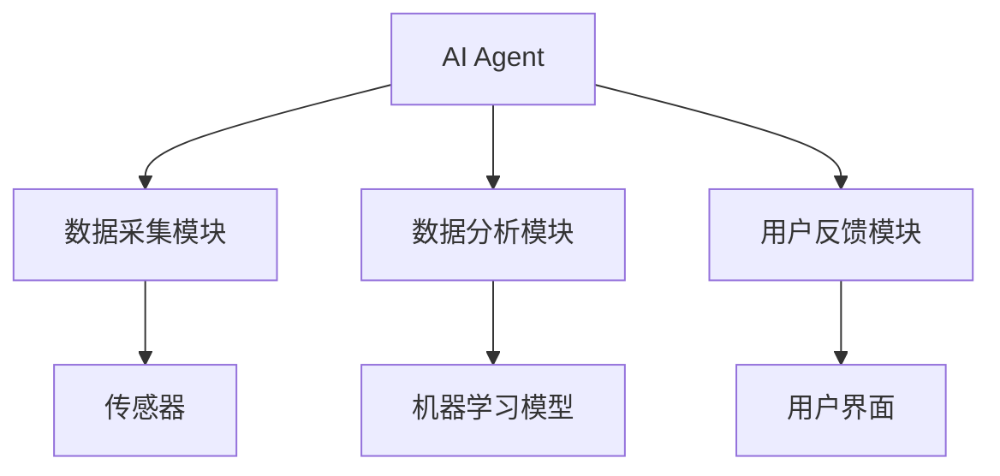
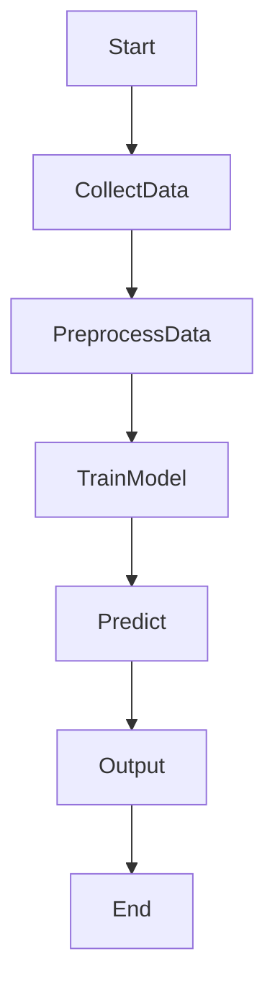
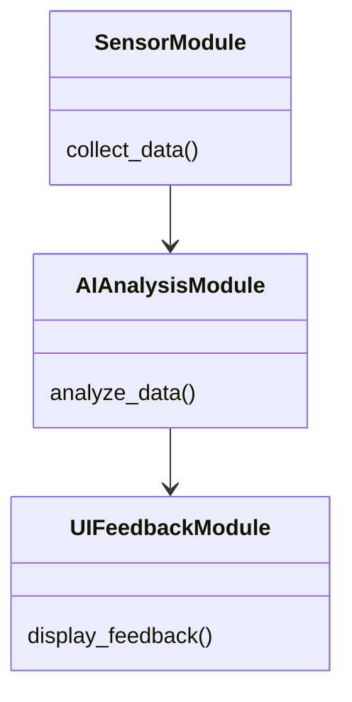
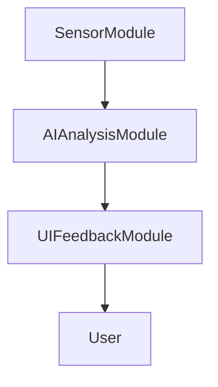
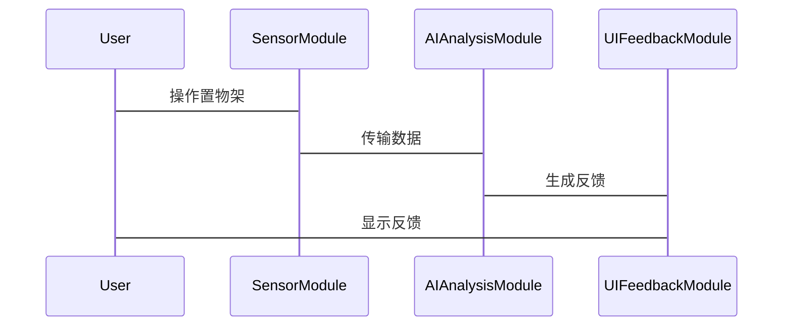

                 


# 智能浴室置物架：AI Agent的个人卫生习惯分析

## 关键词：智能浴室置物架、AI Agent、个人卫生习惯、物联网、数据采集与分析

## 摘要：本文探讨了AI Agent在智能浴室置物架中的应用，分析其如何通过数据采集与分析，优化个人卫生习惯，提升用户体验。文章从背景、核心概念、算法原理、系统架构到项目实战，全面解析智能浴室置物架的设计与实现。

---

# 第一部分: 背景介绍

## 第1章: 问题背景与描述

### 1.1 问题背景

#### 1.1.1 智能浴室置物架的现状
现代浴室置物架逐渐智能化，但大多数仅具备基本存储功能，缺乏数据分析能力。

#### 1.1.2 个人卫生习惯的重要性
良好的卫生习惯对健康至关重要，但人们常忽视或难以持续执行。

#### 1.1.3 当前存在的问题与挑战
- 卫生习惯难以量化和分析。
- 缺乏智能化工具帮助用户改善卫生习惯。

### 1.2 问题描述

#### 1.2.1 卫生习惯分析的需求
- 如何量化用户的卫生习惯。
- 如何通过技术手段提供反馈和建议。

#### 1.2.2 智能浴室置物架的功能需求
- 数据采集与传输。
- 数据分析与反馈。

#### 1.2.3 AI Agent在卫生习惯分析中的作用
- 自动采集数据。
- 分析数据并提供建议。

### 1.3 问题解决

#### 1.3.1 AI Agent的核心作用
- 数据采集：通过传感器获取用户行为数据。
- 数据分析：利用机器学习模型分析习惯。
- 反馈优化：根据分析结果提供反馈和建议。

### 1.4 边界与外延

#### 1.4.1 系统的边界定义
- 仅关注浴室环境中的卫生习惯分析。
- 不涉及其他生活习惯或健康数据。

#### 1.4.2 相关概念的外延
- 包括传感器、AI算法、用户界面。

#### 1.4.3 系统功能的扩展性
- 可扩展至其他卫浴设备或家庭场景。

### 1.5 概念结构与核心要素

#### 1.5.1 系统构成要素
- 传感器模块：收集用户行为数据。
- AI分析模块：处理数据并生成反馈。
- 用户界面：展示反馈和建议。

---

# 第二部分: 核心概念与联系

## 第2章: 核心概念原理

### 2.1 AI Agent的原理

#### 2.1.1 感知模块
- 通过传感器采集用户行为数据。
- 示例：用户每天刷牙的时间和频率。

#### 2.1.2 决策模块
- 利用机器学习模型分析数据。
- 示例：判断用户是否坚持每天刷牙。

#### 2.1.3 执行模块
- 根据分析结果提供反馈。
- 示例：提醒用户更换牙刷。

### 2.2 智能浴室置物架的原理

#### 2.2.1 数据采集模块
- 使用重量传感器检测物品放置情况。
- 示例：记录毛巾更换频率。

#### 2.2.2 数据分析模块
- 应用分类算法识别异常行为。
- 示例：识别用户未及时清洁洗手盆。

#### 2.2.3 用户反馈模块
- 通过LED显示或手机App提供反馈。
- 示例：提醒用户及时擦干毛巾。

### 2.2 概念属性特征对比表

| 概念       | 属性               | 特征对比               |
|------------|--------------------|------------------------|
| 传统置物架 | 功能单一           | 仅提供存储功能         |
| AI Agent置物架 | 功能多样           | 提供存储、分析、反馈   |

### 2.3 ER实体关系图



---

# 第三部分: 算法原理讲解

## 第3章: 算法原理

### 3.1 数据采集与特征提取

#### 3.1.1 数据采集流程
- 传感器采集：如加速度传感器、重量传感器。
- 数据预处理：去除噪声，提取特征。

#### 3.1.2 特征提取
- 时间特征：用户行为的时间分布。
- 频率特征：用户行为的频率。

### 3.2 分类算法

#### 3.2.1 机器学习模型选择
- 使用逻辑回归模型进行分类。

#### 3.2.2 分类模型公式
$$ P(y=1|x) = \frac{1}{1 + e^{-\beta x}} $$

### 3.3 算法流程图



### 3.4 算法实现代码

```python
import numpy as np
from sklearn.linear_model import LogisticRegression

# 示例数据
X = np.array([[1, 0], [0, 1], [1, 1], [0, 0]])
y = np.array([0, 0, 1, 1])

# 训练模型
model = LogisticRegression()
model.fit(X, y)

# 预测
print(model.predict(X))
```

---

# 第四部分: 系统分析与架构设计

## 第4章: 系统分析

### 4.1 问题场景介绍

#### 4.1.1 场景描述
- 用户使用浴室置物架存储毛巾、牙刷等物品。
- 系统通过传感器和AI分析用户卫生习惯。

### 4.2 系统功能设计

#### 4.2.1 功能模块
- 数据采集模块：采集用户行为数据。
- 数据分析模块：分析数据并生成反馈。
- 用户反馈模块：展示反馈和建议。

## 4.3 系统架构设计

### 4.3.1 领域模型类图



### 4.3.2 系统架构图



### 4.3.3 系统接口设计

- `SensorModule.collect_data()`
- `AIAnalysisModule.analyze_data()`
- `UIFeedbackModule.display_feedback()`

### 4.3.4 系统交互序列图



---

# 第五部分: 项目实战

## 第5章: 项目实战

### 5.1 环境安装

#### 5.1.1 安装Python
```bash
python --version
```

#### 5.1.2 安装依赖库
```bash
pip install numpy scikit-learn
```

### 5.2 核心代码实现

#### 5.2.1 数据采集模块

```python
import numpy as np

def collect_data(samples=100):
    # 生成示例数据
    return np.random.rand(samples, 2)
```

#### 5.2.2 数据分析模块

```python
from sklearn.linear_model import LogisticRegression

def analyze_data(X, y):
    model = LogisticRegression()
    model.fit(X, y)
    return model
```

#### 5.2.3 用户反馈模块

```python
def display_feedback(prediction):
    print(f"预测结果: {prediction}")
```

### 5.3 实际案例分析

#### 5.3.1 案例描述
用户A每天刷牙两次，但经常忘记清洁洗手盆。

#### 5.3.2 数据分析
模型预测用户A的洗手频率低于推荐值。

#### 5.3.3 系统反馈
系统提醒用户A及时清洁洗手盆。

### 5.4 项目小结

#### 5.4.1 成果总结
- 成功实现AI Agent在浴室置物架中的应用。
- 提供了有效的卫生习惯反馈机制。

---

# 第六部分: 总结与展望

## 第6章: 总结与展望

### 6.1 小结
- 本文详细介绍了AI Agent在智能浴室置物架中的应用。
- 系统实现了数据采集、分析和反馈功能。

### 6.2 注意事项
- 数据隐私保护。
- 系统稳定性与安全性。

### 6.3 拓展阅读
- 物联网技术在智能家居中的应用。
- 机器学习在行为分析中的应用。

---

# 作者

**作者：AI天才研究院 & 禅与计算机程序设计艺术**

