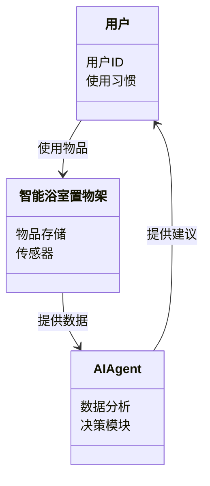
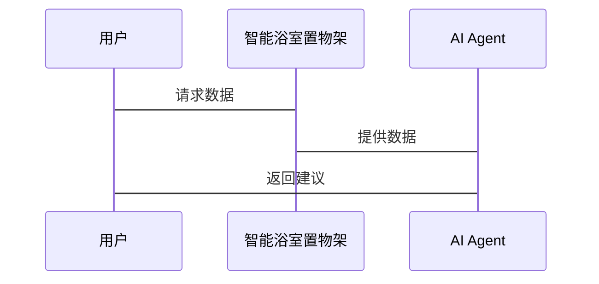
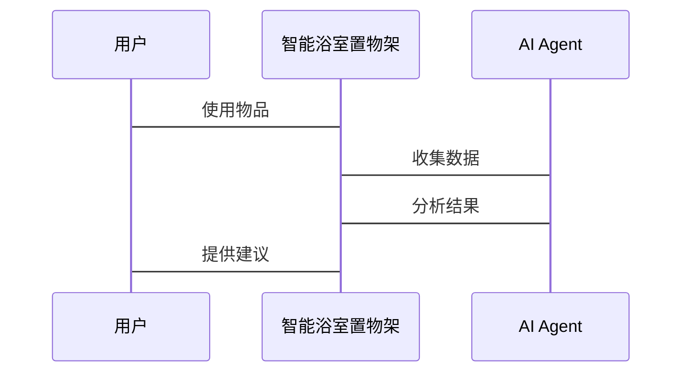

                 


# 智能浴室置物架：AI Agent的个人卫生习惯分析

> 关键词：智能浴室置物架，AI Agent，个人卫生习惯，数据分析，算法原理

> 摘要：本文探讨了智能浴室置物架与AI Agent结合的技术应用，分析其在个人卫生习惯中的作用，详细阐述了AI Agent的工作原理、系统架构设计以及实际项目实现，帮助读者深入了解智能浴室置物架在卫生习惯分析中的潜力和价值。

---

# 第一部分: 智能浴室置物架与AI Agent的背景介绍

## 第1章: 智能浴室置物架的发展背景

### 1.1 智能浴室置物架的定义与特点
#### 1.1.1 智能浴室置物架的定义
智能浴室置物架是一种结合了物联网和人工智能技术的智能设备，用于存储和管理浴室内的洗漱用品、毛巾等物品。它不仅具备传统置物架的基本功能，还能够通过传感器、摄像头等设备采集数据，并利用AI技术进行数据分析和智能决策。

#### 1.1.2 智能浴室置物架的核心特点
- **智能感知**：通过传感器和摄像头实时监测物品的使用情况和环境状况。
- **数据分析**：利用AI算法对收集的数据进行分析，识别用户的使用习惯和偏好。
- **智能推荐**：根据分析结果，主动推荐合适的清洁频率、物品摆放位置等。
- **远程控制**：通过手机APP或其他智能设备实现远程控制和管理。

#### 1.1.3 智能浴室置物架与传统置物架的对比
| 特性                | 传统置物架          | 智能浴室置物架      |
|---------------------|---------------------|---------------------|
| 功能                | 存储物品            | 存储+数据分析+智能推荐 |
| 数据采集            | 无                  | 传感器、摄像头      |
| 用户交互            | 无                  | APP、语音指令       |
| 自动化程度          | 低                  | 高                  |

### 1.2 AI Agent的基本概念
#### 1.2.1 AI Agent的定义
AI Agent（人工智能代理）是一种能够感知环境、执行任务并做出决策的智能实体。它能够根据输入的数据和目标，自主完成一系列操作，以实现预设的目标。

#### 1.2.2 AI Agent的核心功能
- **数据感知**：通过传感器、摄像头等设备感知环境和用户行为。
- **数据处理**：对收集的数据进行清洗、分析和建模。
- **决策制定**：基于分析结果，制定相应的决策和行动计划。
- **执行操作**：通过执行机构（如机械臂、指示灯等）完成决策任务。

#### 1.2.3 AI Agent在智能浴室置物架中的作用
AI Agent在智能浴室置物架中的主要作用是通过数据分析和智能决策，优化用户的卫生习惯和物品管理。例如，AI Agent可以根据用户的使用频率推荐清洁时间，或者根据环境湿度调整物品摆放位置，以防止霉菌生长。

---

## 第2章: 个人卫生习惯分析的背景与意义

### 2.1 个人卫生习惯的重要性
#### 2.1.1 卫生习惯对健康的影响
良好的卫生习惯可以有效预防疾病，提高生活质量。例如，定期清洁浴室可以减少细菌和病毒的滋生，降低感染的风险。

#### 2.1.2 卫生习惯对生活质量的影响
个人卫生习惯直接影响到日常生活中的舒适度和幸福感。例如，合理的物品摆放可以提高使用效率，减少混乱。

### 2.2 智能浴室置物架在卫生习惯分析中的应用
#### 2.2.1 数据采集与分析的技术优势
智能浴室置物架通过传感器和摄像头采集数据，能够实时监测用户的使用习惯和环境状况。这些数据经过AI算法分析后，可以提供个性化的卫生习惯建议。

#### 2.2.2 AI Agent在卫生习惯分析中的独特价值
AI Agent能够通过数据驱动的方式，不断优化用户的卫生习惯。例如，通过分析用户的使用频率和清洁习惯，AI Agent可以制定个性化的清洁计划，并通过APP提醒用户执行。

---

# 第二部分: 智能浴室置物架与AI Agent的核心概念与联系

## 第3章: AI Agent的原理与功能

### 3.1 AI Agent的核心原理
#### 3.1.1 数据感知与采集
AI Agent通过传感器、摄像头等设备采集环境数据和用户行为数据。例如，传感器可以监测物品的使用频率，摄像头可以捕捉用户的使用习惯。

#### 3.1.2 数据分析与决策
AI Agent利用机器学习算法对采集的数据进行分析和建模，生成决策建议。例如，使用随机森林算法对用户的使用习惯进行分类，生成清洁频率建议。

#### 3.1.3 行为执行与反馈
AI Agent根据决策结果执行相应的操作，并通过传感器和摄像头收集反馈数据，不断优化决策模型。

### 3.2 AI Agent的功能模块
#### 3.2.1 数据采集模块
负责采集环境数据和用户行为数据，例如传感器数据和摄像头图像。

#### 3.2.2 数据分析模块
负责对采集的数据进行清洗、特征提取和建模，生成决策建议。

#### 3.2.3 行为决策模块
根据分析结果，制定相应的行动计划，并通过执行机构（如机械臂）完成操作。

## 第4章: 智能浴室置物架与AI Agent的实体关系分析

### 4.1 实体关系分析
#### 4.1.1 用户与智能浴室置物架的关系
用户通过智能浴室置物架存储物品，并通过APP与置物架进行交互。

#### 4.1.2 AI Agent与智能浴室置物架的关系
AI Agent作为智能浴室置物架的核心，负责数据分析和智能决策，优化用户的卫生习惯和物品管理。

#### 4.1.3 数据与AI Agent的关系
数据是AI Agent进行分析和决策的基础，AI Agent通过数据驱动的方式优化用户的卫生习惯。

---

# 第三部分: 算法原理讲解

## 第5章: 分类算法原理与实现

### 5.1 分类算法原理
分类算法是一种监督学习算法，用于将数据划分为不同的类别。常用的分类算法包括随机森林、支持向量机（SVM）和朴素贝叶斯等。

#### 5.1.1 随机森林算法
随机森林是一种基于决策树的集成算法，通过构建多棵决策树并进行投票的方式进行分类。

#### 5.1.2 支持向量机（SVM）
SVM是一种基于几何的分类算法，通过找到一个超平面将数据分成不同的类别。

#### 5.1.3 朴素贝叶斯
朴素贝叶斯是一种基于概率的分类算法，假设各个特征之间相互独立。

### 5.2 分类算法的实现
以下是一个使用随机森林算法进行分类的Python代码示例：

```python
from sklearn.ensemble import RandomForestClassifier
from sklearn.datasets import make_classification
from sklearn.model_selection import train_test_split

# 生成数据
X, y = make_classification(n_samples=100, n_features=4, n_classes=2, random_state=0)

# 划分训练集和测试集
X_train, X_test, y_train, y_test = train_test_split(X, y, test_size=0.2, random_state=0)

# 初始化模型
model = RandomForestClassifier(n_estimators=100, random_state=0)

# 训练模型
model.fit(X_train, y_train)

# 预测结果
y_pred = model.predict(X_test)

# 输出准确率
print("Accuracy:", model.score(X_test, y_test))
```

### 5.3 分类算法的数学模型
随机森林算法的数学模型如下：

$$
y = \text{argmax}_i \sum_{j=1}^{n} \text{votes}_i
$$

其中，$y$是预测的类别，$\text{votes}_i$是第$i$棵决策树的投票结果。

---

## 第6章: 分类算法的优化与调优

### 6.1 参数调整
通过调整随机森林的参数（如$n\_estimators$、$max\_depth$等），可以优化模型的性能。

### 6.2 模型评估
通过准确率、召回率、F1分数等指标评估模型的性能。

### 6.3 模型优化
使用网格搜索（Grid Search）或随机搜索（Random Search）进行参数调优。

---

# 第四部分: 系统分析与架构设计方案

## 第7章: 问题场景介绍

### 7.1 浴室环境的特点
浴室环境潮湿、易滑，物品管理不便。

### 7.2 用户需求
用户希望通过智能浴室置物架优化物品管理，改善卫生习惯。

## 第8章: 系统功能设计

### 8.1 领域模型
以下是领域模型的Mermaid类图：



### 8.2 系统架构设计
以下是系统架构的Mermaid图：


### 8.3 接口设计
以下是接口设计的Mermaid图：



---

## 第9章: 系统交互流程图

### 9.1 交互流程图
以下是系统交互流程图的Mermaid图：



---

# 第五部分: 项目实战

## 第10章: 环境安装与系统实现

### 10.1 环境安装
安装必要的库和工具，例如Python、NumPy、scikit-learn等。

### 10.2 核心代码实现
以下是核心代码实现的示例：

```python
import numpy as np
from sklearn.ensemble import RandomForestClassifier
from sklearn.metrics import accuracy_score

# 数据预处理
data = np.loadtxt('data.csv', delimiter=',')
X = data[:, :-1]
y = data[:, -1]

# 划分训练集和测试集
X_train, X_test, y_train, y_test = train_test_split(X, y, test_size=0.2, random_state=0)

# 初始化模型
model = RandomForestClassifier(n_estimators=100, random_state=0)

# 训练模型
model.fit(X_train, y_train)

# 预测结果
y_pred = model.predict(X_test)

# 输出准确率
print("Accuracy:", accuracy_score(y_test, y_pred))
```

### 10.3 代码应用解读与分析
通过代码实现数据分析和模型训练，生成用户的卫生习惯分析结果。

---

## 第11章: 实际案例分析

### 11.1 实际案例
通过一个实际案例分析，展示如何通过智能浴室置物架和AI Agent优化用户的卫生习惯。

### 11.2 案例分析与解读
通过案例分析，总结智能浴室置物架在实际应用中的优势和挑战。

---

## 第12章: 项目小结

### 12.1 项目总结
总结项目的实现过程和主要成果。

### 12.2 经验与教训
分享项目中的经验教训，为后续项目提供参考。

---

# 第六部分: 最佳实践、小结、注意事项和拓展阅读

## 第13章: 最佳实践与小结

### 13.1 最佳实践
- 定期维护和更新模型。
- 注意数据隐私和安全。

### 13.2 小结
总结全文内容，强调智能浴室置物架与AI Agent结合的潜力和价值。

---

## 第14章: 注意事项与拓展阅读

### 14.1 注意事项
- 注意数据隐私和用户隐私。
- 确保系统的稳定性和可靠性。

### 14.2 拓展阅读
建议读者进一步阅读相关领域的书籍和论文，例如《集体智慧编程》和《机器学习实战》。

---

# 结语

智能浴室置物架与AI Agent的结合，不仅优化了用户的卫生习惯，还为智能家居的发展提供了新的思路。通过本文的分析和实践，我们看到了AI技术在日常生活中的巨大潜力。

---

作者：AI天才研究院/AI Genius Institute & 禅与计算机程序设计艺术 /Zen And The Art of Computer Programming

