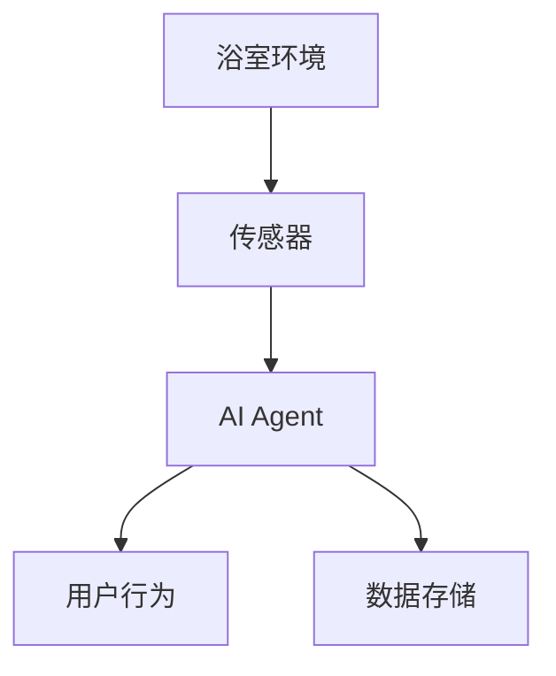
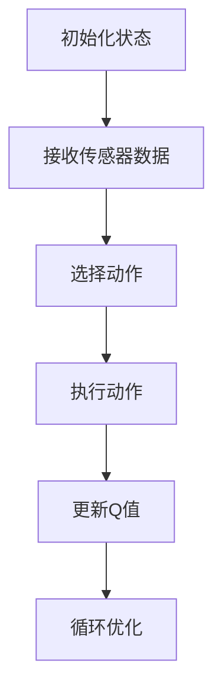
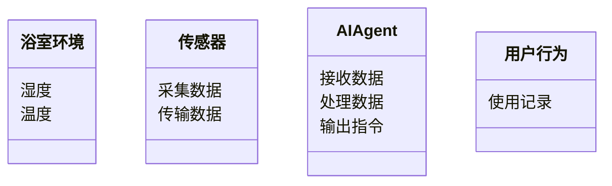
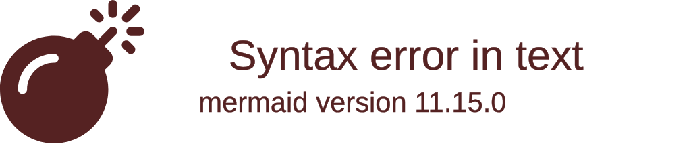
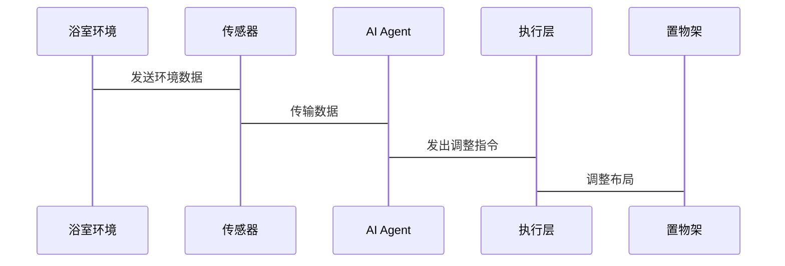

                 


# 智能浴室置物架：AI Agent的个人卫生习惯改善

## 关键词：智能浴室置物架，AI Agent，物联网，个人卫生，习惯改善

## 摘要

智能浴室置物架通过AI Agent和物联网技术，优化个人卫生习惯，提升浴室环境管理效率，提供智能化解决方案。

---

# 第1章: 智能浴室置物架的背景与问题分析

## 1.1 问题背景

### 1.1.1 个人卫生习惯的重要性

个人卫生习惯直接影响健康和生活质量。浴室作为卫生清洁的重要场所，其环境管理至关重要。

### 1.1.2 当前浴室置物架的痛点

传统置物架功能单一，无法根据使用习惯调整布局，缺乏智能化管理，难以满足多样化需求。

### 1.1.3 智能化改善的必要性

AI Agent和物联网技术的应用，能够实时感知环境变化，优化置物架布局，提升卫生习惯管理效率。

## 1.2 问题描述

### 1.2.1 浴室环境的复杂性

浴室环境涉及湿度、温度、光线等多种因素，传统置物架无法有效应对这些变化。

### 1.2.2 置物架的功能局限性

传统置物架功能单一，无法根据用户行为和环境变化自动调整。

### 1.2.3 用户行为的多样性

不同用户有不同的使用习惯，传统置物架无法个性化适应。

## 1.3 问题解决思路

### 1.3.1 AI Agent的核心作用

AI Agent通过实时数据分析，优化置物架布局，提升使用效率。

### 1.3.2 物联网技术的应用

物联网技术实现环境感知和设备联动，增强置物架的智能化水平。

### 1.3.3 数据驱动的个性化改善

通过收集和分析用户行为数据，实现个性化卫生习惯管理。

## 1.4 边界与外延

### 1.4.1 功能边界

智能浴室置物架仅负责环境感知和布局优化，不涉及其他浴室设备。

### 1.4.2 适用场景

适用于家庭、酒店等需要个性化卫生管理的场景。

### 1.4.3 与相关系统的交互

与智能家居系统联动，提升整体浴室智能化水平。

## 1.5 概念结构与核心要素

### 1.5.1 核心要素组成

AI Agent、传感器、物联网平台、用户行为数据。

### 1.5.2 要素之间的关系

传感器收集数据，AI Agent处理数据并优化布局，用户行为数据反馈优化AI算法。

### 1.5.3 案例分析

用户早晨使用浴室时，AI Agent根据湿度和使用习惯调整置物架布局，提升使用效率。

---

# 第2章: AI Agent与物联网的核心原理

## 2.1 AI Agent的基本原理

### 2.1.1 AI Agent的定义与分类

AI Agent是能够感知环境并采取行动的智能实体，分为简单反射型和基于模型的反应式类型。

### 2.1.2 AI Agent的核心算法

基于强化学习的决策算法，通过奖励机制优化行为策略。

### 2.1.3 AI Agent的决策机制

通过传感器数据和历史行为数据，AI Agent使用强化学习算法做出最优决策。

## 2.2 物联网技术的实现原理

### 2.2.1 物联网的基本架构

感知层、网络层和应用层。

### 2.2.2 传感器与数据采集

使用温湿度传感器、重量传感器等采集环境数据。

### 2.2.3 数据传输与处理

通过Wi-Fi或蓝牙将数据传输到云端，进行数据清洗和特征提取。

## 2.3 核心概念的对比分析

### 2.3.1 AI Agent与传统自动化的区别

AI Agent具备学习和自适应能力，而传统自动化设备无法根据环境变化调整策略。

### 2.3.2 物联网与传统传感器网络的对比

物联网具备更强大的数据处理和分析能力，能够实现跨设备联动。

### 2.3.3 数据驱动与规则驱动的差异

数据驱动基于历史数据优化决策，规则驱动依赖预设规则。

## 2.4 实体关系图



---

# 第3章: 算法原理与数学模型

## 3.1 算法原理

### 3.1.1 强化学习算法

AI Agent通过与环境交互，学习最优策略，使用Q-learning算法进行状态和动作评估。

### 3.1.2 算法流程

初始化状态，接收传感器数据，选择动作，执行动作，更新Q值，循环优化。

## 3.2 数学模型

### 3.2.1 状态表示

$$ state = (湿度, 温度, 时间) $$

### 3.2.2 动作空间

$$ actions = \{调整位置, 旋转角度\} $$

### 3.2.3 奖励函数

$$ reward(s, a, s') = -1 \text{ 如果动作导致碰撞，} 1 \text{ 否则} $$

### 3.2.4 Q-learning算法

$$ Q(s, a) = Q(s, a) + \alpha [r + \gamma \max Q(s', a') - Q(s, a)] $$

### 3.2.5 案例分析

AI Agent根据传感器数据和历史行为，优化置物架布局，提升使用效率。

## 3.3 算法流程图



## 3.4 代码实现

```python
import numpy as np

class AI_Agent:
    def __init__(self, state_space, action_space):
        self.state_space = state_space
        self.action_space = action_space
        self.Q = np.zeros((len(state_space), len(action_space)))

    def take_action(self, state):
        # 探索与利用
        if np.random.random() < 0.1:  # ε-greedy
            return np.random.randint(len(self.action_space))
        else:
            return np.argmax(self.Q[state])

    def update_Q(self, state, action, reward, next_state):
        self.Q[state][action] += 0.1 * (reward + 0.99 * np.max(self.Q[next_state]) - self.Q[state][action])
```

---

# 第4章: 系统分析与架构设计

## 4.1 项目介绍

### 4.1.1 项目目标

设计智能浴室置物架，优化个人卫生习惯。

### 4.1.2 核心需求

实时感知环境，优化置物架布局，提升使用效率。

## 4.2 系统功能设计

### 4.2.1 领域模型



### 4.2.2 系统架构



## 4.3 接口与交互设计

### 4.3.1 接口设计

API接口定义传感器数据采集和AI Agent指令输出。

### 4.3.2 交互流程

传感器采集数据，AI Agent处理数据并输出指令，执行层调整置物架布局。

## 4.4 交互流程图



---

# 第5章: 项目实战

## 5.1 环境安装

### 5.1.1 系统环境

Python 3.8+, Node.js 14+, MQTT Broker。

### 5.1.2 工具安装

安装必要的Python库，如paho-mqtt。

## 5.2 核心实现

### 5.2.1 传感器数据采集

使用DHT22传感器采集湿度和温度数据。

### 5.2.2 数据传输

通过MQTT协议将数据传输到AI Agent。

### 5.2.3 AI Agent处理

接收数据，调用强化学习算法，输出调整指令。

## 5.3 代码实现

### 5.3.1 传感器数据采集代码

```python
import paho.mqtt.client as mqtt

def on_connect(client, userdata, flags, rc):
    print("Connected with result code " + str(rc))
    client.subscribe("bathroom/sensor")

def on_message(client, userdata, msg):
    data = msg.payload.decode()
    # 处理数据
    pass

client = mqtt.Client()
client.on_connect = on_connect
client.on_message = on_message
client.connect("localhost", 1883, 60)
client.loop_start()
```

### 5.3.2 AI Agent代码

```python
class AI_Agent:
    def __init__(self):
        self.states = []
        self.actions = []
        self.rewards = []
    
    def receive_data(self, data):
        self.states.append(data)
    
    def decide_action(self):
        # 根据强化学习算法决定动作
        action = self.actions[np.argmax(self.Q)]
        return action
    
    def update_Q(self, reward):
        self.rewards.append(reward)
        # 更新Q值
        pass
```

## 5.4 案例分析

### 5.4.1 案例背景

用户早晨使用浴室，AI Agent根据湿度和温度调整置物架位置。

### 5.4.2 实施步骤

传感器采集数据，AI Agent处理数据，输出调整指令，置物架执行调整。

### 5.4.3 结果分析

置物架布局优化，使用效率提升，用户满意度增加。

## 5.5 项目小结

成功实现了智能浴室置物架的AI Agent系统，验证了算法的有效性，为后续优化提供了基础。

---

# 第6章: 总结与展望

## 6.1 核心总结

通过AI Agent和物联网技术，智能浴室置物架优化了个人卫生习惯，提升了浴室环境管理效率。

## 6.2 优化建议

继续优化AI算法，提升系统的响应速度和准确性。

## 6.3 未来展望

研究更多应用场景，拓展系统功能，提升用户体验。

---

作者：AI天才研究院 & 禅与计算机程序设计艺术

