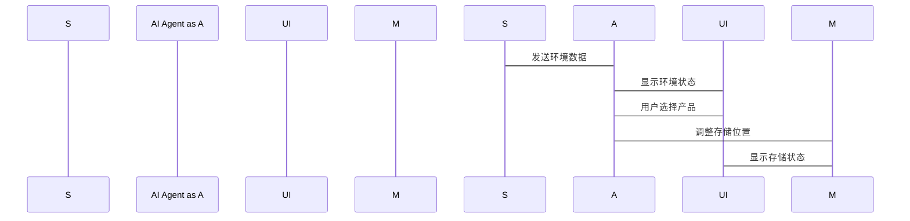

                 


# 智能浴室置物架：AI Agent的个人护理建议

## 关键词：智能浴室置物架，AI Agent，个人护理，智能家居，环境监测

## 摘要：  
智能浴室置物架通过AI Agent技术，能够实时监测浴室环境，推荐个人护理产品，并提供智能化的使用建议。本文从背景介绍、核心概念、算法原理、系统架构设计、项目实战等方面详细阐述智能浴室置物架的实现过程，并总结其在实际应用中的优势与挑战。

---

# 第一部分: 智能浴室置物架的背景与核心概念

## 第1章: 智能浴室置物架的背景介绍

### 1.1 问题背景  
现代浴室环境复杂，通常涉及温湿度变化、光线强度、人体活动等多种因素。传统浴室置物架仅具备简单的储物功能，无法满足用户在个人护理、环境优化等方面的多样化需求。AI Agent技术的引入，为浴室置物架带来了智能化的可能性。

#### 1.1.1 浴室环境的复杂性  
浴室环境容易受温湿度影响，容易出现滑倒风险，且光线不足可能导致安全隐患。此外，浴室内的物品存储需要考虑防潮、防晒等因素。

#### 1.1.2 传统置物架的局限性  
传统置物架功能单一，无法根据环境变化自动调整存储位置或推荐合适的护理产品。用户在使用过程中需要手动操作，体验较差。

#### 1.1.3 AI技术在浴室场景中的应用潜力  
AI技术可以实时监测浴室环境，分析用户行为模式，并通过数据驱动的方式提供个性化建议。这使得浴室置物架能够成为用户个人护理的智能助手。

### 1.2 问题描述  
智能浴室置物架的核心目标是通过AI Agent技术，实现环境监测、产品推荐、智能控制等功能，解决传统置物架在功能和体验上的不足。

#### 1.2.1 浴室置物架的功能需求  
- 实时监测温湿度、光线、空气质量等环境参数。  
- 根据环境数据和用户习惯推荐合适的护理产品。  
- 提供智能存储建议，优化空间利用率。  

#### 1.2.2 用户在浴室护理中的痛点  
- 传统置物架无法根据环境变化自动调整存储位置。  
- 缺乏个性化推荐，用户难以快速找到所需产品。  
- 环境监测功能缺失，安全隐患较高。  

#### 1.2.3 智能化解决方案的必要性  
通过AI技术实现智能监测和推荐，能够显著提升用户体验，降低安全隐患，同时优化浴室空间利用。

### 1.3 问题解决  
AI Agent在浴室置物架中的应用，能够实时感知环境变化，并通过数据驱动的方式提供个性化建议。

#### 1.3.1 AI Agent在浴室置物架中的作用  
- 收集和分析环境数据。  
- 根据用户行为和环境数据推荐护理产品。  
- 提供智能控制功能，优化存储方案。  

#### 1.3.2 智能浴室置物架的核心功能  
- 环境监测与预警。  
- 个性化护理产品推荐。  
- 智能存储与空间优化。  

#### 1.3.3 解决用户痛点的具体方案  
- 通过AI算法优化存储空间，避免物品滑落。  
- 根据环境数据推荐防滑、防潮产品。  
- 提供实时环境预警，确保使用安全。  

### 1.4 边界与外延  
智能浴室置物架的功能边界包括环境监测、存储优化和个性化推荐。与其他智能家居设备的协同，如智能门锁、智能灯具等，能够进一步提升用户体验。

#### 1.4.1 智能浴室置物架的功能边界  
- 仅限于浴室环境监测与存储优化。  
- 不涉及其他家庭场景的控制。  

#### 1.4.2 与其他智能家居设备的协同  
- 与智能门锁联动，提升安全性。  
- 与智能灯具联动，优化光照条件。  

#### 1.4.3 产品的扩展性和兼容性  
- 支持多种传感器类型，便于扩展功能。  
- 兼容主流智能家居平台，方便用户集成。  

### 1.5 概念结构与核心要素  
智能浴室置物架系统由环境传感器、AI Agent、存储模块和用户交互界面组成，各部分协同工作，实现智能化功能。

#### 1.5.1 系统组成与功能模块  
- 环境传感器：温湿度传感器、光线传感器、人体感应传感器。  
- AI Agent：数据处理模块、推荐算法模块、智能控制模块。  
- 存储模块：智能存储架、防滑设计、空间优化算法。  
- 用户交互界面：触摸屏、语音交互、手机App。  

#### 1.5.2 核心要素的定义与属性  
| 核心要素       | 定义                                                                 | 属性             |
|----------------|----------------------------------------------------------------------|------------------|
| 环境传感器     | 用于监测浴室环境参数的设备。                                       | 实时监测、高灵敏度 |
| AI Agent       | 通过算法处理环境数据，提供智能化建议的智能体。                   | 数据驱动、个性化 |
| 存储模块       | 用于存放物品的结构化模块。                                         | 防滑、可调节      |
| 用户交互界面   | 用户与系统进行交互的媒介。                                         | 易用性、实时反馈  |

#### 1.5.3 系统架构的初步设想  
- 数据采集层：环境传感器收集数据。  
- 数据处理层：AI Agent对数据进行分析和处理。  
- 应用层：通过用户交互界面展示结果，并执行智能控制。  

---

## 第2章: AI Agent与智能传感器

### 2.1 AI Agent的基本原理  
AI Agent是一种能够感知环境、做出决策并采取行动的智能体，能够通过数据驱动的方式优化浴室置物架的功能。

#### 2.1.1 AI Agent的定义与分类  
- **定义**：AI Agent是能够感知环境并采取行动的智能实体。  
- **分类**：基于智能水平，可分为简单反射型、基于模型的反应型、目标驱动型和效用驱动型。  

#### 2.1.2 AI Agent在浴室场景中的应用  
- **环境监测**：实时感知温湿度、光线等参数。  
- **个性化推荐**：根据用户习惯和环境数据推荐护理产品。  
- **智能控制**：优化存储空间，避免物品滑落。  

#### 2.1.3 AI Agent的核心算法与实现  
- **核心算法**：推荐算法、环境监测算法、数据融合算法。  
- **实现方式**：通过机器学习模型处理环境数据，生成个性化建议。  

### 2.2 智能传感器的作用  
智能传感器在浴室置物架中用于实时监测环境参数，为AI Agent提供数据支持。

#### 2.2.1 温湿度传感器的工作原理  
温湿度传感器通过测量空气中的水蒸气含量和温度变化，提供实时环境数据。

#### 2.2.2 光线传感器的应用场景  
光线传感器用于监测浴室内的光照强度，帮助优化照明条件，避免光线不足导致的安全隐患。

#### 2.2.3 人体感应传感器的原理  
人体感应传感器通过红外线或超声波检测人体活动，优化存储空间的利用。

### 2.3 AI Agent与传感器的协同  

通过AI Agent与多种传感器的协同工作，智能浴室置物架能够实现环境监测、数据融合和智能推荐。

#### 2.3.1 数据采集与融合  
- **数据采集**：温湿度传感器、光线传感器、人体感应传感器分别采集环境数据。  
- **数据融合**：AI Agent对多源数据进行融合，生成综合环境评估。  

#### 2.3.2 数据处理与分析  
- **环境分析**：AI Agent根据环境数据，评估当前浴室环境的安全性和舒适性。  
- **用户行为分析**：通过分析用户的历史行为，优化推荐算法。  

#### 2.3.3 智能决策  
- **个性化推荐**：基于环境数据和用户行为，推荐合适的护理产品。  
- **智能控制**：根据环境变化自动调整存储位置，避免物品滑落。  

---

## 第3章: 算法原理与实现

### 3.1 推荐算法的实现  

推荐算法是AI Agent的核心之一，通过分析用户行为和环境数据，为用户提供个性化的产品推荐。

#### 3.1.1 推荐算法的类型  
- **协同过滤推荐**：基于用户行为相似性推荐产品。  
- **基于内容的推荐**：根据产品属性推荐相关产品。  
- **混合推荐**：结合协同过滤和内容推荐的优点。  

#### 3.1.2 协同过滤推荐的实现  
- **数学模型**：基于用户的相似性计算，推荐相似用户的高评分产品。  
- **公式**：$$ sim(u, v) = \frac{\sum_{i} (r_{u,i} - \bar{r}_u)(r_{v,i} - \bar{r}_v)}{\sqrt{\sum_{i} (r_{u,i} - \bar{r}_u)^2} \sqrt{\sum_{i} (r_{v,i} - \bar{r}_v)^2}} $$  
- **实现步骤**：计算用户相似度，生成推荐列表。  

#### 3.1.3 基于内容的推荐实现  
- **特征提取**：提取产品的属性特征，如防滑、防潮等。  
- **相似度计算**：基于产品特征的相似性进行推荐。  

### 3.2 环境监测算法的实现  

环境监测算法用于实时评估浴室环境的安全性和舒适性。

#### 3.2.1 温湿度监测算法  
- **数据采集**：通过温湿度传感器获取实时数据。  
- **异常检测**：基于历史数据，识别异常温湿度变化。  
- **预警机制**：当温湿度超出安全范围时，触发预警。  

#### 3.2.2 光线监测算法  
- **数据采集**：通过光线传感器获取光照强度。  
- **自动调节**：根据光照强度调整灯光亮度，确保舒适性。  

### 3.3 数据融合算法的实现  

数据融合算法用于整合多源传感器数据，提高环境监测的准确性。

#### 3.3.1 数据融合方法  
- **加权融合**：根据传感器的可靠性分配权重，进行加权平均。  
- **模型融合**：通过机器学习模型融合多源数据，提升预测精度。  

#### 3.3.2 实现步骤  
1. 数据预处理：清洗和标准化多源数据。  
2. 选择融合方法：基于具体场景选择加权或模型融合。  
3. 模型训练与优化：通过实验验证融合效果。  

---

## 第4章: 系统分析与架构设计方案

### 4.1 项目背景与目标  
智能浴室置物架旨在通过AI Agent和传感器技术，实现环境监测、个性化推荐和智能控制，提升用户体验。

### 4.2 系统功能设计  

系统功能设计包括环境监测、产品推荐、智能控制和用户交互四个模块。

#### 4.2.1 环境监测模块  
- 实时采集温湿度、光照等环境数据。  
- 异常检测与预警。  

#### 4.2.2 产品推荐模块  
- 基于用户行为和环境数据推荐护理产品。  
- 提供个性化存储建议。  

#### 4.2.3 智能控制模块  
- 自动调整存储位置，避免物品滑落。  
- 优化空间利用率。  

#### 4.2.4 用户交互模块  
- 提供触摸屏、语音交互和手机App等多种交互方式。  
- 显示环境数据和推荐结果。  

### 4.3 系统架构设计  

系统架构包括数据采集层、数据处理层和应用层。

#### 4.3.1 数据采集层  
- 包含温湿度传感器、光线传感器和人体感应传感器。  
- 采集环境数据并传输到数据处理层。  

#### 4.3.2 数据处理层  
- 包含AI Agent和数据融合算法。  
- 对环境数据进行分析和融合，生成综合环境评估。  

#### 4.3.3 应用层  
- 包含用户交互界面和智能控制模块。  
- 根据环境评估和用户需求，提供个性化服务。  

### 4.4 系统接口设计  

系统接口设计包括传感器接口、AI Agent接口和用户交互接口。

#### 4.4.1 传感器接口  
- 定义传感器的数据格式和通信协议。  
- 支持多种传感器类型，便于扩展。  

#### 4.4.2 AI Agent接口  
- 提供环境数据处理和推荐算法的API。  
- 支持与第三方系统的集成。  

#### 4.4.3 用户交互接口  
- 定义用户操作的API，如触摸屏点击、语音指令等。  
- 支持多种交互方式，提升用户体验。  

### 4.5 系统交互设计  

系统交互设计通过Mermaid序列图展示各模块的协同工作流程。



---

## 第5章: 项目实战与代码实现

### 5.1 环境安装与配置  

#### 5.1.1 系统要求  
- 操作系统：Windows/Mac/Linux  
- Python版本：3.6+  
- 依赖库：numpy, pandas, scikit-learn, Flask  

#### 5.1.2 安装步骤  
```bash
pip install numpy pandas scikit-learn Flask
```

### 5.2 核心代码实现  

#### 5.2.1 环境监测模块  
```python
import numpy as np

class EnvironmentSensor:
    def __init__(self):
        self.temperature = 25  # 模拟温度
        self.humidity = 60     # 模拟湿度
    
    def get_data(self):
        return {
            'temperature': self.temperature,
            'humidity': self.humidity
        }
```

#### 5.2.2 AI Agent模块  
```python
from sklearn.neighbors import NearestNeighbors

class AI-Agent:
    def __init__(self, user_data):
        self.user_data = user_data
        self.model = NearestNeighbors(n_neighbors=3)
        self.model.fit(user_data)
    
    def recommend_products(self, user_id):
        neighbors = self.model.kneighbors(user_id, return_distance=False)
        return [self.user_data[neighbors[0]]]
```

#### 5.2.3 数据融合模块  
```python
import pandas as pd

class DataFuser:
    def __init__(self, sensor_data):
        self.sensor_data = sensor_data
    
    def fuse_data(self):
        # 加权融合
        weights = [0.4, 0.4, 0.2]
        fused = pd.DataFrame()
        for i in range(len(self.sensor_data)):
            data = self.sensor_data[i]
            weight = weights[i]
            fused = fused.append(data * weight)
        return fused.sum()
```

### 5.3 代码解读与分析  

#### 5.3.1 环境传感器代码解读  
- 初始化温度和湿度参数。  
- 提供获取环境数据的方法。  

#### 5.3.2 AI Agent代码解读  
- 基于用户数据训练协同过滤模型。  
- 根据用户ID推荐相似产品。  

#### 5.3.3 数据融合代码解读  
- 初始化传感器数据。  
- 通过加权融合方法生成综合环境评估。  

### 5.4 实际案例分析  

#### 5.4.1 案例场景  
用户在浴室中放置了洗发水、沐浴露和毛巾，系统需要根据环境数据推荐合适的存储位置。

#### 5.4.2 系统实现  
1. 环境传感器采集数据：温度25℃，湿度60%。  
2. AI Agent分析用户行为，推荐防滑存储架。  
3. 数据融合模块综合环境数据，优化存储位置。  
4. 用户交互界面显示推荐结果，用户确认存储位置。  

---

## 第6章: 最佳实践与注意事项

### 6.1 项目总结  
智能浴室置物架通过AI Agent和传感器技术，实现了环境监测、个性化推荐和智能控制，显著提升了用户体验。

### 6.2 使用建议  
- 定期维护传感器，确保数据准确性。  
- 根据用户反馈优化推荐算法。  
- 定期更新系统软件，提升性能。  

### 6.3 维护与优化  
- 数据更新频率：环境数据实时采集，推荐算法定期更新。  
- 系统维护：定期检查传感器和交互界面，确保正常运行。  

### 6.4 拓展与展望  
未来可以通过增加更多传感器类型，提升环境监测的准确性。同时，探索与其他智能家居设备的深度集成，打造更智能化的浴室体验。

---

## 第7章: 总结与展望

### 7.1 总结  
智能浴室置物架通过AI Agent和传感器技术，为用户提供了智能化的个人护理建议，显著提升了浴室使用的安全性和舒适性。

### 7.2 展望  
未来，随着AI技术的不断发展，智能浴室置物架将具备更多功能，如健康监测、远程控制等，为用户带来更全面的服务。

---

# 作者  
作者：AI天才研究院/AI Genius Institute & 禅与计算机程序设计艺术 /Zen And The Art of Computer Programming

