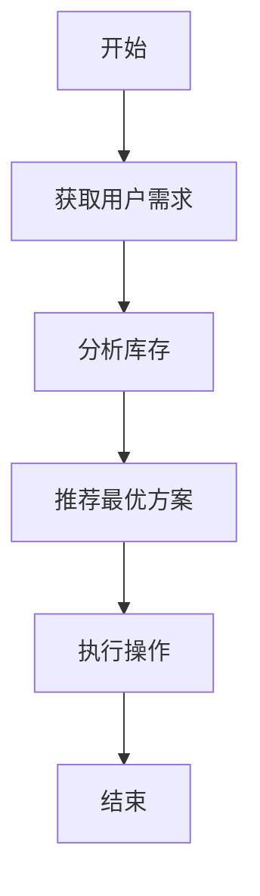
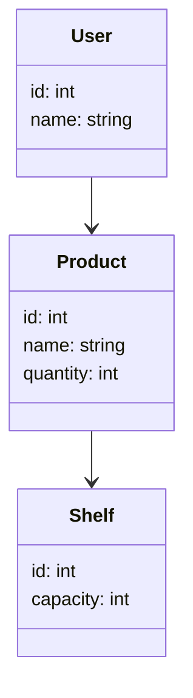

                 


# 智能浴室置物架：AI Agent的洗护用品管理

> 关键词：智能浴室置物架, AI Agent, 洗护用品管理, 物联网, 人工智能

> 摘要：本文深入探讨了智能浴室置物架的设计与实现，结合AI Agent技术，详细分析了其在洗护用品管理中的应用。文章从背景概念、技术原理、系统架构、项目实战到最佳实践，全面阐述了智能浴室置物架的核心技术与实现细节。

---

## 第一部分: 智能浴室置物架的背景与概念

### 第1章: 智能浴室置物架的发展背景

#### 1.1 智能家居的发展趋势
##### 1.1.1 智能家居的定义与特点
智能家居通过物联网技术将家中设备互联互通，实现智能化管理。其特点包括自动化、远程控制和高效率。

##### 1.1.2 智能浴室的市场需求
现代家庭对卫浴空间的智能化需求日益增长，智能浴室置物架成为智能家居的重要组成部分。

##### 1.1.3 AI Agent在智能家居中的应用
AI Agent（智能代理）通过学习用户习惯，优化设备运行，提升用户体验。

#### 1.2 AI Agent的基本概念
##### 1.2.1 AI Agent的定义
AI Agent是一种能够感知环境、自主决策的智能实体，能够执行复杂任务。

##### 1.2.2 AI Agent的核心功能
包括感知、决策、执行和自适应学习。

##### 1.2.3 AI Agent与传统自动化设备的区别
AI Agent具有自主决策能力，能够根据环境变化调整行为，而传统设备仅能执行预设任务。

#### 1.3 洗护用品管理的智能化需求
##### 1.3.1 洗护用品管理的痛点分析
传统置物架存在空间利用不足、管理复杂等问题，用户需求未被充分满足。

##### 1.3.2 智能化管理的优势
通过AI Agent实现智能分类、库存管理和自动补货，提升用户体验。

##### 1.3.3 智能浴室置物架的市场定位
作为智能家居的一部分，智能浴室置物架具有广阔市场前景。

---

## 第2章: 智能浴室置物架的核心概念

### 2.1 问题背景与问题描述
#### 2.1.1 洗护用品管理的复杂性
洗护用品种类繁多，使用场景多样，管理难度大。

#### 2.1.2 智能浴室置物架的目标
实现洗护用品的智能化分类、库存管理和高效管理。

#### 2.1.3 边界与外延
智能浴室置物架的边界在于其功能模块，外延包括智能家居系统。

### 2.2 核心概念与联系
#### 2.2.1 核心概念原理
通过AI Agent实现智能分类和库存管理。

#### 2.2.2 核心概念属性特征对比表格
| 特性 | 传统置物架 | 智能置物架 |
|------|-------------|------------|
| 智能分类 | 无         | 有         |
| 库存管理 | 无         | 有         |
| 自动补货 | 无         | 有         |

#### 2.2.3 ER实体关系图架构（Mermaid流程图）
```mermaid
entity User {
  id: int
  name: string
}
entity Product {
  id: int
  name: string
  quantity: int
}
entity Shelf {
  id: int
  capacity: int
}
```

---

## 第三部分: 智能浴室置物架的技术原理

### 第3章: AI Agent的核心算法

#### 3.1 算法原理讲解
AI Agent通过感知环境、分析数据、制定决策并执行操作，实现智能管理。

##### 3.1.1 算法流程图（Mermaid）


##### 3.1.2 算法实现代码示例
```python
class AIAgent:
    def __init__(self):
        self.products = {}
        self.inventory = {}

    def perceive_environment(self):
        # 获取环境数据
        pass

    def decide_action(self):
        # 分析数据，制定决策
        pass

    def execute_action(self):
        # 执行操作
        pass

    def learn_improve(self):
        # 自适应学习
        pass
```

#### 3.2 数学模型与公式
##### 3.2.1 库存管理模型
$$ \text{库存量} = \text{当前库存} + \text{新增补货} - \text{消耗量} $$

##### 3.2.2 空间优化算法
$$ \text{最优排列} = \argmin_{i} \sum_{j} (i - j)^2 $$

---

## 第四部分: 系统架构与设计

### 第4章: 系统架构设计

#### 4.1 系统功能设计
##### 4.1.1 功能模块分解
- 智能分类模块
- 库存管理模块
- 自动补货模块

##### 4.1.2 领域模型（Mermaid类图）


#### 4.2 系统架构设计（Mermaid架构图）


---

## 第五部分: 项目实战

### 第5章: 项目实战与实现

#### 5.1 环境搭建
- 安装Python、AI框架、物联网设备。

#### 5.2 核心代码实现
##### 5.2.1 智能分类模块
```python
def classify_products(products):
    # 根据类型分类
    pass
```

##### 5.2.2 库存管理模块
```python
def manage_inventory(products, inventory):
    # 更新库存
    pass
```

#### 5.3 案例分析
- 案例一：智能分类
- 案例二：自动补货

#### 5.4 项目总结
通过AI Agent实现了高效的洗护用品管理，提升了用户体验。

---

## 第六部分: 最佳实践与总结

### 第6章: 最佳实践与注意事项

#### 6.1 最佳实践
- 定期更新模型
- 保持设备清洁
- 及时处理异常情况

#### 6.2 小结
智能浴室置物架结合AI Agent技术，实现了高效的洗护用品管理，提升了智能家居的用户体验。

#### 6.3 注意事项
- 数据隐私保护
- 设备维护
- 用户教育

---

## 第七部分: 拓展阅读

### 第7章: 拓展阅读与未来展望

#### 7.1 相关技术
- 物联网
- 人工智能
- 智能家居

#### 7.2 未来展望
AI Agent技术将进一步提升智能浴室置物架的功能，实现更智能化的管理。

---

## 作者信息

作者：AI天才研究院/AI Genius Institute & 禅与计算机程序设计艺术 /Zen And The Art of Computer Programming

