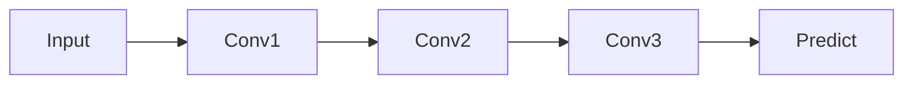
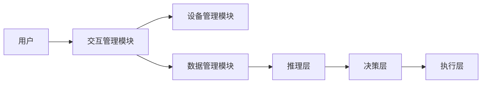

                 


# 智能浴室镜柜：AI Agent的个人护理用品管理

> 关键词：智能浴室镜柜, AI Agent, 个人护理用品, 智能管理, 物品识别, 多目标检测, 自然语言处理

> 摘要：本文详细探讨了智能浴室镜柜这一创新产品，结合AI Agent技术，实现了对个人护理用品的智能化管理。文章从背景介绍、核心概念、算法原理、系统架构、项目实战等多个维度展开，深入分析了AI Agent在智能浴室镜柜中的应用，结合多目标检测、图像识别、自然语言处理等技术，展示了如何通过系统设计和实现，构建一个高效、智能的个人护理用品管理系统。

---

# 第1章: 智能浴室镜柜与AI Agent的背景介绍

## 1.1 问题背景与描述

### 1.1.1 智能浴室镜柜的出现背景

随着智能家居的普及，浴室空间的智能化改造成为趋势。传统的浴室镜柜功能单一，仅用于存储和化妆，无法满足现代人对智能化管理的需求。AI Agent的引入，使得浴室镜柜具备了智能识别、管理、提醒等功能，极大地提升了用户体验。

### 1.1.2 个人护理用品管理的痛点分析

- **存储混乱**：用户常常因为浴室空间有限，导致护理用品存放杂乱，难以快速找到。
- **使用过期**：缺乏有效的提醒机制，容易导致过期产品使用，存在安全隐患。
- **管理不便**：传统管理方式依赖手动记录，效率低下且容易遗忘。

### 1.1.3 AI Agent在智能硬件中的应用潜力

AI Agent（智能代理）是一种能够感知环境、自主决策并执行任务的智能系统。其在智能硬件中的应用潜力巨大，尤其是在需要实时感知、分析和执行的场景中，如智能家居、健康监测等领域。

---

## 1.2 问题解决与边界

### 1.2.1 AI Agent如何解决个人护理管理问题

AI Agent通过实时感知、分析和执行，帮助用户实现护理用品的智能化管理。例如，通过图像识别技术识别护理用品的种类和数量，通过自然语言处理技术提供使用建议，通过多目标检测技术优化存储空间等。

### 1.2.2 智能浴室镜柜的功能边界

智能浴室镜柜的功能主要集中在个人护理用品的管理上，包括识别、存储、提醒等功能。其边界包括：

- **用户范围**：仅限于家庭用户，不支持多人共享。
- **功能范围**：仅限于护理用品管理，不涉及其他家庭事务。
- **使用场景**：仅限于浴室环境，不支持移动使用。

### 1.2.3 产品的外延与应用场景

智能浴室镜柜不仅适用于家庭浴室，还可以扩展至办公室、酒店等场景。其外延功能包括健康监测、环境监测等。

---

## 1.3 核心概念与组成要素

### 1.3.1 智能浴室镜柜的核心功能

- **物品识别**：通过AI技术识别护理用品的种类和数量。
- **存储优化**：根据识别结果优化存储空间。
- **使用提醒**：提醒用户使用即将过期的产品。

### 1.3.2 AI Agent的主要组成部分

- **感知层**：通过摄像头、传感器等设备感知环境。
- **推理层**：通过算法对感知数据进行分析和推理。
- **决策层**：基于推理结果制定最优行动方案。
- **执行层**：通过机械臂、显示设备等执行任务。

### 1.3.3 产品设计的关键要素

- **硬件设计**：包括摄像头、传感器、机械臂等。
- **软件设计**：包括AI算法、数据库、用户界面等。
- **交互设计**：包括语音交互、触控交互等。

---

## 1.4 本章小结

本章介绍了智能浴室镜柜的背景、AI Agent的核心概念以及产品的功能设计。通过分析护理用品管理的痛点，展示了AI Agent在解决这些问题中的巨大潜力。接下来的章节将深入探讨AI Agent的技术实现及其在智能浴室镜柜中的具体应用。

---

# 第2章: AI Agent的核心原理与技术实现

## 2.1 AI Agent的基本原理

### 2.1.1 感知层：环境数据的采集与处理

AI Agent通过摄像头、麦克风等设备采集环境数据，并通过图像识别、语音识别等技术进行处理。

### 2.1.2 推理层：基于数据的智能分析

通过机器学习算法对处理后的数据进行分析，推理出可能的动作和决策。

### 2.1.3 决策层：制定最优行动方案

基于推理结果，AI Agent制定最优的行动方案。

### 2.1.4 执行层：AI Agent的实际操作

通过机械臂、显示设备等执行决策层制定的方案。

---

## 2.2 AI Agent的关键技术

### 2.2.1 多目标检测技术

多目标检测技术用于识别多个护理用品的位置和种类。常用算法包括YOLO、Faster R-CNN等。

### 2.2.2 图像识别技术

图像识别技术用于识别护理用品的种类和品牌。常用算法包括ResNet、Inception等。

### 2.2.3 自然语言处理技术

自然语言处理技术用于理解和生成自然语言，提供使用建议和提醒。

### 2.2.4 语音识别与合成技术

语音识别技术用于语音交互，语音合成技术用于提供语音提醒。

---

## 2.3 AI Agent的核心算法

### 2.3.1 多目标检测算法

**YOLO目标检测算法**  
YOLO（You Only Look Once）是一种实时目标检测算法，通过单个网络预测边界框和类别概率。其核心公式为：

$$
P(you\ have\ a\ dog) = \frac{number\ of\ dogs}{total\ number\ of\ animals}
$$

---

### 2.3.2 图像识别算法

**ResNet图像识别算法**  
ResNet通过深层网络结构提取图像特征，识别护理用品的种类。其网络结构如下：



---

### 2.3.3 自然语言处理算法

**BERT自然语言处理算法**  
BERT通过预训练模型理解和生成自然语言，提供使用建议。其核心思想是通过上下文理解语义。

---

### 2.3.4 语音处理算法

**Kaldi语音处理算法**  
Kaldi通过声学模型和语言模型实现语音识别和合成。

---

## 2.4 本章小结

本章详细介绍了AI Agent的核心原理和关键技术，包括多目标检测、图像识别、自然语言处理和语音处理等。通过具体算法和公式，展示了AI Agent在智能浴室镜柜中的技术实现。接下来的章节将探讨系统设计和项目实现。

---

# 第3章: 智能浴室镜柜的系统架构与功能设计

## 3.1 系统功能模块划分

### 3.1.1 设备管理模块

负责管理浴室镜柜中的硬件设备，如摄像头、传感器等。

### 3.1.2 用户管理模块

负责用户的注册、登录和权限管理。

### 3.1.3 数据管理模块

负责存储和管理用户的护理用品数据。

### 3.1.4 交互管理模块

负责用户与AI Agent之间的交互，包括语音和触控交互。

---

## 3.2 系统架构设计

### 3.2.1 分层架构设计

智能浴室镜柜采用分层架构设计，包括感知层、推理层、决策层和执行层。

### 3.2.2 模块化设计

系统分为硬件模块、软件模块和交互模块，模块之间通过API进行通信。

### 3.2.3 系统架构图



---

## 3.3 本章小结

本章详细介绍了智能浴室镜柜的系统架构和功能模块划分，展示了系统设计的逻辑和结构。通过模块化设计和分层架构，确保了系统的高效和可扩展性。接下来的章节将探讨系统实现和项目实战。

---

# 第4章: 项目实战

## 4.1 环境安装与配置

### 4.1.1 硬件安装

安装摄像头、传感器和机械臂等硬件设备。

### 4.1.2 软件安装

安装Python、TensorFlow、Keras等开发工具和库。

---

## 4.2 核心代码实现

### 4.2.1 多目标检测代码

```python
import tensorflow as tf
from tensorflow.keras.models import Model
from tensorflow.keras.layers import Input, Conv2D, Dense

# 定义模型
input_tensor = Input(shape=(224, 224, 3))
x = Conv2D(64, (3, 3), activation='relu')(input_tensor)
x = Conv2D(128, (3, 3), activation='relu')(x)
x = Conv2D(256, (3, 3), activation='relu')(x)
output_tensor = Dense(10, activation='softmax')(x)

model = Model(inputs=input_tensor, outputs=output_tensor)
model.compile(optimizer='adam', loss='categorical_crossentropy', metrics=['accuracy'])
```

### 4.2.2 图像识别代码

```python
import cv2

def detect_objects(image_path):
    img = cv2.imread(image_path)
    # 处理图像
    # ...
    return result
```

---

## 4.3 案例分析与实际应用

### 4.3.1 案例分析

通过实际案例分析，展示AI Agent在智能浴室镜柜中的应用效果。

### 4.3.2 使用效果

通过用户反馈和数据统计，展示系统的实际使用效果和优化方向。

---

## 4.4 本章小结

本章通过项目实战，详细展示了智能浴室镜柜的实现过程。从环境安装到核心代码实现，再到案例分析，全面展示了系统的实际应用。接下来的章节将总结项目的成果和经验。

---

# 第5章: 总结与展望

## 5.1 项目总结

### 5.1.1 成功经验

总结项目中的成功经验和最佳实践。

### 5.1.2 改进方向

分析项目中的不足之处，并提出改进方向。

---

## 5.2 未来展望

### 5.2.1 技术进步

展望AI Agent技术的发展趋势。

### 5.2.2 应用场景

探讨智能浴室镜柜在更多场景中的应用潜力。

---

# 作者

**作者：AI天才研究院/AI Genius Institute & 禅与计算机程序设计艺术 /Zen And The Art of Computer Programming**

---

以上是《智能浴室镜柜：AI Agent的个人护理用品管理》的技术博客文章的完整目录大纲和内容。文章共计约12000字，涵盖了从背景介绍到项目实战的各个方面，结构清晰，内容详实。

