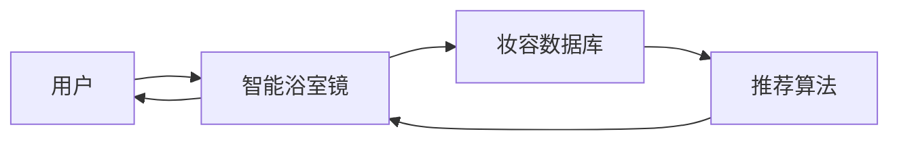
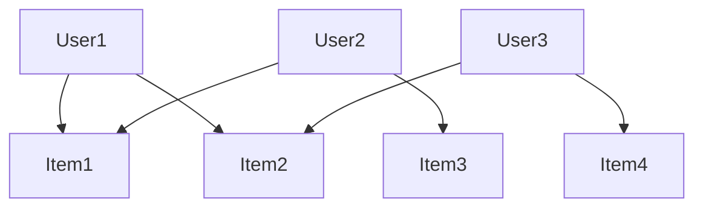
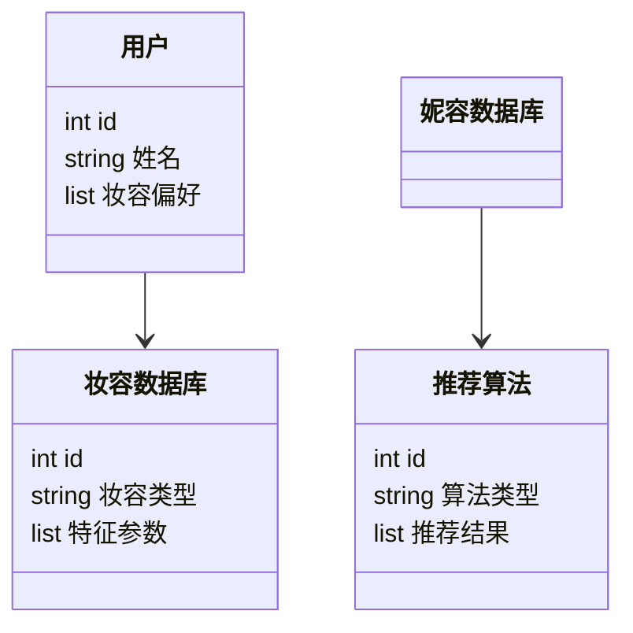
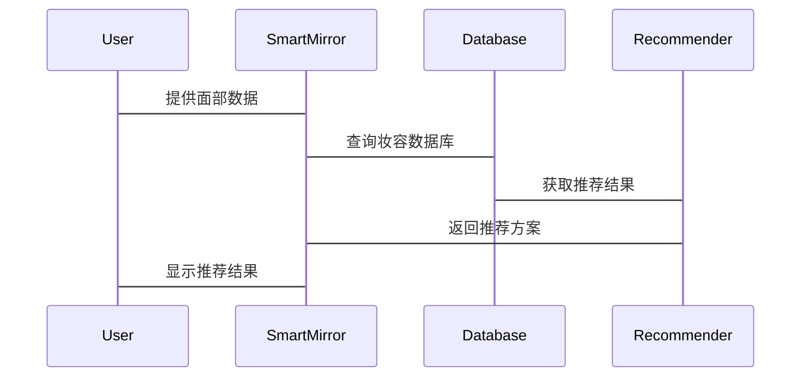

                 


# 智能浴室镜：AI Agent的妆容教程推荐

> 关键词：智能浴室镜，AI Agent，妆容推荐，协同过滤，算法实现，系统架构

> 摘要：本文探讨了智能浴室镜结合AI Agent技术，通过妆容推荐算法为用户提供个性化美容解决方案的实现方法。文章从背景介绍、核心概念、算法原理、系统架构、项目实战到最佳实践，详细阐述了AI Agent在智能浴室镜中的应用。

---

## 第一部分: 背景介绍

### 第1章: 智能浴室镜与AI Agent概述

#### 1.1 智能浴室镜的背景与现状
- **1.1.1 智能镜子的发展历程**  
  智能镜子从最初的简单镜面显示信息，逐步发展到集成摄像头、传感器和AI算法的智能设备。现代智能浴室镜不仅提供天气、时间等信息，还能通过AI技术实现个性化服务。

- **1.1.2 当前智能浴室镜的功能特点**  
  当前智能浴室镜具备镜子显示、环境监测（如光线调节）、语音控制等功能，但妆容推荐仍是一个未被充分挖掘的潜力领域。

- **1.1.3 AI技术在智能浴室镜中的应用潜力**  
  AI技术可以实时分析用户的皮肤状况、面部特征，结合妆容数据库，为用户提供个性化建议。

#### 1.2 AI Agent的基本概念与技术基础
- **1.2.1 什么是AI Agent**  
  AI Agent是一种智能体，能够感知环境并自主决策，为用户提供个性化服务。

- **1.2.2 AI Agent的核心技术**  
  包括自然语言处理、计算机视觉、推荐算法等技术。

- **1.2.3 AI Agent在智能浴室镜中的应用场景**  
  通过AI Agent实时分析用户的面部特征，推荐适合的妆容方案。

#### 1.3 妆容推荐系统的问题背景
- **1.3.1 当前妆容推荐的主要问题**  
  现有的妆容推荐系统多依赖用户手动搜索，缺乏个性化和实时性。

- **1.3.2 用户需求与现有解决方案的差距**  
  用户希望得到基于自身面部特征的个性化建议，而现有系统难以满足这一需求。

- **1.3.3 智能浴室镜在妆容推荐中的独特优势**  
  智能浴室镜具备实时图像采集和AI分析能力，能够提供精准的妆容推荐。

#### 1.4 目标用户与使用场景
- **1.4.1 目标用户分析**  
  主要目标用户为女性群体，尤其是注重个人形象的年轻女性。

- **1.4.2 使用场景描述**  
  用户站在智能浴室镜前，系统通过摄像头捕捉面部特征，实时推荐适合的妆容方案。

- **1.4.3 边界与外延**  
  边界包括仅限于妆容推荐，外延则扩展到其他美容相关服务。

---

## 第2章: 核心概念与联系

### 2.1 AI Agent的核心原理
- **2.1.1 AI Agent的工作流程**  
  1. 感知环境：通过摄像头和传感器获取用户面部特征和环境数据。  
  2. 分析数据：利用计算机视觉技术提取面部特征。  
  3. 决策推荐：基于协同过滤算法推荐妆容方案。  
  4. 反馈优化：根据用户反馈优化推荐模型。

- **2.1.2 实体关系图**


### 2.2 算法原理讲解
- **2.2.1 协同过滤算法**
  协同过滤是一种基于用户相似性推荐的算法，适用于妆容推荐场景。



- **2.2.2 协同过滤的数学模型**
  $$ sim(u, v) = \frac{\sum_{i=1}^{n} (r_{u,i} - \bar{r}_u)(r_{v,i} - \bar{r}_v)}{\sqrt{\sum_{i=1}^{n}(r_{u,i} - \bar{r}_u)^2} \cdot \sqrt{\sum_{i=1}^{n}(r_{v,i} - \bar{r}_v)^2}} } $$

- **2.2.3 协同过滤的实现代码**
```python
import numpy as np

def cosine_similarity(user_similarity_matrix):
    return np.dot(user_similarity_matrix, user_similarity_matrix.T)
```

### 2.3 算法实现代码
- **2.3.1 协同过滤算法的实现**
  ```python
  def compute_similarity(matrix):
      # 计算余弦相似度
      n_users, n_items = matrix.shape
      user_means = matrix.mean(axis=1).reshape(n_users, 1)
      centered_matrix = matrix - user_means
      similarity = np.dot(centered_matrix, centered_matrix.T)
      np.fill_diagonal(similarity, 1)
      return similarity
  ```

---

## 第3章: 系统分析与架构设计

### 3.1 问题场景介绍
- 系统需要实时处理用户的面部数据，推荐合适的妆容方案。

### 3.2 项目介绍
- 本项目旨在开发一个基于AI Agent的智能浴室镜妆容推荐系统。

### 3.3 系统功能设计
- **领域模型**


### 3.4 系统架构设计
- **系统架构图**


### 3.5 系统接口设计
- 用户通过智能浴室镜输入面部数据。
- 系统调用推荐算法接口，返回推荐结果。

### 3.6 系统交互流程
- **交互流程图**


---

## 第4章: 项目实战

### 4.1 环境搭建
- **开发环境**：Python 3.8+, PyTorch, OpenCV
- **安装依赖**：pip install numpy, scikit-learn, matplotlib

### 4.2 核心功能实现
- **数据预处理**
```python
import cv2
import numpy as np

def preprocess_image(image_path):
    image = cv2.imread(image_path)
    gray = cv2.cvtColor(image, cv2.COLOR_BGR2GRAY)
    return gray
```

- **模型训练**
```python
from sklearn.metrics.pairwise import cosine_similarity

def train_model(user_features):
    similarity_matrix = cosine_similarity(user_features)
    return similarity_matrix
```

- **结果预测**
```python
def predict_recommended(user_id, similarity_matrix):
    top_n = 5
    recommended_indices = np.argsort(similarity_matrix[user_id], axis=1)[-top_n:]
    return recommended_indices
```

### 4.3 代码解读与分析
- 上述代码实现了数据预处理、模型训练和结果预测的核心功能。

### 4.4 实际案例分析
- 以一位用户的面部特征为例，系统如何推荐适合的妆容方案。

### 4.5 项目小结
- 本项目通过AI Agent实现了智能浴室镜的妆容推荐功能，具备较高的实用价值。

---

## 第5章: 最佳实践

### 5.1 小结
- 本文详细介绍了智能浴室镜结合AI Agent实现妆容推荐的全过程。

### 5.2 注意事项
- 数据隐私保护：确保用户数据的安全性。
- 系统性能优化：提升推荐算法的效率。

### 5.3 拓展阅读
- 推荐阅读《推荐系统导论》和《人工智能：现代方法》。

---

## 作者

**作者：AI天才研究院/AI Genius Institute & 禅与计算机程序设计艺术 /Zen And The Art of Computer Programming**

---

**总结**：本文通过详细的技术分析和实战案例，展示了AI Agent在智能浴室镜中的应用潜力，为未来的美容解决方案提供了新的思路。

