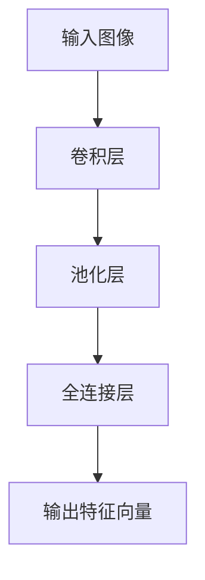
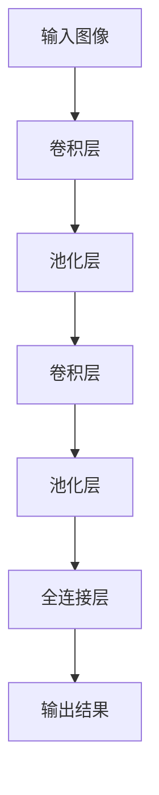
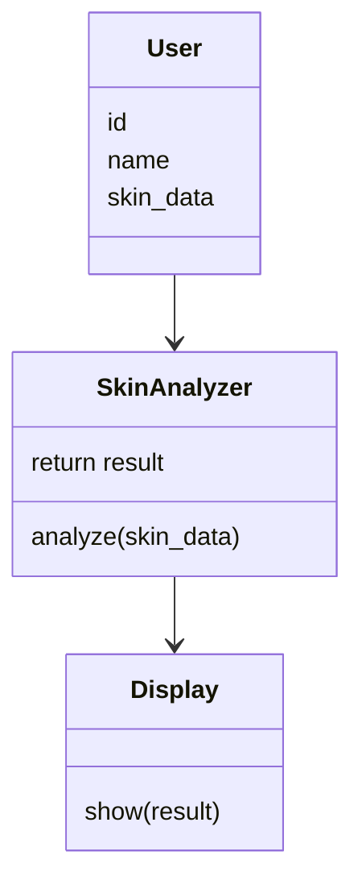
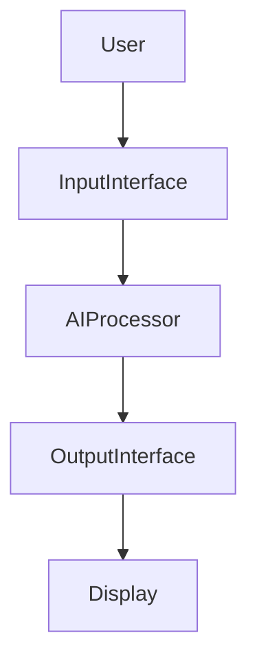
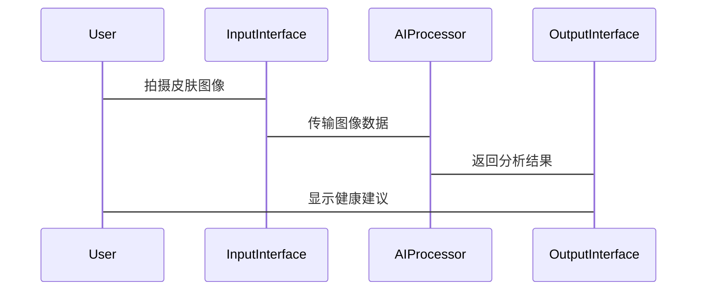

                 


```markdown
# 智能浴室镜：AI Agent的皮肤状况分析

---

## 关键词：
智能浴室镜, AI Agent, 皮肤状况分析, 图像处理, 健康监测, 人工智能, 系统架构

---

## 摘要：
本文将深入探讨智能浴室镜如何通过AI Agent技术实现皮肤状况的智能分析。从背景介绍到核心概念，从算法原理到系统架构，从项目实战到最佳实践，我们将全面解析智能浴室镜的AI皮肤分析系统。通过详细的技术分析和实际案例，本文将帮助读者理解如何利用AI技术实现高效、精准的皮肤健康监测。

---

## 第一部分：智能浴室镜与AI Agent的背景介绍

### 第1章：智能浴室镜与皮肤健康分析的背景

#### 1.1 智能浴室镜的定义与应用场景
##### 1.1.1 智能浴室镜的基本定义
智能浴室镜是一种集成AI技术的智能硬件设备，主要用于浴室环境中的人体健康监测，尤其是皮肤状况的分析。它通常配备高分辨率的摄像头、传感器和AI算法，能够实时捕捉用户皮肤状态并提供健康建议。

##### 1.1.2 智能浴室镜的主要应用场景
- 皮肤健康管理：监测皮肤状态，如痘痘、过敏、干燥等问题。
- 美容与护肤建议：根据皮肤状况推荐护肤品和美容方案。
- 健康预警：通过皮肤变化早期发现潜在健康问题。

##### 1.1.3 智能浴室镜的市场现状与发展趋势
随着人们对健康和美容的关注度不断提高，智能浴室镜市场迅速增长。未来，AI技术的进一步发展将推动其功能更加智能化和精准化。

#### 1.2 皮肤健康分析的必要性
##### 1.2.1 皮肤健康的重要性
皮肤是人体最大的器官，不仅是保护屏障，还能反映身体健康状况。皮肤问题可能与内分泌、免疫系统等密切相关。

##### 1.2.2 现有皮肤健康检测方法的局限性
传统皮肤检测方法依赖于医生经验，效率低且成本高。用户自我检测的准确性也有限。

##### 1.2.3 AI技术在皮肤健康分析中的优势
AI技术能够快速、准确地分析皮肤图像，提供个性化的健康建议，成本低且易于普及。

#### 1.3 AI Agent在智能浴室镜中的作用
##### 1.3.1 AI Agent的基本概念
AI Agent是一种智能体，能够感知环境、自主决策并执行任务。在智能浴室镜中，AI Agent负责数据采集、分析和交互。

##### 1.3.2 AI Agent在智能浴室镜中的具体应用
- 数据采集：通过摄像头和传感器获取用户皮肤图像和生理数据。
- 数据分析：利用AI算法对皮肤图像进行特征提取和分类。
- 用户交互：根据分析结果提供健康建议或操作指导。

##### 1.3.3 AI Agent与智能浴室镜的结合方式
AI Agent嵌入智能浴室镜的软硬件系统，通过实时数据处理和反馈实现智能分析。

#### 1.4 本章小结
本章介绍了智能浴室镜的定义、应用场景及其在皮肤健康分析中的重要性，重点阐述了AI Agent在其中的核心作用。

---

## 第二部分：智能浴室镜中的核心概念与联系

### 第2章：AI Agent与图像处理的核心概念

#### 2.1 AI Agent的核心原理
##### 2.1.1 AI Agent的基本工作原理
AI Agent通过感知环境、获取数据、分析数据、做出决策并执行操作。其核心在于数据处理和智能决策能力。

##### 2.1.2 AI Agent的感知与决策机制
AI Agent利用摄像头、传感器等设备获取环境数据，通过算法进行分析，生成决策并执行操作。

##### 2.1.3 AI Agent的学习与优化过程
通过机器学习模型，AI Agent可以从大量数据中学习，不断优化自身的分析和决策能力。

#### 2.2 图像处理与皮肤分析的关键技术
##### 2.2.1 图像采集与预处理技术
图像采集是皮肤分析的第一步，预处理包括去噪、增强和归一化等步骤。

##### 2.2.2 图像特征提取方法
常用的技术包括边缘检测、纹理分析和颜色空间转换等，用于提取皮肤特征。

##### 2.2.3 图像分类与识别算法
基于卷积神经网络（CNN）的图像分类算法是目前皮肤分析的主流方法。

#### 2.3 AI Agent与图像处理的关联性分析
##### 2.3.1 AI Agent在图像处理中的角色
AI Agent作为数据处理的核心，负责图像的采集、分析和结果反馈。

##### 2.3.2 图像处理数据对AI Agent的影响
高质量的图像数据是AI Agent准确分析的基础，数据质量直接影响分析结果。

##### 2.3.3 AI Agent与图像处理的协同优化
通过优化图像处理算法和提升AI模型的学习能力，可以实现更精准的皮肤分析。

#### 2.4 核心概念对比分析
##### 2.4.1 AI Agent与传统图像处理算法的对比
| 概念 | 属性 | 描述 |
|------|------|------|
| AI Agent | 智能性 | 具备自主学习和优化能力 |
| 传统图像处理算法 | 确定性 | 基于固定规则的处理方式 |
| AI Agent | 学习能力 | 可通过数据优化性能 |
| 传统图像处理算法 | 稳定性 | 处理结果相对固定 |

##### 2.4.2 ER实体关系图架构
```mermaid
erDiagram
    user {
        id
        name
        skin_data
    }
    skin_feature {
        feature_id
        feature_name
        description
    }
    analysis_result {
        result_id
        result_type
        analysis_time
    }
    user --> skin_data
    skin_data --> skin_feature
    skin_feature --> analysis_result
```

---

## 第三部分：智能浴室镜中的算法原理

### 第3章：图像处理与AI分析算法原理

#### 3.1 图像采集与预处理
##### 3.1.1 图像采集流程
- 拍摄皮肤图像
- 调整光线和分辨率
- 去除噪声

##### 3.1.2 图像预处理技术
- 转换为标准尺寸
- 调整亮度和对比度
- 去除背景干扰

#### 3.2 图像特征提取
##### 3.2.1 基于CNN的特征提取


##### 3.2.2 常见特征提取算法
- Haar特征
- SIFT特征
- HOG特征

#### 3.3 基于深度学习的皮肤分类
##### 3.3.1 CNN网络结构


##### 3.3.2 常见分类算法
- SVM
- Random Forest
- K-Nearest Neighbors (KNN)

#### 3.4 算法实现与优化
##### 3.4.1 算法实现步骤
```python
def preprocess_image(image):
    # 调整图像尺寸
    image = cv2.resize(image, (224, 224))
    # 转换为张量
    image = image / 255.0
    return image
```

##### 3.4.2 算法优化技巧
- 数据增强
- 调整超参数
- 使用迁移学习

---

## 第四部分：智能浴室镜中的数学模型与公式

### 第4章：AI Agent的数学模型与公式

#### 4.1 基于CNN的数学模型
##### 4.1.1 卷积层的数学表示
$$
f(x) = \sum_{k=1}^{K} w_{k} \cdot x_{k} + b
$$
其中，\(w\) 是权重，\(x\) 是输入，\(b\) 是偏置。

##### 4.1.2 池化层的数学表示
$$
y_i = \max(x_{i-1}, x_i)
$$
其中，\(x_i\) 和 \(x_{i-1}\) 是输入的相邻元素。

#### 4.2 基于损失函数的优化
##### 4.2.1 常见损失函数
- 均方误差（MSE）：
$$
L = \frac{1}{N}\sum_{i=1}^{N}(y_i - \hat{y_i})^2
$$
- 交叉熵损失：
$$
L = -\frac{1}{N}\sum_{i=1}^{N} y_i \log(\hat{y_i}) + (1 - y_i) \log(1 - \hat{y_i})
$$

##### 4.2.2 梯度下降算法
$$
w = w - \eta \cdot \frac{\partial L}{\partial w}
$$
其中，\(\eta\) 是学习率，\(\frac{\partial L}{\partial w}\) 是权重的梯度。

#### 4.3 基于激活函数的计算
##### 4.3.1 常见激活函数
- ReLU：
$$
f(x) = \max(0, x)
$$
- Sigmoid：
$$
f(x) = \frac{1}{1 + e^{-x}}
$$

---

## 第五部分：智能浴室镜中的系统分析与架构设计

### 第5章：系统分析与架构设计方案

#### 5.1 问题场景介绍
智能浴室镜需要在复杂的浴室环境中稳定工作，包括光照变化、湿度干扰等。

#### 5.2 系统功能设计
##### 5.2.1 领域模型


##### 5.2.2 系统架构设计


#### 5.3 系统接口设计
##### 5.3.1 输入接口
- 摄像头输入
- 传感器输入

##### 5.3.2 输出接口
- 显示屏输出
- 语音助手输出

#### 5.4 系统交互设计
##### 5.4.1 交互流程


---

## 第六部分：智能浴室镜中的项目实战

### 第6章：项目实战与实现

#### 6.1 环境安装与配置
##### 6.1.1 开发环境
- Python 3.8+
- OpenCV
- TensorFlow

##### 6.1.2 安装依赖
```bash
pip install numpy cv2 tensorflow
```

#### 6.2 系统核心实现
##### 6.2.1 图像预处理代码
```python
import cv2

def preprocess_image(image):
    image = cv2.resize(image, (224, 224))
    image = image / 255.0
    return image
```

##### 6.2.2 模型训练代码
```python
import tensorflow as tf
from tensorflow.keras import layers

model = tf.keras.Sequential([
    layers.Conv2D(32, (3,3), activation='relu'),
    layers.MaxPooling2D((2,2)),
    layers.Conv2D(64, (3,3), activation='relu'),
    layers.MaxPooling2D((2,2)),
    layers.Flatten(),
    layers.Dense(128, activation='relu'),
    layers.Dense(1, activation='sigmoid')
])
```

#### 6.3 案例分析与结果展示
##### 6.3.1 案例分析
- 输入一张皮肤图像，经过预处理后输入模型，输出健康状况。

##### 6.3.2 结果展示
- 显示分析结果，如“皮肤状态良好”、“建议使用保湿霜”等。

---

## 第七部分：智能浴室镜中的最佳实践与总结

### 第7章：最佳实践与总结

#### 7.1 最佳实践
##### 7.1.1 数据质量管理
确保数据的多样性和代表性，避免过拟合。

##### 7.1.2 模型优化
定期更新模型，提高准确率和响应速度。

##### 7.1.3 系统维护
定期检查硬件和软件，确保系统稳定运行。

#### 7.2 小结
智能浴室镜通过AI Agent和图像处理技术，实现了高效、精准的皮肤健康监测。本文详细介绍了其核心概念、算法原理、系统架构和项目实现，为读者提供了全面的技术参考。

#### 7.3 注意事项
- 确保用户隐私安全
- 定期校准设备
- 提供良好的用户体验

#### 7.4 拓展阅读
- 《深度学习实战》
- 《AI图像处理入门》
- 《系统架构设计指南》

---

## 作者：AI天才研究院/AI Genius Institute & 禅与计算机程序设计艺术/Zen And The Art of Computer Programming
```

