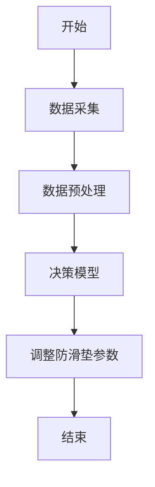
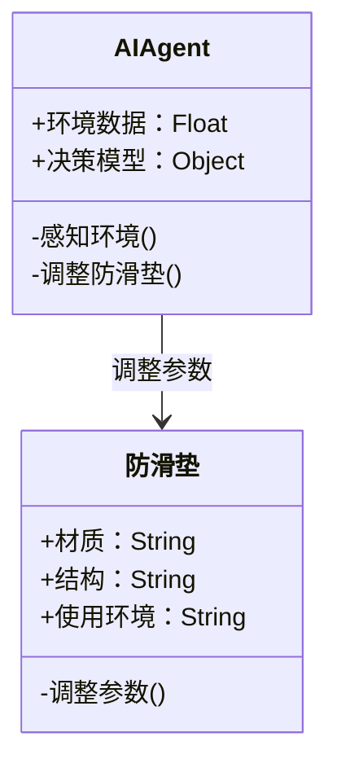
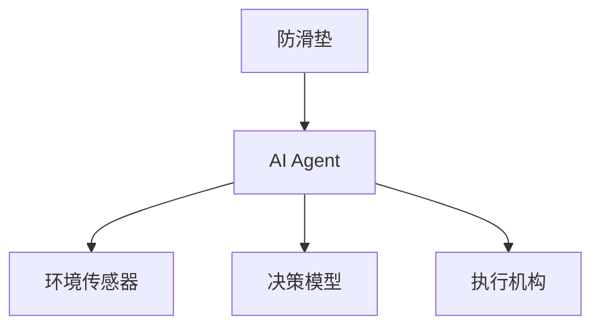
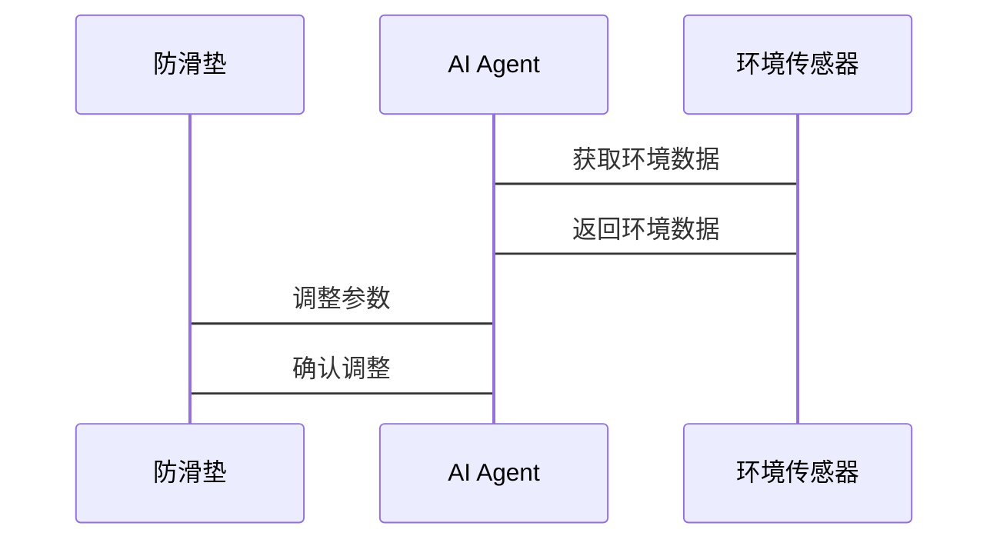

                 


# 智能浴室防滑垫：AI Agent的平衡能力评估

> 关键词：智能浴室防滑垫，AI Agent，平衡能力评估，系统架构，项目实战

> 摘要：本文深入探讨了智能浴室防滑垫中AI Agent的平衡能力评估问题，从背景介绍、核心概念、算法原理、系统架构到项目实战，系统性地分析和实现了一种基于AI的防滑垫平衡能力评估系统。通过详细的技术分析和实际案例，本文为读者提供了全面的技术解决方案和实践指导。

---

# 第一部分：背景介绍

## 第1章：问题背景与描述

### 1.1 问题背景
#### 1.1.1 浴室防滑垫的重要性
浴室是家庭中容易发生滑倒事故的地方，防滑垫的使用可以有效减少滑倒的风险。然而，传统防滑垫在材质、设计上存在局限性，无法根据环境变化自动调整。

#### 1.1.2 AI Agent在防滑垫中的应用
随着AI技术的发展，AI Agent（智能代理）可以实时感知环境并做出决策。将其应用于防滑垫，可以实现动态调整以确保最佳的防滑性能。

#### 1.1.3 平衡能力评估的必要性
AI Agent需要具备平衡能力，能够根据浴室环境的变化（如湿度、温度、使用频率等）实时调整防滑垫的性能，确保其始终处于最佳状态。

### 1.2 问题描述
#### 1.2.1 防滑垫的使用场景
浴室环境中湿度高、地面易滑，传统防滑垫无法根据环境变化自动调整。

#### 1.2.2 AI Agent在防滑垫中的具体问题
AI Agent需要实时感知环境数据（如温度、湿度、使用情况等），并根据这些数据调整防滑垫的性能参数。

#### 1.2.3 平衡能力评估的定义
平衡能力评估是指AI Agent能够根据环境变化，动态调整防滑垫的性能参数，以确保防滑效果的最佳状态。

### 1.3 问题解决与边界

#### 1.3.1 问题解决方法
引入AI Agent，通过实时感知环境数据，动态调整防滑垫的性能参数，以达到最佳防滑效果。

#### 1.3.2 边界与外延
- 系统仅限于浴室环境，不考虑其他场景。
- AI Agent的决策范围限于防滑垫的性能参数调整。

---

## 第2章：核心概念与结构

### 2.1 核心概念
#### 2.1.1 防滑垫的基本属性
- 材质：影响防滑性能的关键因素。
- 结构：防滑垫的物理结构设计。
- 使用环境：湿度、温度、使用频率等。

#### 2.1.2 AI Agent的核心功能
- 实时感知：采集环境数据。
- 自动决策：根据数据调整防滑垫参数。
- 反馈优化：根据使用反馈优化决策模型。

#### 2.1.3 平衡能力评估的关键指标
- 防滑性能：防滑垫的摩擦系数。
- 稳定性：防滑垫在不同环境下的性能一致性。
- 响应速度：AI Agent调整防滑垫参数的速率。

---

# 第二部分：核心概念与联系

## 第3章：AI Agent的基本原理

### 3.1 感知机制
#### 3.1.1 数据采集与处理
AI Agent通过传感器采集环境数据（如湿度、温度），并进行预处理。

#### 3.1.2 感知模型的构建
基于机器学习算法，构建感知模型，用于预测防滑垫的性能变化。

#### 3.1.3 感知结果的输出
AI Agent将感知结果输出，作为决策的依据。

### 3.2 决策与执行机制
#### 3.2.1 决策算法的选择
采用强化学习算法，根据感知结果调整防滑垫的参数。

#### 3.2.2 执行机制的实现
AI Agent通过控制防滑垫的结构参数（如表面纹理、材质硬度）进行调整。

---

# 第三部分：算法原理讲解

## 第4章：平衡能力评估算法

### 4.1 算法原理
#### 4.1.1 算法流程
1. 数据采集：通过传感器获取环境数据。
2. 数据预处理：去除噪声，提取特征。
3. 决策模型：基于强化学习算法，调整防滑垫参数。
4. 执行：根据决策结果调整防滑垫。

#### 4.1.2 算法流程图


### 4.2 算法实现
#### 4.2.1 Python代码实现
```python
import numpy as np
from sklearn import preprocessing

# 数据采集
data = np.array([[25, 60], [26, 62], [24, 58]])

# 数据预处理
normalized_data = preprocessing.minmax_scale(data, feature_range=(0, 1))
print(normalized_data)

# 决策模型
# 假设决策模型基于强化学习，这里简化为一个线性回归模型
from sklearn.linear_model import LinearRegression

model = LinearRegression()
model.fit(normalized_data[:, 0].reshape(-1, 1), normalized_data[:, 1].reshape(-1, 1))

# 执行：调整防滑垫参数
predicted_data = model.predict(normalized_data[:, 0].reshape(-1, 1))
print(predicted_data)
```

---

# 第四部分：系统分析与架构设计方案

## 第5章：系统架构设计

### 5.1 项目介绍
#### 5.1.1 项目背景
智能浴室防滑垫项目旨在通过AI技术提高防滑垫的安全性和舒适性。

#### 5.1.2 系统功能设计


### 5.2 系统架构设计
#### 5.2.1 系统架构图


### 5.3 接口设计与交互
#### 5.3.1 接口设计


---

# 第五部分：项目实战

## 第6章：系统实现

### 6.1 环境安装
#### 6.1.1 安装Python环境
```bash
python -m pip install numpy scikit-learn
```

### 6.2 核心代码实现
#### 6.2.1 防滑垫参数调整代码
```python
from sklearn.linear_model import LinearRegression

# 数据预处理
data = np.array([[25, 60], [26, 62], [24, 58]])
normalized_data = preprocessing.minmax_scale(data, feature_range=(0, 1))

# 训练模型
model = LinearRegression()
model.fit(normalized_data[:, 0].reshape(-1, 1), normalized_data[:, 1].reshape(-1, 1))

# 预测调整参数
predicted_data = model.predict(normalized_data[:, 0].reshape(-1, 1))
print(predicted_data)
```

---

## 第7章：总结与扩展

### 7.1 最佳实践 tips
- 定期校准传感器，确保数据准确性。
- 根据用户反馈优化决策模型。

### 7.2 小结
本文系统性地分析了智能浴室防滑垫中AI Agent的平衡能力评估问题，从理论到实践，详细阐述了系统的实现过程。

### 7.3 注意事项
- 确保系统的安全性，避免因误操作导致滑倒事故。
- 定期维护系统，确保传感器和AI模型的正常运行。

### 7.4 拓展阅读
推荐阅读《机器学习实战》和《深度学习入门》等书籍，进一步了解AI技术在智能家居中的应用。

---

作者：AI天才研究院/AI Genius Institute & 禅与计算机程序设计艺术 /Zen And The Art of Computer Programming

