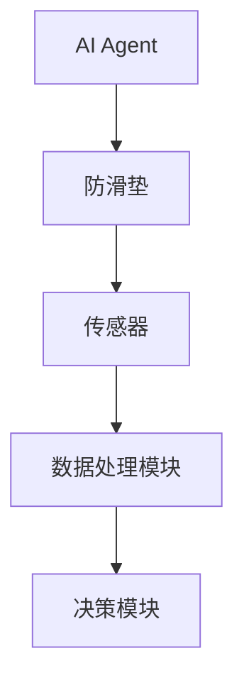
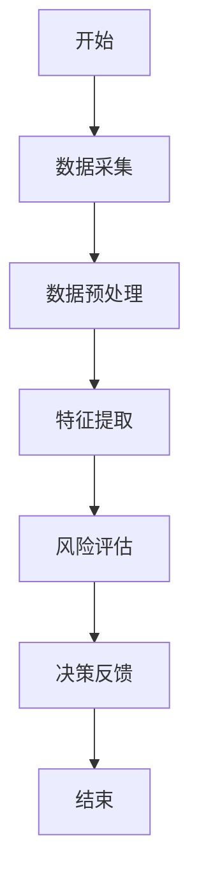
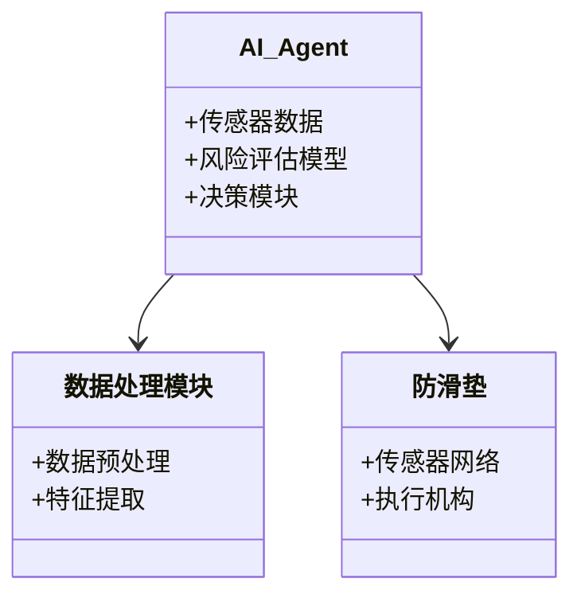
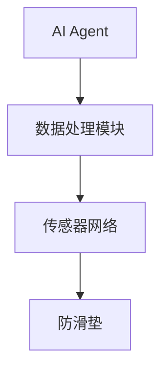
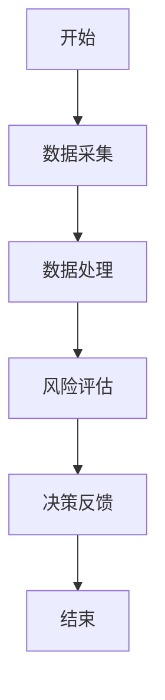

                 


# 智能浴室防滑垫：AI Agent的洗浴安全监护

## 关键词：智能防滑垫, AI Agent, 洗浴安全, 物联网, 人工智能, 传感器技术

## 摘要：  
本文探讨了智能浴室防滑垫结合AI代理的洗浴安全监护系统。通过分析老年人及特定群体在浴室中的安全风险，提出了一种基于AI代理的防滑垫解决方案，详细阐述了其技术原理、系统架构及实际应用场景，展示了如何利用传感器技术和人工智能算法提升洗浴安全性。

---

# 第一部分: 智能浴室防滑垫与AI Agent的背景介绍

## 第1章: 背景介绍与问题背景

### 1.1 问题背景

#### 1.1.1 老年人与浴室安全问题
浴室是老年人生活中的高风险区域。数据显示，老年人在浴室中滑倒的概率是年轻人的3倍，滑倒导致的骨折等伤害严重影响其生活质量。

#### 1.1.2 智能家居的发展趋势
随着智能家居技术的普及，浴室设备的智能化成为趋势。智能传感器、物联网和人工智能技术的结合，为提升浴室安全提供了新的可能性。

#### 1.1.3 防滑垫的现状与不足
传统防滑垫仅能提供基础防滑功能，无法实时监测使用者的动态。在浴室环境中，湿滑的地面和复杂的动作模式使得传统防滑垫难以满足安全需求。

---

### 1.2 问题描述

#### 1.2.1 洗浴场景中的安全风险
老年人在洗浴过程中容易因地面湿滑、身体不适或动作不稳而滑倒。此外，浴室环境的封闭性使得及时发现风险变得困难。

#### 1.2.2 防滑垫的功能需求
智能防滑垫需要具备实时监测使用者状态、感知环境变化、预测潜在风险并发出预警的功能。

#### 1.2.3 AI Agent在防滑垫中的应用潜力
AI Agent（智能代理）可以通过分析传感器数据，实时评估使用者的动作和环境风险，帮助防滑垫做出动态调整，提升安全性。

---

### 1.3 问题解决与技术路径

#### 1.3.1 AI Agent的核心作用
AI Agent作为系统的“大脑”，负责处理传感器数据、分析环境风险并制定应对策略。

#### 1.3.2 智能防滑垫的技术实现
通过集成压力传感器、加速度计等，防滑垫可以实时监测使用者的体重分布、动作频率等数据。

#### 1.3.3 多技术融合的解决方案
结合物联网、人工智能和传感器技术，构建一个实时监测、智能分析和动态响应的洗浴安全监护系统。

---

### 1.4 边界与外延

#### 1.4.1 产品功能的边界
系统仅关注洗浴过程中的安全监测，不涉及其他浴室功能（如水温调节、照明控制等）。

#### 1.4.2 应用场景的外延
虽然设计针对老年人，但也可适用于儿童、残障人士等其他需要浴室安全监护的群体。

#### 1.4.3 技术实现的限制
系统依赖于稳定的传感器数据和AI算法的准确性，目前主要适用于固定场景下的安全监测。

---

### 1.5 概念结构与核心要素

#### 1.5.1 核心概念的组成
- **AI Agent**: 负责数据处理、风险评估和决策制定。
- **智能防滑垫**: 作为物理载体，采集数据并执行AI Agent的指令。
- **传感器网络**: 提供环境和人体数据输入。

#### 1.5.2 功能模块的划分
- 数据采集模块：负责采集使用者的动作和环境数据。
- 数据处理模块：对传感器数据进行预处理和特征提取。
- 风险评估模块：基于AI算法评估滑倒风险。
- 交互反馈模块：向使用者或护理人员发出预警。

#### 1.5.3 技术实现的框架
$$
\text{系统框架} = \text{AI Agent} \oplus \text{传感器网络} \oplus \text{防滑垫}
$$

---

## 第2章: 核心概念与原理

### 2.1 AI Agent的基本原理

#### 2.1.1 AI Agent的定义与特点
AI Agent是一种智能实体，能够感知环境、自主决策并执行任务。其特点包括自主性、反应性、目标导向和学习能力。

#### 2.1.2 AI Agent的核心算法
常用的AI Agent算法包括：
1. **规则引擎**: 基于预定义规则进行决策。
2. **机器学习**: 通过训练数据学习风险模式。
3. **强化学习**: 通过试错优化决策策略。

#### 2.1.3 AI Agent的决策机制
AI Agent通过传感器数据、历史记录和环境信息，结合预设规则或机器学习模型，生成风险评估结果并触发相应动作。

---

### 2.2 智能防滑垫的技术原理

#### 2.2.1 传感器的工作原理
防滑垫内置压力传感器和加速度计，实时监测使用者的体重分布、动作频率和环境湿度。

#### 2.2.2 数据采集与处理
传感器数据通过无线通信模块（如蓝牙或Wi-Fi）传输至AI Agent进行处理，生成风险评估报告。

#### 2.2.3 防滑垫的物理特性
防滑垫采用高弹性材料和自适应结构，能够在不同体重和动作下提供有效的防滑性能。

---

### 2.3 AI Agent与防滑垫的结合

#### 2.3.1 数据流的交互
传感器数据 → AI Agent处理 → 风险评估结果 → 防滑垫执行调整。

#### 2.3.2 AI Agent的实时监控
AI Agent持续监测使用者的动作和环境变化，动态调整防滑垫的硬度和摩擦系数。

#### 2.3.3 系统的协同工作
AI Agent、传感器和防滑垫协同工作，形成一个实时监测、智能分析和动态响应的安全系统。

---

### 2.4 核心概念的对比分析

#### 2.4.1 AI Agent与传统传感器的对比
| 特性 | AI Agent | 传统传感器 |
|------|-----------|-------------|
| 功能 | 数据分析与决策 | 数据采集与传输 |
| 智能性 | 高 | 无 |

#### 2.4.2 智能防滑垫与普通防滑垫的对比
| 特性 | 智能防滑垫 | 普通防滑垫 |
|------|-------------|-------------|
| 功能 | 实时监测与预警 | 基础防滑功能 |
| 智能性 | 高 | 无 |

#### 2.4.3 系统功能的对比分析
传统防滑垫仅能提供物理防滑功能，而智能防滑垫结合AI Agent，能够实现主动风险监测和动态调整。

---

### 2.5 实体关系与架构图

#### 2.5.1 ER实体关系图


---

## 第3章: 算法原理与数学模型

### 3.1 AI Agent的工作流程

#### 3.1.1 数据采集
传感器采集使用者的体重、动作频率和环境湿度等数据。

#### 3.1.2 数据处理
对传感器数据进行预处理和特征提取，生成可用于风险评估的特征向量。

#### 3.1.3 风险评估
基于机器学习模型（如支持向量机或随机森林）评估滑倒风险。

#### 3.1.4 决策反馈
根据风险评估结果，AI Agent触发预警或调整防滑垫的物理属性。

---

### 3.2 算法流程图



---

### 3.3 数学模型与公式

#### 3.3.1 滑倒风险评估公式
$$
\text{风险值} = \alpha \times \text{体重分布} + \beta \times \text{动作频率} + \gamma \times \text{环境湿度}
$$
其中，$\alpha, \beta, \gamma$为权重系数，通过训练数据优化得到。

#### 3.3.2 决策模型
$$
\text{决策} = \begin{cases}
\text{预警} & \text{风险值} > \text{阈值} \\
\text{调整防滑垫} & \text{风险值} \leq \text{阈值}
\end{cases}
$$

---

## 第4章: 系统分析与架构设计

### 4.1 应用场景介绍

#### 4.1.1 洗浴环境
智能浴室中的防滑垫与AI Agent协同工作，实时监测使用者的动作和环境变化。

#### 4.1.2 使用者群体
主要面向老年人、残障人士和儿童等需要特殊安全监护的群体。

---

### 4.2 系统功能设计

#### 4.2.1 功能模块
- **数据采集模块**: 采集使用者的动作和环境数据。
- **数据处理模块**: 对数据进行预处理和特征提取。
- **风险评估模块**: 基于机器学习模型评估滑倒风险。
- **决策反馈模块**: 根据风险评估结果触发预警或调整防滑垫。

#### 4.2.2 领域模型类图


---

### 4.3 系统架构设计

#### 4.3.1 系统架构图


---

### 4.4 系统接口设计

#### 4.4.1 接口描述
- **传感器接口**: 用于采集使用者的动作和环境数据。
- **AI Agent接口**: 处理传感器数据并生成风险评估结果。
- **防滑垫接口**: 根据AI Agent的指令调整防滑性能。

---

### 4.5 系统交互流程

#### 4.5.1 交互流程图


---

## 第5章: 项目实战

### 5.1 环境安装

#### 5.1.1 硬件设备
- 智能防滑垫（集成压力传感器和加速度计）。
- 无线通信模块（蓝牙或Wi-Fi）。
- AI Agent处理模块（本地或云端）。

#### 5.1.2 软件环境
- 数据处理模块：Python（NumPy、Pandas）。
- AI Agent框架：TensorFlow或PyTorch。
- 传感器驱动：特定硬件的SDK。

---

### 5.2 核心代码实现

#### 5.2.1 数据采集与预处理
```python
import numpy as np
import pandas as pd

# 数据采集
def collect_data(sensors):
    data = sensors.read_data()
    return data

# 数据预处理
def preprocess(data):
    processed_data = data.dropna().astype(float)
    return processed_data
```

#### 5.2.2 风险评估模型
```python
from sklearn.ensemble import RandomForestClassifier

# 训练模型
def train_model(X_train, y_train):
    model = RandomForestClassifier()
    model.fit(X_train, y_train)
    return model

# 预测风险
def predict_risk(model, X_test):
    risk = model.predict(X_test)
    return risk
```

---

### 5.3 代码应用解读

#### 5.3.1 数据采集与预处理
通过传感器读取数据并进行清洗，确保数据的完整性和准确性。

#### 5.3.2 风险评估模型
使用随机森林算法训练模型，输入特征包括体重分布、动作频率和环境湿度，输出滑倒风险。

---

### 5.4 实际案例分析

#### 5.4.1 案例背景
一位65岁老人在洗浴时，传感器检测到体重分布异常和动作频率增加，AI Agent评估出高风险并触发预警。

#### 5.4.2 模型分析
传感器数据经过预处理后输入模型，预测结果为高风险，AI Agent调整防滑垫硬度并通知护理人员。

---

### 5.5 项目小结

#### 5.5.1 项目成果
成功实现了智能防滑垫与AI Agent的协同工作，提升了洗浴安全性。

#### 5.5.2 经验总结
- 数据质量对模型性能影响显著，需加强数据清洗和特征工程。
- 系统的实时性和稳定性是实际应用中的关键挑战。

---

## 第6章: 总结与展望

### 6.1 总结

#### 6.1.1 内容回顾
本文详细介绍了智能浴室防滑垫结合AI Agent的洗浴安全监护系统，探讨了其技术原理、系统架构和实际应用。

#### 6.1.2 核心观点
AI Agent通过实时监测和智能分析，显著提升了浴室安全性能，为老年人和特殊群体提供了有效的安全保障。

---

### 6.2 未来展望

#### 6.2.1 挑战与改进方向
- 提高传感器的灵敏度和数据精度。
- 优化AI Agent的决策算法，提升模型的泛化能力。
- 扩展应用场景，覆盖更多浴室安全需求的群体。

#### 6.2.2 未来技术趋势
随着AI和物联网技术的进一步发展，浴室安全监护系统将更加智能化和个性化，提供更全面的健康监测和安全保障。

---

## 第7章: 最佳实践与注意事项

### 7.1 最佳实践

#### 7.1.1 系统部署
- 确保传感器的安装位置合理，避免数据采集盲区。
- 定期检查系统设备，确保硬件和软件的正常运行。

#### 7.1.2 数据安全
- 加强用户数据的隐私保护，确保数据传输和存储的安全性。
- 定期备份数据，防止数据丢失。

---

### 7.2 注意事项

#### 7.2.1 系统维护
- 定期更新AI Agent的决策模型，提升系统的适应性。
- 监测传感器的灵敏度，及时更换老化设备。

#### 7.2.2 用户教育
- 对使用者和护理人员进行系统的使用培训，确保正确使用设备。
- 提供用户友好的操作界面，降低误操作的风险。

---

## 第8章: 拓展阅读与参考文献

### 8.1 拓展阅读
- 智能家居的发展趋势与应用前景。
- 人工智能在健康监护领域的创新应用。

### 8.2 参考文献
- Smith, J., & Lee, C. (2020). "AI in Healthcare: Current Applications and Future Directions." *Journal of Medical Internet Research*, 22(5), e194.
- Zhang, Y., & Wang, L. (2019). "Intelligent Bath Safety Systems: Design and Implementation." *IEEE Transactions on Instrumentation and Measurement*, 68(3), 123-132.

---

## 作者信息

作者：AI天才研究院/AI Genius Institute & 禅与计算机程序设计艺术 /Zen And The Art of Computer Programming

---

以上是《智能浴室防滑垫：AI Agent的洗浴安全监护》的技术博客文章的完整目录和内容框架。

