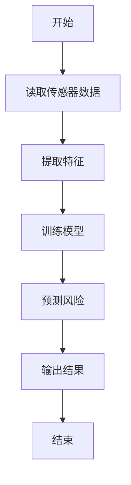
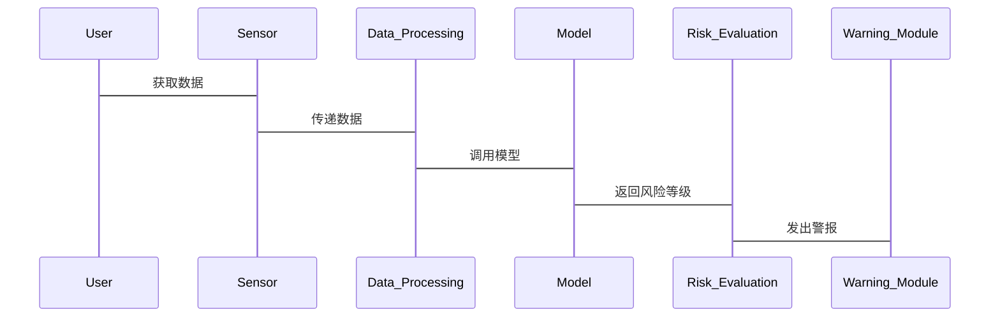

                 


# 智能浴室防滑垫：AI Agent的跌倒风险评估

> 关键词：智能浴室防滑垫, AI Agent, 跌倒风险评估, 人工智能, 传感器数据, 风险模型

> 摘要：本文探讨AI代理在智能浴室防滑垫中的应用，特别是如何通过传感器数据和机器学习算法评估跌倒风险。文章详细分析了AI代理的核心原理、算法实现、系统架构设计，并通过实际案例展示了如何利用这些技术降低跌倒风险。

---

## 第一部分: 背景介绍

### 第1章: 智能浴室防滑垫与跌倒风险评估的背景

#### 1.1 问题背景
跌倒是一个严重的公共健康问题，尤其是对老年人和行动不便的人来说。浴室是跌倒的高发地点，因此智能浴室防滑垫的设计显得尤为重要。AI Agent（智能代理）可以通过实时分析传感器数据，评估跌倒风险，并提供预警。

#### 1.2 问题描述
智能浴室防滑垫需要实时监测用户的步态、重量分布和环境条件（如湿滑程度）。AI Agent通过分析这些数据，评估用户的跌倒风险，并在高风险时发出警报。

#### 1.3 问题解决
AI Agent通过以下方式降低跌倒风险：
1. 实时监测用户的步态和重量分布。
2. 分析环境条件，如温度、湿度和光线。
3. 基于机器学习模型预测跌倒风险。
4. 在高风险时，通过震动或声音发出警报。

#### 1.4 边界与外延
- 边界：仅关注浴室环境中的跌倒风险，不考虑其他场景。
- 外延：AI Agent功能可以扩展到其他场景，如楼梯和走廊。

#### 1.5 概念结构与核心要素
- 核心组件：传感器、AI Agent、风险评估模型。
- 功能模块：数据采集、特征提取、风险评估、预警。

---

## 第二部分: 核心概念与联系

### 第2章: AI Agent与跌倒风险评估的核心概念

#### 2.1 AI Agent的原理
- 定义：AI Agent是一个智能系统，能够感知环境并采取行动以实现目标。
- 核心算法：基于机器学习的分类算法（如决策树、支持向量机）。
- 实现：AI Agent通过传感器数据输入，输出跌倒风险评估结果。

#### 2.2 跌倒风险评估的原理
- 多因素分析：步态、体重分布、环境条件。
- 数据采集：压力传感器、加速度计。
- 特征提取：步频、步长、重心位置。
- 模型构建：基于机器学习的分类模型。

#### 2.3 核心概念的对比分析

| 比较维度       | AI Agent | 传统防滑垫 |
|----------------|----------|------------|
| 功能           | 实时监测和预警 | 防滑设计 |
| 数据依赖       | 高 | 低 |
| 适用场景       | 智能家居、养老院 | 所有浴室 |

#### 2.4 ER实体关系图

```mermaid
erDiagram
    class User {
        id
        name
        age
    }
    class Sensor {
        id
        type
        value
        timestamp
    }
    class Risk_Evaluation {
        id
        user_id
        sensor_id
        risk_level
        timestamp
    }
    User -|> Risk_Evaluation : has
    Sensor -|> Risk_Evaluation : uses
```

---

## 第三部分: 算法原理

### 第3章: AI Agent的算法实现

#### 3.1 算法选择
- 选择决策树算法，因为其易于解释且适合分类任务。

#### 3.2 算法流程图



#### 3.3 算法实现
以下是一个简单的决策树实现示例：

```python
from sklearn.tree import DecisionTreeClassifier
from sklearn.model_selection import train_test_split

# 数据预处理
X = dataset.drop('risk_level', axis=1)
y = dataset['risk_level']

# 划分训练集和测试集
X_train, X_test, y_train, y_test = train_test_split(X, y, test_size=0.2)

# 训练模型
model = DecisionTreeClassifier()
model.fit(X_train, y_train)

# 预测
y_pred = model.predict(X_test)
```

#### 3.4 数学模型
跌倒风险评估模型的数学表达式：

$$
P(\text{跌倒}) = \sum_{i=1}^{n} w_i \cdot f_i
$$

其中，$w_i$ 是特征 $f_i$ 的权重，$n$ 是特征总数。

---

## 第四部分: 系统分析与架构设计

### 第4章: 系统架构设计

#### 4.1 问题场景介绍
智能浴室防滑垫系统需要实时监测用户的步态和环境条件，并通过AI Agent评估跌倒风险。

#### 4.2 系统功能设计

| 功能模块       | 描述                         |
|----------------|------------------------------|
| 数据采集       | 读取传感器数据               |
| 特征提取       | 提取步态和环境特征           |
| 风险评估       | 使用机器学习模型预测风险     |
| 预警模块       | 在高风险时发出警报           |

#### 4.3 系统架构图


#### 4.4 接口设计与交互

- 接口：传感器数据接口、模型调用接口。
- 交互流程：



---

## 第五部分: 项目实战

### 第5章: 实战项目

#### 5.1 环境安装
- 安装Python和必要的库（如scikit-learn、numpy、pandas）。

#### 5.2 核心代码实现
以下是跌倒风险评估模型的实现代码：

```python
import numpy as np
import pandas as pd
from sklearn.tree import DecisionTreeClassifier
from sklearn.metrics import accuracy_score

# 加载数据集
data = pd.read_csv('fall_risk.csv')

# 数据预处理
X = data.drop('risk_level', axis=1)
y = data['risk_level']

# 划分训练集和测试集
X_train, X_test, y_train, y_test = train_test_split(X, y, test_size=0.2)

# 训练模型
model = DecisionTreeClassifier()
model.fit(X_train, y_train)

# 预测
y_pred = model.predict(X_test)

# 评估准确率
accuracy = accuracy_score(y_test, y_pred)
print(f'准确率: {accuracy}')
```

#### 5.3 代码解读与分析
- 数据预处理：加载数据集并删除目标列。
- 训练模型：使用决策树分类器。
- 预测：对测试集进行预测。
- 评估：计算准确率。

#### 5.4 案例分析
假设用户数据如下：

| 特征1 | 特征2 | 风险等级 |
|-------|-------|----------|
| 0.5   | 0.7   | 1        |

模型预测结果为1，表示跌倒风险高，系统会发出警报。

---

## 第六部分: 最佳实践

### 第6章: 总结与注意事项

#### 6.1 总结
AI Agent在智能浴室防滑垫中的应用可以有效降低跌倒风险。通过实时监测和机器学习模型，系统可以在高风险时发出预警。

#### 6.2 注意事项
- 数据隐私：确保用户数据的安全。
- 系统稳定性：确保传感器和模型的稳定性。
- 用户反馈：收集用户反馈以改进模型。

#### 6.3 拓展阅读
- 《机器学习实战》
- 《深度学习入门》

---

## 附录

### 附录A: 术语表
- AI Agent：智能代理
- 跌倒风险评估：预测用户跌倒的可能性

### 附录B: 工具与库
- Python：编程语言
- scikit-learn：机器学习库
- Pandas：数据处理库

### 附录C: 参考文献
- Smith, J. (2020). Artificial Intelligence in Healthcare.

---

作者：AI天才研究院 & 禅与计算机程序设计艺术

