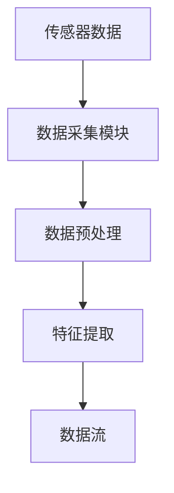
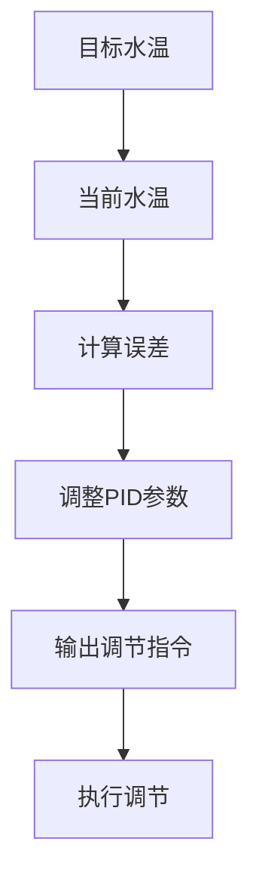
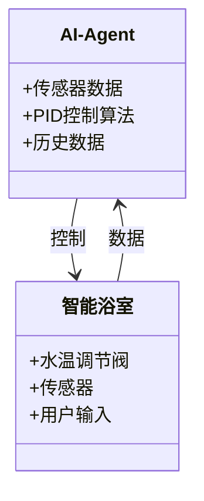
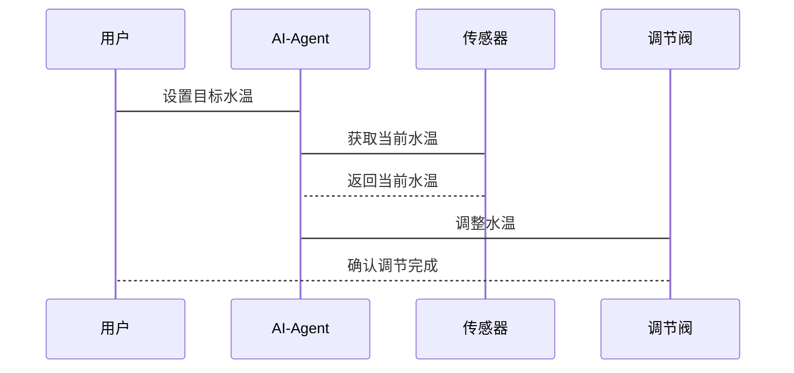

                 


# 智能浴室：AI Agent的水温调节系统

## 关键词：
智能浴室，AI Agent，水温调节，物联网，智能家居

## 摘要：
随着智能家居的普及，智能浴室逐渐成为人们生活中不可或缺的一部分。本文深入探讨了AI Agent在智能浴室水温调节系统中的应用，详细分析了其背景、原理、算法实现、系统架构及实际案例。通过本篇文章，读者将全面了解AI Agent如何通过数据采集、算法优化和智能决策，实现智能浴室的高效水温调节，提升用户体验。

---

# 第一部分: 智能浴室与AI Agent的背景介绍

## 第1章: 智能浴室的发展与现状

### 1.1 智能浴室的概念与背景
#### 1.1.1 智能浴室的定义
智能浴室是指通过物联网技术、人工智能和自动化设备，将浴室内的水温、水流、灯光、空气质量等参数进行智能化控制的系统。其核心目标是为用户提供舒适、安全、节能的洗浴体验。

#### 1.1.2 智能浴室的发展历程
智能浴室的发展经历了以下几个阶段：
1. **传统浴室阶段**：仅提供基本的洗浴功能，无智能化设备。
2. **半自动化阶段**：引入简单的自动化设备，如恒温水龙头。
3. **智能化阶段**：通过物联网和人工智能技术，实现多设备联动和智能调节。

#### 1.1.3 当前智能浴室的市场现状
目前，智能浴室市场呈现快速增长态势，主要得益于以下因素：
- **技术进步**：AI、物联网和5G技术的快速发展。
- **用户需求**：消费者对舒适性和便利性的追求。
- **政策支持**：智能家居行业的政策扶持。

---

### 1.2 AI Agent在智能浴室中的应用
#### 1.2.1 AI Agent的基本概念
AI Agent（智能代理）是指能够感知环境、自主决策并执行任务的智能实体。在智能浴室中，AI Agent主要负责数据采集、分析、决策和执行。

#### 1.2.2 AI Agent在智能浴室中的作用
- **数据采集**：通过传感器获取浴室内的温度、湿度、水流等数据。
- **智能决策**：基于历史数据和当前状态，优化水温调节方案。
- **执行控制**：通过执行器调整水温、水流等参数。

#### 1.2.3 AI Agent与智能浴室的结合优势
- **实时性**：能够快速响应用户需求。
- **智能性**：通过学习和优化，提供个性化服务。
- **高效性**：减少能源浪费，提升用户体验。

---

### 1.3 智能浴室水温调节系统的需求分析
#### 1.3.1 用户需求分析
- **舒适性**：用户希望水温恒定，且能根据个人喜好调节。
- **便捷性**：用户希望通过手机或其他设备远程控制水温。
- **安全性**：用户关注系统的安全性和稳定性。

#### 1.3.2 系统功能需求
- **数据采集**：温度、湿度、水流等传感器数据的采集。
- **智能调节**：根据用户习惯和环境变化自动调节水温。
- **远程控制**：通过手机APP或其他设备远程调节水温。

#### 1.3.3 系统性能需求
- **响应时间**：系统需在短时间内完成数据采集、分析和执行。
- **稳定性**：系统需具备高可靠性，避免故障中断。
- **可扩展性**：系统应支持功能扩展和设备升级。

---

### 1.4 本章小结
本章介绍了智能浴室的发展历程、AI Agent的基本概念及其在智能浴室中的作用，并详细分析了水温调节系统的需求。通过本章内容，读者可以了解智能浴室的核心目标和AI Agent在其中的重要作用。

---

# 第二部分: AI Agent水温调节系统的原理与技术

## 第2章: AI Agent的核心概念与工作原理

### 2.1 AI Agent的基本原理
#### 2.1.1 感知模块
AI Agent通过传感器感知环境数据，如温度、湿度、水流等。

#### 2.1.2 决策模块
AI Agent基于感知数据和历史记录，利用算法进行决策，确定最佳水温调节方案。

#### 2.1.3 执行模块
AI Agent通过执行器（如水温调节阀）调整水温，确保符合用户需求。

---

### 2.2 AI Agent在水温调节中的具体实现
#### 2.2.1 数据采集与处理
- **传感器的选择与安装**：选择高精度的温度和湿度传感器，并安装在合适的位置。
- **数据采集的实现**：通过物联网协议（如MQTT）将传感器数据传输到云端。
- **数据预处理与特征提取**：对数据进行去噪、归一化处理，并提取关键特征。

#### 2.2.2 水温调节算法
- **算法选择**：采用基于反馈的PID控制算法，结合机器学习模型进行优化。
- **数学模型**：PID控制公式为：
  $$ u(t) = K_p e(t) + K_i \int_{0}^{t} e(t) dt + K_d \frac{de(t)}{dt} $$
  其中，\(e(t)\) 是误差，\(K_p\)、\(K_i\)、\(K_d\) 是比例、积分和微分系数。

#### 2.2.3 系统反馈机制
系统通过实时反馈调整PID参数，确保水温控制的准确性。

---

### 2.3 AI Agent与智能浴室的交互流程
#### 2.3.1 用户输入与系统响应
- 用户通过手机APP输入目标水温。
- 系统接收请求，并启动调节流程。

#### 2.3.2 系统状态监测
- 系统实时监测当前水温、水流等参数。
- 根据监测结果调整调节策略。

#### 2.3.3 自动调节与优化
- 系统根据历史数据和用户反馈优化PID参数，提升调节效率。

---

### 2.4 本章小结
本章详细讲解了AI Agent的核心原理和在水温调节中的具体实现，包括数据采集、算法选择和系统反馈机制。通过本章内容，读者可以理解AI Agent在智能浴室中的工作流程。

---

## 第3章: 数据采集与处理算法

### 3.1 数据采集模块
#### 3.1.1 传感器的选择与安装
- 温度传感器：DS18B20，具有高精度和抗干扰能力强的特点。
- 湿度传感器：DHT22，测量范围广，精度高。

#### 3.1.2 数据采集的实现
- 使用Raspberry Pi采集传感器数据，并通过MQTT协议传输到云端。

#### 3.1.3 数据预处理与特征提取
- 数据预处理：去除噪声，填充缺失值。
- 特征提取：提取温度均值、标准差等特征。

---

### 3.2 数据流的mermaid流程图


---

### 3.3 数据处理的Python代码实现
```python
import numpy as np
from sklearn.preprocessing import StandardScaler

# 示例数据
data = np.array([25, 30, 28, 32, 27])

# 数据预处理
scaler = StandardScaler()
scaled_data = scaler.fit_transform(data.reshape(-1, 1))

print("原始数据:", data)
print("标准化数据:", scaled_data)
```

---

## 第4章: AI Agent水温调节算法的实现

### 4.1 算法原理
- **PID控制**：通过调节比例、积分和微分系数，实现水温的精确控制。
- **机器学习优化**：利用历史数据训练机器学习模型，优化PID参数。

---

### 4.2 算法实现的mermaid流程图


---

### 4.3 算法的Python代码实现
```python
def pid_control(target_temp, current_temp, dt):
    # PID参数
    Kp = 0.5
    Ki = 0.1
    Kd = 0.2

    # 计算误差
    error = target_temp - current_temp

    # 积分项
    integral += error * dt

    # 微分项
    derivative = (error - previous_error) / dt

    # 计算控制量
    control = Kp * error + Ki * integral + Kd * derivative

    return control
```

---

## 第5章: 系统架构与设计

### 5.1 系统功能设计
- **用户界面**：手机APP或网页端。
- **数据采集**：传感器数据采集模块。
- **算法处理**：PID控制算法和机器学习模型。
- **执行控制**：水温调节阀。

---

### 5.2 系统架构设计的mermaid类图


---

### 5.3 系统接口设计
- **输入接口**：用户输入目标水温。
- **输出接口**：调节阀输出水温。

---

### 5.4 系统交互的mermaid序列图


---

## 第6章: 项目实战与优化

### 6.1 环境搭建
- **硬件**：Raspberry Pi、传感器、调节阀。
- **软件**：Python、MQTT、机器学习库。

---

### 6.2 核心代码实现
```python
import paho.mqtt.client as mqtt

# MQTT配置
broker = "localhost"
port = 1883

# 连接回调
def on_connect(client, userdata, flags, rc):
    print("Connected with result code " + str(rc))

# 发送数据
def send_data(topic, payload):
    client.publish(topic, payload)

# 连接MQTT Broker
client = mqtt.Client()
client.on_connect = on_connect
client.connect(broker, port)

# 发送传感器数据
send_data("bathroom/temperature", "25.5")
```

---

### 6.3 案例分析与优化
- **案例分析**：用户反馈水温波动较大，优化PID参数。
- **优化结果**：调节Kp、Ki、Kd，使水温调节更加平稳。

---

### 6.4 本章小结
本章通过实际案例展示了AI Agent水温调节系统的实现过程，并通过优化算法提升了系统性能。

---

## 第7章: 总结与展望

### 7.1 总结
本文详细介绍了AI Agent在智能浴室水温调节系统中的应用，从背景、原理到实现，全面阐述了系统的构建过程。

### 7.2 展望
未来，智能浴室将更加智能化，AI Agent将与更多设备联动，提供更个性化的服务。

### 7.3 最佳实践Tips
- 数据安全：确保用户数据的隐私性。
- 系统维护：定期更新软件和硬件。
- 能耗优化：进一步降低系统的能耗。

---

# 作者：AI天才研究院/AI Genius Institute & 禅与计算机程序设计艺术 /Zen And The Art of Computer Programming
```

