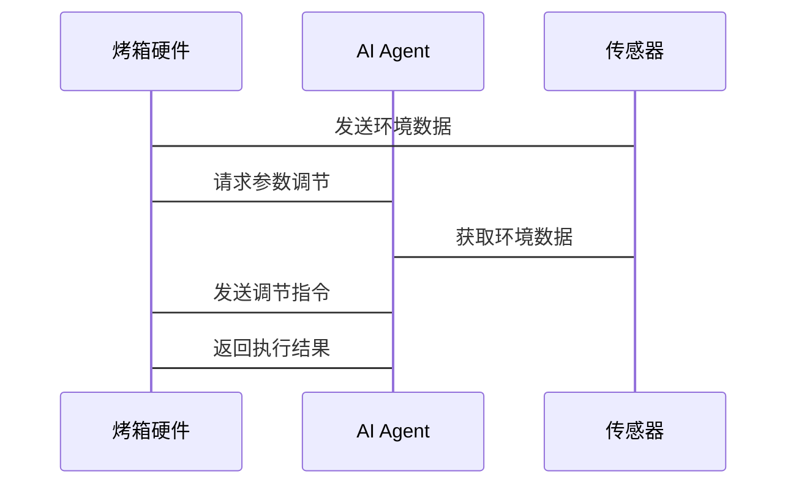

                 


# 智能烤箱：AI Agent的烘焙参数自动调节

> 关键词：智能烤箱、AI Agent、烘焙参数、自动调节、物联网、传感器数据、数学建模

> 摘要：本文深入探讨了智能烤箱中AI Agent自动调节烘焙参数的技术实现。通过分析AI Agent在智能烤箱中的感知、决策和执行模块，结合数学建模和系统架构设计，展示了如何利用AI技术实现烘焙参数的智能化调节。文章从背景介绍、核心技术、系统设计、项目实战到优化扩展，全面阐述了智能烤箱AI Agent的实现过程，为读者提供了从理论到实践的完整指南。

---

## 第一部分: 智能烤箱与AI Agent概述

### 第1章: 智能烤箱与AI Agent的基本概念

#### 1.1 智能烤箱的定义与特点

##### 1.1.1 智能烤箱的定义
智能烤箱是一种结合了人工智能技术的厨房设备，能够通过传感器和AI算法自动调整烘焙参数，如温度、湿度和时间，以实现最佳的烘焙效果。

##### 1.1.2 智能烤箱的核心特点
- **自动化控制**：通过AI算法自动调整烘焙参数。
- **智能感知**：集成多种传感器，实时监测烘焙环境。
- **学习能力**：通过机器学习优化烘焙效果。
- **用户友好**：提供简单易用的交互界面。

##### 1.1.3 智能烤箱与传统烤箱的区别
| 特性          | 传统烤箱       | 智能烤箱       |
|---------------|----------------|----------------|
| 控制方式      | 手动调节       | 自动调节       |
| 感知能力      | 无            | 集成传感器     |
| 学习能力      | 无            | 有（机器学习）  |
| 操作复杂度    | 高            | 低             |

#### 1.2 AI Agent的基本概念

##### 1.2.1 AI Agent的定义
AI Agent是一种能够感知环境、做出决策并执行动作的智能实体，能够根据输入的感知信息，通过内部算法生成相应的输出动作。

##### 1.2.2 AI Agent的核心特点
- **感知能力**：通过传感器获取环境信息。
- **决策能力**：基于感知信息进行分析和决策。
- **执行能力**：根据决策结果执行相应的动作。
- **学习能力**：通过机器学习优化决策算法。

#### 1.3 智能烤箱中AI Agent的应用背景

##### 1.3.1 烘焙参数调节的复杂性
烘焙是一个涉及多参数协调的过程，温度、湿度、时间等因素需要精确控制，传统烤箱难以实现自动化调节。

##### 1.3.2 AI Agent在烘焙参数调节中的优势
- **精确控制**：AI Agent能够根据环境变化实时调整烘焙参数。
- **优化效果**：通过机器学习不断优化烘焙效果。
- **简化操作**：用户只需设定目标，AI Agent自动完成调节。

##### 1.3.3 智能烤箱AI Agent的市场前景
随着智能家居的普及和AI技术的发展，智能烤箱市场潜力巨大，AI Agent的应用将提升用户体验，增加市场竞争力。

#### 1.4 本章小结
本章介绍了智能烤箱和AI Agent的基本概念，分析了AI Agent在智能烤箱中的应用背景及其优势。

---

### 第2章: 智能烤箱AI Agent的核心技术

#### 2.1 AI Agent的感知模块

##### 2.1.1 传感器数据的采集与处理
智能烤箱中的感知模块通过多种传感器（如温度传感器、湿度传感器、光照传感器）采集烘焙环境的数据，并通过数据预处理（如去噪、归一化）进行处理。

##### 2.1.2 烘焙环境的实时监测
感知模块实时监测烘焙环境的温度、湿度、光照等参数，并将数据传输给决策模块。

#### 2.2 AI Agent的决策模块

##### 2.2.1 烘焙参数调节的算法选择
决策模块基于感知模块提供的数据，选择合适的算法（如PID控制、模糊控制、机器学习算法）进行烘焙参数调节。

##### 2.2.2 决策逻辑的优化与调整
通过机器学习优化决策逻辑，提升烘焙效果。例如，使用强化学习算法训练AI Agent，使其在实际烘焙过程中不断优化参数调节策略。

#### 2.3 AI Agent的执行模块

##### 2.3.1 烘焙参数的自动调节
执行模块根据决策模块的指令，自动调整烤箱的温度、湿度、时间等参数。

##### 2.3.2 烤箱硬件的控制与反馈
执行模块通过控制烤箱硬件（如加热元件、风扇）实现参数调节，并实时反馈执行结果给感知模块。

#### 2.4 本章小结
本章详细介绍了智能烤箱AI Agent的核心技术，包括感知模块、决策模块和执行模块的功能与实现方式。

---

### 第3章: 智能烤箱AI Agent的数学建模

#### 3.1 烘焙参数调节的数学模型

##### 3.1.1 烘焙时间的数学表达式
$$ T = f(t, T_{\text{initial}}, T_{\text{target}}) $$

##### 3.1.2 烘焙温度的数学表达式
$$ T_{\text{target}} = a \cdot t + b \cdot T_{\text{initial}} $$

##### 3.1.3 烘焙湿度的数学表达式
$$ H = c \cdot (T - T_{\text{ambient}}) $$

#### 3.2 烘焙参数调节的优化算法

##### 3.2.1 常用优化算法的比较
| 算法名称       | 优点             | 缺点             |
|----------------|------------------|------------------|
| 遗传算法       | 全局优化         | 收敛速度慢       |
| 模拟退火算法   | 避免局部最优       | 参数设置复杂     |
| PID控制        | 实时性好         | 需要手动调整参数 |

##### 3.2.2 烘焙参数调节的遗传算法实现
遗传算法通过编码、选择、交叉和变异操作，不断优化烘焙参数的组合，以达到最佳的烘焙效果。

##### 3.2.3 烘焙参数调节的模拟退火算法实现
模拟退火算法通过模拟金属退火的过程，逐步降低温度参数，避免陷入局部最优解。

#### 3.3 数学模型的验证与优化

##### 3.3.1 数学模型的验证方法
通过实验验证数学模型的准确性，比较实际烘焙效果与模型预测结果的差异。

##### 3.3.2 数学模型的优化策略
根据实验结果不断调整模型参数，优化烘焙效果。

##### 3.3.3 数学模型的实际应用案例
通过具体案例展示数学模型的实际应用效果，分析模型的优缺点。

#### 3.4 本章小结
本章详细讲解了智能烤箱AI Agent的数学建模过程，包括烘焙参数的数学表达式和优化算法的选择与实现。

---

### 第4章: 智能烤箱AI Agent的系统架构设计

#### 4.1 系统模块划分

##### 4.1.1 感知模块的设计
感知模块负责采集烘焙环境的传感器数据，包括温度、湿度、光照等。

##### 4.1.2 决策模块的设计
决策模块基于感知数据，通过算法选择最优的烘焙参数调节方案。

##### 4.1.3 执行模块的设计
执行模块根据决策模块的指令，控制烤箱硬件完成参数调节。

#### 4.2 系统数据流设计

##### 4.2.1 数据采集流程
1. 传感器采集环境数据。
2. 数据预处理模块对数据进行清洗和归一化。
3. 数据传输到决策模块。

##### 4.2.2 数据处理流程
1. 决策模块对数据进行分析和处理。
2. 选择合适的算法进行烘焙参数调节。
3. 生成调节指令。

##### 4.2.3 数据输出流程
1. 执行模块根据指令调整烤箱硬件。
2. 硬件反馈执行结果。
3. 感知模块重新采集环境数据。

#### 4.3 系统通信机制设计

##### 4.3.1 烤箱与AI Agent的通信协议
采用MQTT协议进行烤箱与AI Agent之间的通信，确保数据传输的实时性和可靠性。

##### 4.3.2 系统接口设计
通过API接口实现烤箱与AI Agent之间的数据交互，确保系统的可扩展性和灵活性。

##### 4.3.3 系统交互的序列图


#### 4.4 本章小结
本章详细设计了智能烤箱AI Agent的系统架构，包括模块划分、数据流设计和通信机制。

---

### 第5章: 智能烤箱AI Agent的项目实战

#### 5.1 环境搭建

##### 5.1.1 开发环境的选择
选择Python作为开发语言，使用TensorFlow或Keras进行机器学习模型的训练。

##### 5.1.2 硬件设备的安装
安装必要的传感器和烤箱硬件，确保设备能够正常采集和发送数据。

#### 5.2 系统核心实现

##### 5.2.1 感知模块的实现
编写代码实现传感器数据的采集和处理，例如：

```python
import sensors

def get_environment_data():
    temperature = sensors.read_temperature()
    humidity = sensors.read_humidity()
    return temperature, humidity
```

##### 5.2.2 决策模块的实现
实现机器学习模型的训练和预测，例如：

```python
import tensorflow as tf
model = tf.keras.Sequential([
    tf.keras.layers.Dense(64, activation='relu'),
    tf.keras.layers.Dense(1, activation='sigmoid')
])
model.compile(optimizer='adam', loss='binary_crossentropy')
model.fit(X_train, y_train, epochs=10)
```

##### 5.2.3 执行模块的实现
编写代码实现烤箱硬件的控制，例如：

```python
def control_oven(target_temp, target_humidity):
    oven.set_temperature(target_temp)
    oven.set_humidity(target_humidity)
```

#### 5.3 代码应用解读与分析

##### 5.3.1 传感器数据的采集与处理
通过传感器获取环境数据，并进行数据预处理，确保数据的准确性。

##### 5.3.2 机器学习模型的训练与预测
训练机器学习模型，使其能够根据环境数据预测最优的烘焙参数。

##### 5.3.3 烤箱硬件的控制与反馈
根据模型预测结果，控制烤箱硬件进行参数调节，并实时反馈执行结果。

#### 5.4 实际案例分析

##### 5.4.1 案例背景介绍
介绍一个具体的烘焙场景，例如烘焙蛋糕。

##### 5.4.2 模型预测结果
展示模型预测的烘焙参数，例如目标温度和湿度。

##### 5.4.3 烤箱硬件的执行结果
展示烤箱硬件根据预测参数执行的结果，例如实际温度和湿度曲线。

#### 5.5 项目小结
本章通过实际案例展示了智能烤箱AI Agent的实现过程，包括环境搭建、系统核心实现和代码应用解读。

---

### 第6章: 智能烤箱AI Agent的系统优化与扩展

#### 6.1 系统优化策略

##### 6.1.1 算法优化
通过改进机器学习算法（如使用更复杂的神经网络结构）提升烘焙效果。

##### 6.1.2 系统性能优化
优化系统运行效率，减少资源消耗。

#### 6.2 系统扩展

##### 6.2.1 多烤箱控制
通过改进系统架构，实现对多个烤箱的集中控制和管理。

##### 6.2.2 物联网联动
将智能烤箱与智能家居系统联动，实现更智能化的家居体验。

#### 6.3 本章小结
本章讨论了智能烤箱AI Agent的系统优化与扩展策略，为系统的进一步发展提供了方向。

---

## 第七章: 总结与展望

### 7.1 本章总结
本文详细介绍了智能烤箱中AI Agent自动调节烘焙参数的技术实现，从感知、决策到执行模块，全面分析了系统的实现过程。

### 7.2 未来展望
未来，随着AI技术的不断发展，智能烤箱AI Agent将更加智能化，能够实现更复杂的烘焙任务，为用户提供更优质的烘焙体验。

---

## 参考文献
（此处列出相关的技术文献和资料）

---

## 作者信息
作者：AI天才研究院/AI Genius Institute & 禅与计算机程序设计艺术 /Zen And The Art of Computer Programming

