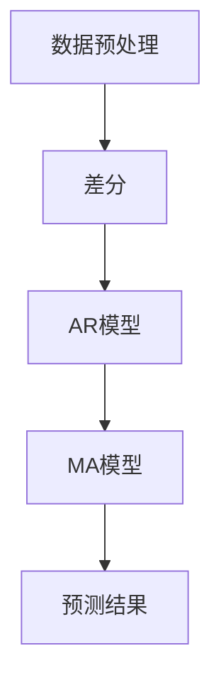
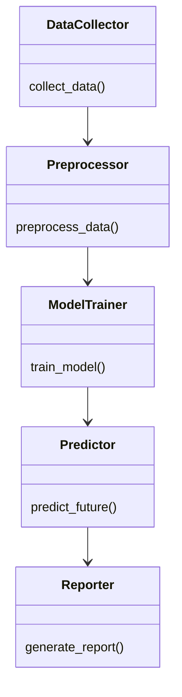

                 


# 《智能现金流预测与管理平台》

## 关键词：现金流预测、机器学习、智能平台、时间序列分析、系统架构

## 摘要：智能现金流预测与管理平台利用先进的机器学习算法和大数据分析技术，为企业提供高精度的现金流预测和优化管理。本文将从背景、核心概念、算法原理、系统架构到项目实战，全面解析智能现金流预测平台的构建与应用。

---

## 第一部分：智能现金流预测与管理平台的背景与概述

### 第1章：现金流预测与管理平台的背景与重要性

#### 1.1 现金流预测的基本概念

现金流预测是通过对历史数据和市场趋势的分析，预测企业未来一段时间内的现金流情况。它是企业财务管理中的重要环节，能够帮助企业合理规划资金使用，降低财务风险。现金流预测的基本步骤包括数据收集、模型选择、参数调优和结果验证。

#### 1.2 现金流预测的背景与重要性

随着企业规模的扩大和市场环境的复杂化，传统的现金流预测方法逐渐显现出局限性。传统方法依赖于手动计算和简单模型，预测精度低，难以应对复杂的市场变化。而智能现金流预测平台通过机器学习算法和大数据分析技术，能够提高预测的准确性和实时性。

#### 1.3 智能现金流预测平台的必要性

智能现金流预测平台利用先进的技术手段，能够处理海量数据，发现隐藏在数据中的规律，从而提供更准确的预测结果。它不仅能够帮助企业优化资金管理，还能提高企业的整体运营效率，降低财务风险。

---

## 第二部分：现金流预测的核心概念与联系

### 第2章：现金流预测的关键概念与联系

#### 2.1 现金流预测的核心概念

现金流预测的核心概念包括时间序列分析、机器学习模型和特征工程。时间序列分析是通过观察数据随时间的变化规律来预测未来的值。机器学习模型则是利用算法从数据中学习特征，从而进行预测。特征工程是通过选择和构建特征来提高模型的预测性能。

#### 2.2 现金流预测模型的对比分析

以下是几种常用现金流预测模型的对比分析：

| 模型名称 | 优点 | 缺点 | 适用场景 |
|----------|------|------|----------|
| ARIMA    | 易实现，适合线性趋势 | 不适合非线性数据 | 适合有明确趋势和季节性的数据 |
| LSTM      | 能捕捉长期依赖关系 | 训练时间较长 | 适合时间序列数据，尤其是有复杂模式的数据 |
| XGBoost   | 高精度，适合非线性关系 | 对异常值敏感 | 适合特征工程较好的数据 |

---

## 第三部分：现金流预测的算法原理讲解

### 第3章：常用现金流预测算法及其原理

#### 3.1 时间序列分析（ARIMA）

ARIMA模型通过自回归和移动平均来预测未来的值。其数学公式如下：

$$ ARIMA(p, d, q) = y_t - y_{t-d} + \epsilon_t $$

其中，p为自回归阶数，d为差分阶数，q为移动平均阶数。

##### ARIMA流程图



##### Python代码实现

```python
from statsmodels.tsa.arima_model import ARIMA
import pandas as pd

# 数据预处理
data = pd.read_csv('cash_flow.csv')
data_diff = data['amount'].diff().dropna()

# 模型训练
model = ARIMA(data_diff, order=(5, 1, 2))
model_fit = model.fit()

# 预测
future_forecast = model_fit.forecast(steps=10)
print(future_forecast)
```

---

## 第四部分：现金流预测系统的分析与架构设计

### 第4章：智能现金流预测平台的系统分析与架构设计

#### 4.1 系统功能设计

系统功能设计包括数据采集、数据预处理、模型训练、预测结果展示和报告生成。

##### 领域模型类图



#### 4.2 系统架构设计

系统架构采用微服务架构，包括数据采集模块、数据预处理模块、模型训练模块和预测展示模块。

##### 系统架构图


---

## 第五部分：智能现金流预测平台的项目实战

### 第5章：现金流预测平台的项目实战

#### 5.1 项目环境安装

安装所需的库：

```bash
pip install numpy pandas scikit-learn tensorflow statsmodels
```

#### 5.2 核心代码实现

以下是现金流预测的核心代码：

```python
import pandas as pd
import numpy as np
from sklearn.ensemble import RandomForestRegressor
from tensorflow.keras.models import Sequential
from tensorflow.keras.layers import LSTM, Dense

# 数据加载
data = pd.read_csv('cash_flow.csv')
X = data[['revenue', 'expenses']]
y = data['cash_flow']

# 模型训练
model = Sequential()
model.add(LSTM(50, return_sequences=True, input_shape=(1, 2)))
model.add(Dense(1))
model.compile(optimizer='adam', loss='mean_squared_error')

model.fit(X.reshape(-1, 1, 2), y, epochs=100, batch_size=32)

# 预测
new_data = np.array([[100000, 50000]])
new_data_reshaped = new_data.reshape(-1, 1, 2)
prediction = model.predict(new_data_reshaped)
print(prediction)
```

#### 5.3 项目小结

通过项目实战，读者可以掌握智能现金流预测平台的核心实现步骤，包括数据预处理、模型选择和结果解读。实际案例分析能够帮助读者更好地理解如何将理论应用于实践。

---

## 第六部分：总结与展望

### 6.1 总结

智能现金流预测与管理平台通过机器学习算法和大数据分析技术，能够提高现金流预测的准确性和效率。本文从背景、核心概念、算法原理、系统架构到项目实战，全面解析了智能现金流预测平台的构建与应用。

### 6.2 展望

未来，随着人工智能技术的不断发展，智能现金流预测平台将更加智能化和自动化。通过引入更先进的算法和更强大的计算能力，预测精度将进一步提高，为企业提供更强大的支持。

---

## 作者：AI天才研究院/AI Genius Institute & 禅与计算机程序设计艺术 /Zen And The Art of Computer Programming

