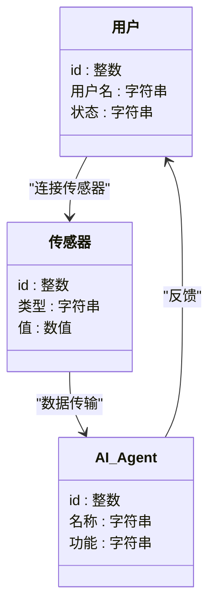

                 


```markdown
# 智能瑜伽垫：AI Agent的冥想辅助系统

> 关键词：智能瑜伽垫，AI Agent，冥想，传感器技术，机器学习，实时反馈

> 摘要：本文探讨了智能瑜伽垫作为AI Agent的冥想辅助系统的创新应用。通过分析其核心概念、算法原理、系统架构，结合实际项目案例，展示了如何利用现代技术提升冥想体验。文章深入浅出地阐述了智能瑜伽垫的功能设计、技术实现及其在健康领域的潜力。

---

# 第一部分: 智能瑜伽垫的背景与概念

## 第1章: 智能瑜伽垫的背景介绍

### 1.1 瑜伽垫的发展历程
#### 1.1.1 从传统瑜伽垫到智能瑜伽垫的演变
- 传统瑜伽垫的功能局限性
- 智能瑜伽垫的创新与升级
- 技术进步推动智能瑜伽垫的出现

#### 1.1.2 智能瑜伽垫的定义与核心功能
- 智能瑜伽垫的基本定义
- 核心功能：实时监测、AI反馈、个性化指导

#### 1.1.3 AI Agent在智能瑜伽垫中的作用
- AI Agent的定义与特性
- AI Agent如何辅助冥想练习

### 1.2 智能瑜伽垫的应用场景
#### 1.2.1 瑜伽练习的常见问题与挑战
- 用户姿势不正确的问题
- 呼吸节奏难以掌握的难题
- 缺乏专业指导的困扰

#### 1.2.2 智能瑜伽垫如何解决这些问题
- 实时姿势矫正
- 呼吸节奏引导
- 个性化练习计划

#### 1.2.3 智能瑜伽垫的用户群体与市场前景
- 主要用户群体分析
- 市场需求与发展趋势

### 1.3 本章小结
#### 1.3.1 智能瑜伽垫的核心价值
- 提供精准的冥想辅助
- 帮助用户提升练习效果

#### 1.3.2 未来发展趋势
- 技术的不断升级
- 用户体验的持续优化

---

# 第二部分: 智能瑜伽垫的核心概念与AI Agent的原理

## 第2章: 智能瑜伽垫的核心概念

### 2.1 智能瑜伽垫的组成与功能
#### 2.1.1 传感器模块的作用
- 压力传感器：监测身体接触点的压力
- 加速度计：检测运动幅度
- 陀螺仪：测量旋转角度

#### 2.1.2 AI Agent的功能模块
- 数据采集与处理
- 行为分析与反馈
- 个性化推荐系统

#### 2.1.3 用户交互界面的设计
- 图形界面：显示实时数据与反馈
- 声音反馈：指导呼吸节奏
- 振动提示：提醒矫正姿势

### 2.2 AI Agent的定义与特点
#### 2.2.1 AI Agent的基本概念
- AI Agent的定义
- AI Agent的核心特点：智能性、适应性、自主性

#### 2.2.2 AI Agent与传统软件的区别
- 数据处理能力
- 自主决策能力
- 个性化服务能力

#### 2.2.3 AI Agent在智能瑜伽垫中的具体应用
- 实时数据分析
- 行为模式识别
- 个性化反馈生成

### 2.3 智能瑜伽垫与AI Agent的关系
#### 2.3.1 智能瑜伽垫作为AI Agent的载体
- 硬件基础：传感器与计算模块
- 软件支持：AI算法与数据处理

#### 2.3.2 AI Agent如何提升瑜伽练习的效果
- 通过数据分析优化练习质量
- 提供实时反馈加速技能提升
- 自适应调整练习计划

#### 2.3.3 智能瑜伽垫的智能化表现
- 自动识别用户动作
- 实时反馈纠正错误
- 智能推荐练习方案

### 2.4 核心概念的ER实体关系图
```mermaid
erDiagram
    class 瑜伽垫 {
        id : 整数
        传感器类型 : 字符串
        连接的设备 : 设备ID
    }
    class 设备 {
        id : 整数
        设备类型 : 字符串
        状态 : 字符串
    }
    class AI_Agent {
        id : 整数
        名称 : 字符串
        功能 : 字符串
    }
    瑜伽垫 --> 设备 : "通过设备连接"
    瑜伽垫 --> AI_Agent : "由AI Agent控制"
```

---

# 第三部分: 智能瑜伽垫的算法原理

## 第3章: 算法原理与实现

### 3.1 数据采集与预处理
#### 3.1.1 传感器数据的采集
- 数据流图：传感器 → 数据采集模块 → 数据预处理
- 数据格式转换：原始数据 → 结构化数据

#### 3.1.2 数据预处理方法
- 噪声消除：滤波算法
- 数据归一化：标准化处理
- 异常数据处理：剔除或标记

### 3.2 基于机器学习的姿势识别
#### 3.2.1 机器学习模型的选择
- 传统算法：支持向量机（SVM）
- 深度学习模型：卷积神经网络（CNN）
- 模型选择依据：数据量与复杂度

#### 3.2.2 姿势识别的数学模型
- SVM分类器的数学公式：
$$
\text{max}\_{w,b,\xi} \frac{1}{2}||w||^2 + C\sum_{i=1}^n \xi_i
$$
$$
y_i = \text{sign}(w \cdot x_i + b)
$$

#### 3.2.3 姿势识别的实现步骤
1. 数据采集与标注
2. 特征提取与选择
3. 模型训练与评估
4. 模型部署与应用

### 3.3 呼吸节奏分析与反馈
#### 3.3.1 呼吸信号的特征提取
- 周期分析：计算呼吸周期
- 幅值分析：监测呼吸深度
- 频率分析：评估呼吸速率

#### 3.3.2 呼吸反馈的生成机制
- 基于FFT的呼吸信号分析
- 呼吸模式分类：深度学习模型
- 反馈策略：实时指导用户调整呼吸节奏

#### 3.3.3 呼吸反馈的数学模型
- 呼吸周期计算公式：
$$
T = \frac{\sum t_i}{n}
$$
- 呼吸深度计算公式：
$$
D = \frac{\sum d_i}{n}
$$
- 呼吸速率计算公式：
$$
R = \frac{60}{T}
$$

### 3.4 AI Agent的决策逻辑
#### 3.4.1 决策树的构建
- 数据特征：姿势、呼吸、压力
- 决策规则：基于特征的条件判断

#### 3.4.2 基于规则的反馈机制
- 姿势矫正规则：当用户姿势偏离标准时，触发反馈
- 呼吸调节规则：当呼吸频率异常时，触发反馈

#### 3.4.3 反馈机制的优化
- 动态调整反馈强度
- 自适应学习用户习惯

---

# 第四部分: 智能瑜伽垫的系统架构设计

## 第4章: 系统架构与实现

### 4.1 系统功能设计
#### 4.1.1 领域模型设计


#### 4.1.2 系统功能模块
- 数据采集模块：传感器数据采集
- 数据处理模块：预处理与特征提取
- AI处理模块：姿势识别与呼吸分析
- 反馈模块：实时反馈与指导

### 4.2 系统架构设计
#### 4.2.1 系统架构图


#### 4.2.2 系统接口设计
- 用户接口：图形界面与声音反馈
- 传感器接口：数据采集与传输
- AI接口：算法调用与数据处理

#### 4.2.3 系统交互流程
1. 用户启动应用
2. 传感器采集数据
3. 数据传输至AI处理模块
4. AI处理模块分析数据并生成反馈
5. 反馈模块发送反馈至用户

### 4.3 系统实现细节
#### 4.3.1 传感器模块的实现
- 硬件选型：压力传感器、加速度计
- 传感器数据的采集与传输
- 传感器校准与调试

#### 4.3.2 AI处理模块的实现
- 机器学习模型的训练与部署
- 数据处理算法的实现
- AI Agent的逻辑实现

#### 4.3.3 反馈模块的实现
- 反馈方式：声音、震动、图形
- 反馈策略的制定
- 反馈效果的优化

---

# 第五部分: 智能瑜伽垫的项目实战

## 第5章: 项目实战与案例分析

### 5.1 开发环境的安装
#### 5.1.1 系统需求
- 操作系统：Windows/Mac/Linux
- 开发工具：Python、PyTorch、TensorFlow
- 传感器驱动：特定传感器驱动程序

#### 5.1.2 环境搭建
1. 安装Python
2. 安装深度学习框架（如TensorFlow）
3. 安装传感器开发库

### 5.2 系统核心代码实现
#### 5.2.1 传感器数据采集代码
```python
import numpy as np
from sensor_library import SensorCollector

class SensorDataCollector:
    def __init__(self):
        self.sensor = SensorCollector()
    
    def collect_data(self):
        return self.sensor.get_data()
```

#### 5.2.2 姿势识别模型训练代码
```python
import torch
import torch.nn as nn
import torch.optim as optim

class PostureRecognizer(nn.Module):
    def __init__(self, input_size, output_size):
        super(PostureRecognizer, self).__init__()
        self.fc = nn.Linear(input_size, output_size)
    
    def forward(self, x):
        return self.fc(x)

# 训练代码
criterion = nn.CrossEntropyLoss()
optimizer = optim.SGD(PostureRecognizer(input_size, output_size).parameters(), lr=0.01)
```

#### 5.2.3 反馈生成代码
```python
def generate_feedback(posture_class, breath_rate):
    if posture_class == 'incorrect':
        return "请调整您的姿势"
    elif breath_rate < 10:
        return "请加快呼吸"
    else:
        return "继续保持"
```

### 5.3 代码功能解读与分析
#### 5.3.1 传感器数据采集模块
- 功能：实时采集用户姿势和呼吸数据
- 输入：传感器信号
- 输出：结构化数据

#### 5.3.2 姿势识别模块
- 功能：识别用户姿势是否正确
- 输入：传感器数据
- 输出：姿势分类结果

#### 5.3.3 反馈生成模块
- 功能：根据姿势和呼吸数据生成反馈
- 输入：姿势分类结果和呼吸速率
- 输出：反馈信息

### 5.4 实际案例分析
#### 5.4.1 用户A的案例
- 用户信息：初学者，呼吸节奏慢，姿势不正确
- 系统反馈：呼吸频率过低，姿势矫正建议
- 练习效果：呼吸频率提升，姿势改善

#### 5.4.2 用户B的案例
- 用户信息：资深练习者，呼吸节奏正常，姿势正确
- 系统反馈：继续保持
- 练习效果：无明显改进，但保持良好状态

### 5.5 项目小结
#### 5.5.1 核心代码的功能总结
- 传感器数据采集：确保数据准确
- 姿势识别：提高练习准确性
- 反馈生成：优化用户体验

#### 5.5.2 项目实现的关键点
- 传感器与AI算法的结合
- 系统的实时反馈机制
- 用户体验的优化设计

---

# 第六部分: 总结与展望

## 第6章: 总结与展望

### 6.1 本章小结
#### 6.1.1 智能瑜伽垫的核心价值
- 提供精准的冥想辅助
- 帮助用户提升练习效果

#### 6.1.2 系统设计的关键点
- 传感器技术的应用
- AI算法的实现
- 用户反馈机制的优化

### 6.2 未来展望
#### 6.2.1 技术的持续进步
- 更高精度的传感器
- 更先进的AI算法

#### 6.2.2 市场的扩展与应用
- 新用户的获取
- 新功能的开发

#### 6.2.3 用户体验的提升
- 更个性化的服务
- 更智能的反馈机制

### 6.3 最佳实践 Tips
#### 6.3.1 开发建议
- 注重传感器与算法的结合
- 优化用户体验
- 提高系统的稳定性

#### 6.3.2 用户建议
- 按照反馈调整练习
- 定期维护设备
- 合理使用功能

---

# 作者

作者：AI天才研究院/AI Genius Institute & 禅与计算机程序设计艺术 /Zen And The Art of Computer Programming

---

**注意：以上内容为示例，实际撰写时需要根据具体需求调整内容和细节。**
```

