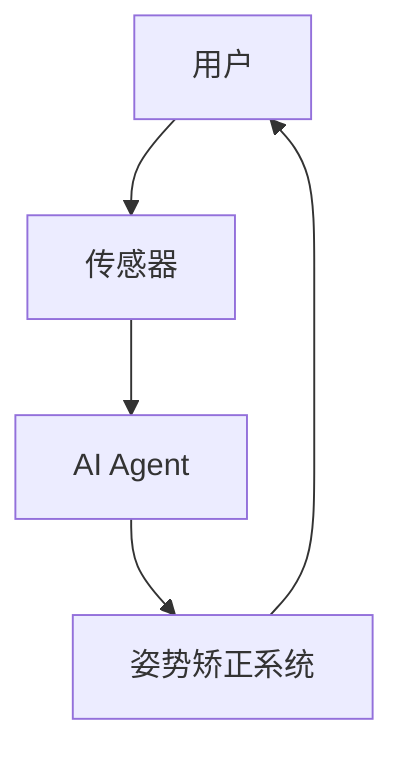
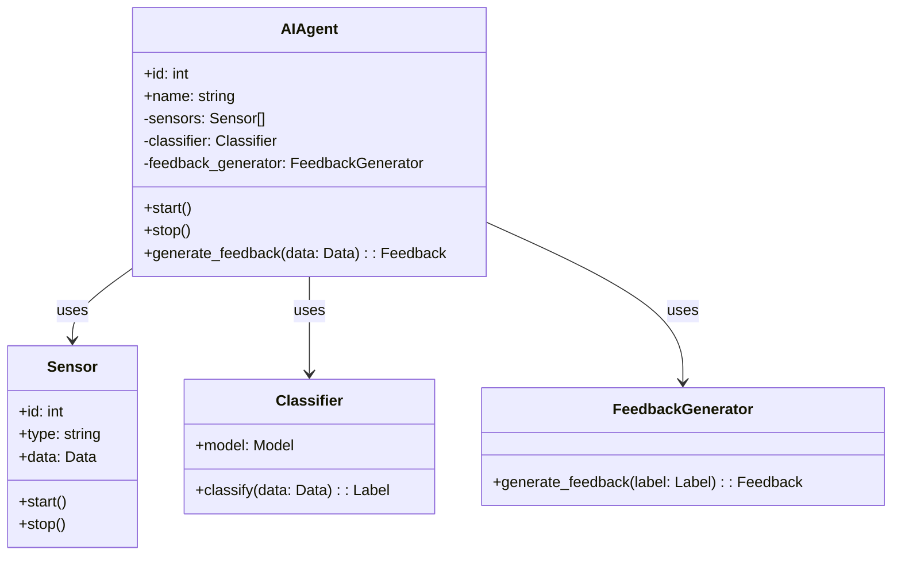
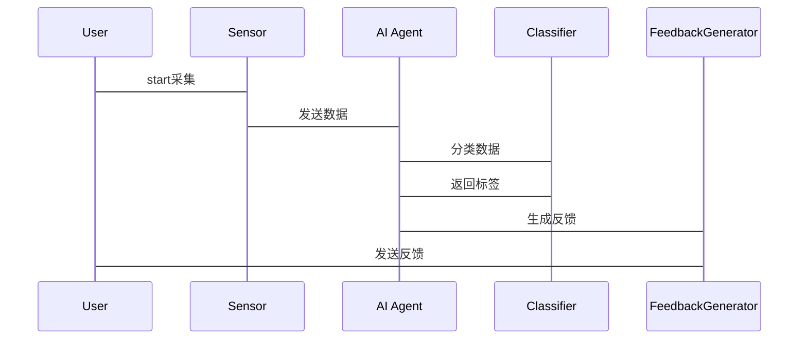

                 


# 智能瑜伽服：AI Agent的姿势矫正系统

> 关键词：智能瑜伽服，AI Agent，姿势矫正，人工智能，健身科技，运动健康

> 摘要：本文详细探讨了智能瑜伽服中AI Agent的姿势矫正系统，从背景介绍、核心概念到算法原理、系统设计，再到项目实战和总结，全面解析了该系统的原理和实现方式。通过本文，读者将深入了解如何利用AI技术提升瑜伽练习的效果和安全性。

---

# 第一部分：背景介绍

## 第1章：智能瑜伽服的背景与问题背景

### 1.1 智能瑜伽服的背景介绍

#### 1.1.1 瑜伽运动的发展与现状

瑜伽是一种古老的身体与心灵练习方式，起源于古印度，距今已有五千多年的历史。它不仅能够改善身体的柔韧性和平衡性，还能帮助人们放松身心、缓解压力。随着现代生活节奏的加快，瑜伽因其健康益处，逐渐成为全球广泛传播的运动方式。

#### 1.1.2 智能健身设备的兴起

近年来，随着科技的发展，智能健身设备逐渐走进人们的生活。从智能手环到智能跑步机，这些设备能够实时监测用户的运动数据，如心率、步频、卡路里消耗等，为用户提供个性化的健身指导。然而，这些设备在姿势矫正方面的能力相对有限，无法提供实时的姿势反馈和专业指导。

#### 1.1.3 AI技术在健身领域的应用

人工智能（AI）技术的快速发展为健身领域带来了新的可能性。AI可以通过分析用户的运动数据，提供个性化的训练计划和实时反馈。特别是在姿势矫正方面，AI技术能够通过图像识别和深度学习，实时监测用户的姿势，并提供纠正建议。这种智能化的姿势矫正系统，能够帮助用户避免运动损伤，提高练习效果。

### 1.2 问题背景与需求分析

#### 1.2.1 瑜伽姿势矫正的重要性

在瑜伽练习中，正确的姿势是确保练习效果和避免受伤的关键。许多人在练习瑜伽时，由于缺乏专业指导，容易出现姿势错误，导致肌肉拉伤、关节疼痛等问题。因此，姿势矫正的重要性不容忽视。

#### 1.2.2 传统姿势矫正的局限性

传统的姿势矫正主要依赖于专业教练的指导。然而，教练的时间和资源有限，无法满足所有用户的需求。此外，用户在没有教练在场的情况下，很难自我纠正姿势错误。因此，如何提供一种高效、便捷的姿势矫正方式，成为亟待解决的问题。

#### 1.2.3 智能瑜伽服的市场需求

智能瑜伽服作为一种创新的健身设备，结合了AI技术和服装设计，能够实时监测用户的姿势，并提供反馈和矫正建议。这种设备的出现，不仅满足了用户对个性化健身指导的需求，还能够随时随地提供姿势矫正服务，具有广阔的市场前景。

---

## 第2章：AI Agent在姿势矫正中的作用

### 2.1 AI Agent的基本概念

#### 2.1.1 人工智能代理的定义

AI Agent（人工智能代理）是指能够感知环境、执行任务并做出决策的智能实体。它可以是一个软件程序，也可以是一个硬件设备，通过传感器和执行器与环境交互。

#### 2.1.2 AI Agent的核心功能与特点

AI Agent的核心功能包括感知、推理、决策和执行。它能够通过传感器获取环境信息，利用算法进行分析和推理，做出最优决策，并通过执行器完成任务。AI Agent的特点是智能化、自主性和适应性。

#### 2.1.3 AI Agent在智能瑜伽服中的应用

在智能瑜伽服中，AI Agent扮演着关键的角色。它通过内置的传感器获取用户的姿势数据，利用深度学习算法进行分析，识别姿势错误，并提供实时反馈和矫正建议。这种智能化的姿势矫正系统，能够帮助用户在练习瑜伽时保持正确的姿势，避免受伤。

---

### 2.2 姿势矫正系统的核心要素

#### 2.2.1 传感器技术

传感器是AI Agent获取姿势数据的关键技术。智能瑜伽服中常用的传感器包括加速度计、陀螺仪、磁力计等，能够实时监测用户的姿势变化。

#### 2.2.2 数据处理与分析

姿势矫正系统需要对传感器获取的数据进行处理和分析。这包括数据清洗、特征提取、模式识别等步骤。通过这些处理，系统能够识别用户的姿势是否正确。

#### 2.2.3 AI算法与反馈机制

AI算法是姿势矫正系统的核心。基于深度学习的姿势识别算法能够准确识别用户的姿势，并通过反馈机制提供实时矫正建议。这种反馈机制不仅能够纠正姿势错误，还能根据用户的学习情况调整反馈策略。

---

# 第二部分：AI Agent的姿势矫正系统核心概念

## 第3章：AI Agent的姿势矫正系统核心概念

### 3.1 系统核心概念与原理

#### 3.1.1 姿势识别的原理

姿势识别是通过传感器数据和AI算法，识别用户当前的姿势状态。这包括人体关键点的检测、姿势分类等步骤。基于深度学习的姿势识别算法，如卷积神经网络（CNN），能够准确识别用户的姿势。

#### 3.1.2 姿势矫正的算法流程

姿势矫正的算法流程包括数据采集、姿势识别、错误检测和反馈生成。系统首先通过传感器获取用户的姿势数据，然后利用AI算法识别姿势是否正确，如果检测到错误，系统会生成矫正建议，并通过反馈机制指导用户调整姿势。

#### 3.1.3 系统的输入与输出

系统的输入包括传感器数据、用户的历史数据和环境数据。系统的输出包括姿势识别结果、矫正建议和反馈信息。用户可以根据系统的输出，调整自己的练习姿势，确保练习的安全性和效果。

---

### 3.2 核心概念与联系

#### 3.2.1 AI Agent与传感器的实体关系图

```mermaid
er
actor AI Agent {
  id
  name
}
actor 传感器 {
  id
  type
}
```

#### 3.2.2 数据流与系统交互流程图



---

## 第4章：算法原理与数学模型

### 4.1 姿势识别算法原理

#### 4.1.1 基于深度学习的姿势识别

基于深度学习的姿势识别算法，如使用卷积神经网络（CNN）进行人体关键点检测。这种方法能够准确识别人体的姿态和动作。

#### 4.1.2 人体关键点检测

人体关键点检测是姿势识别的重要步骤。通过检测人体的关键点，如肩膀、膝盖、脚踝等，系统能够准确识别用户的姿势状态。

#### 4.1.3 姿势分类算法

姿势分类算法是基于机器学习的分类器，如支持向量机（SVM）或随机森林（Random Forest），用于将用户的姿势分类为正确或错误。

---

### 4.2 数学模型与公式

#### 4.2.1 姿势识别的损失函数

$$L = \sum_{i=1}^{n} (y_i - \hat{y}_i)^2$$

其中，$y_i$是真实标签，$\hat{y}_i$是预测标签，$n$是样本数量。

#### 4.2.2 姿势分类的准确率公式

准确率 = 正确分类的样本数 / 总样本数

---

## 第5章：系统分析与架构设计

### 5.1 问题场景介绍

在瑜伽练习中，用户需要实时的姿势反馈和矫正建议。传统的方法依赖于专业教练，但这种方式成本高且不方便。智能瑜伽服通过AI Agent提供实时的姿势矫正，解决了这一问题。

### 5.2 项目介绍

智能瑜伽服项目旨在通过AI技术和传感器，提供实时的姿势矫正服务。系统包括数据采集、姿势识别、反馈生成等模块。

### 5.3 系统功能设计

#### 5.3.1 数据采集模块

数据采集模块通过传感器获取用户的姿势数据，包括加速度、角速度等。

#### 5.3.2 姿势识别模块

姿势识别模块利用深度学习算法，对用户的姿势进行分类，识别是否正确。

#### 5.3.3 反馈生成模块

反馈生成模块根据姿势识别结果，生成矫正建议，并通过振动或语音反馈指导用户调整姿势。

### 5.4 系统架构设计



### 5.5 系统接口设计

系统接口包括传感器接口、AI Agent接口和用户反馈接口。传感器接口用于获取姿势数据，AI Agent接口用于姿势识别，用户反馈接口用于生成矫正建议。

### 5.6 系统交互设计



---

## 第6章：项目实战

### 6.1 环境安装

要运行智能瑜伽服系统，首先需要安装以下环境：

- Python 3.8+
- TensorFlow 2.0+
- OpenCV 4.5+
- Sensor API

### 6.2 系统核心实现源代码

#### 6.2.1 传感器数据采集代码

```python
import sensor_api

def collect_data():
    sensor = sensor_api.Sensor()
    data = sensor.read_data()
    return data
```

#### 6.2.2 姿势识别代码

```python
import tensorflow as tf
from tensorflow.keras import models

def pose_classifier(data):
    model = models.load_model('pose_model.h5')
    prediction = model.predict(data)
    return prediction
```

#### 6.2.3 反馈生成代码

```python
def generate_feedback(prediction):
    if prediction[0][0] > 0.9:
        return "姿势正确，请继续保持"
    else:
        return "姿势错误，请调整"
```

### 6.3 实际案例分析

假设用户在练习瑜伽时，传感器检测到用户的姿势不正确，AI Agent通过分类器识别出错误姿势，并通过反馈生成模块生成矫正建议，指导用户调整姿势。

### 6.4 项目小结

通过实际案例分析，可以看出智能瑜伽服系统能够实时监测用户的姿势，并提供个性化的矫正建议。这种智能化的姿势矫正系统，能够帮助用户提高练习效果，避免运动损伤。

---

# 第三部分：总结与展望

## 第7章：总结与展望

### 7.1 最佳实践 tips

- 定期更新AI模型，以提高姿势识别的准确率
- 提供多种反馈方式，如振动、语音和视觉反馈
- 结合其他健身设备，提供全面的健身指导

### 7.2 小结

本文详细探讨了智能瑜伽服中AI Agent的姿势矫正系统，从背景介绍、核心概念到算法原理、系统设计，再到项目实战和总结，全面解析了该系统的原理和实现方式。

### 7.3 注意事项

- 确保传感器的准确性和稳定性
- 保护用户数据的安全性
- 提供用户友好的界面和交互体验

### 7.4 拓展阅读

- 《深度学习在姿势识别中的应用》
- 《AI在健身领域的创新应用》
- 《智能传感器技术与健身设备的结合》

---

# 作者：AI天才研究院/AI Genius Institute & 禅与计算机程序设计艺术/Zen And The Art of Computer Programming

