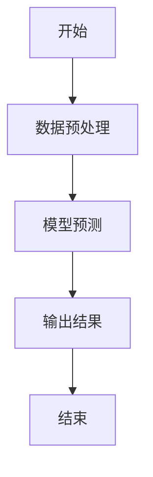
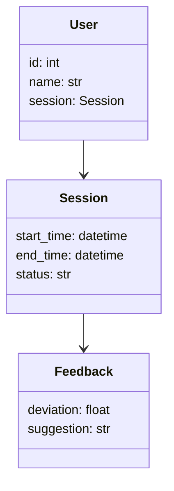
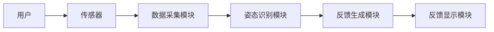
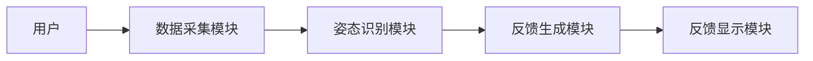

                 


# 第一部分: 智能瑜伽球与AI Agent的背景介绍

---

## 第1章: 智能瑜伽球与AI Agent的概述

### 1.1 智能瑜伽球的定义与特点

#### 1.1.1 传统瑜伽球的功能与局限性
传统瑜伽球是一种常见的健身工具，主要用于锻炼身体的平衡性和核心力量。然而，传统瑜伽球的使用依赖于用户的自我感知和经验，缺乏实时反馈和个性化指导，容易导致动作错误或受伤。

#### 1.1.2 智能瑜伽球的核心概念
智能瑜伽球通过集成传感器和AI技术，能够实时监测用户的动作并提供反馈。它结合了传统瑜伽球的功能和现代AI技术的优势，能够为用户提供智能化的健身指导。

#### 1.1.3 AI Agent在智能瑜伽球中的作用
AI Agent作为智能瑜伽球的核心，负责数据的采集、分析和反馈生成。它通过传感器获取用户的动作数据，利用深度学习算法进行分析，并实时提供个性化的指导。

### 1.2 AI Agent的基本原理

#### 1.2.1 AI Agent的定义与分类
AI Agent是一种智能体，能够感知环境、做出决策并执行动作。根据功能的不同，AI Agent可以分为感知型、决策型和执行型。

#### 1.2.2 AI Agent的核心功能模块
AI Agent的核心功能模块包括感知模块、决策模块和执行模块。感知模块负责采集数据，决策模块负责分析数据并制定计划，执行模块负责输出反馈。

#### 1.2.3 AI Agent与传统健身指导的区别
与传统健身指导相比，AI Agent能够实时监测用户的动作，提供更精准的反馈，并能够根据用户的需求进行个性化调整。

### 1.3 智能瑜伽球的应用场景与优势

#### 1.3.1 家庭健身场景
智能瑜伽球适合家庭使用，用户可以在家中进行锻炼，无需依赖专业教练。

#### 1.3.2 健身房专业训练场景
在健身房中，智能瑜伽球可以提供专业的训练指导，帮助教练更有效地指导用户。

#### 1.3.3 远程健身指导的优势
智能瑜伽球可以通过远程连接，为用户提供实时的健身指导，突破时间和空间的限制。

### 1.4 本章小结

---

## 第2章: AI Agent的核心概念与系统架构

### 2.1 AI Agent的核心概念

#### 2.1.1 AI Agent的感知模块
感知模块负责采集用户的动作数据，包括姿态、运动轨迹等。

#### 2.1.2 AI Agent的决策模块
决策模块负责分析数据，判断用户的动作是否正确，并制定下一步的训练计划。

#### 2.1.3 AI Agent的执行模块
执行模块负责输出反馈，包括语音提示、视觉提示等。

### 2.2 AI Agent的系统架构

#### 2.2.1 基于传感器的数据采集模块
数据采集模块通过内置的传感器获取用户的动作数据。

#### 2.2.2 基于深度学习的姿态识别模块
姿态识别模块利用深度学习算法，对用户的动作进行分析。

#### 2.2.3 基于反馈机制的实时指导模块
实时指导模块根据分析结果，为用户提供个性化的反馈和建议。

### 2.3 AI Agent的核心算法与数学模型

#### 2.3.1 姿态识别算法的数学模型
姿态识别算法通常基于深度学习模型，如姿态估计模型。模型通过回归或分类的方式，对用户的姿态进行预测。

#### 2.3.2 实时反馈算法的数学模型
实时反馈算法通过对比用户的动作和标准动作，计算出动作的偏差，并生成相应的反馈。

#### 2.3.3 算法实现
以下是姿态识别算法的伪代码示例：

```python
def pose_estimation(data):
    # 数据预处理
    processed_data = preprocess(data)
    # 模型预测
    pose = model.predict(processed_data)
    return pose
```

---

## 第3章: AI Agent的算法原理

### 3.1 姿态识别算法

#### 3.1.1 基于深度学习的姿态估计
姿态估计通常使用基于深度学习的模型，如关键点检测网络。模型通过回归的方式，预测用户身体各关键点的位置。

#### 3.1.2 姿态估计的数学模型
姿态估计的数学模型通常包括回归模型和分类模型。回归模型用于预测关键点的坐标，分类模型用于判断用户的动作类型。

#### 3.1.3 算法流程
以下是姿态估计的流程图：



### 3.2 实时反馈算法

#### 3.2.1 基于反馈机制的实时指导
实时反馈算法通过对比用户的动作和标准动作，计算出动作的偏差，并生成相应的反馈。

#### 3.2.2 反馈生成的数学模型
反馈生成的数学模型通常包括分类模型和回归模型。分类模型用于判断动作的类型，回归模型用于预测动作的偏差。

#### 3.2.3 算法实现
以下是实时反馈算法的伪代码示例：

```python
def feedback_generation(data):
    # 数据预处理
    processed_data = preprocess(data)
    # 模型预测
    deviation = model.predict(processed_data)
    return deviation
```

---

## 第4章: 系统分析与架构设计

### 4.1 系统应用场景

#### 4.1.1 家庭健身场景
用户可以在家中使用智能瑜伽球进行锻炼，无需依赖专业教练。

#### 4.1.2 健身房专业训练场景
在健身房中，智能瑜伽球可以提供专业的训练指导，帮助教练更有效地指导用户。

#### 4.1.3 远程健身指导场景
用户可以通过智能瑜伽球进行远程健身指导，突破时间和空间的限制。

### 4.2 系统功能设计

#### 4.2.1 领域模型设计
以下是领域模型的类图：



### 4.3 系统架构设计

#### 4.3.1 系统架构图
以下是系统架构图：



### 4.4 系统接口设计

#### 4.4.1 系统接口设计
系统接口包括数据采集接口、姿态识别接口和反馈生成接口。

#### 4.4.2 接口交互流程
以下是接口交互流程图：



---

## 第5章: 项目实战

### 5.1 环境安装

#### 5.1.1 安装Python
安装Python 3.8或更高版本。

#### 5.1.2 安装OpenCV
使用以下命令安装OpenCV：

```bash
pip install opencv-python
```

### 5.2 系统核心实现

#### 5.2.1 核心代码实现
以下是姿态识别的核心代码：

```python
import cv2

def pose_estimation(frame):
    # 数据预处理
    processed_frame = cv2.resize(frame, (224, 224))
    # 模型预测
    pose = model.predict(processed_frame)
    return pose
```

### 5.3 案例分析与详细解读

#### 5.3.1 案例分析
以下是一个简单的案例分析，展示如何使用智能瑜伽球进行平衡训练。

### 5.4 项目小结

---

## 第6章: 最佳实践

### 6.1 小结
智能瑜伽球结合了AI技术，能够为用户提供智能化的健身指导。

### 6.2 注意事项
在使用智能瑜伽球时，用户需要注意安全，避免受伤。

### 6.3 拓展阅读
推荐读者阅读相关书籍，深入了解AI在健身领域的应用。

---

## 作者：AI天才研究院/AI Genius Institute & 禅与计算机程序设计艺术 /Zen And The Art of Computer Programming

