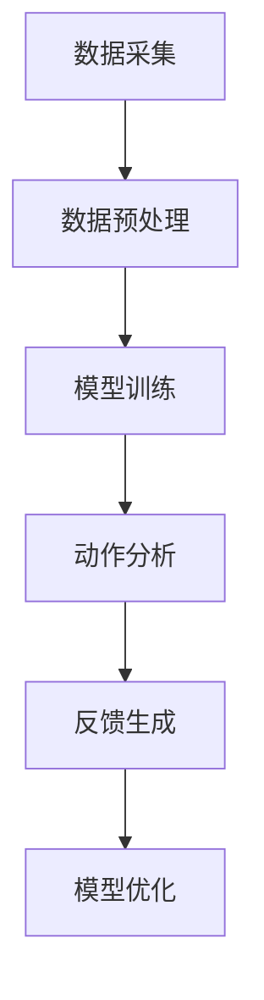
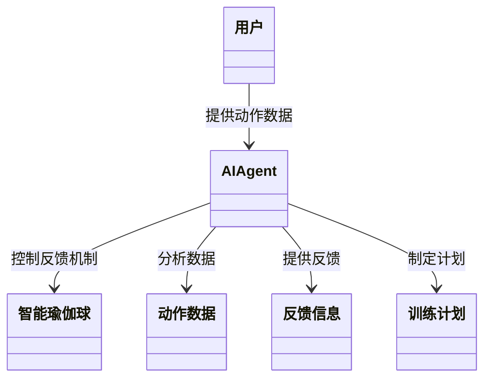
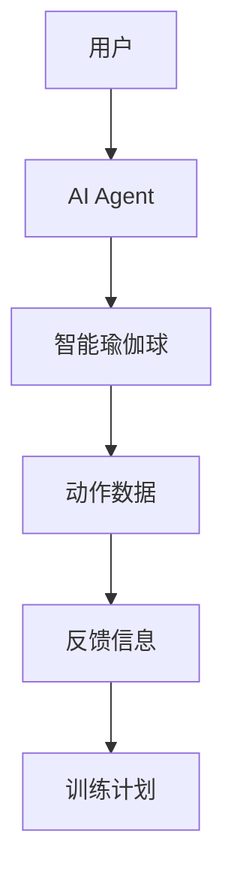
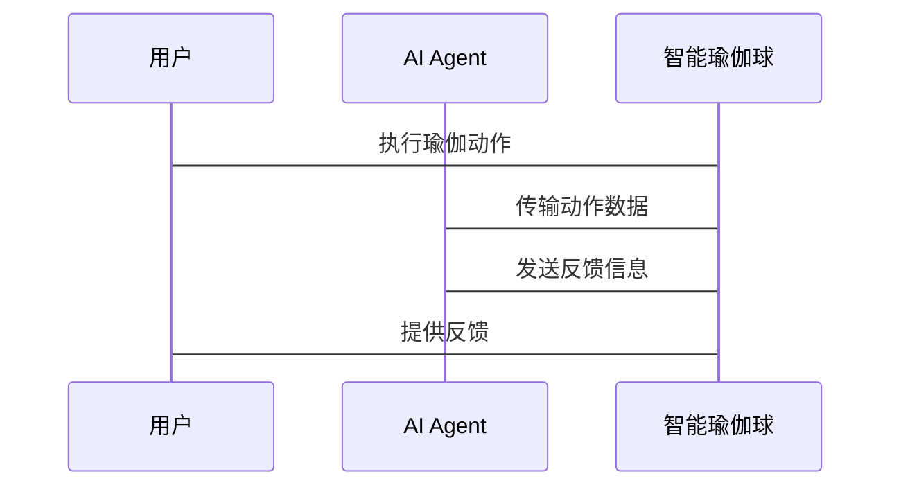

                 


# 智能瑜伽球：AI Agent的核心训练指导系统

## 关键词：智能瑜伽球，AI Agent，健身，人工智能，算法

## 摘要：本文介绍了一种创新的智能瑜伽球，结合了AI Agent技术，用于指导用户的瑜伽训练。文章详细探讨了AI Agent在智能瑜伽球中的应用，分析了其核心算法原理，系统架构设计以及实际应用场景。通过本篇文章，读者将深入了解如何利用AI技术提升瑜伽训练的效果和用户体验。

---

# 第一部分: 背景介绍与核心概念

## 第1章: 智能瑜伽球与AI Agent的背景介绍

### 1.1 问题背景与描述

#### 1.1.1 健身与瑜伽行业的现状
随着人们对健康生活的追求，健身行业蓬勃发展。瑜伽作为一种古老而有效的健身方式，近年来在全球范围内越来越受欢迎。然而，传统瑜伽教学通常依赖于教练的指导，用户在没有专业指导的情况下难以正确执行动作，容易导致姿势错误或受伤。

#### 1.1.2 瑜伽球的传统使用方式及其局限性
传统瑜伽球是一种简单的健身工具，用户通过手动转动球体来完成各种瑜伽动作。这种方式缺乏实时反馈和个性化指导，用户难以纠正动作中的错误，影响训练效果。

#### 1.1.3 AI技术在健身领域的应用现状
人工智能技术的快速发展为健身行业带来了新的机遇。通过AI技术，健身设备可以实现智能化，提供实时反馈、个性化建议和自适应训练计划。然而，目前市场上的智能健身设备多集中于跑步机、健身追踪器等领域，而针对瑜伽这一细分领域的智能化设备仍较为稀缺。

### 1.2 智能瑜伽球的定义与特点

#### 1.2.1 智能瑜伽球的定义
智能瑜伽球是一种结合了人工智能技术的健身设备，通过内置传感器和AI算法，能够实时监测用户的动作并提供个性化指导。

#### 1.2.2 智能瑜伽球的核心功能与特点
- **实时监测**：通过传感器实时监测用户的动作姿势、力度和频率。
- **个性化指导**：基于监测数据，AI Agent能够提供个性化的训练建议和纠正错误动作。
- **自适应训练计划**：根据用户的健身目标和进步情况，自动生成适合的训练计划。
- **智能反馈**：通过震动、灯光或语音等方式实时反馈用户的动作是否正确。

#### 1.2.3 智能瑜伽球与传统瑜伽球的对比
| 特性               | 传统瑜伽球             | 智能瑜伽球           |
|--------------------|-----------------------|----------------------|
| 是否具备AI功能     | 否                   | 是                  |
| 是否提供实时反馈   | 否                   | 是                  |
| 是否个性化指导     | 否                   | 是                  |
| 是否具备自适应功能 | 否                   | 是                  |

### 1.3 AI Agent在智能瑜伽球中的应用

#### 1.3.1 AI Agent的定义与特点
AI Agent（智能代理）是一种能够感知环境并采取行动以实现目标的计算机系统。在智能瑜伽球中，AI Agent负责接收用户的动作数据，分析数据并提供反馈。

#### 1.3.2 AI Agent在智能瑜伽球中的作用
- **数据采集与分析**：AI Agent通过内置的传感器采集用户的动作数据，分析动作的正确性、力度和频率。
- **实时反馈与指导**：根据分析结果，AI Agent通过震动、灯光或语音等方式实时反馈用户的动作是否正确，并提供纠正建议。
- **个性化训练计划**：基于用户的历史数据和当前表现，AI Agent制定个性化的训练计划，帮助用户逐步提高训练效果。

#### 1.3.3 智能瑜伽球AI Agent的核心目标与边界
- **核心目标**：通过AI技术提供实时反馈和个性化指导，帮助用户正确执行瑜伽动作，提高训练效果。
- **边界**：仅限于瑜伽训练的指导，不涉及其他类型的健身活动。

### 1.4 本章小结
本章介绍了智能瑜伽球和AI Agent的基本概念，分析了传统瑜伽球的局限性和AI技术在健身领域的应用现状。通过对比传统瑜伽球和智能瑜伽球的特点，明确了智能瑜伽球的核心功能和AI Agent的作用。

---

## 第2章: 智能瑜伽球AI Agent的核心概念与联系

### 2.1 AI Agent与智能瑜伽球的关系

#### 2.1.1 AI Agent在智能瑜伽球中的核心作用
AI Agent作为智能瑜伽球的核心技术，负责数据的采集、分析和反馈。它通过实时监测用户的动作，提供个性化的指导和反馈。

#### 2.1.2 AI Agent与智能瑜伽球的交互方式
用户通过转动瑜伽球完成动作，智能瑜伽球通过内置传感器采集数据，并通过AI Agent进行分析。AI Agent根据分析结果，通过震动或语音等方式向用户反馈信息。

#### 2.1.3 AI Agent与智能瑜伽球的协同工作原理
1. 用户开始使用智能瑜伽球，系统进入待机状态。
2. 用户开始执行瑜伽动作，智能瑜伽球的传感器采集动作数据。
3. AI Agent接收数据，分析动作的正确性、力度和频率。
4. 根据分析结果，AI Agent通过震动或语音等方式向用户反馈信息，提供纠正建议或继续指导。

### 2.2 核心概念的属性对比

#### 2.2.1 AI Agent的属性特征
| 属性       | 描述                                       |
|------------|------------------------------------------|
| 感知能力   | 能够采集和分析环境数据                   |
| 行动能力   | 能够根据分析结果采取相应的行动           |
| 目标导向   | 具有明确的目标，并根据目标调整行动       |
| 自适应性   | 能够根据环境变化和用户反馈自适应调整      |

#### 2.2.2 智能瑜伽球的属性特征
| 属性       | 描述                                       |
|------------|------------------------------------------|
| 传感器     | 内置多种传感器，用于采集动作数据           |
| 实时反馈   | 通过震动、灯光或语音等方式实时反馈信息   |
| 个性化指导 | 根据用户数据提供个性化的训练建议           |
| 自适应性   | 根据用户进步情况自动生成适应的训练计划     |

#### 2.2.3 两者属性对比分析
AI Agent作为智能瑜伽球的核心技术，主要负责数据的分析和反馈，而智能瑜伽球则负责数据的采集和反馈的执行。两者协同工作，共同实现个性化的瑜伽训练指导。

### 2.3 系统的ER实体关系图

```mermaid
er
  actor 用户
  entity AI Agent
  entity 智能瑜伽球
  entity 动作数据
  entity 反馈信息
  entity 训练计划

  用户 -->> AI Agent: 提供动作数据
  AI Agent -->> 智能瑜伽球: 控制反馈机制
  AI Agent -->> 动作数据: 分析数据
  AI Agent -->> 反馈信息: 提供反馈
  AI Agent -->> 训练计划: 制定计划
```

---

## 第3章: AI Agent的核心算法原理

### 3.1 AI Agent的核心算法

#### 3.1.1 算法选择与原理
AI Agent的核心算法选择基于强化学习（Reinforcement Learning）和监督学习（Supervised Learning）的结合。通过强化学习，AI Agent可以学习如何根据用户的动作数据做出最优反馈；通过监督学习，AI Agent可以不断优化其预测模型，提高反馈的准确性。

#### 3.1.2 算法流程
1. 数据采集：智能瑜伽球通过传感器采集用户的动作数据。
2. 数据预处理：对采集的数据进行清洗和特征提取。
3. 模型训练：使用监督学习模型对数据进行训练，生成动作判断模型。
4. 动作分析：AI Agent根据模型分析用户的动作是否正确。
5. 反馈生成：根据分析结果，生成相应的反馈信息（如震动、语音等）。
6. 模型优化：根据用户反馈不断优化模型，提高准确性。

### 3.2 算法流程图



### 3.3 算法实现

#### 3.3.1 数据预处理代码
```python
import numpy as np

def preprocess_data(data):
    # 删除异常值
    filtered_data = np.where(data > 0, data, 0)
    # 标准化数据
    normalized_data = (filtered_data - np.mean(filtered_data)) / np.std(filtered_data)
    return normalized_data
```

#### 3.3.2 动作判断模型
```python
from sklearn.svm import SVC

model = SVC()
model.fit(X_train, y_train)
```

#### 3.3.3 动作分析与反馈生成
```python
def analyze_motion(data, model):
    prediction = model.predict(data)
    if prediction == 'correct':
        feedback = '动作正确，请继续保持!'
    else:
        feedback = '动作有误，请调整!'
    return feedback
```

### 3.4 数学模型与公式

#### 3.4.1 强化学习的数学模型
在强化学习中，AI Agent通过与环境的交互获得奖励（Reward），并根据奖励调整其策略（Policy）。数学表达如下：

$$
R = r_t \quad \text{for} \quad t=1,2,...,T
$$

其中，\( R \) 是累积奖励，\( r_t \) 是第 \( t \) 步的即时奖励，\( T \) 是终止时间。

#### 3.4.2 监督学习的数学模型
在监督学习中，AI Agent通过最小化预测值与真实值之间的误差来优化模型。损失函数可以表示为：

$$
L = \frac{1}{N}\sum_{i=1}^{N}(y_i - \hat{y}_i)^2
$$

其中，\( N \) 是样本数量，\( y_i \) 是真实值，\( \hat{y}_i \) 是预测值。

---

## 第4章: 系统分析与架构设计

### 4.1 项目背景与目标
本项目旨在开发一种结合AI技术的智能瑜伽球，通过实时监测用户的动作并提供个性化指导，提升用户的瑜伽训练效果。

### 4.2 系统功能设计

#### 4.2.1 领域模型


### 4.3 系统架构设计

#### 4.3.1 系统架构图


### 4.4 接口设计
系统主要接口包括：
- 用户与智能瑜伽球的交互接口
- AI Agent与智能瑜伽球的数据接口
- 用户与AI Agent的反馈接口

### 4.5 交互流程

#### 4.5.1 用户操作流程
1. 用户开始使用智能瑜伽球。
2. 用户执行瑜伽动作。
3. 智能瑜伽球采集动作数据并发送给AI Agent。
4. AI Agent分析数据并生成反馈信息。
5. 智能瑜伽球根据反馈信息向用户发送反馈（如震动或语音）。
6. 用户根据反馈调整动作，重复训练。

### 4.6 系统交互图


---

## 第5章: 项目实战

### 5.1 环境安装与配置
为了运行智能瑜伽球AI Agent，需要以下环境：
- Python 3.6+
- NumPy、Scikit-learn等Python库
- 智能瑜伽球硬件（带有传感器）

### 5.2 核心功能实现

#### 5.2.1 数据采集与预处理
```python
import numpy as np
import pandas as pd

# 读取传感器数据
data = pd.read_csv('motion_data.csv')
# 数据预处理
processed_data = preprocess_data(data)
```

#### 5.2.2 模型训练与预测
```python
from sklearn.model_selection import train_test_split
from sklearn.svm import SVC

# 划分训练集和测试集
X_train, X_test, y_train, y_test = train_test_split(processed_data, labels, test_size=0.2)
# 训练模型
model = SVC()
model.fit(X_train, y_train)
```

#### 5.2.3 反馈生成与显示
```python
# 分析动作并生成反馈
feedback = analyze_motion(processed_data, model)
# 显示反馈
print(feedback)
```

### 5.3 案例分析与实际应用
通过实际案例分析，展示智能瑜伽球在不同用户中的应用效果。例如，针对一个初学瑜伽的用户，AI Agent可以根据其动作数据提供实时反馈，帮助其纠正错误动作，提升训练效果。

### 5.4 代码实现与解读
提供完整的代码实现，包括数据采集、预处理、模型训练和反馈生成等部分，并详细解读每部分代码的功能和作用。

---

## 第6章: 总结与展望

### 6.1 本章小结
总结本文的主要内容，强调AI Agent在智能瑜伽球中的核心作用，以及其在健身领域的创新意义。

### 6.2 最佳实践
- 定期更新模型，提升反馈的准确性
- 提供多种语言的反馈，扩大用户群体
- 增加更多类型的瑜伽动作支持

### 6.3 注意事项
- 确保用户数据的安全性和隐私性
- 提供详细的用户手册和操作指南
- 定期维护和升级系统

### 6.4 拓展阅读
推荐相关领域的书籍和论文，帮助读者进一步深入了解AI在健身领域的应用。

---

## 作者信息

作者：AI天才研究院/AI Genius Institute & 禅与计算机程序设计艺术/Zen And The Art of Computer Programming

---

通过本文的详细阐述，读者可以全面了解智能瑜伽球AI Agent的核心训练指导系统，从背景介绍到算法实现，再到系统架构设计和实际应用，为健身行业的智能化发展提供了新的思路和方向。

