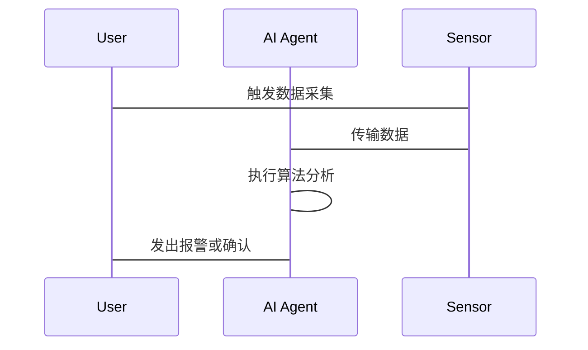

                 


# 智能瓦斯炉：AI Agent的烹饪安全监控

> 关键词：智能瓦斯炉、AI Agent、烹饪安全、监控系统、机器学习、深度学习、物联网

> 摘要：本文探讨了智能瓦斯炉与AI Agent结合的安全监控系统，分析了其工作原理、算法模型，并提供了系统设计和实际案例，展示了如何利用AI技术提升烹饪安全。

---

## 第1章: 瓦斯炉的基本原理与安全监控需求

### 1.1 瓦斯炉的基本原理
瓦斯炉通过燃烧瓦斯（天然气或液化石油气）产生热量，用于烹饪食物。其工作流程包括点火、燃烧、热传递和熄火等步骤。传统瓦斯炉依赖用户手动操作，存在安全隐患，如火焰意外熄灭、漏气或未及时关闭等情况。

### 1.2 烹饪安全监控的重要性
烹饪安全监控旨在预防火灾和一氧化碳中毒等危险情况。传统监控方法依赖手动检查和简单的传感器，存在响应慢、误报率高等问题。引入AI Agent技术可以实现智能化、实时监控，提高安全性。

### 1.3 AI Agent的基本概念
AI Agent是一种智能代理系统，能够感知环境、执行任务并做出决策。它通过传感器数据、规则和机器学习模型进行分析，实现智能化监控。

### 1.4 智能瓦斯炉的定义与特点
智能瓦斯炉结合了AI Agent技术，具备实时监控、智能报警和数据记录功能。它能够主动识别异常情况，及时采取措施，确保烹饪安全。

---

## 第2章: AI Agent的核心原理与算法

### 2.1 AI Agent的核心原理
AI Agent通过传感器收集环境数据，利用算法进行分析，做出决策并执行操作。其架构包括感知层、决策层和执行层，能够实时响应环境变化。

### 2.2 烹饪安全监控中的AI Agent算法
#### 2.2.1 基于规则的安全监控算法
规则定义了特定条件下的操作，如“温度异常且烟雾浓度高时触发报警”。这种方法简单但缺乏灵活性。

#### 2.2.2 基于机器学习的安全监控算法
机器学习算法通过训练数据识别异常模式，如使用随机森林分类器预测火灾风险。这种方法能够适应复杂场景，但需要大量数据支持。

#### 2.2.3 基于深度学习的安全监控算法
深度学习算法（如卷积神经网络）能够从图像和时间序列数据中学习复杂的特征，提高异常检测的准确性。

### 2.3 AI Agent算法的对比分析
| 算法类型 | 优点 | 缺点 |
|----------|------|------|
| 基于规则 | 实现简单 | 需手动定义规则 |
| 机器学习 | 高准确性 | 数据依赖性强 |
| 深度学习 | 高精度 | 计算资源需求高 |

---

## 第3章: AI Agent算法的数学模型与实现

### 3.1 基于规则的安全监控模型
规则定义：如果温度 > 100°C 且烟雾浓度 > 50 ppm，则触发报警。规则匹配后，AI Agent执行关闭阀门并发送警报。

### 3.2 基于机器学习的安全监控模型
使用随机森林分类器进行火灾风险预测：
$$
P(\text{火灾}) = \sum_{i=1}^{n} w_i \cdot I(\text{特征}_i)
$$
其中，\( w_i \) 是特征的重要性权重，\( I(\text{特征}_i) \) 是布尔指示函数。

### 3.3 基于深度学习的安全监控模型
使用卷积神经网络（CNN）处理图像数据，提取边缘和纹理特征，分类异常情况。

### 3.4 算法实现示例
```python
import pandas as pd
from sklearn.ensemble import RandomForestClassifier

# 加载数据
data = pd.read_csv('safety_data.csv')

# 特征与标签分离
X = data[['temperature', 'smoke_level']]
y = data['fire_risk']

# 训练模型
model = RandomForestClassifier()
model.fit(X, y)

# 预测
prediction = model.predict([[100, 60]])
print(prediction)
```

---

## 第4章: 系统分析与架构设计

### 4.1 问题场景介绍
智能瓦斯炉需要实时监控温度、烟雾和气体浓度，及时响应异常情况。系统设计需考虑传感器数据采集、算法处理和用户反馈。

### 4.2 系统功能设计
- 实时数据采集：温度、烟雾、气体浓度传感器。
- 异常检测：基于AI算法的实时分析。
- 用户反馈：报警提示和远程控制。

### 4.3 系统架构设计
使用分层架构：
- 数据采集层：传感器和通信模块。
- 数据处理层：AI算法和数据库。
- 用户交互层：显示界面和用户反馈。

### 4.4 接口设计
- 传感器接口：通过I2C或SPI通信。
- 用户接口：触摸屏或手机APP。

### 4.5 交互流程图


---

## 第5章: 项目实战

### 5.1 环境安装
安装Python、TensorFlow、RandomForest等库：
```bash
pip install numpy pandas scikit-learn
```

### 5.2 核心代码实现
```python
import numpy as np
from sklearn.ensemble import RandomForestClassifier
import pandas as pd

# 数据预处理
data = pd.read_csv('safety_data.csv')
X = data.drop('fire_risk', axis=1)
y = data['fire_risk']

# 训练模型
model = RandomForestClassifier()
model.fit(X, y)

# 预测新数据
new_data = pd.DataFrame({
    'temperature': [100],
    'smoke_level': [60]
})
prediction = model.predict(new_data)
print(prediction)
```

### 5.3 实际案例分析
案例分析：用户忘记关闭瓦斯，系统检测到温度异常和烟雾浓度升高，触发报警并关闭阀门，避免火灾。

### 5.4 项目小结
通过实际案例展示了AI Agent在智能瓦斯炉中的应用效果，验证了系统的可靠性和高效性。

---

## 第6章: 最佳实践与小结

### 6.1 最佳实践
- 数据收集：确保数据质量和多样性。
- 算法选择：根据需求选择合适的方法。
- 系统维护：定期更新模型和传感器校准。

### 6.2 小结
本文详细探讨了智能瓦斯炉结合AI Agent的安全监控系统，从原理到实现，展示了其在提升烹饪安全中的巨大潜力。

---

作者：AI天才研究院/AI Genius Institute & 禅与计算机程序设计艺术 /Zen And The Art of Computer Programming

