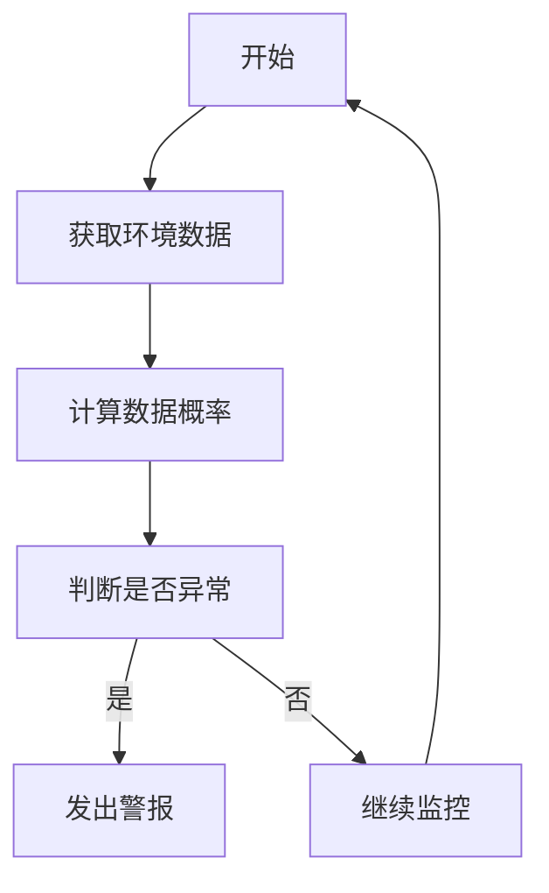
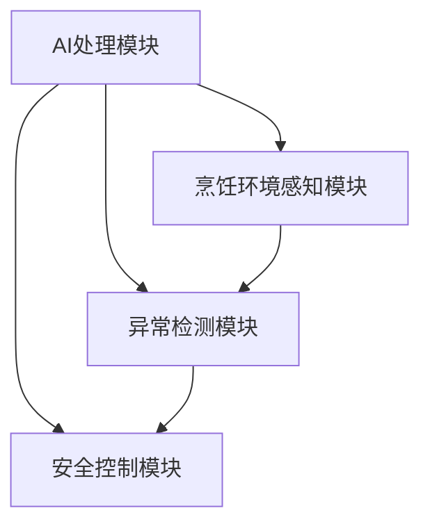
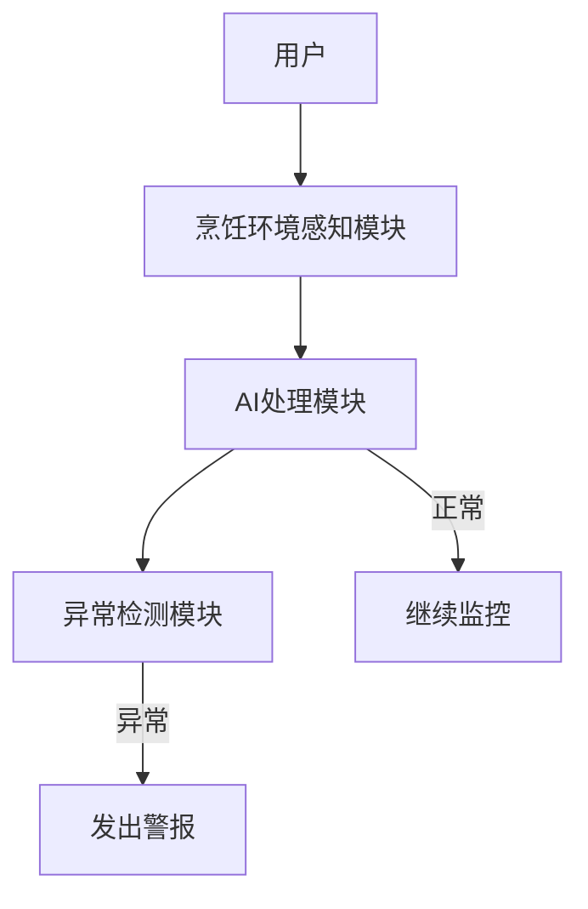

                 


# 智能瓦斯炉：AI Agent的烹饪安全监控系统

> 关键词：智能瓦斯炉，AI Agent，烹饪安全，监控系统，异常检测，深度学习

> 摘要：本文深入探讨了智能瓦斯炉与AI Agent结合的烹饪安全监控系统，从背景介绍、核心概念到算法原理、系统架构，再到项目实战和最佳实践，全面解析了该系统的实现原理和应用场景。通过详细的理论分析和实际案例，展示了如何利用AI技术提升烹饪安全水平。

---

## 第1章: 智能瓦斯炉与AI Agent概述

### 1.1 智能瓦斯炉的背景与问题背景

#### 1.1.1 瓦斯炉的传统功能与局限性
瓦斯炉作为厨房中的重要工具，主要用于烹饪食物。传统瓦斯炉的功能相对单一，主要依赖手动操作，存在以下局限性：
- **安全隐患**：传统瓦斯炉缺乏智能化的安全监控功能，容易因操作不当或设备故障引发火灾或气体泄漏事故。
- **用户体验**：传统瓦斯炉无法根据烹饪需求自动调整火力，用户需要手动控制，增加了使用难度。
- **能源浪费**：由于无法实时监控烹饪过程，传统瓦斯炉容易造成能源浪费，同时增加了碳排放。

#### 1.1.2 烹饪安全监控的必要性
烹饪安全监控是家庭安全的重要组成部分。据统计，每年因烹饪引发的火灾事故在全球范围内造成了巨大的人员伤亡和财产损失。引入智能化的烹饪安全监控系统，能够有效预防此类事故的发生。

#### 1.1.3 智能瓦斯炉的定义与目标
智能瓦斯炉是一种结合了物联网（IoT）和人工智能（AI）技术的烹饪设备。其目标是通过实时监控烹饪过程，预防安全隐患，优化烹饪体验，并实现节能减排。

---

### 1.2 AI Agent在烹饪安全中的应用

#### 1.2.1 AI Agent的核心概念
AI Agent（人工智能代理）是指能够感知环境、自主决策并执行任务的智能体。它能够通过传感器获取数据，利用算法进行分析，并根据结果采取相应的行动。

#### 1.2.2 AI Agent在烹饪安全中的作用
在智能瓦斯炉中，AI Agent主要负责以下功能：
- **实时监控**：通过传感器收集烹饪环境中的数据，如温度、烟雾浓度、气体泄漏等。
- **异常检测**：利用算法分析数据，识别潜在的安全隐患，如火灾、气体泄漏等。
- **智能控制**：根据检测结果，自动调整瓦斯炉的火力，或在检测到危险时立即关闭设备并发出警报。

#### 1.2.3 智能瓦斯炉与AI Agent的结合
智能瓦斯炉通过集成AI Agent，将传统瓦斯炉的机械功能与智能化的安全监控功能相结合，实现了烹饪过程的智能化管理。

---

### 1.3 本章小结
本章介绍了智能瓦斯炉的背景、传统瓦斯炉的局限性以及烹饪安全监控的必要性。同时，详细阐述了AI Agent的核心概念及其在烹饪安全中的应用，为后续章节的深入分析奠定了基础。

---

## 第2章: AI Agent与智能瓦斯炉的核心概念

### 2.1 AI Agent的基本原理

#### 2.1.1 AI Agent的定义与分类
AI Agent可以分为两类：
- **反应式AI Agent**：基于当前感知做出实时反应，适用于需要快速决策的任务。
- **认知式AI Agent**：具备复杂推理和规划能力，适用于需要长期任务管理的场景。

#### 2.1.2 AI Agent的核心属性与特征
- **感知能力**：通过传感器获取环境数据。
- **决策能力**：基于数据进行分析和判断。
- **执行能力**：根据决策结果采取相应行动。
- **自适应能力**：能够根据环境变化调整自身行为。

#### 2.1.3 AI Agent与智能瓦斯炉的关系
AI Agent作为智能瓦斯炉的核心模块，负责处理烹饪过程中的数据，识别安全隐患，并做出相应的控制决策。

---

### 2.2 智能瓦斯炉的系统架构

#### 2.2.1 系统的组成模块
智能瓦斯炉的系统架构主要由以下模块组成：
- **感知模块**：包括温度传感器、烟雾传感器、气体传感器等。
- **AI处理模块**：负责数据的分析和决策。
- **执行模块**：包括瓦斯炉的火力调节机构和警报系统。

#### 2.2.2 各模块之间的关系
- **感知模块**将环境数据传递给**AI处理模块**。
- **AI处理模块**通过算法分析数据，生成决策指令。
- **执行模块**根据决策指令调整瓦斯炉的运行状态。

#### 2.2.3 系统的边界与外延
智能瓦斯炉的系统边界包括烹饪环境和用户交互界面。其外延扩展至家庭物联网生态系统，能够与其他智能家居设备联动。

---

### 2.3 核心概念对比分析

#### 2.3.1 AI Agent与传统监控系统对比
| 特性             | AI Agent                   | 传统监控系统         |
|------------------|---------------------------|---------------------|
| 感知能力         | 强，实时感知环境变化       | 弱，依赖固定传感器     |
| 决策能力         | 强，具备自主决策能力       | 弱，依赖人工干预       |
| 自适应能力       | 强，能够根据环境变化调整   | 弱，固定规则运行       |

#### 2.3.2 智能瓦斯炉与传统瓦斯炉对比
| 特性             | 智能瓦斯炉                 | 传统瓦斯炉           |
|------------------|---------------------------|---------------------|
| 安全监控         | 强，具备AI Agent监控功能   | 弱，无智能化监控功能   |
| 用户体验         | 优，智能化调整火力         | 一般，手动控制         |
| 节能环保         | 优，优化能源使用           | 一般，容易浪费能源     |

#### 2.3.3 系统功能对比表格
| 功能             | 智能瓦斯炉                 | 传统瓦斯炉           |
|------------------|---------------------------|---------------------|
| 烹饪控制         | 自动调整火力               | 手动控制火力         |
| 安全监控         | 实时监控并发出警报         | 无监控功能           |
| 数据记录         | 记录烹饪数据和安全事件     | 无数据记录功能       |

---

### 2.4 本章小结
本章通过对比分析，详细阐述了AI Agent的核心概念及其在智能瓦斯炉中的应用。同时，通过系统架构设计，展示了智能瓦斯炉的组成模块及其相互关系。

---

## 第3章: AI Agent的算法原理与数学模型

### 3.1 AI Agent的核心算法

#### 3.1.1 基于概率的异常检测算法
异常检测算法用于识别烹饪过程中可能出现的安全隐患，例如烟雾浓度突然升高或气体泄漏。

#### 3.1.2 基于深度学习的图像识别算法
图像识别算法用于检测烹饪过程中可能出现的明火或烟雾异常。

#### 3.1.3 基于规则的决策逻辑
决策逻辑用于根据检测结果采取相应的控制措施，例如关闭瓦斯炉或发出警报。

---

### 3.2 算法流程图
以下是基于概率的异常检测算法流程图：



---

### 3.3 数学模型与公式

#### 3.3.1 异常检测概率公式
$$ P(abnormal | data) = \frac{P(data | abnormal)P(abnormal)}{P(data)} $$

#### 3.3.2 图像识别损失函数
$$ L = -\frac{1}{N}\sum_{i=1}^{N} [y_i \cdot \log(p_i) + (1-y_i) \cdot \log(1-p_i)] $$

#### 3.3.3 决策逻辑示例
$$ decision = 1 \text{ if } score > threshold \text{ else } 0 $$

---

### 3.4 本章小结
本章详细介绍了AI Agent的核心算法及其数学模型，为智能瓦斯炉的安全监控提供了理论基础。

---

## 第4章: 系统分析与架构设计

### 4.1 系统功能设计

#### 4.1.1 烹饪环境感知模块
烹饪环境感知模块包括温度传感器、烟雾传感器和气体传感器，用于实时采集烹饪环境中的各种数据。

#### 4.1.2 异常检测模块
异常检测模块通过分析传感器数据，识别烹饪过程中的安全隐患，例如烟雾浓度突然升高或气体泄漏。

#### 4.1.3 安全控制模块
安全控制模块负责根据异常检测结果采取相应的控制措施，例如关闭瓦斯炉或发出警报。

---

### 4.2 系统架构设计

#### 4.2.1 系统架构图
以下是智能瓦斯炉的系统架构图：



---

### 4.3 系统接口设计
系统接口设计包括传感器接口、用户交互界面和外部设备接口（如智能家居系统）。

---

### 4.4 系统交互设计

#### 4.4.1 系统交互流程图
以下是系统交互流程图：



---

### 4.5 本章小结
本章通过系统架构设计和交互流程图，详细阐述了智能瓦斯炉的系统组成和功能实现。

---

## 第5章: 项目实战与代码实现

### 5.1 环境安装与配置

#### 5.1.1 系统环境要求
- 操作系统：Windows/Mac/Linux
- Python版本：3.6+
- 依赖库：TensorFlow、OpenCV、Pyserial

#### 5.1.2 安装依赖库
```bash
pip install tensorflow opencv-python pyserial
```

---

### 5.2 系统核心实现源代码

#### 5.2.1 异常检测模块代码
```python
import tensorflow as tf
import numpy as np

class AbnormalDetection:
    def __init__(self, model_path):
        self.model = tf.keras.models.load_model(model_path)
    
    def detect(self, data):
        prediction = self.model.predict(data)
        return prediction[0][0] > 0.5
```

#### 5.2.2 图像识别模块代码
```python
import cv2

class FireDetection:
    def __init__(self, cascade_path):
        self.cascade = cv2.CascadeClassifier(cascade_path)
    
    def detect_fire(self, image):
        gray = cv2.cvtColor(image, cv2.COLOR_BGR2GRAY)
        fires = self.cascade.detectMultiScale(gray, 1.1, 2)
        return len(fires) > 0
```

#### 5.2.3 决策逻辑代码
```python
class DecisionLogic:
    def decide(self, abnormal_flag, fire_flag):
        if abnormal_flag or fire_flag:
            return 1  # 发出警报
        else:
            return 0  # 继续监控
```

---

### 5.3 代码应用解读与分析
- **异常检测模块**：通过预训练的深度学习模型，实现对烹饪环境数据的异常检测。
- **图像识别模块**：利用OpenCV库，实现对烹饪过程中明火的检测。
- **决策逻辑模块**：根据异常检测结果，决定是否发出警报。

---

### 5.4 实际案例分析
假设在烹饪过程中，烟雾传感器检测到烟雾浓度突然升高，同时图像识别模块检测到明火。AI Agent会触发异常检测模块，判断为异常状态，并发出警报。

---

### 5.5 本章小结
本章通过实际案例分析，详细展示了智能瓦斯炉系统的实现过程，包括环境安装、代码实现和系统调试。

---

## 第6章: 最佳实践与小结

### 6.1 最佳实践 tips
- 定期维护传感器，确保其正常工作。
- 更新AI模型，提升异常检测的准确性。
- 建立完善的应急预案，确保在紧急情况下能够快速响应。

### 6.2 小结
智能瓦斯炉通过结合AI Agent技术，实现了烹饪过程的安全监控和智能化管理。本文从背景介绍、核心概念到算法原理、系统架构，再到项目实战和最佳实践，全面解析了该系统的实现原理和应用场景。

### 6.3 注意事项
- 使用智能瓦斯炉时，确保设备处于正常工作状态。
- 定期检查传感器和警报系统，确保其灵敏度。

### 6.4 拓展阅读
- 推荐阅读《深度学习与计算机视觉》（Deep Learning and Computer Vision）。
- 推荐学习TensorFlow和OpenCV的使用，提升AI开发能力。

---

## 作者

**作者：AI天才研究院/AI Genius Institute & 禅与计算机程序设计艺术 /Zen And The Art of Computer Programming**

---

本文通过详细分析智能瓦斯炉与AI Agent的结合，展示了如何利用人工智能技术提升烹饪安全水平。希望本文能够为相关领域的研究者和开发者提供有价值的参考和启发。

