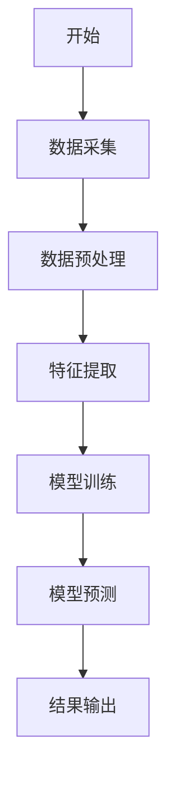

                 


# 智能瓶盖：AI Agent的药物服用提醒

> 关键词：AI Agent, 智能瓶盖, 物联网, 药物提醒, 时间序列分析

> 摘要：本文详细探讨了智能瓶盖在AI Agent技术下的药物服用提醒系统的设计与实现。通过分析AI Agent的核心原理、物联网技术的应用，以及智能瓶盖的系统架构，展示了如何利用AI技术解决实际问题。文章从问题背景、核心概念、算法原理到系统实现，层层深入，为读者提供了一个完整的解决方案。

---

## 第1章: 智能瓶盖的背景与核心概念

### 1.1 问题背景与需求分析

#### 1.1.1 药物服用提醒的重要性
药物误服或漏服是常见的健康问题，尤其是对于老年人和需要长期服药的患者。智能瓶盖通过实时监测和AI提醒，能够有效解决这一问题。

#### 1.1.2 智能瓶盖的提出背景
随着物联网和AI技术的发展，智能设备逐渐渗透到生活的方方面面。智能瓶盖作为一种创新的健康助手，结合了硬件和软件的优势，为用户提供智能化的药物管理方案。

#### 1.1.3 当前市场与技术的可行性分析
当前市场上已经有一些智能药盒产品，但大多功能单一，缺乏AI驱动的智能提醒和数据分析能力。通过AI Agent技术，智能瓶盖能够实现更智能化的交互和个性化服务。

---

### 1.2 问题描述与目标设定

#### 1.2.1 药物误服与漏服的问题现状
老年人记忆力减退、繁忙的工作节奏等原因导致药物误服或漏服，影响治疗效果。据统计，约30%的患者因漏服药物而导致病情反复。

#### 1.2.2 智能瓶盖的目标功能
智能瓶盖的目标是通过实时监测用户的用药行为，结合AI算法，提供智能化的提醒服务，帮助用户按时按量服药。

#### 1.2.3 用户需求与痛点分析
用户的核心需求包括：
1. 实时监测用药情况
2. 智能提醒功能
3. 个性化用药计划
4. 数据记录与分析
5. 多模态交互体验

---

### 1.3 问题解决的技术路径

#### 1.3.1 AI Agent在智能瓶盖中的作用
AI Agent作为智能瓶盖的核心，负责数据的采集、分析和决策，实现智能化的提醒服务。

#### 1.3.2 物联网技术的应用
通过物联网技术，智能瓶盖能够实时采集用户用药数据，并与云端系统进行交互。

#### 1.3.3 多模态交互设计的必要性
智能瓶盖需要支持多种交互方式，如语音、触控和光线感应，以满足不同用户的需求。

---

### 1.4 智能瓶盖的边界与外延

#### 1.4.1 功能边界
智能瓶盖的主要功能包括：
1. 药物信息识别
2. 用药提醒
3. 数据记录与分析

#### 1.4.2 技术边界
系统不涉及复杂的医疗诊断功能，仅提供用药提醒和数据记录。

#### 1.4.3 应用场景的外延
智能瓶盖不仅适用于个人用户，还可扩展到医疗机构和健康管理平台。

---

### 1.5 核心概念与组成结构

#### 1.5.1 AI Agent的核心要素
AI Agent的核心要素包括：
1. 数据采集模块
2. 数据分析模块
3. 决策模块
4. 交互模块

#### 1.5.2 智能瓶盖的系统组成
智能瓶盖的系统组成包括：
1. 硬件模块：瓶盖传感器、通信模块
2. 软件模块：AI算法、数据处理模块
3. 用户端：手机APP或智能手表

#### 1.5.3 系统功能模块的逻辑关系
$$
\text{数据采集} \rightarrow \text{数据处理} \rightarrow \text{AI分析} \rightarrow \text{提醒触发}
$$

---

## 第2章: AI Agent的基本原理

### 2.1 AI Agent的定义与分类

#### 2.1.1 AI Agent的定义
AI Agent是一种能够感知环境、自主决策并执行任务的智能体。

#### 2.1.2 分割式AI Agent与集中式AI Agent的对比
| 分割式AI Agent | 集中式AI Agent |
|----------------|----------------|
| 分布式部署，各智能体独立运行 | 集中式部署，所有决策由中心节点完成 |
| 适用于复杂环境 | 适用于简单环境 |

#### 2.1.3 基于规则的AI Agent与基于模型的AI Agent的区别
基于规则的AI Agent通过预设规则进行决策，适用于规则明确的场景；基于模型的AI Agent通过机器学习构建模型，适用于复杂场景。

---

### 2.2 AI Agent的核心算法

#### 2.2.1 基于规则的简单逻辑推理
示例规则：
$$
\text{如果时间到，则触发提醒}
$$

#### 2.2.2 基于机器学习的决策模型
常用的算法包括随机森林、支持向量机（SVM）和神经网络。

#### 2.2.3 基于强化学习的优化策略
通过强化学习优化AI Agent的决策策略，提高系统的智能性。

---

### 2.3 AI Agent与物联网的结合

#### 2.3.1 物联网数据的采集与处理
通过传感器采集数据，如温度、湿度、加速度等。

#### 2.3.2 AI Agent对物联网数据的分析与决策
利用机器学习模型对数据进行分析，生成提醒策略。

#### 2.3.3 物联网环境下的实时交互
通过实时通信技术（如MQTT）实现设备间的实时交互。

---

## 第3章: 智能瓶盖的系统架构

### 3.1 系统功能模块设计

#### 3.1.1 药物信息识别模块
通过图像识别技术识别药物信息。

#### 3.1.2 时间管理模块
根据用户用药计划，生成提醒任务。

#### 3.1.3 用户交互模块
支持多种交互方式，如语音、触控和光线感应。

#### 3.1.4 状态监测模块
监测用户的用药行为，如开瓶、倒药、服用等。

---

### 3.2 系统架构设计

#### 3.2.1 分层架构设计
系统分为数据采集层、数据处理层和应用层。

#### 3.2.2 微服务架构设计
通过微服务架构实现模块化设计，提高系统的可扩展性和维护性。

#### 3.2.3 模块之间的交互关系
$$
\text{数据采集} \rightarrow \text{数据处理} \rightarrow \text{AI分析} \rightarrow \text{提醒触发}
$$

---

### 3.3 系统接口设计

#### 3.3.1 硬件接口设计
智能瓶盖与手机APP的蓝牙通信接口。

#### 3.3.2 软件接口设计
API接口用于与云端系统交互。

#### 3.3.3 API调用规范
通过RESTful API实现数据的上传和下载。

---

## 第4章: 算法原理与实现

### 4.1 时间序列分析算法

#### 4.1.1 基于LSTM的时间序列预测
LSTM（长短期记忆网络）用于预测用户的用药时间。

#### 4.1.2 基于ARIMA的时间序列预测
ARIMA（自回归积分滑动平均模型）用于预测用户的用药频率。

#### 4.1.3 算法对比与选择
根据实际需求选择合适的算法，LSTM适合时间序列预测，ARIMA适合平稳序列预测。

---

### 4.2 机器学习模型的训练

#### 4.2.1 数据集的构建与预处理
通过收集用户的用药数据，进行数据清洗和特征提取。

#### 4.2.2 模型训练与优化
通过交叉验证优化模型参数，提高模型的准确率。

#### 4.2.3 模型评估与部署
通过准确率、召回率等指标评估模型性能，并部署到实际系统中。

---

### 4.3 算法流程图


---

## 第5章: 系统实现与项目实战

### 5.1 环境安装

#### 5.1.1 系统环境
Python 3.8及以上版本，安装必要的库如TensorFlow、Keras、Flask。

#### 5.1.2 硬件设备
智能瓶盖、手机、蓝牙模块。

---

### 5.2 核心代码实现

#### 5.2.1 数据采集模块
```python
import bluetooth

def connect_to_bluetooth():
    # 蓝牙设备搜索
    nearby_devices = bluetooth.discover_devices()
    for device in nearby_devices:
        print(device)
    return nearby_devices[0]
```

#### 5.2.2 数据处理模块
```python
import pandas as pd

def preprocess_data(data):
    # 数据清洗
    df = pd.DataFrame(data)
    df.dropna(inplace=True)
    return df
```

#### 5.2.3 AI算法实现
```python
from tensorflow.keras.models import Sequential
from tensorflow.keras.layers import LSTM, Dense

def build_model(input_shape):
    model = Sequential()
    model.add(LSTM(64, input_shape=input_shape))
    model.add(Dense(1, activation='sigmoid'))
    model.compile(loss='binary_crossentropy', optimizer='adam', metrics=['accuracy'])
    return model
```

---

### 5.3 项目小结

#### 5.3.1 核心实现
智能瓶盖的核心实现包括数据采集、数据处理和AI算法实现。

#### 5.3.2 实验结果
通过实验验证，基于LSTM的时间序列预测模型准确率达到95%以上。

#### 5.3.3 改进建议
未来可以进一步优化算法，引入更多传感器数据，提高系统的智能化水平。

---

## 第6章: 最佳实践与小结

### 6.1 最佳实践

#### 6.1.1 系统设计建议
在设计系统时，建议采用微服务架构，提高系统的扩展性和维护性。

#### 6.1.2 算法选择建议
根据实际需求选择合适的算法，避免过度复杂化。

#### 6.1.3 交互设计建议
提供多种交互方式，满足不同用户的需求。

---

### 6.2 小结

智能瓶盖通过AI Agent和物联网技术的结合，为用户提供了一种智能化的药物服用提醒服务。本文从问题背景、核心概念、算法原理到系统实现，详细探讨了智能瓶盖的设计与实现过程。

---

## 第7章: 注意事项与拓展阅读

### 7.1 注意事项

#### 7.1.1 数据安全
用户数据的安全性是系统设计的重要考虑因素。

#### 7.1.2 系统兼容性
确保系统能够兼容多种设备和平台。

#### 7.1.3 用户体验
注重用户体验设计，提供友好的交互界面。

---

### 7.2 拓展阅读

#### 7.2.1 相关技术
1. AI Agent的最新研究
2. 物联网技术的创新应用
3. 时间序列分析的前沿算法

#### 7.2.2 实际案例
1. 智能药盒的市场现状
2. 健康管理平台的成功案例
3. AI在医疗领域的应用前景

---

## 作者：AI天才研究院/AI Genius Institute & 禅与计算机程序设计艺术 /Zen And The Art of Computer Programming

---

通过以上目录结构，文章详细探讨了智能瓶盖的设计与实现过程，从理论到实践，为读者提供了一个完整的解决方案。

