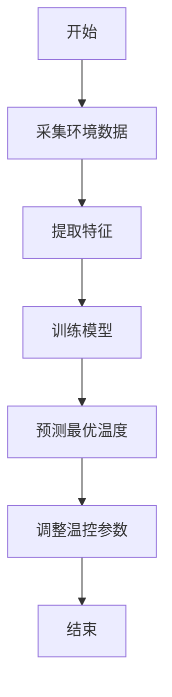
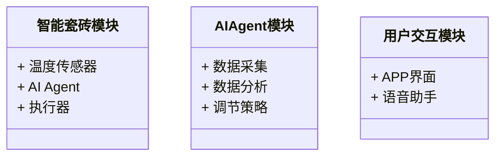
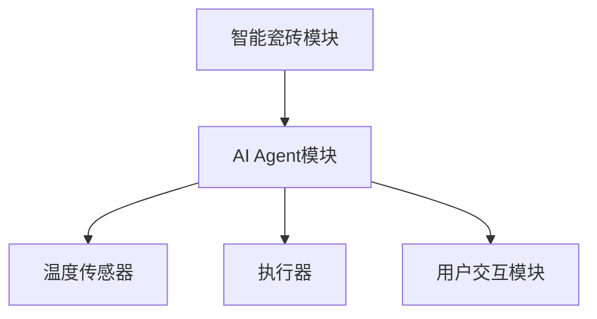
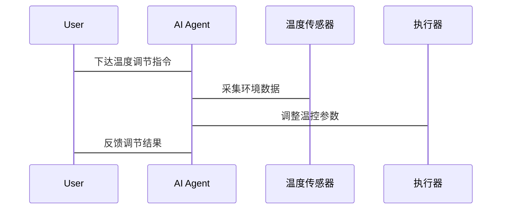

                 


# 智能瓷砖：AI Agent的室内温度均衡系统

## 关键词：智能瓷砖，AI Agent，室内温度均衡，物联网，智能家居

## 摘要：本文详细探讨了智能瓷砖与AI Agent结合的室内温度均衡系统，从系统背景、核心概念、算法原理、系统架构到项目实战，全面分析了该系统的设计与实现。通过结合AI技术与物联网，该系统能够实现室内温度的智能调节，提升居住舒适度。

---

# 第一部分: 智能瓷砖与AI Agent的背景介绍

## 第1章: 智能瓷砖与AI Agent概述

### 1.1 智能瓷砖的定义与特点

智能瓷砖是一种集成物联网（IoT）和人工智能（AI）技术的新型建筑材料。它不仅具备传统瓷砖的装饰功能，还能够感知环境数据、分析数据并执行相应的操作。以下是智能瓷砖的几个关键特点：

1. **感知能力**：内置温度、湿度、光照等多种传感器，能够实时感知环境数据。
2. **可编程性**：通过AI算法，智能瓷砖可以根据用户需求和环境变化，动态调整其功能。
3. **智能交互**：支持与智能家居设备的联动，能够通过语音助手（如Alexa、Google Home）进行控制。
4. **能源效率**：采用低功耗设计，支持太阳能供电或能量回收技术，减少能源消耗。

### 1.2 AI Agent的基本概念

AI Agent（人工智能代理）是一种能够感知环境并采取行动以实现目标的智能实体。在智能瓷砖系统中，AI Agent负责接收传感器数据，分析用户需求，并通过执行器调整瓷砖的温控参数。以下是AI Agent的核心特征：

1. **感知能力**：通过传感器获取环境数据。
2. **决策能力**：基于数据进行分析和决策。
3. **执行能力**：通过执行机构调整瓷砖的温控参数。
4. **学习能力**：通过机器学习算法优化温度调节策略。

### 1.3 智能瓷砖与AI Agent的结合

智能瓷砖与AI Agent的结合使得室内温度调节更加智能化和个性化。AI Agent能够根据用户的行为模式和环境变化，动态调整温度，从而实现舒适、节能的目标。以下是结合的具体表现：

1. **动态调节**：AI Agent能够实时分析环境数据和用户需求，动态调整温度。
2. **个性化设置**：通过学习用户的偏好，AI Agent能够提供个性化的温度调节服务。
3. **能效优化**：通过优化调节策略，AI Agent能够降低能源消耗，提升能效。

## 第2章: 智能瓷砖温度均衡系统的背景

### 2.1 室内温度均衡的重要性

室内温度的均衡对于居住舒适度和健康至关重要。传统空调系统通常采用集中调节的方式，存在能耗高、局部温度不均等问题。以下是智能瓷砖温度均衡系统的重要性：

1. **提升舒适度**：通过局部调节，智能瓷砖能够实现精准的温度控制，提升居住舒适度。
2. **降低能耗**：通过智能调节，减少不必要的能源浪费，降低能耗。
3. **个性化调节**：根据用户需求和环境变化，提供个性化的温度调节服务。

### 2.2 智能瓷砖在温度均衡中的优势

智能瓷砖在温度均衡中的优势主要体现在以下几个方面：

1. **分布式调节**：智能瓷砖可以通过局部调节实现整个房间的温度均衡，避免集中调节的能耗问题。
2. **智能感知与决策**：AI Agent能够实时感知环境数据，智能决策调节策略。
3. **与智能家居联动**：通过与智能家居设备的联动，智能瓷砖能够实现更加智能化的温度调节。

### 2.3 智能瓷砖温度均衡系统的边界与外延

智能瓷砖温度均衡系统的边界主要集中在智能瓷砖本身和其直接连接的传感器、执行器上。系统通过传感器获取环境数据，通过AI Agent进行分析和决策，并通过执行器调整瓷砖的温控参数。以下是系统的外延：

1. **智能家居系统**：智能瓷砖可以与智能家居系统联动，实现更加智能化的家居体验。
2. **能源管理系统**：通过优化调节策略，智能瓷砖可以与能源管理系统联动，实现能效优化。
3. **用户交互界面**：通过手机APP或语音助手，用户可以方便地控制智能瓷砖的温度调节功能。

## 第3章: 智能瓷砖温度均衡系统的概念结构

### 3.1 系统的核心要素

智能瓷砖温度均衡系统的核心要素包括以下几个方面：

1. **智能瓷砖模块**：负责感知环境数据和执行调节操作。
2. **AI Agent模块**：负责分析数据、制定调节策略。
3. **温度传感器模块**：负责采集环境温度数据。
4. **用户交互模块**：负责与用户进行交互，接收用户的指令和反馈。

### 3.2 系统的核心概念与联系

以下是系统核心概念的对比表格和ER实体关系图：

#### 对比表格：

| 模块         | 描述                                         | 特点                           |
|--------------|--------------------------------------------|--------------------------------|
| 智能瓷砖模块 | 负责感知环境数据和执行调节操作               | 集成传感器、执行器、AI算法       |
| AI Agent模块 | 负责分析数据、制定调节策略                   | 具备感知、决策、执行能力         |
| 温度传感器模块 | 负责采集环境温度数据                         | 高精度、实时性                   |
| 用户交互模块 | 负责与用户进行交互，接收用户的指令和反馈     | 支持多种交互方式（语音、APP等） |

#### ER实体关系图：

```mermaid
erd
  title 智能瓷砖温度均衡系统 ER 图

  建筑物
  智能瓷砖
  AI Agent
  温度传感器
  用户

  智能瓷砖 --> AI Agent: 包含
  温度传感器 --> AI Agent: 接收数据
  用户 --> AI Agent: 下达指令
  智能瓷砖 --> 温度传感器: 集成
  智能瓷砖 --> 用户: 提供交互界面
```

---

# 第二部分: 智能瓷砖温度均衡系统的算法原理

## 第4章: 算法原理讲解

### 4.1 AI Agent的温度调节算法

AI Agent的温度调节算法主要包括数据采集、特征提取、模型训练和决策执行四个步骤。

#### 数据采集

智能瓷砖通过集成的温度传感器采集环境数据，数据采集频率可以根据需求进行调整。

#### 特征提取

通过分析采集到的温度数据，提取出有用的特征，例如平均温度、温度波动幅度等。

#### 模型训练

基于机器学习算法，训练一个能够预测最优温度的模型。常用的算法包括支持向量机（SVM）、随机森林（Random Forest）和神经网络（Neural Network）。

#### 决策执行

根据训练好的模型，AI Agent可以预测出最优的温度调节策略，并通过执行器调整智能瓷砖的温控参数。

### 4.2 算法流程图

以下是温度调节算法的流程图：



### 4.3 数学模型与公式

以下是温度调节模型的数学表达式：

$$
T_{\text{opt}} = f(T_{\text{current}}, T_{\text{target}}, \text{环境数据})
$$

其中：
- \( T_{\text{opt}} \) 表示最优温度
- \( T_{\text{current}} \) 表示当前温度
- \( T_{\text{target}} \) 表示目标温度
- 环境数据包括湿度、光照强度等

### 4.4 代码实现

以下是温度调节算法的Python代码示例：

```python
import numpy as np
from sklearn import svm

# 数据预处理
X = np.array([[20, 50], [22, 45], [25, 40]])  # 特征数据
y = np.array([0, 1, 2])  # 标签

# 训练模型
model = svm.SVC()
model.fit(X, y)

# 预测最优温度
new_data = np.array([[21, 48]])
predicted_label = model.predict(new_data)
print(predicted_label)
```

---

# 第三部分: 智能瓷砖温度均衡系统的系统分析与架构设计

## 第5章: 系统分析与架构设计方案

### 5.1 问题场景介绍

智能瓷砖温度均衡系统的目标是通过AI Agent实现室内温度的智能调节，提升居住舒适度。系统需要解决以下问题：

1. 如何实现精准的温度调节？
2. 如何优化能源消耗？
3. 如何实现与智能家居设备的联动？

### 5.2 系统功能设计

以下是系统的功能模块设计：

#### 领域模型



### 5.3 系统架构设计

以下是系统的架构设计：

#### 系统架构图



### 5.4 系统接口设计

以下是系统的接口设计：

#### 接口设计

1. **传感器接口**：智能瓷砖模块通过传感器接口采集环境数据。
2. **执行器接口**：智能瓷砖模块通过执行器接口调整温控参数。
3. **用户交互接口**：用户可以通过APP或语音助手控制智能瓷砖的温度调节功能。

### 5.5 系统交互流程图

以下是系统的交互流程图：



---

# 第四部分: 智能瓷砖温度均衡系统的项目实战

## 第6章: 项目实战

### 6.1 环境搭建与开发工具

#### 开发环境

1. **操作系统**：Windows 10 或 macOS
2. **编程语言**：Python 3.8+
3. **开发工具**：PyCharm 或 VS Code
4. **依赖库**：scikit-learn、numpy、pandas

### 6.2 系统核心实现

#### 核心代码实现

以下是AI Agent模块的核心代码：

```python
import numpy as np
from sklearn.ensemble import RandomForestClassifier

# 数据预处理
X = np.array([[20, 50], [22, 45], [25, 40], [21, 48]])  # 特征数据
y = np.array([0, 1, 2, 3])  # 标签

# 训练模型
model = RandomForestClassifier(n_estimators=100)
model.fit(X, y)

# 预测最优温度
new_data = np.array([[21, 48]])
predicted_label = model.predict(new_data)
print(predicted_label)
```

#### 代码解读与分析

1. **数据预处理**：将采集到的环境数据进行标准化处理。
2. **模型训练**：使用随机森林算法训练分类模型。
3. **模型预测**：根据训练好的模型，预测最优温度调节策略。

### 6.3 实际案例分析

#### 案例分析

假设用户希望将室内温度调节到22摄氏度，系统会根据当前温度、目标温度和环境数据，通过AI Agent模块进行预测和决策，最终调整智能瓷砖的温控参数。

---

# 第五部分: 总结与展望

## 第7章: 总结与展望

### 7.1 最佳实践 Tips

1. **定期更新模型**：为了保证系统的准确性，需要定期更新AI Agent的模型。
2. **优化传感器布局**：合理的传感器布局可以提高数据采集的准确性。
3. **加强用户交互设计**：良好的用户交互设计可以提升用户体验。

### 7.2 小结

智能瓷砖温度均衡系统通过结合AI Agent和物联网技术，能够实现室内温度的智能调节，提升居住舒适度。系统的核心在于AI Agent的算法设计和传感器数据的处理。

### 7.3 注意事项

1. **数据隐私**：在采集和处理用户数据时，需要注意数据隐私和安全。
2. **系统兼容性**：系统需要与多种智能家居设备兼容，确保良好的用户体验。

### 7.4 拓展阅读

1. **机器学习算法**：深入学习随机森林、神经网络等机器学习算法。
2. **物联网技术**：学习更多的物联网技术，了解其在智能家居中的应用。

---

# 作者：AI天才研究院/AI Genius Institute & 禅与计算机程序设计艺术 /Zen And The Art of Computer Programming

