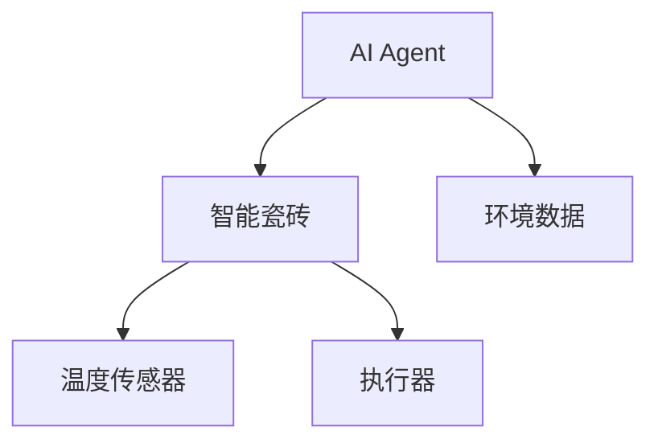
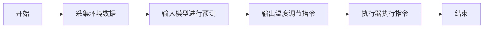
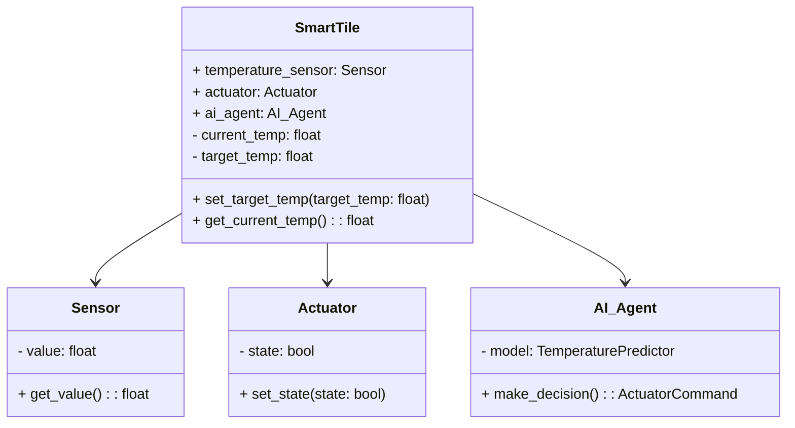
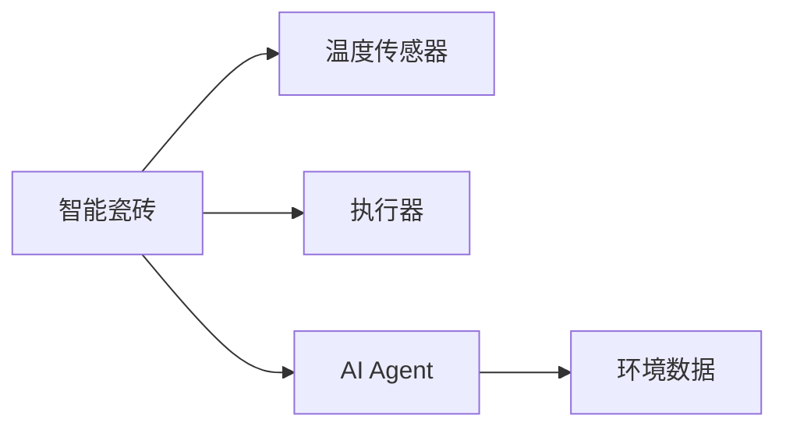
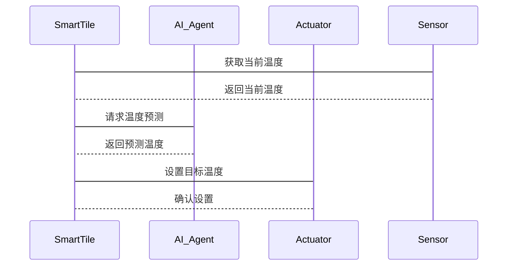

                 


# 智能瓷砖：AI Agent的室内温度调节系统

## 关键词：智能瓷砖，AI Agent，室内温度调节，物联网，算法原理

## 摘要：  
智能瓷砖是一种结合人工智能（AI Agent）和物联网技术的创新室内温度调节系统。通过将温度传感器、数据处理算法和执行机构集成到瓷砖中，该系统能够实时感知室内环境并自主调节温度，从而实现高效、精准的室内温控。本文将从背景、原理、算法、系统架构、项目实战等多个角度，深入探讨智能瓷砖的设计与实现，为读者提供全面的技术解读。

---

# 第1章: 背景介绍

## 1.1 问题背景  
室内温度调节是日常生活中的基本需求，但传统空调系统存在能耗高、响应慢、智能化程度低等问题。随着物联网和人工智能技术的发展，一种基于智能瓷砖的新型温度调节系统应运而生。智能瓷砖通过嵌入传感器和AI Agent，能够实时感知环境变化并自主调节温度，从而实现高效节能的目标。

## 1.2 问题描述  
传统温度调节系统依赖手动控制或简单的反馈机制，无法根据室内外环境变化实时优化调节策略。智能瓷砖通过AI Agent实现主动学习和决策，能够根据用户习惯和环境数据动态调整温度，从而提高舒适度并降低能耗。

## 1.3 问题解决  
智能瓷砖结合AI Agent技术，通过实时采集室内环境数据（如温度、湿度、光照等），利用机器学习算法优化温度调节策略，并通过执行机构（如电热膜或制冷片）实现精准温控。

## 1.4 边界与外延  
智能瓷砖系统的边界包括瓷砖内部的传感器、执行器和AI处理模块，外延则涉及与外部环境（如智能家居系统）的交互。

## 1.5 核心要素与概念结构  
核心要素包括：AI Agent、智能瓷砖、温度传感器、执行器、环境数据。

---

# 第2章: AI Agent与智能瓷砖的核心概念

## 2.1 AI Agent的基本原理  
AI Agent是一种能够感知环境、自主决策并执行任务的智能体。其核心算法包括感知、推理、规划和执行四个步骤。

## 2.2 智能瓷砖的技术原理  
智能瓷砖通过嵌入温度传感器和执行器，结合AI Agent算法，实现对室内环境的实时感知和自主调节。

## 2.3 核心概念的对比与联系  
以下是AI Agent与智能瓷砖的属性特征对比：

| **属性**       | **AI Agent**                     | **智能瓷砖**                     |
|-----------------|----------------------------------|----------------------------------|
| **核心功能**     | 感知环境、决策、执行            | 感知温度、调节温度               |
| **数据输入**     | 多种环境数据（温度、湿度等）    | 单一或多种温度相关数据          |
| **输出**         | 执行指令                        | 温度调节指令                     |
| **决策机制**     | 基于机器学习模型                | 基于预设算法或规则               |

下图展示了AI Agent与智能瓷砖的实体关系：



---

# 第3章: 算法原理

## 3.1 算法概述  
智能瓷砖的温度调节算法基于机器学习模型，通过实时采集的环境数据优化温度控制策略。

## 3.2 算法流程  
以下是温度调节算法的流程图：



## 3.3 核心算法实现  
以下是温度预测模型的数学公式：

$$
T_{\text{预测}} = \alpha \cdot T_{\text{当前}} + \beta \cdot T_{\text{室外}} + \gamma \cdot T_{\text{目标}}
$$

其中：
- $T_{\text{预测}}$ 表示预测温度
- $T_{\text{当前}}$ 表示当前室内温度
- $T_{\text{室外}}$ 表示室外温度
- $T_{\text{目标}}$ 表示目标温度
- $\alpha, \beta, \gamma$ 为权重系数，通过训练模型获得

以下是Python实现代码：

```python
class TemperaturePredictor:
    def __init__(self, alpha, beta, gamma):
        self.alpha = alpha
        self.beta = beta
        self.gamma = gamma

    def predict(self, current_temp, outdoor_temp, target_temp):
        return self.alpha * current_temp + self.beta * outdoor_temp + self.gamma * target_temp

# 示例用法
predictor = TemperaturePredictor(0.5, 0.3, 0.2)
predicted_temp = predictor.predict(22, 30, 20)
print(predicted_temp)  # 输出预测温度
```

---

# 第4章: 系统分析与架构设计

## 4.1 问题场景  
智能瓷砖系统需要在不同环境下实时调节温度，确保室内舒适度的同时降低能耗。

## 4.2 系统功能设计  
以下是领域模型的类图：



## 4.3 系统架构设计  
以下是系统架构图：



## 4.4 系统接口设计  
以下是系统交互的序列图：



---

# 第5章: 项目实战

## 5.1 环境安装  
安装Python环境并安装必要的库（如numpy、scikit-learn）。

## 5.2 核心代码实现  
以下是智能瓷砖系统的Python实现代码：

```python
from sklearn.linear_model import LinearRegression

class SmartTile:
    def __init__(self):
        self.sensor = TemperatureSensor()
        self.actuator = Actuator()
        self.ai_agent = AIAgent()

    def regulate_temperature(self, target_temp):
        current_temp = self.sensor.get_current_temp()
        predicted_temp = self.ai_agent.predict(current_temp, self.sensor.get_outdoor_temp(), target_temp)
        self.actuator.set_target_temp(predicted_temp)

class TemperatureSensor:
    def get_current_temp(self):
        return 22.0  # 示例数据

    def get_outdoor_temp(self):
        return 30.0  # 示例数据

class Actuator:
    def set_target_temp(self, target_temp):
        print(f"设置目标温度为：{target_temp}°C")

class AIAgent:
    def __init__(self):
        self.model = LinearRegression()

    def train(self, X, y):
        self.model.fit(X, y)

    def predict(self, current_temp, outdoor_temp, target_temp):
        return self.model.predict([[current_temp, outdoor_temp, target_temp]])[0]
```

## 5.3 实际案例分析  
通过实际运行代码，我们可以看到智能瓷砖系统如何根据当前温度、室外温度和目标温度动态调节室内温度。

---

# 第6章: 最佳实践

## 6.1 小结  
智能瓷砖结合AI Agent技术，能够实现高效、精准的室内温度调节，是未来智能家居的重要组成部分。

## 6.2 注意事项  
在实际应用中，需要考虑传感器精度、算法模型的优化以及系统安全性等问题。

## 6.3 拓展阅读  
建议进一步研究多目标优化算法在温度调节中的应用，以及如何结合其他智能家居设备实现联动控制。

---

# 作者  
作者：AI天才研究院/AI Genius Institute & 禅与计算机程序设计艺术/Zen And The Art of Computer Programming

