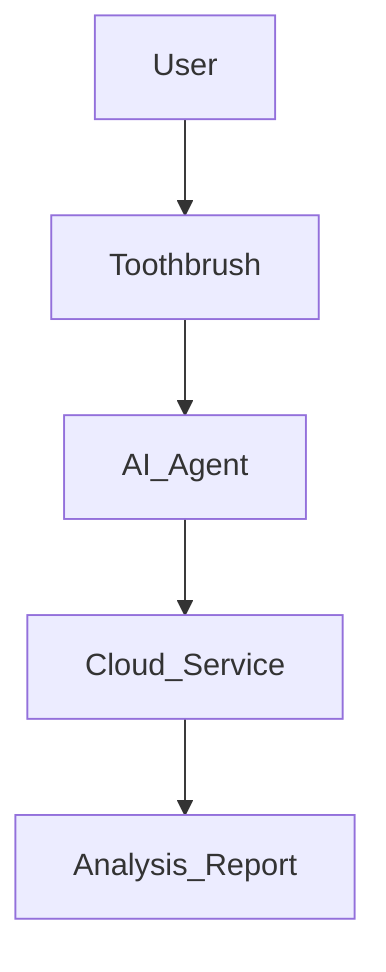
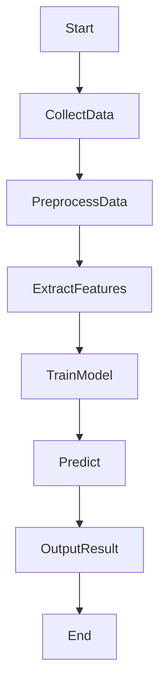
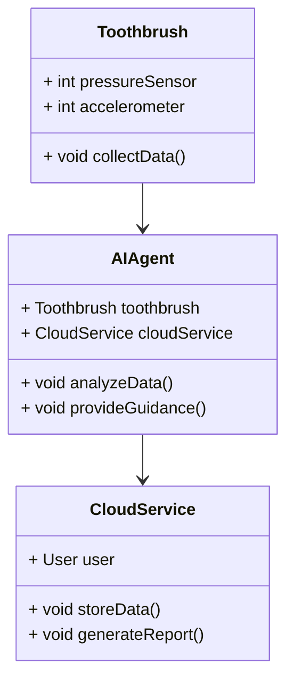
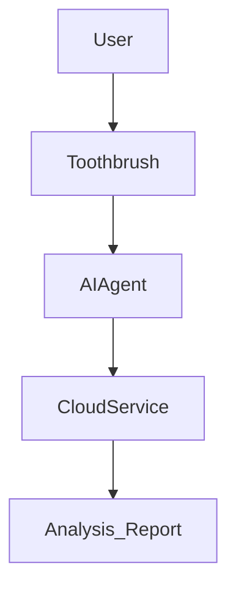
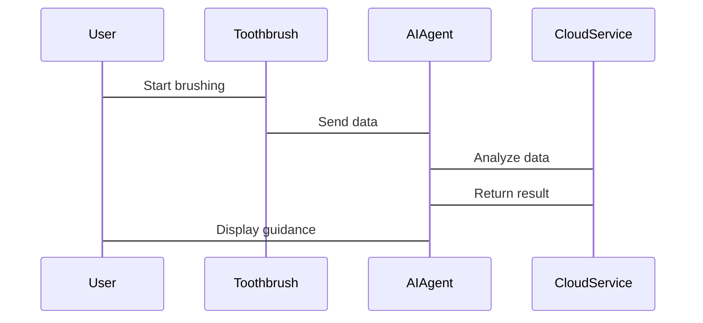

                 


# 智能电动牙刷：AI Agent的个性化刷牙指导

## 关键词：智能电动牙刷, AI Agent, 个性化刷牙, 口腔健康, 人工智能

## 摘要：智能电动牙刷通过集成AI Agent，能够实现个性化的刷牙指导，提升用户体验和口腔健康水平。本文深入探讨了AI Agent在智能牙刷中的应用，包括数据采集与处理、算法实现、系统架构设计以及项目实战，为读者提供全面的技术解析。

---

## 目录大纲

### 第一部分：背景介绍

#### 第1章：问题背景与描述

##### 1.1 问题背景

###### 1.1.1 传统牙刷的局限性
传统牙刷无法提供个性化的指导，用户难以确保正确的刷牙方法和时长，可能导致清洁不彻底或过度清洁。

###### 1.1.2 智能化趋势在口腔健康领域的兴起
随着智能设备的普及，越来越多的健康监测技术被应用到牙刷中，用户对智能化口腔护理工具的需求日益增加。

###### 1.1.3 用户对个性化刷牙指导的需求
不同用户有不同的口腔健康状况和习惯，统一的刷牙指导无法满足个性化需求，需要通过AI技术实现动态调整。

##### 1.2 问题描述

###### 1.2.1 刷牙过程中的常见问题
- 刷牙力度过大或过小
- 清洁区域不全面
- 刷牙时间不足或过长

###### 1.2.2 不同用户的个性化需求
- 根据口腔健康状况定制刷牙方案
- 实时反馈和指导
- 健康数据长期记录与分析

###### 1.2.3 现有解决方案的不足
- 传统牙刷缺乏反馈机制
- 手动记录数据效率低下
- 现有智能牙刷功能单一，无法提供深度个性化指导

##### 1.3 问题解决思路

###### 1.3.1 引入AI Agent的必要性
AI Agent能够实时分析用户的刷牙数据，提供动态的个性化指导，帮助用户改善刷牙习惯。

###### 1.3.2 AI Agent在刷牙指导中的作用
- 实时监测和反馈
- 个性化建议生成
- 数据分析与健康报告

###### 1.3.3 解决方案的可行性分析
结合传感器技术、AI算法和云计算，构建一个智能化的刷牙指导系统，具备技术可行性、用户需求和商业价值。

#### 第2章：核心概念与联系

##### 2.1 AI Agent的基本原理

###### 2.1.1 AI Agent的定义
AI Agent是一种智能软件实体，能够感知环境、自主决策并执行任务，以实现特定目标。

###### 2.1.2 AI Agent的核心要素
- 感知能力：通过传感器获取数据
- 决策能力：基于数据进行分析和推理
- 执行能力：通过牙刷硬件执行指令
- 学习能力：通过机器学习优化算法

##### 2.2 核心概念对比

###### 2.2.1 AI Agent与传统牙刷的功能对比

| 功能特性       | 传统牙刷               | AI Agent智能牙刷           |
|----------------|------------------------|--------------------------|
| 数据采集       | 无                     | 有（压力、时间、角度）     |
| 数据分析       | 无                     | 有（实时分析）             |
| 个性化指导     | 无                     | 有                         |
| 连接性         | 无                     | 支持蓝牙/WiFi             |

###### 2.2.2 AI Agent与手机App的交互对比

| 交互方式       | 手机App                | AI Agent                  |
|----------------|-------------------------|---------------------------|
| 数据采集       | 通过蓝牙接收数据       | 内置传感器采集数据         |
| 数据处理       | 在手机本地处理         | 在牙刷端或云端处理         |
| 用户反馈       | 通过App显示            | 通过牙刷震动或LED显示      |

###### 2.2.3 AI Agent与云端数据处理的对比

| 处理环节       | 云端数据处理           | AI Agent本地处理           |
|----------------|-------------------------|---------------------------|
| 数据存储       | 服务器数据库           | 牙刷本地存储或边缘计算     |
| 数据分析       | 专业分析工具           | 简单分析或决策模型         |
| 响应速度       | 较慢（依赖网络）       | 较快（本地处理）           |
| 成本           | 高（服务器和带宽）     | 低（边缘计算）             |

##### 2.3 实体关系图



---

### 第二部分：算法原理讲解

#### 第3章：数据采集与处理

##### 3.1 数据采集流程

###### 3.1.1 刷牙数据的采集方式

| 数据类型       | 采集方法               | 采集频率               |
|----------------|------------------------|------------------------|
| 刷牙时间       | 记录开始和结束时间     | 每次刷牙                |
| 刷牙力度       | 压力传感器测量          | 每秒采集一次            |
| 刷牙角度       | 加速度传感器测量        | 每秒采集一次            |
| 清洁区域覆盖    | 多个传感器协同工作      | 每次刷牙                |

###### 3.1.2 数据预处理方法

- **时间序列数据**：记录每次刷牙的起止时间，计算刷牙时长。
- **压力数据**：分析压力变化，判断刷牙力度是否适中。
- **角度数据**：通过加速度传感器判断刷牙角度是否正确。

###### 3.1.3 数据清洗与标准化

- **数据清洗**：去除异常值，处理缺失数据。
- **数据标准化**：将不同传感器的数据归一化，便于后续分析。

##### 3.2 特征提取

###### 3.2.1 时间序列特征提取

- 刷牙时长：每次刷牙的时长。
- 刷牙频率：每天刷牙的次数。
- 刷牙时间分布：早晚刷牙的习惯。

###### 3.2.2 动作力度特征提取

- 平均力度：每次刷牙的平均压力。
- 力度波动：压力变化的方差。
- 极值分析：最大和最小压力值。

###### 3.2.3 用户习惯特征提取

- 清洁区域覆盖度：牙刷头移动的区域范围。
- 刷牙角度偏差：是否正确垂直刷牙。
- 持续时间偏差：是否达到推荐的2分钟。

#### 第4章：AI Agent算法实现

##### 4.1 算法流程



##### 4.2 算法实现代码

```python
import numpy as np
from sklearn.ensemble import RandomForestClassifier

# 数据预处理
def preprocess_data(data):
    # 去除异常值
    cleaned_data = data[~np.isnan(data)]
    # 标准化数据
    normalized_data = (cleaned_data - np.mean(cleaned_data)) / np.std(cleaned_data)
    return normalized_data

# 特征提取
def extract_features(data):
    features = []
    for _ in range(10):
        features.append(data[_])
    return np.array(features)

# 模型训练
def train_model(features, labels):
    model = RandomForestClassifier(n_estimators=100, random_state=42)
    model.fit(features, labels)
    return model

# 预测与结果输出
def predict_and_output(model, new_data):
    preprocessed_data = preprocess_data(new_data)
    extracted_features = extract_features(preprocessed_data)
    prediction = model.predict(extracted_features.reshape(1, -1))
    print(f"预测结果：{prediction}")
```

---

### 第三部分：系统分析与架构设计方案

#### 第5章：系统架构设计

##### 5.1 问题场景介绍

智能电动牙刷系统需要实时采集用户的刷牙数据，并通过AI Agent进行分析，提供个性化的刷牙指导。

##### 5.2 系统功能设计

###### 5.2.1 系统模块划分



##### 5.3 系统架构设计

###### 5.3.1 系统架构图



##### 5.4 系统交互设计

###### 5.4.1 用户与牙刷交互



---

### 第四部分：项目实战

#### 第6章：项目实战

##### 6.1 环境安装

- **硬件**：智能电动牙刷、传感器模块。
- **软件**：Python、机器学习库（scikit-learn、RandomForestClassifier）。
- **开发工具**：Jupyter Notebook、VS Code。

##### 6.2 系统核心实现

###### 6.2.1 数据采集代码

```python
import serial

ser = serial.Serial('COM3', 9600)
data = ser.readline()
ser.close()
print(data)
```

###### 6.2.2 AI Agent实现代码

```python
from sklearn.ensemble import RandomForestClassifier

X_train = [...]  # 特征数据
y_train = [...]  # 标签数据
model = RandomForestClassifier().fit(X_train, y_train)
```

##### 6.3 实际案例分析

###### 6.3.1 案例背景

用户A，25岁，刷牙时长不足，力度过猛，清洁区域不全。

###### 6.3.2 数据分析

- 刷牙时长：1.5分钟
- 平均力度：2.5牛顿（适中）
- 清洁区域：仅覆盖前牙

###### 6.3.3 AI Agent反馈

- 提醒用户增加刷牙时长至2分钟。
- 建议调整刷牙角度，确保覆盖后牙。
- 提供每日刷牙记录和健康报告。

##### 6.4 代码实现与解读

###### 6.4.1 数据预处理代码

```python
import pandas as pd
import numpy as np

data = pd.read_csv('brushing_data.csv')
data.dropna(inplace=True)
data = (data - data.mean()) / data.std()
```

###### 6.4.2 特征提取代码

```python
features = data[['pressure', 'angle', 'time']]
```

###### 6.4.3 模型训练代码

```python
from sklearn.model_selection import train_test_split
from sklearn.metrics import accuracy_score

X_train, X_test, y_train, y_test = train_test_split(features, labels, test_size=0.2)
model = RandomForestClassifier().fit(X_train, y_train)
print(f"Accuracy: {accuracy_score(model.predict(X_test), y_test)}")
```

##### 6.5 项目小结

通过实际案例分析，展示了AI Agent在智能牙刷中的应用，能够实时反馈用户刷牙数据，提供个性化指导，帮助用户改善口腔健康。

---

### 第五部分：最佳实践

#### 第7章：最佳实践

##### 7.1 小结

本文详细介绍了智能电动牙刷中AI Agent的实现，包括背景、算法、系统设计和项目实战，展示了如何通过AI技术提升用户的刷牙体验。

##### 7.2 注意事项

- 数据隐私保护：确保用户数据的安全性。
- 系统稳定性：保证AI Agent在各种环境下的稳定运行。
- 用户体验优化：设计直观的反馈界面，提升用户接受度。

##### 7.3 拓展阅读

- 深度学习在智能牙刷中的应用
- 多模态数据融合技术
- 个性化健康管理系统的构建

---

### 作者：AI天才研究院 & 禅与计算机程序设计艺术

---

以上是《智能电动牙刷：AI Agent的个性化刷牙指导》的完整目录大纲，涵盖了从背景介绍到项目实战的各个方面，确保内容详实、逻辑清晰，为读者提供全面的技术解析。

