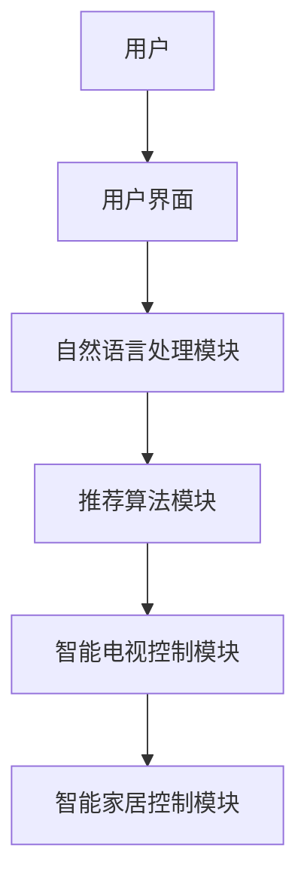

                 


# 智能电视：AI Agent的家庭娱乐管家系统

---

## 关键词

- 智能电视
- AI Agent
- 家庭娱乐
- 人工智能
- 自然语言处理
- 机器学习
- 系统架构

---

## 摘要

本文探讨了智能电视与AI Agent的结合，分析了AI Agent在家庭娱乐中的角色与功能，详细讲解了其背后的技术原理、算法实现和系统架构，并通过实际案例展示了AI Agent在智能电视中的应用场景和优势。文章旨在为读者提供全面的技术视角，帮助理解智能电视AI Agent的实现机制及其对未来家庭娱乐的影响。

---

## 目录

### 第一部分: 智能电视与AI Agent的背景与概念

#### 第1章: 智能电视的发展与AI Agent的引入

##### 1.1 智能电视的定义与特点
- 1.1.1 传统电视的局限性
- 1.1.2 智能电视的核心特征
- 1.1.3 智能电视的市场现状与发展趋势

##### 1.2 AI Agent的基本概念与作用
- 1.2.1 AI Agent的定义
- 1.2.2 AI Agent的核心功能与优势
- 1.2.3 AI Agent在家庭娱乐中的应用场景

##### 1.3 智能电视与AI Agent的结合
- 1.3.1 智能电视中AI Agent的定位
- 1.3.2 AI Agent如何提升家庭娱乐体验
- 1.3.3 智能电视AI Agent的未来发展

---

### 第二部分: AI Agent的核心概念与原理

#### 第2章: AI Agent的核心概念与原理

##### 2.1 AI Agent的核心概念
- 2.1.1 AI Agent的定义与分类
- 2.1.2 AI Agent的核心功能模块
- 2.1.3 AI Agent与智能电视的交互方式

##### 2.2 AI Agent的工作原理
- 2.2.1 自然语言处理（NLP）在AI Agent中的应用
- 2.2.2 机器学习在AI Agent中的应用
- 2.2.3 知识图谱与推理在AI Agent中的应用

##### 2.3 AI Agent与智能电视的实体关系图
```mermaid
er
    actor User {
        id
        name
    }
    entity Smart_Television {
        id
        brand
        model
    }
    entity AI-Agent {
        id
        name
    }
    relationship User -[通过AI-Agent与智能电视交互]-> Smart_Television
    relationship AI-Agent -[控制和管理]-> Smart_Television
```

---

### 第三部分: AI Agent的算法原理与数学模型

#### 第3章: AI Agent的算法原理与数学模型

##### 3.1 AI Agent的核心算法
- 3.1.1 自然语言处理（NLP）算法
  - 基于词袋模型的文本表示
  - 语言模型与序列处理
- 3.1.2 机器学习算法
  - 监督学习与推荐系统
  - 非监督学习与聚类分析
- 3.1.3 知识图谱与推理算法
  - 实体识别与关系抽取
  - 基于知识图谱的推理

##### 3.2 算法原理的数学模型与公式
- 3.2.1 朴素贝叶斯分类器
  $$P(y|x) = \frac{P(x|y)P(y)}{P(x)}$$
- 3.2.2 协同过滤推荐算法
  $$sim(i, j) = \frac{\sum_{k=1}^{n} r_{ik} r_{jk}}{\sqrt{\sum_{k=1}^{n} r_{ik}^2} \sqrt{\sum_{k=1}^{n} r_{jk}^2}}$$
- 3.2.3 嵌入层与注意力机制
  $$\text{Attention}(Q, K, V) = \text{softmax}\left(\frac{QK^T}{\sqrt{d_k}}\right)V$$

##### 3.3 算法实现的Python代码示例
```python
def nlp_processing(text):
    # 分词
    words = tokenize(text)
    # 词向量表示
    vector = word_to_vector(words)
    # 模型预测
    prediction = model.predict(vector)
    return prediction
```

---

### 第四部分: 系统分析与架构设计

#### 第4章: 智能电视AI Agent的系统架构设计

##### 4.1 问题场景介绍
- 用户需求分析
- 系统功能概述

##### 4.2 系统功能设计
- 用户交互模块
- 内容推荐模块
- 设备控制模块

##### 4.3 系统架构图


##### 4.4 接口设计与交互流程
- 用户输入接口
- API调用流程
- 系统反馈机制

---

### 第五部分: 项目实战与案例分析

#### 第5章: 智能电视AI Agent的项目实战

##### 5.1 环境安装与配置
- Python环境搭建
- 依赖库安装
  ```bash
  pip install numpy pandas scikit-learn
  ```

##### 5.2 核心代码实现
- 自然语言处理模块
  ```python
  def process_command(command):
      # 分词
      tokens = tokenize(command)
      # 模型预测
      intent = predict_intent(tokens)
      return intent
  ```

- 推荐系统实现
  ```python
  def recommend_content(user_id):
      # 获取用户历史数据
      user_data = get_user_data(user_id)
      # 计算相似用户
      similar_users = find_similar_users(user_data)
      # 返回推荐列表
      return get_recommendations(similar_users)
  ```

##### 5.3 案例分析与经验总结
- 典型案例分析
- 项目实施中的问题与解决方案
- 性能优化经验

---

### 第六部分: 最佳实践与总结

#### 第6章: 最佳实践与总结

##### 6.1 最佳实践
- 技术选型建议
- 开发规范与代码管理
- 测试与调试技巧

##### 6.2 小结
- 本文的主要内容回顾
- 对未来发展的展望

##### 6.3 注意事项
- 系统安全与隐私保护
- 用户体验的优化建议
- 技术实现中的常见问题

##### 6.4 拓展阅读
- 推荐的相关书籍与论文
- 其他参考资料与学习资源

---

## 作者

作者：AI天才研究院/AI Genius Institute & 禅与计算机程序设计艺术 /Zen And The Art of Computer Programming

