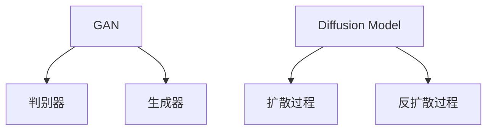
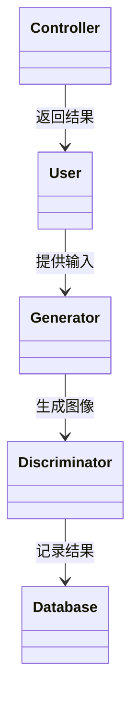
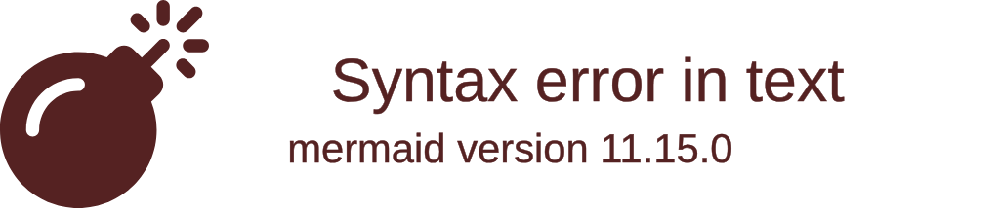
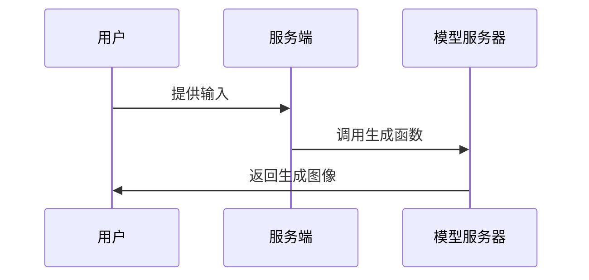

                 


# 智能画架：AI Agent的绘画技巧指导

> 关键词：AI Agent, 智能画架, 绘画技巧, 生成对抗网络, 扩散模型, 深度学习

> 摘要：本文深入探讨了AI Agent在绘画领域的应用，详细介绍了AI绘画的核心概念、算法原理、系统架构以及实际项目实现。通过分析不同AI绘画模型的工作原理，结合具体的代码实现和实际案例，为读者提供了一套系统的学习和应用指南，帮助读者掌握AI绘画的技巧和方法。

---

## 第一部分: 智能画架与AI绘画的背景与基础

### 第1章: AI绘画的核心概念与背景

#### 1.1 AI绘画的定义与背景
- **1.1.1 AI绘画的基本概念**  
  AI绘画是指利用人工智能技术生成或辅助生成绘画作品的过程。通过深度学习算法，AI能够模仿人类的绘画风格，创作出高质量的艺术作品。  
- **1.1.2 AI绘画的起源与发展**  
  AI绘画的起源可以追溯到生成对抗网络（GAN）的提出，随着技术的进步，扩散模型（Diffusion Model）等新算法的出现，进一步推动了AI绘画的发展。  
- **1.1.3 AI绘画的应用场景与用户需求**  
  AI绘画广泛应用于艺术创作、广告设计、教育培训等领域。用户需求主要集中在快速生成灵感、辅助创作、降低学习门槛等方面。

#### 1.2 AI绘画工具的分类与特点
- **1.2.1 基于规则的AI绘画工具**  
  这类工具通过预定义的规则和模板生成绘画作品，适用于简单的图形创作。  
- **1.2.2 基于深度学习的AI绘画工具**  
  利用GAN、Diffusion Model等深度学习模型，能够生成复杂且逼真的绘画作品。  
- **1.2.3 基于用户交互的AI绘画工具**  
  用户可以通过输入关键词或调整参数，实时生成符合需求的绘画作品。

#### 1.3 AI绘画的市场现状与趋势
- **1.3.1 全球AI绘画市场的规模与增长**  
  近年来，AI绘画市场迅速增长，预计未来几年将保持高速发展趋势。  
- **1.3.2 主流AI绘画工具的对比分析**  
  包括MidJourney、DALL-E、Stable Diffusion等工具的优缺点对比。  
- **1.3.3 AI绘画技术的未来发展趋势**  
  更高的生成质量、更强的用户定制化能力、更广泛的应用场景是未来的主要发展方向。

---

### 第2章: AI绘画的核心技术与原理

#### 2.1 AI绘画的主要技术
- **2.1.1 生成对抗网络（GAN）在AI绘画中的应用**  
  GAN由生成器和判别器组成，通过对抗训练生成逼真的绘画作品。  
- **2.1.2 变量自编码器（VAE）在AI绘画中的应用**  
  VAE通过压缩和解压的过程，生成多样化的绘画作品。  
- **2.1.3 扩散模型（Diffusion Model）在AI绘画中的应用**  
  扩散模型通过逐步添加噪声并去噪，生成高质量的绘画作品。

#### 2.2 AI绘画的算法流程
- **2.2.1 数据预处理与特征提取**  
  对输入的图像数据进行归一化处理，并提取关键特征。  
- **2.2.2 模型训练与优化**  
  使用大规模的数据集训练模型，并通过调整超参数优化生成效果。  
- **2.2.3 绘画生成与后处理**  
  根据输入的条件生成绘画作品，并通过后处理提升质量。

#### 2.3 AI绘画的数学模型与公式
- **2.3.1 GAN的损失函数**  
  $$ L_{\text{GAN}} = \log(D(x)) + \log(1 - D(G(z))) $$
  其中，$D(x)$是判别器对真实图像的判别概率，$G(z)$是生成器生成的图像。  
- **2.3.2 Diffusion Model的扩散与反扩散过程**  
  $$ x_{t} = \sigma \epsilon + \sqrt{1 - \sigma^2} x_{t-1} $$
  其中，$\epsilon$是噪声，$\sigma$是扩散系数。

---

### 第3章: AI绘画工具的核心算法原理

#### 3.1 生成对抗网络（GAN）的工作原理
- **3.1.1 GAN的基本结构**  
  由生成器和判别器组成，生成器通过对抗训练生成图像，判别器判断图像是否为真实图像。  
- **3.1.2 GAN的训练过程**  
  通过交替训练生成器和判别器，逐步优化生成效果。

#### 3.2 扩散模型（Diffusion Model）的工作原理
- **3.2.1 扩散过程**  
  从噪声开始，逐步添加结构信息，生成最终的图像。  
- **3.2.2 反扩散过程**  
  通过逐步去噪，生成高质量的图像。

#### 3.3 深度学习模型的对比分析
- **3.3.1 GAN与Diffusion Model的对比**  
  通过对比表格展示两种模型的优缺点：

| 比较维度      | GAN                     | Diffusion Model         |
|---------------|-------------------------|--------------------------|
| 生成速度       | 快                     | 较慢                   |
| 生成质量       | 较低                   | 高                     |
| 训练稳定性       | 较差                   | 较好                   |

- **3.3.2 模型之间的关系**  
  使用Mermaid流程图展示GAN和Diffusion Model的关系：



---

### 第4章: AI绘画系统的架构设计

#### 4.1 系统功能设计
- **4.1.1 领域模型设计**  
  使用Mermaid类图展示系统中的各个功能模块：



- **4.1.2 系统架构设计**  
  使用Mermaid架构图展示系统的整体架构：



- **4.1.3 系统交互设计**  
  使用Mermaid序列图展示用户与系统之间的交互过程：



---

### 第5章: 项目实战与优化

#### 5.1 环境搭建与安装
- **5.1.1 安装Python环境**  
  使用Anaconda或虚拟环境管理Python版本。  
- **5.1.2 安装依赖库**  
  使用pip安装必要的深度学习库，如TensorFlow、PyTorch等。

#### 5.2 核心代码实现
- **5.2.1 GAN模型实现**  
  ```python
  import tensorflow as tf
  from tensorflow.keras import layers

  def build_generator():
      generator = tf.keras.Sequential([
          layers.Dense(256, activation='relu'),
          layers.Dense(784, activation='sigmoid')
      ])
      return generator

  def build_discriminator():
      discriminator = tf.keras.Sequential([
          layers.Dense(256, activation='relu'),
          layers.Dense(1, activation='sigmoid')
      ])
      return discriminator
  ```

- **5.2.2 Diffusion Model实现**  
  ```python
  def diffusion_step(x, noise_scale):
      noise = tf.random.normal(tf.shape(x)) * noise_scale
      return x + noise

  def reverse_diffusion_step(x, noise_scale):
      noise = tf.random.normal(tf.shape(x)) * noise_scale
      return x - noise
  ```

#### 5.3 代码解读与优化
- **5.3.1 代码解读**  
  GAN模型的生成器和判别器分别负责生成图像和判别图像的真实性。Diffusion Model通过逐步添加和去除噪声，生成高质量的图像。  
- **5.3.2 代码优化**  
  使用并行计算和优化算法（如Adam）加速模型训练。

#### 5.4 实际案例分析
- **5.4.1 案例一：风景画生成**  
  使用GAN模型生成一幅风景画，展示生成器和判别器的协同工作过程。  
- **5.4.2 案例二：人物画生成**  
  使用Diffusion Model生成一幅人物画，展示扩散和反扩散过程的效果。

---

## 总结与展望

通过本文的详细介绍，读者可以全面了解AI Agent在绘画领域的应用，掌握从理论到实践的整个过程。未来，随着技术的不断进步，AI绘画工具将更加智能化和多样化，为艺术创作带来更多可能性。

---

**作者：AI天才研究院/AI Genius Institute & 禅与计算机程序设计艺术 /Zen And The Art of Computer Programming**

