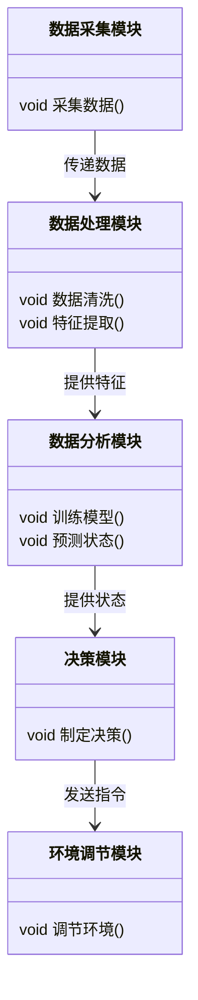
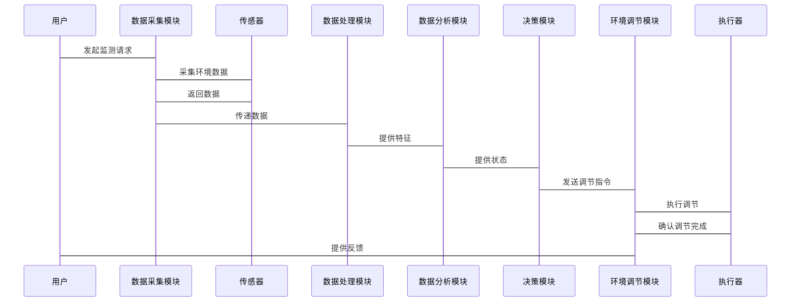

                 


# 第一部分：智能窗台：AI Agent的室内植物生长监测概述

## 第1章：背景介绍

### 1.1 问题背景

#### 1.1.1 室内植物生长监测的重要性
随着城市化进程的加快，越来越多的人选择在室内种植植物，以改善空气质量、美化环境并缓解压力。然而，室内植物的生长受多种因素影响，如光照、温度、湿度、养分等。传统的监测方法依赖于人工观察，效率低且容易遗漏关键信息。因此，引入智能化的监测系统变得尤为重要。

#### 1.1.2 当前监测方法的局限性
目前，市场上的植物监测设备多为单一功能型，如湿度传感器或光照传感器，无法全面监测植物的生长环境。此外，数据采集后缺乏智能分析能力，无法为用户提供有效的种植建议。

#### 1.1.3 AI Agent技术的应用潜力
AI Agent（人工智能代理）是一种能够感知环境、自主决策并执行任务的智能体。通过AI Agent技术，可以实现对室内植物生长环境的实时监测、智能分析和自动调整，从而提高植物生长效率。

### 1.2 问题描述

#### 1.2.1 室内植物生长的关键影响因素
室内植物的生长受光照强度、温度、湿度、土壤pH值、养分浓度等多种因素的影响。这些因素的综合作用决定了植物的健康状态和生长速度。

#### 1.2.2 现有监测系统的不足
现有的监测系统通常只能监测单一因素，缺乏多传感器融合能力，无法全面感知植物的生长环境。此外，数据处理能力有限，无法提供个性化的种植建议。

#### 1.2.3 引入AI Agent的目标与意义
通过引入AI Agent技术，可以实现对室内植物生长环境的全面监测、智能分析和自主调节。AI Agent能够根据监测数据自动调整环境参数，优化植物生长条件，提高种植效率。

### 1.3 问题解决

#### 1.3.1 AI Agent在植物监测中的作用
AI Agent能够实时感知植物生长环境中的多种因素，分析数据并生成相应的决策，如调整光照强度、调节温湿度等，以优化植物生长条件。

#### 1.3.2 多传感器融合技术的应用
通过集成多种传感器（如光照、温度、湿度、土壤pH值传感器等），AI Agent可以全面感知植物的生长环境，提供更准确的监测数据。

#### 1.3.3 数据分析与反馈机制
AI Agent利用机器学习算法对监测数据进行分析，识别植物的健康状态，并根据分析结果提供反馈，优化种植策略。

### 1.4 边界与外延

#### 1.4.1 系统的适用范围
本系统适用于家庭、办公室、学校等室内环境，用于监测和优化各种常见室内植物的生长条件。

#### 1.4.2 与其他智能设备的协同
系统可以与其他智能家居设备（如智能灯、空调、加湿器等）联动，实现环境的自动调节。

#### 1.4.3 系统的可扩展性与限制
系统设计具有良好的扩展性，可以根据需要添加更多传感器或算法模型。然而，目前系统的监测范围和决策能力有限，适用于简单的室内植物生长监测。

### 1.5 概念结构与核心要素

#### 1.5.1 核心概念的组成
系统由AI Agent、多传感器、数据处理模块、决策模块和执行模块组成。AI Agent负责协调各模块的工作，实现对植物生长环境的监测和优化。

#### 1.5.2 各要素之间的关系
AI Agent通过传感器获取环境数据，利用数据处理模块分析数据，生成决策并发送给执行模块，执行模块根据决策调整环境参数。各模块之间相互协作，共同优化植物生长条件。

#### 1.5.3 系统的整体架构
系统采用模块化设计，各模块之间通过标准接口进行通信。AI Agent作为核心模块，负责协调各模块的工作，实现系统的智能化管理。

## 第2章：核心概念与联系

### 2.1 AI Agent的基本原理

#### 2.1.1 AI Agent的定义与特征
AI Agent是一种能够感知环境、自主决策并执行任务的智能体。它具有自主性、反应性、目标导向性和社交能力等特征。

#### 2.1.2 多智能体系统简介
多智能体系统由多个AI Agent组成，各智能体之间通过通信和协作，共同完成复杂任务。在室内植物监测中，可以使用多个AI Agent分别负责不同的监测任务。

#### 2.1.3 事件驱动机制
AI Agent通过事件驱动机制感知环境变化，触发相应的决策和行动。例如，当光照强度低于阈值时，AI Agent会触发增加光照的事件。

### 2.2 室内植物监测的核心要素

#### 2.2.1 环境数据采集
通过多种传感器采集室内环境数据，如光照强度、温度、湿度、土壤pH值等。

#### 2.2.2 生长状态分析
利用机器学习算法分析监测数据，识别植物的健康状态，预测生长趋势。

#### 2.2.3 用户反馈机制
系统可以根据用户的反馈调整监测策略，优化种植建议，提高用户体验。

### 2.3 核心概念的联系

#### 2.3.1 AI Agent与环境数据的关系
AI Agent通过传感器获取环境数据，利用数据处理模块分析数据，生成相应的决策。

#### 2.3.2 数据分析与生长状态的关联
数据分析结果直接关联植物的生长状态，例如，通过分析光照和温度数据，可以预测植物的生长速度。

#### 2.3.3 用户反馈对系统优化的影响
用户的反馈可以帮助系统不断优化监测策略和种植建议，提高系统的智能化水平。

### 2.4 概念属性特征对比表

#### 表2-1：AI Agent与传统传感器对比

| 特性              | AI Agent                          | 传统传感器                        |
|-------------------|-----------------------------------|------------------------------------|
| 功能              | 能够感知环境、自主决策、执行任务 | 仅能采集环境数据                  |
| 智能性            | 具有较高的智能性，能够自主学习   | 智能性较低，无法自主学习          |
| 可扩展性          | 具有良好的扩展性                  | 可扩展性有限                      |
| 应用场景          | 适用于复杂的环境监测与控制       | 适用于简单的环境监测              |

### 2.5 ER实体关系图

```mermaid
erDiagram
    class 系统 {
        id 系统ID
        name 系统名称
    }
    class 植物 {
        id 植物ID
        name 植物名称
        status 生长状态
    }
    class 传感器 {
        id 传感器ID
        type 传感器类型
    }
    class 数据 {
        id 数据ID
        value 数据值
        time 时间戳
    }
    系统 --> 植物 : 管理
    植物 --> 传感器 : 使用
    传感器 --> 数据 : 采集
```

---

## 第3章：算法原理讲解

### 3.1 算法概述

#### 3.1.1 机器学习模型的选择
在本系统中，我们选择使用支持向量回归（Support Vector Regression, SVR）和随机森林（Random Forest）算法来预测植物的健康状态。

#### 3.1.2 数据预处理
数据预处理包括数据清洗、特征提取和数据标准化等步骤。通过数据预处理，可以提高模型的准确性和鲁棒性。

#### 3.1.3 模型训练与优化
利用训练数据对模型进行训练，并通过交叉验证优化模型参数，选择最优模型。

#### 3.1.4 模型评估
通过测试数据对模型进行评估，计算模型的准确率、召回率和F1分数等指标，确保模型的性能达到预期。

---

### 3.2 机器学习模型的实现

#### 3.2.1 SVR模型的实现

##### 3.2.1.1 SVR模型的原理
支持向量回归是一种基于支持向量机（Support Vector Machine, SVM）的回归算法。它通过找到一个最优超平面，使得预测值与实际值的误差最小化。

##### 3.2.1.2 SVR模型的数学公式
$$ y = w \cdot x + b $$
其中，\( y \) 是预测值，\( w \) 是权重向量，\( x \) 是输入特征，\( b \) 是偏置项。

##### 3.2.1.3 SVR模型的实现步骤
1. 数据预处理：清洗数据，提取特征，标准化数据。
2. 模型训练：使用训练数据训练SVR模型。
3. 模型优化：通过网格搜索（Grid Search）优化模型参数。
4. 模型评估：使用测试数据评估模型性能。

##### 3.2.1.4 Python代码实现
```python
from sklearn.svm import SVR
from sklearn.model_selection import GridSearchCV
from sklearn.metrics import mean_absolute_error

# 数据预处理
X = ...  # 特征数据
y = ...  # 目标变量

# 网格搜索优化模型参数
param_grid = {'kernel': ['rbf', 'linear'], 'C': [1, 10, 100]}
grid_search = GridSearchCV(SVR(), param_grid, cv=5)
grid_search.fit(X, y)

# 最优模型
best_model = grid_search.best_estimator_
print("最佳参数：", grid_search.best_params_)
print("最优模型均绝对误差：", mean_absolute_error(y, best_model.predict(X)))

# 模型评估
print("训练集准确率：", best_model.score(X, y))
```

#### 3.2.2 随机森林模型的实现

##### 3.2.2.1 随机森林模型的原理
随机森林是一种基于决策树的集成学习算法。它通过构建多棵决策树，并将它们的结果进行投票或平均，从而提高模型的准确性和稳定性。

##### 3.2.2.2 随机森林模型的数学公式
随机森林模型的预测结果是多棵决策树预测结果的平均值或多数投票结果。

##### 3.2.2.3 随机森林模型的实现步骤
1. 数据预处理：清洗数据，提取特征，标准化数据。
2. 模型训练：使用训练数据训练随机森林模型。
3. 模型优化：通过网格搜索优化模型参数。
4. 模型评估：使用测试数据评估模型性能。

##### 3.2.2.4 Python代码实现
```python
from sklearn.ensemble import RandomForestRegressor
from sklearn.model_selection import GridSearchCV
from sklearn.metrics import mean_absolute_error

# 数据预处理
X = ...  # 特征数据
y = ...  # 目标变量

# 网格搜索优化模型参数
param_grid = {'n_estimators': [10, 20, 30], 'max_depth': [None, 10, 20]}
grid_search = GridSearchCV(RandomForestRegressor(), param_grid, cv=5)
grid_search.fit(X, y)

# 最优模型
best_model = grid_search.best_estimator_
print("最佳参数：", grid_search.best_params_)
print("最优模型均绝对误差：", mean_absolute_error(y, best_model.predict(X)))

# 模型评估
print("训练集准确率：", best_model.score(X, y))
```

---

### 3.3 算法优化与改进

#### 3.3.1 超参数优化
通过网格搜索和随机搜索等方法，优化模型的超参数，如学习率、树的深度、特征选择等，以提高模型的性能。

#### 3.3.2 增量学习
在模型训练过程中，采用增量学习方法，逐步更新模型参数，以适应环境变化和新的数据。

#### 3.3.3 模型融合
通过将多个模型的预测结果进行融合，如投票、加权平均等方法，提高模型的整体性能。

---

## 第4章：系统分析与架构设计方案

### 4.1 问题场景介绍

#### 4.1.1 系统目标
本系统旨在实现对室内植物生长环境的实时监测、智能分析和自主调节，优化植物生长条件，提高种植效率。

#### 4.1.2 系统范围
系统适用于家庭、办公室、学校等室内环境，支持多种常见室内植物的生长监测。

#### 4.1.3 系统边界
系统的边界包括与用户的交互界面、与智能设备的接口以及与其他系统的集成。

### 4.2 系统功能设计

#### 4.2.1 领域模型
系统功能模块包括数据采集、数据处理、数据分析、决策制定和环境调节等模块。

#### 4.2.2 领域模型类图


### 4.3 系统架构设计

#### 4.3.1 系统架构图
```mermaid
archiDiagram
    component 系统 {
        component 数据采集模块 {
            use 传感器
        }
        component 数据处理模块 {
            use 数据库
        }
        component 数据分析模块 {
            use 机器学习模型
        }
        component 决策模块 {
            use 策略库
        }
        component 环境调节模块 {
            use 执行器
        }
    }
```

#### 4.3.2 系统接口设计
系统接口包括传感器接口、数据库接口、用户界面接口和执行器接口等。

#### 4.3.3 系统交互流程


---

## 第5章：项目实战

### 5.1 环境安装

#### 5.1.1 系统需求
需要安装Python 3.6及以上版本、Jupyter Notebook、NumPy、Pandas、Scikit-learn等库。

#### 5.1.2 安装步骤
```bash
pip install numpy pandas scikit-learn matplotlib
```

### 5.2 系统核心实现

#### 5.2.1 数据采集模块实现
```python
import numpy as np
import pandas as pd

# 读取数据
data = pd.read_csv('plant_data.csv')

# 数据预处理
data = data.dropna()  # 删除缺失值
data = pd.get_dummies(data)  # 独热编码
```

#### 5.2.2 数据分析模块实现
```python
from sklearn.model_selection import train_test_split
from sklearn.ensemble import RandomForestRegressor
from sklearn.metrics import mean_absolute_error

# 数据分割
X_train, X_test, y_train, y_test = train_test_split(data.drop('status', axis=1), data['status'], test_size=0.2)

# 模型训练
model = RandomForestRegressor()
model.fit(X_train, y_train)

# 模型评估
print(mean_absolute_error(y_test, model.predict(X_test)))
```

#### 5.2.3 决策模块实现
```python
from sklearn.svm import SVR

# 模型训练
svr_model = SVR(C=100, kernel='rbf')
svr_model.fit(X_train, y_train)

# 模型预测
y_pred = svr_model.predict(X_test)
```

### 5.3 案例分析与总结

#### 5.3.1 案例分析
通过实际案例分析，验证系统的监测和调节能力。例如，当光照强度不足时，系统能够自动调节光照，提高植物的健康状态。

#### 5.3.2 总结
本系统的实现展示了AI Agent在室内植物生长监测中的应用潜力。通过多传感器融合、智能数据分析和自主决策，系统能够有效优化植物生长条件，提高种植效率。

---

## 第6章：最佳实践与扩展阅读

### 6.1 最佳实践 tips

#### 6.1.1 数据采集
确保数据的准确性和完整性，定期校准传感器，避免数据漂移。

#### 6.1.2 系统维护
定期更新模型参数，优化算法，确保系统的稳定性和高效性。

#### 6.1.3 用户教育
提供用户友好的界面和操作指南，帮助用户更好地使用系统，优化种植策略。

### 6.2 小结
本文详细介绍了AI Agent在室内植物生长监测中的应用，从背景介绍、核心概念、算法原理到系统设计和项目实战，全面阐述了系统的实现过程和优化方法。

### 6.3 注意事项
在实际应用中，需要注意系统的可扩展性、可靠性和安全性，确保系统的稳定运行和用户数据的安全。

### 6.4 拓展阅读
建议读者进一步阅读相关领域的最新研究成果，如深度学习在植物监测中的应用、多智能体协作优化算法等。

---

## 作者信息

作者：AI天才研究院/AI Genius Institute & 禅与计算机程序设计艺术/Zen And The Art of Computer Programming

---

# 结束语

通过本文的详细介绍，读者可以全面了解AI Agent在室内植物生长监测中的应用，并掌握系统的实现方法和优化技巧。希望本文能够为相关领域的研究和实践提供有价值的参考。

