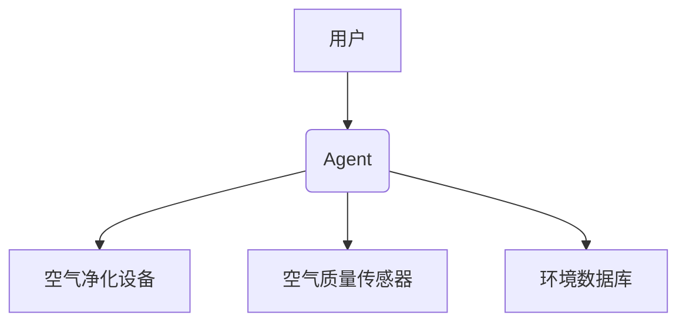
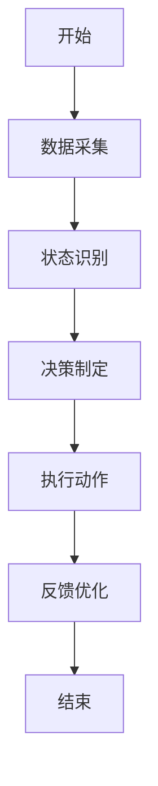
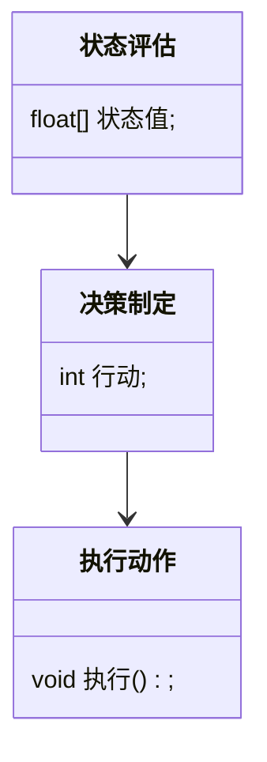
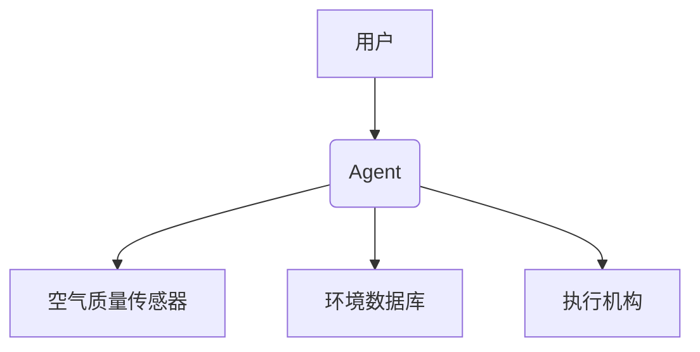
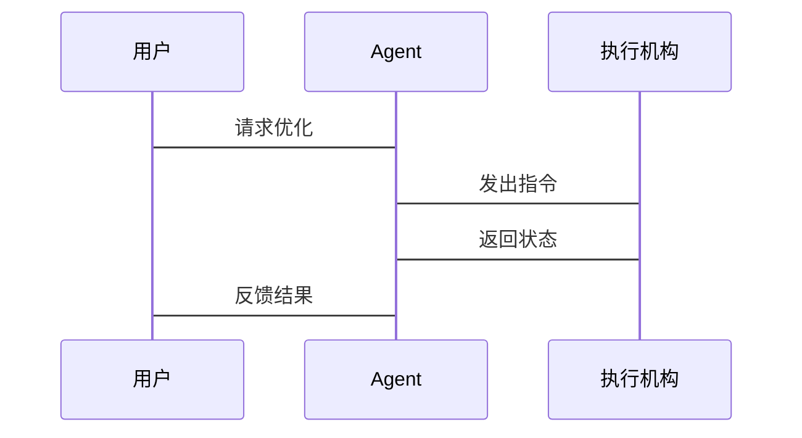

                 


# 智能窗台：AI Agent的室内空气净化

## 关键词：AI Agent、室内空气净化、智能窗台、空气质量优化、机器学习、智能算法

## 摘要：本文探讨了AI Agent在室内空气净化中的应用，通过智能化决策优化净化效果，结合数学建模和系统架构设计，详细分析了AI Agent的核心算法和系统实现。

---

# 目录

## 第一部分: 智能窗台与AI Agent的背景介绍

### 第1章: 智能窗台与AI Agent概述

#### 1.1 问题背景与问题描述
- 1.1.1 室内空气净化的重要性
- 1.1.2 现有空气净化技术的局限性
- 1.1.3 AI Agent在空气净化中的潜力

#### 1.2 AI Agent的核心概念与定义
- 1.2.1 AI Agent的基本定义
- 1.2.2 智能窗台的定义与特征
- 1.2.3 AI Agent与智能窗台的关系

#### 1.3 问题解决与边界定义
- 1.3.1 AI Agent如何优化室内空气净化
- 1.3.2 智能窗台的边界与外延
- 1.3.3 核心要素与组成结构

#### 1.4 本章小结

---

## 第二部分: AI Agent与室内空气净化的核心概念

### 第2章: AI Agent的核心原理与特征

#### 2.1 AI Agent的核心原理
- 2.1.1 机器学习与深度学习的基础
- 2.1.2 强化学习在AI Agent中的应用
- 2.1.3 自然语言处理与环境交互

#### 2.2 核心概念对比与特征分析
- 2.2.1 AI Agent与传统自动化系统的对比
- 2.2.2 智能窗台与传统空气净化设备的差异
- 2.2.3 功能特性与性能指标对比

#### 2.3 ER实体关系图


#### 2.4 本章小结

---

## 第三部分: AI Agent的算法原理与数学模型

### 第3章: AI Agent的核心算法

#### 3.1 算法原理与流程


#### 3.2 数学模型与公式
- 3.2.1 状态评估模型
  $$ Q(s) = r + \gamma \max_a Q(s',a) $$
- 3.2.2 决策优化模型
  $$ a = \arg\max_a Q(s,a) $$

#### 3.3 代码实现与解读
```python
def agent_algorithm(state):
    # 状态评估
    q_values = model.predict(state)
    # 决策选择
    action = np.argmax(q_values)
    return action
```

#### 3.4 本章小结

---

## 第四部分: 系统架构与设计

### 第4章: 系统架构设计

#### 4.1 问题场景介绍
- 智能窗台的使用场景
- 空气净化系统的需求分析

#### 4.2 系统功能设计
- 领域模型


#### 4.3 系统架构设计


#### 4.4 接口设计与交互
- 接口设计
- 交互流程


#### 4.5 本章小结

---

## 第五部分: 项目实战

### 第5章: 项目实战

#### 5.1 环境安装与配置
- 安装Python环境
- 安装机器学习库（如TensorFlow、Keras）

#### 5.2 系统核心实现
```python
import numpy as np
import tensorflow as tf

# 状态评估模型
class QNetwork:
    def __init__(self, state_space, action_space):
        self.model = tf.keras.Sequential([
            tf.keras.layers.Dense(64, activation='relu', input_dim=state_space),
            tf.keras.layers.Dense(action_space, activation='linear')
        ])
    
    def predict(self, state):
        return self.model.predict(state)
```

#### 5.3 案例分析与优化
- 具体案例分析
- 算法优化与调整

#### 5.4 本章小结

---

## 第六部分: 总结与展望

### 第6章: 总结与注意事项

#### 6.1 总结
- AI Agent在室内空气净化中的应用价值
- 系统设计与实现的关键点

#### 6.2 注意事项与建议
- 数据隐私与安全
- 传感器精度与实时性
- 算法优化与适应性

#### 6.3 未来展望
- 更智能的决策算法
- 更高效的硬件支持
- 更广泛的应用场景

#### 6.4 最佳实践 Tips
- 定期校准传感器
- 优化算法参数
- 保持系统更新

#### 6.5 本章小结

---

## 作者：AI天才研究院/AI Genius Institute & 禅与计算机程序设计艺术 /Zen And The Art of Computer Programming

