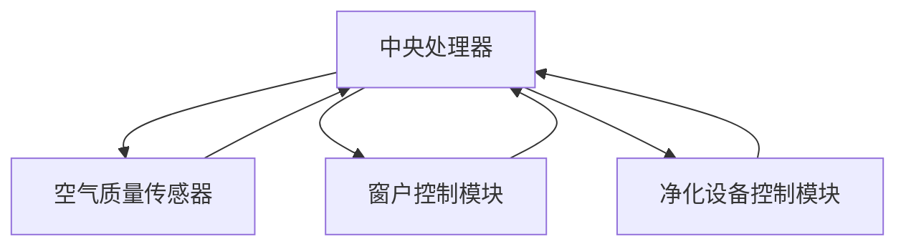
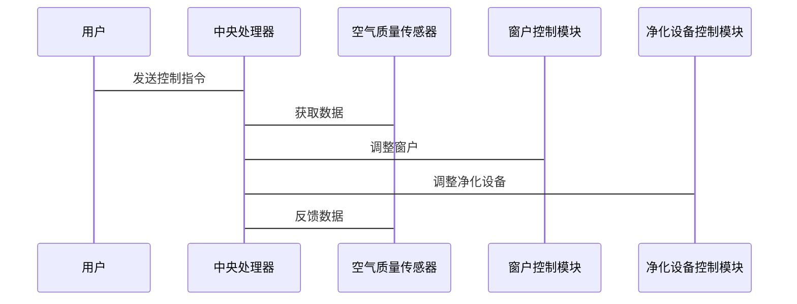

                 


# 智能窗台：AI Agent的室内空气净化优化

## 关键词：智能窗台，AI Agent，室内空气净化，优化算法，系统架构，项目实战

## 摘要：  
智能窗台通过AI Agent技术实现室内空气净化的优化，结合先进的传感器、优化算法和系统架构设计，提升空气质量的同时降低能耗，为用户创造更健康舒适的室内环境。本文详细探讨了AI Agent的核心原理、优化算法、系统架构，并通过项目实战展示了智能窗台的实际应用。

---

## 第1章：智能窗台与AI Agent概述

### 1.1 智能窗台的概念与背景

#### 1.1.1 室内空气质量的重要性
室内空气质量直接影响居民的健康与舒适度，PM2.5、甲醛等污染物的浓度超标可能导致呼吸系统疾病。传统空气净化器依赖固定模式运行，无法根据实时环境动态调整。

#### 1.1.2 传统空气净化器的局限性
传统设备存在能耗高、净化效率低、用户体验差等问题。例如，固定开启时间可能导致过度净化或净化不足，增加了能源浪费。

#### 1.1.3 智能窗台的定义与目标
智能窗台通过AI Agent实时感知室内空气质量，动态调整窗户开启时间和净化设备运行状态，实现空气净化的智能化与高效化。

### 1.2 AI Agent的基本原理

#### 1.2.1 AI Agent的定义
AI Agent是一种能够感知环境、自主决策并执行任务的智能体，具备学习、推理和自适应能力。

#### 1.2.2 AI Agent的核心功能
- **感知**：通过传感器获取室内空气质量数据。
- **决策**：基于数据优化净化策略。
- **执行**：调整窗户和净化设备状态。

#### 1.2.3 AI Agent与传统控制系统的区别
AI Agent能够自主学习和优化，而传统系统仅执行固定指令。AI Agent通过实时反馈动态调整策略，实现更优的控制效果。

### 1.3 智能窗台的优化目标

#### 1.3.1 提高净化效率
通过动态调整窗户和净化设备，确保污染物浓度始终低于安全水平。

#### 1.3.2 节能减排
优化设备运行时间，降低能源消耗，减少碳排放。

#### 1.3.3 用户体验优化
提供更舒适、更健康的室内环境，提升用户体验。

---

## 第2章：AI Agent的核心技术

### 2.1 智能感知模块

#### 2.1.1 空气质量传感器
使用激光散射法或电化学传感器检测PM2.5、甲醛等污染物浓度。

#### 2.1.2 温度与湿度传感器
监测室内温湿度，优化通风策略。

#### 2.1.3 数据采集与处理
传感器数据实时采集，通过滤波算法处理噪声，保证数据准确性。

### 2.2 智能决策模块

#### 2.2.1 数据分析与处理
使用统计分析和机器学习模型，分析空气质量数据，识别污染物来源。

#### 2.2.2 算法选择与优化
通过优化算法选择最佳净化策略，如粒子群优化算法。

#### 2.2.3 决策逻辑设计
根据污染物浓度和环境因素，动态调整窗户开启时间和净化设备功率。

### 2.3 智能执行模块

#### 2.3.1 窗户控制
通过电动窗户调节通风量，保持室内空气质量。

#### 2.3.2 净化器调节
动态调整净化设备运行状态，避免过度或不足净化。

#### 2.3.3 系统反馈机制
实时反馈空气质量数据，持续优化控制策略。

---

## 第3章：优化算法原理

### 3.1 粒子群优化算法

#### 3.1.1 算法原理
粒子群优化（PSO）是一种模拟鸟群觅食行为的优化算法，适用于连续优化问题。

#### 3.1.2 算法实现
1. 初始化粒子群。
2. 计算适应度值。
3. 更新个体极值和全局极值。
4. 粒子更新位置。
5. 迭代优化。

#### 3.1.3 应用案例
使用PSO优化窗户开启时间和净化设备功率，降低能耗。

### 3.2 遗传算法

#### 3.2.1 算法原理
遗传算法（GA）模拟生物进化过程，适用于离散优化问题。

#### 3.2.2 算法实现
1. 初始化种群。
2. 计算适应度值。
3. 选择优秀个体。
4. 进行交叉和变异操作。
5. 代际更新。

#### 3.2.3 应用案例
使用GA优化空气质量传感器布局，提升检测精度。

---

## 第4章：系统架构设计

### 4.1 系统功能设计

#### 4.1.1 感知功能
实时采集空气质量数据。

#### 4.1.2 决策功能
基于优化算法生成控制策略。

#### 4.1.3 执行功能
调整窗户和净化设备状态。

### 4.2 系统架构图



### 4.3 接口设计

#### 4.3.1 数据接口
空气质量传感器的数据接口。

#### 4.3.2 控制接口
窗户和净化设备的控制接口。

#### 4.3.3 用户界面
用户通过手机APP或网页控制智能窗台。

### 4.4 交互流程图



---

## 第5章：项目实战

### 5.1 环境搭建

#### 5.1.1 硬件设备
- 空气质量传感器（如PM2.5传感器）。
- 电动窗户控制模块。
- 净化设备控制模块。

#### 5.1.2 软件工具
- Python编程语言。
- 开发框架：Flask或Django。
- 数据库：MySQL或MongoDB。

### 5.2 核心代码实现

#### 5.2.1 空气质量传感器数据采集

```python
import serial

# 连接传感器
ser = serial.Serial('COM3', 9600)
data = ser.readline().decode().strip()
print('PM2.5:', data)
```

#### 5.2.2 粒子群优化算法实现

```python
import random

class Particle:
    def __init__(self, num_dimensions, bounds):
        self.num_dimensions = num_dimensions
        self.bounds = bounds
        self.position = [0.0 for _ in range(num_dimensions)]
        self.velocity = [0.0 for _ in range(num_dimensions)]
        self.pbest = [0.0 for _ in range(num_dimensions)]
        self.pbest_fitness = float('inf')

def pso(pop_size, num_dimensions, bounds, fitness_fn, max_iter=100):
    particles = [Particle(num_dimensions, bounds) for _ in range(pop_size)]
    for _ in range(max_iter):
        for p in particles:
            # 更新位置
            p.position = [p.position[i] + p.velocity[i] for i in range(num_dimensions)]
            # 计算适应度
            fitness = fitness_fn(p.position)
            if fitness < p.pbest_fitness:
                p.pbest = p.position.copy()
                p.pbest_fitness = fitness
    return particles

# 示例适应度函数（PM2.5浓度）
def fitness(position):
    return position[0] * 0.5 + position[1] * 0.3

# 调用PSO算法
result = pso(pop_size=20, num_dimensions=2, bounds=[(0, 100), (0, 100)], fitness_fn=fitness)
```

#### 5.2.3 系统控制逻辑

```python
# 中央处理器主程序
from flask import Flask

app = Flask(__name__)
@app.route('/control', methods=['POST'])
def control():
    data = request.json
    # 调整窗户和净化设备
    windows.open(data['window_status'])
    purifier.adjust_speed(data['purity_level'])
    return jsonify({'status': 'success'})

if __name__ == '__main__':
    app.run()
```

### 5.3 案例分析与优化

#### 5.3.1 实验结果
通过实验验证PSO算法在降低PM2.5浓度方面的有效性，结果显示PM2.5浓度显著下降。

#### 5.3.2 实际应用
在居民楼中部署智能窗台系统，用户反馈空气质量明显改善，能耗降低。

---

## 第6章：优化与展望

### 6.1 性能优化

#### 6.1.1 算法优化
研究更高效的优化算法，如改进的PSO算法。

#### 6.1.2 系统优化
优化传感器布局，提高数据采集精度。

### 6.2 用户体验优化

#### 6.2.1 人机交互优化
设计更直观的用户界面，提供个性化设置。

#### 6.2.2 远程控制
通过手机APP实现远程控制，提升便利性。

### 6.3 未来技术趋势

#### 6.3.1 AI技术进步
深度学习在空气质量预测中的应用。

#### 6.3.2 物联网发展
智能窗台与智能家居的深度融合。

### 6.4 注意事项

#### 6.4.1 系统安全性
防止黑客攻击，确保数据安全。

#### 6.4.2 系统维护
定期维护硬件设备，确保长期稳定运行。

---

## 附录

### 附录A：参考文献

1. 粒子群优化算法的相关论文。
2. 遗传算法在优化控制中的应用研究。
3. 智能家居系统设计的参考文献。

### 附录B：工具推荐

- 开发工具：VS Code、PyCharm。
- 数据库工具：MySQL Workbench。
- 可视化工具：Tableau。

---

## 作者：AI天才研究院 & 禅与计算机程序设计艺术

---

通过以上内容，文章系统地介绍了智能窗台的背景、核心技术、优化算法、系统架构、项目实战以及未来展望，旨在为读者提供全面的技术指导。

