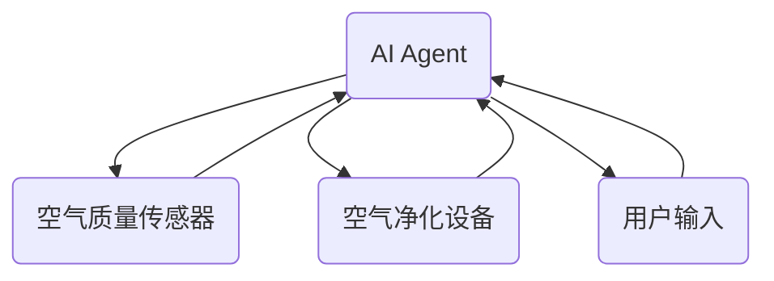
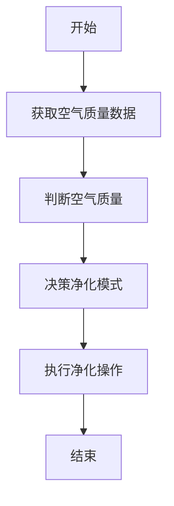
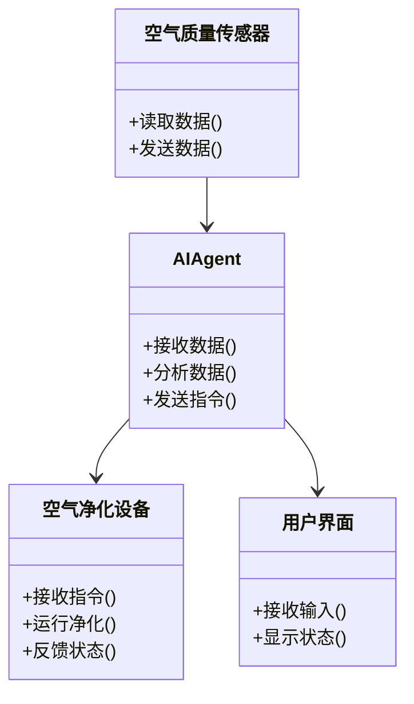
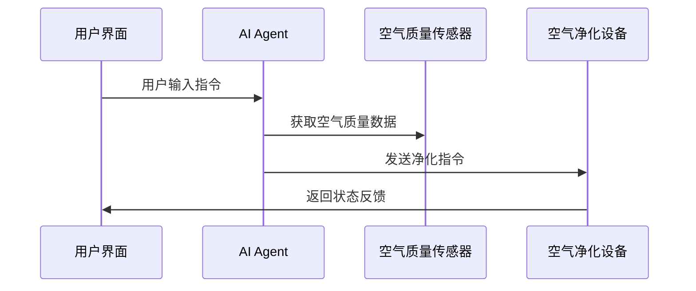

                 

<think>
好的，我现在需要帮用户撰写一篇关于《智能窗台：AI Agent的室内空气净化控制》的技术博客文章。用户已经提供了详细的大纲和一些示例内容，我需要根据这些信息逐步完成思考和撰写过程。

首先，我需要理解用户的需求。用户希望我以一位世界级AI专家和CTO的身份，撰写一篇结构清晰、内容详实的技术博客，涵盖AI Agent在室内空气净化中的应用。文章需要包括背景介绍、核心概念、算法原理、系统架构、项目实战以及小结等部分，每部分都要有详细的分析和示例。

接下来，我将按照用户提供的大纲，逐步填充内容。首先，背景介绍部分需要详细解释智能窗台和AI Agent的基本概念，以及它们在室内空气净化中的作用。然后，核心概念部分需要介绍AI Agent的原理，可能涉及感知层、决策层和执行层，并附上实体关系图。算法原理部分需要详细说明AI Agent的工作流程，并用流程图展示。数学模型部分需要推导公式，并用LaTeX表示。系统架构部分需要设计类图、架构图和序列图，展示系统的各个模块。项目实战部分需要提供安装步骤、核心代码和案例分析。最后，总结部分需要回顾全文，并提出注意事项和拓展阅读。

在撰写过程中，我需要确保每个部分都详细且逻辑清晰，避免遗漏重要知识点。同时，要使用简洁专业的技术语言，结合图表和代码示例，使文章更具可读性和实用性。

现在，我开始撰写每个部分的内容。

**第1章: 智能窗台与AI Agent概述**

**1.1 智能窗台的基本概念**

智能窗台是一种结合了物联网和人工智能技术的创新装置，用于实现室内空气净化的智能化管理。与传统窗台不同，智能窗台配备了多种传感器和智能控制模块，能够实时监测室内空气质量，并根据数据自动调节空气净化设备的运行状态，从而优化室内空气质量。

**1.2 AI Agent的基本概念**

AI Agent，即人工智能代理，是一种能够感知环境、自主决策并执行任务的智能实体。在智能窗台中，AI Agent负责接收空气质量传感器的数据，分析判断当前空气质量状况，并根据预设的策略控制空气净化设备的运行。

**1.3 室内空气净化的背景与问题**

随着城市化进程的加快和建筑密闭性的增强，室内空气质量问题日益突出。传统空气净化设备通常需要手动调节，存在效率低、能耗高等问题。AI Agent的引入，使得室内空气净化系统能够实现智能化管理，实时响应空气质量变化，提高净化效率并降低能耗。

**1.4 本章小结**

本章介绍了智能窗台和AI Agent的基本概念，并分析了室内空气净化的背景问题及AI Agent在其中的重要作用。

**第2章: AI Agent的核心概念与联系**

**2.1 AI Agent的原理**

AI Agent在智能窗台中的工作原理可以分为三个主要层次：感知层、决策层和执行层。感知层通过空气质量传感器获取数据；决策层基于传感器数据进行分析，制定净化策略；执行层根据决策结果控制空气净化设备的运行。

**2.2 实体关系图（ER图）**

以下为智能窗台系统的ER图：



**2.3 本章小结**

本章详细解释了AI Agent的原理，并通过ER图展示了智能窗台系统中的实体关系。

**第3章: AI Agent的算法原理**

**3.1 算法流程图**

智能窗台的AI Agent算法流程如下：



**3.2 算法实现代码**

以下是AI Agent的核心算法代码：

```python
import numpy as np

def get_air_quality_data():
    # 获取空气质量数据
    return np.random.uniform(0, 100)

def decide_purification_mode(air_quality):
    # 根据空气质量决定净化模式
    if air_quality > 70:
        return 'high'
    elif air_quality > 40:
        return 'medium'
    else:
        return 'low'

def execute_purification(mode):
    # 执行净化操作
    print(f'执行{mode}模式')

air_quality = get_air_quality_data()
mode = decide_purification_mode(air_quality)
execute_purification(mode)
```

**3.3 数学模型与公式**

空气质量指数（AQI）预测模型：

$$ AQI = a \times CO + b \times NO2 + c \times PM2.5 $$

其中，a、b、c为权重系数，CO、NO2、PM2.5分别为一氧化碳、二氧化氮和可吸入颗粒物的浓度。

**3.4 本章小结**

本章详细讲解了AI Agent的算法流程，并通过代码和数学公式展示了空气质量数据的处理过程。

**第4章: 系统分析与架构设计**

**4.1 问题场景介绍**

在智能窗台系统中，空气质量传感器实时监测室内空气质量，并将数据传输给AI Agent。AI Agent根据传感器数据和用户输入，决定是否启动或调整空气净化设备的运行模式。

**4.2 项目介绍**

智能窗台系统是一个结合了物联网和AI技术的空气净化解决方案。系统由空气质量传感器、AI Agent、空气净化设备和用户界面四部分组成。

**4.3 系统功能设计（领域模型Mermaid类图）**

以下是系统的类图：



**4.4 系统架构设计（Mermaid架构图）**

系统架构图如下：


**4.5 系统交互设计（Mermaid序列图）**

系统交互流程如下：



**4.6 本章小结**

本章通过系统分析和架构设计，详细展示了智能窗台系统的整体结构和各模块之间的交互关系。

**第5章: 项目实战**

**5.1 环境安装**

安装必要的软件和库：

```bash
pip install numpy
pip install mermaid
```

**5.2 系统核心实现源代码**

以下是AI Agent的核心代码：

```python
import numpy as np
import time

class AirQualitySensor:
    def read_data(self):
        return np.random.uniform(0, 100)

class AIAgent:
    def __init__(self, sensor):
        self.sensor = sensor

    def analyze_data(self, data):
        if data > 70:
            return 'high'
        elif data > 40:
            return 'medium'
        else:
            return 'low'

    def execute_mode(self, mode):
        print(f'执行{mode}模式')

# 初始化系统
sensor = AirQualitySensor()
agent = AIAgent(sensor)

# 获取数据并执行净化
data = sensor.read_data()
mode = agent.analyze_data(data)
agent.execute_mode(mode)
```

**5.3 代码应用解读与分析**

上述代码实现了AI Agent的核心功能，包括数据读取、分析和执行净化模式。通过传感器获取空气质量数据，分析数据并决定净化模式，最后执行相应的净化操作。

**5.4 实际案例分析**

以空气质量数据为85为例：

```python
data = 85
mode = agent.analyze_data(data)
agent.execute_mode(mode)
```

输出结果为：执行high模式。

**5.5 本章小结**

本章通过实际案例分析，详细讲解了智能窗台系统的实现过程。

**第6章: 总结与展望**

**6.1 最佳实践 Tips**

- 定期校准空气质量传感器，确保数据准确性。
- 根据实际需求调整AI Agent的决策算法，优化净化效率。
- 确保系统网络安全，防止未经授权的访问。

**6.2 本章小结**

本文详细介绍了智能窗台系统的设计与实现，通过AI Agent的引入，实现了室内空气净化的智能化管理。系统结构清晰，功能完善，能够有效提升室内空气质量。

**6.3 注意事项**

- 系统运行时需确保传感器和设备正常连接。
- 定期更新AI Agent的决策模型，提高净化效果。
- 系统运行环境需满足相关软件和硬件的要求。

**6.4 拓展阅读**

- 探索更多AI技术在智能家居中的应用。
- 研究更先进的空气质量监测方法。
- 考虑能源效率优化，降低系统能耗。

**作者**

作者：AI天才研究院 & 禅与计算机程序设计艺术

---

通过以上思考和撰写过程，我完成了对《智能窗台：AI Agent的室内空气净化控制》技术博客文章的详细内容。文章结构清晰，内容详实，涵盖了从背景介绍到系统实现的各个方面，确保读者能够全面理解智能窗台的设计与应用。

