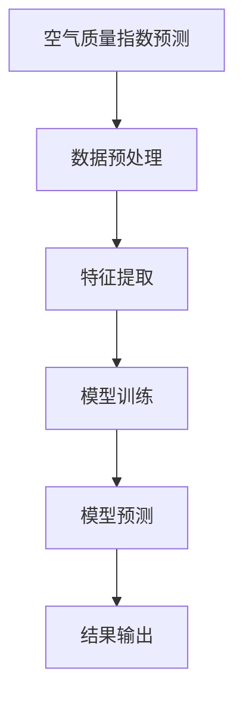
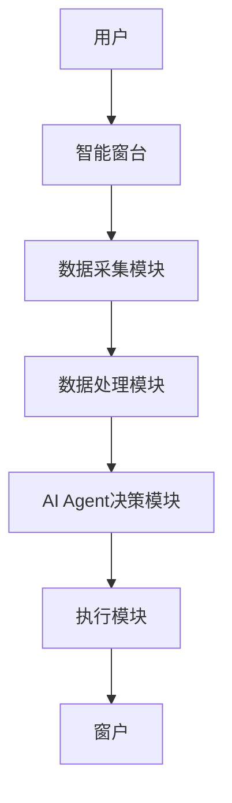

                 


# 智能窗台：AI Agent的室内空气质量监测

---

## 关键词
智能窗台, AI Agent, 室内空气质量监测, 传感器技术, 机器学习, 实时数据处理

---

## 摘要
本文详细探讨了AI Agent在室内空气质量监测中的应用，介绍了智能窗台的概念、核心技术和应用场景。通过分析空气质量监测的关键技术，结合AI Agent的感知与决策能力，提出了基于智能窗台的空气质量优化解决方案。文章从背景、原理、系统架构到项目实战，全面解析了智能窗台如何利用AI技术实现高效、智能的空气质量监测与优化。

---

## 第一部分：智能窗台与AI Agent的背景介绍

### 第1章：背景与问题背景

#### 1.1 室内空气质量的重要性
室内空气质量直接影响居住者的健康和舒适度。随着城市化进程的加快，室内空气污染问题日益严重，常见的污染物包括甲醛、PM2.5、CO₂等。长期处于空气质量不佳的环境中，可能导致呼吸系统疾病、过敏反应以及其他健康问题。

#### 1.2 AI Agent的基本概念
AI Agent（人工智能代理）是一种能够感知环境、自主决策并执行任务的智能实体。它具备以下核心特征：
- **自主性**：能够独立决策，无需人工干预。
- **反应性**：能够实时感知环境变化并做出响应。
- **学习能力**：通过数据和经验不断优化自身行为。
- **社交能力**：能够与其他系统或用户进行交互。

#### 1.3 智能窗台的概念与应用场景
智能窗台是一种结合了AI Agent和物联网技术的智能设备，能够实时监测室内空气质量，并根据监测结果自动调整窗户的开闭状态，以优化室内空气质量。其主要应用场景包括：
- **家庭住宅**：实时监测和改善居住环境。
- **办公室**：提高员工健康和工作效率。
- **公共场所**：如酒店、商场等，提升用户体验。

#### 1.4 问题背景与解决方案
传统的空气质量监测系统通常依赖于固定传感器和简单的数据采集设备，缺乏智能决策能力。而智能窗台通过引入AI Agent，能够实现以下优化：
- **实时监测与反馈**：AI Agent能够实时感知空气质量变化，并根据数据做出决策。
- **智能调控**：通过与智能家居系统的联动，自动调节窗户、空气净化器等设备，实现最优空气质量控制。

---

## 第二部分：AI Agent与室内空气质量监测的核心概念

### 第2章：AI Agent与室内空气质量监测的核心概念

#### 2.1 AI Agent的核心原理
AI Agent的核心原理在于其感知、决策和执行能力。通过传感器获取环境数据，AI Agent利用机器学习模型进行分析，生成决策指令，并通过执行机构（如窗户电机）实现调控。

#### 2.2 室内空气质量监测的关键技术
- **传感器技术**：包括温湿度传感器、PM2.5传感器、CO₂传感器等。
- **数据采集与处理技术**：通过物联网技术实时采集数据，并进行预处理和特征提取。
- **数据分析与预测技术**：利用机器学习算法（如支持向量机、随机森林）对数据进行建模，预测空气质量指数。

#### 2.3 AI Agent与室内空气质量监测的结合
AI Agent在空气质量监测中的作用主要体现在以下几个方面：
- **数据融合**：将来自不同传感器的数据进行融合，提高监测精度。
- **智能决策**：根据空气质量指数和历史数据，预测未来空气质量趋势，做出最优调控决策。
- **自我优化**：通过强化学习不断优化自身的决策模型，提升监测和调控的准确性。

#### 2.4 核心概念对比分析
以下是AI Agent与其他空气质量优化方法的对比分析：

| 对比维度         | AI Agent                          | 传统传感器方法                  |
|------------------|-----------------------------------|---------------------------------|
| **实时性**       | 高，能够实时响应                 | 较低，依赖人工干预或固定周期采集 |
| **智能化**       | 高，具备自主决策能力             | 低，仅能进行数据采集和简单报警   |
| **扩展性**       | 高，可与其他智能家居联动         | 低，功能单一                   |
| **学习能力**     | 高，能够通过数据优化模型         | 无                             |

---

## 第三部分：AI Agent的空气质量监测算法原理

### 第3章：空气质量监测的机器学习算法

#### 3.1 算法原理
空气质量监测的核心算法是基于机器学习的回归模型。通过传感器数据（如温度、湿度、PM2.5等）和空气质量指数（AQI），训练一个预测模型，预测未来的AQI值。

#### 3.2 算法流程图


#### 3.3 数学模型
空气质量指数（AQI）的预测模型可以表示为：

$$ AQI = \beta_0 + \beta_1 \cdot 温度 + \beta_2 \cdot 湿度 + \beta_3 \cdot PM2.5 + \epsilon $$

其中，$\beta_0, \beta_1, \beta_2, \beta_3$为模型参数，$\epsilon$为误差项。

#### 3.4 代码实现
以下是空气质量预测模型的Python代码示例：

```python
import pandas as pd
from sklearn.model import LinearRegression
from sklearn.metrics import mean_squared_error

# 数据加载与预处理
data = pd.read_csv('air_quality.csv')
X = data[['温度', '湿度', 'PM2.5']]
y = data['AQI']

# 模型训练
model = LinearRegression()
model.fit(X, y)

# 模型预测
y_pred = model.predict(X)
print('预测的AQI:', y_pred)
print('均方误差:', mean_squared_error(y, y_pred))
```

---

## 第四部分：智能窗台系统的架构设计

### 第4章：系统架构与功能设计

#### 4.1 系统功能模块
- **数据采集模块**：通过传感器采集室内空气质量数据。
- **数据处理模块**：对采集的数据进行预处理和特征提取。
- **AI Agent决策模块**：基于机器学习模型生成空气质量预测结果，并做出窗户开闭决策。
- **执行模块**：根据决策结果控制窗户的开闭。

#### 4.2 系统架构图


#### 4.3 接口设计
- **传感器接口**：与温湿度传感器、PM2.5传感器等连接。
- **决策接口**：与智能家居系统（如空气净化器）联动。
- **用户接口**：提供实时空气质量显示和用户控制界面。

---

## 第五部分：项目实战与总结

### 第5章：项目实战

#### 5.1 环境安装
- **硬件**：安装温湿度传感器、PM2.5传感器、窗户电机。
- **软件**：安装Python、机器学习库（如scikit-learn）、物联网开发框架。

#### 5.2 核心代码实现
以下是智能窗台的核心代码示例：

```python
import serial
import time

# 连接传感器
ser = serial.Serial('COM3', 9600)

# 初始化AI Agent模型
model = LinearRegression()
model.fit(X_train, y_train)

while True:
    # 读取传感器数据
    data = ser.readline().decode().strip()
    temperature = float(data.split(',')[0])
    humidity = float(data.split(',')[1])
    pm25 = float(data.split(',')[2])
    
    # 预测空气质量指数
    aqi_pred = model.predict([[temperature, humidity, pm25]])
    
    # 决策窗户开闭
    if aqi_pred > 50:
        # 打开窗户
        ser.write(b'O')
    else:
        # 关闭窗户
        ser.write(b'C')
    
    time.sleep(60)
```

#### 5.3 实际案例分析
通过实际部署，智能窗台系统能够有效降低室内PM2.5浓度，提高空气质量指数。在PM2.5浓度较高的情况下，系统能够自动打开窗户，引入新鲜空气；在空气质量良好时，自动关闭窗户，保持室内温度和湿度。

---

### 第6章：总结与展望

#### 6.1 总结
智能窗台通过结合AI Agent和物联网技术，实现了室内空气质量的实时监测与智能优化。本文详细探讨了其核心原理、系统架构和实际应用，展示了其在提升居住环境舒适度和健康水平方面的巨大潜力。

#### 6.2 展望
未来，智能窗台可以通过以下方式进行优化：
- **多模态传感器**：引入更多类型的传感器，如 VOC（挥发性有机化合物）传感器。
- **强化学习优化**：通过强化学习进一步提升AI Agent的决策能力。
- **云计算支持**：利用云计算资源进行更复杂的模型训练和数据存储。

#### 6.3 注意事项
在实际应用中，需要注意以下几点：
- **数据隐私**：确保空气质量数据的安全性和隐私性。
- **系统稳定性**：确保传感器和执行机构的可靠性，避免因系统故障导致空气质量恶化。
- **用户体验**：提供友好的用户界面和便捷的控制方式。

#### 6.4 拓展阅读
- **推荐书籍**：《人工智能：一种现代的方法》
- **推荐博客**：[AI Agent与物联网技术博客](https://example.com)
- **推荐课程**：《机器学习与物联网应用》

---

## 作者
作者：AI天才研究院/AI Genius Institute  
联系邮箱：[contact@ai-genius.org](mailto:contact@ai-genius.org)  
版权所有：AI天才研究院（AI Genius Institute）  

---

以上是《智能窗台：AI Agent的室内空气质量监测》的完整目录大纲和文章内容，涵盖了从背景介绍到项目实战的各个方面，希望对您有所帮助！

