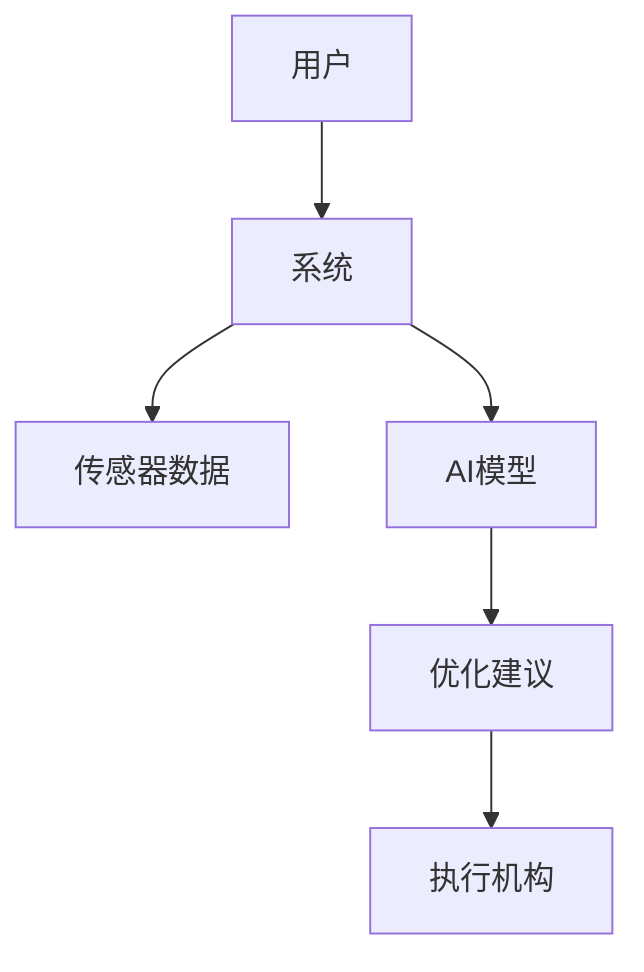
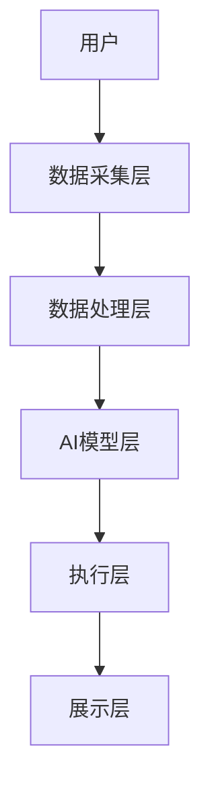
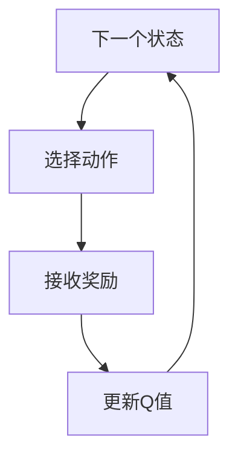
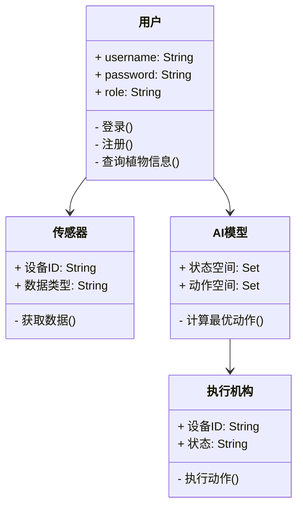
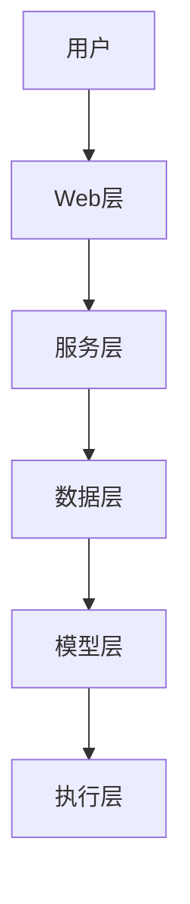

                 


# 智能窗台：AI Agent的室内绿化优化系统

> 关键词：AI Agent，室内绿化，优化系统，智能窗台，强化学习，数学模型

> 摘要：本文详细探讨了AI Agent在室内绿化优化系统中的应用。通过分析室内绿化管理的痛点，提出了一种基于强化学习的AI Agent解决方案，结合系统架构设计和实际案例，展示了如何利用AI技术实现室内绿化的智能化管理。

---

## 第1章 问题背景与描述

### 1.1 问题背景

随着城市化进程的加快，人们对居住环境的要求越来越高，室内绿化成为提升生活品质的重要手段。然而，室内绿植的养护却存在诸多挑战：

- **养护复杂性**：不同植物需要不同的光照、温度和湿度条件，传统的人工管理效率低下。
- **资源浪费**：由于缺乏实时监测和智能调节，常常导致水肥浪费和植物生长不佳。
- **技术滞后**：现有的自动化系统通常基于固定的预设规则，难以应对复杂的环境变化。

AI技术的快速发展为解决这些问题提供了新的可能。AI Agent（智能体）能够通过感知环境、学习优化策略，实现对室内绿化的智能化管理。

### 1.2 问题描述

本文研究的问题是：如何利用AI Agent优化室内绿化的管理流程，使其更加高效、精准和环保。具体包括以下几个方面：

- **数据采集与处理**：如何实时采集室内光照、温度、湿度等环境数据。
- **模型构建与训练**：如何设计AI模型，使其能够根据环境数据和植物需求，制定最优的管理策略。
- **系统部署与应用**：如何将AI Agent部署到实际场景中，实现对绿植的智能养护。

### 1.3 解决思路

AI Agent的核心在于其感知与决策能力。通过部署传感器网络，AI Agent可以实时获取室内环境数据，结合植物的需求模型，制定最优的浇水、施肥和光照调节策略。这种智能化的管理方式不仅提高了绿植的存活率，还显著降低了资源浪费。

---

## 第2章 核心概念与联系

### 2.1 AI Agent的核心原理

AI Agent是一种能够感知环境、自主决策的智能系统。其核心功能包括：

- **感知**：通过传感器获取环境数据。
- **决策**：基于感知数据和预设目标，选择最优动作。
- **学习**：通过与环境的交互，不断优化自身的决策策略。

在室内绿化优化系统中，AI Agent的主要任务是根据植物的生长状态和环境条件，动态调整养护策略。

### 2.2 实体关系与系统架构

以下是系统的实体关系图：



系统架构图如下：



---

## 第3章 算法原理与数学模型

### 3.1 强化学习算法

在本系统中，我们采用Q-learning算法作为AI Agent的核心算法。Q-learning是一种基于值函数的强化学习方法，其目标是找到最优的策略（Q值函数）。

#### 3.1.1 算法流程

以下是Q-learning算法的流程图：



#### 3.1.2 数学模型

Q-learning的更新公式如下：

$$ Q(s, a) = Q(s, a) + \alpha \left[ r + \gamma \max_{a'} Q(s', a') - Q(s, a) \right] $$

其中：
- \( \alpha \) 是学习率，\( \gamma \) 是折扣因子。
- \( s \) 是当前状态，\( a \) 是当前动作，\( s' \) 是下一个状态。

---

## 第4章 系统分析与架构设计

### 4.1 系统功能设计

以下是系统的领域模型类图：



### 4.2 系统架构设计

以下是系统的架构图：



---

## 第5章 项目实战

### 5.1 环境安装

以下是项目所需的环境配置：

```bash
pip install numpy
pip install gym
pip install matplotlib
```

### 5.2 核心代码实现

以下是AI Agent的核心代码：

```python
import numpy as np

class AI-Agent:
    def __init__(self, state_space, action_space):
        self.state_space = state_space
        self.action_space = action_space
        self.q_table = np.zeros((len(state_space), len(action_space)))

    def感知(self, 状态):
        return self.q_table[状态, :]

    def 决策(self, 状态):
        q_values = self.感知(状态)
        return np.argmax(q_values)

    def 学习(self, 状态, 动作, 奖励, 下一状态):
        self.q_table[状态, 动作] += 0.1 * (奖励 + 0.9 * np.max(self.q_table[下一状态, :]) - self.q_table[状态, 动作])

    def 执行(self, 状态):
        动作 = self.决策(状态)
        return 动作
```

### 5.3 实际案例分析

假设我们有一个包含三种植物（A、B、C）的室内环境，每种植物需要不同的光照和温度条件。AI Agent通过传感器获取环境数据，结合植物需求模型，制定最优的养护策略。

---

## 第6章 最佳实践

### 6.1 小结

本文详细介绍了AI Agent在室内绿化优化系统中的应用，从背景分析到算法实现，再到系统设计和项目实战，为读者提供了全面的技术指导。

### 6.2 注意事项

- 在部署系统时，需确保传感器和执行机构的稳定性。
- 定期更新AI模型，以适应环境和植物需求的变化。
- 注意数据隐私保护，避免用户信息泄露。

### 6.3 拓展阅读

- 推荐阅读《强化学习入门》和《深度学习实战》。

---

## 作者

作者：AI天才研究院/AI Genius Institute & 禅与计算机程序设计艺术/Zen And The Art of Computer Programming

---

本文通过详细的技术分析和实践指导，展示了如何利用AI技术优化室内绿化管理。希望本文能为读者提供有价值的参考和启发。

