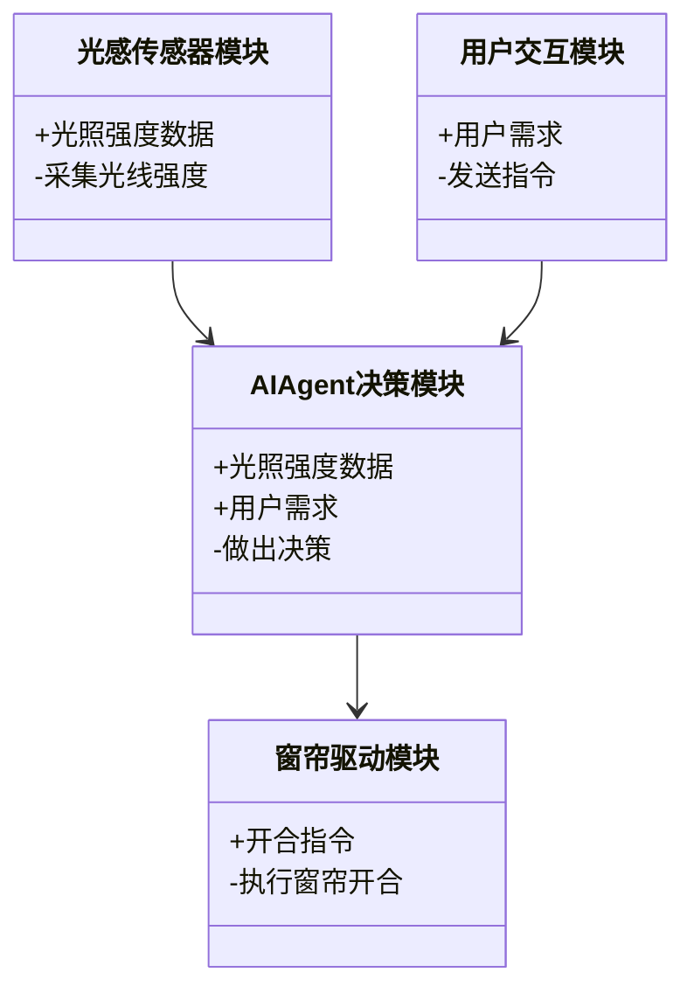
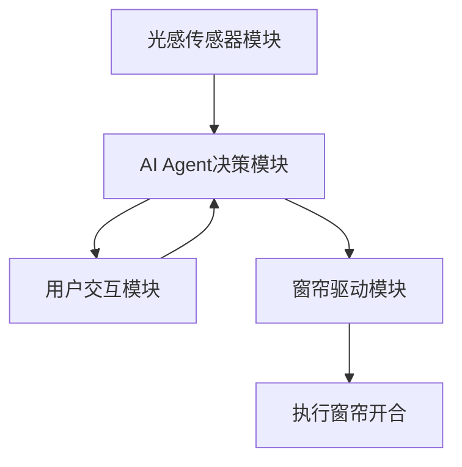

                 


# 智能窗帘：AI Agent的日光优化调节

> 关键词：智能窗帘、AI Agent、日光优化、智能家居、动态调节

> 摘要：本文将探讨智能窗帘系统中AI Agent的日光优化调节技术。通过分析智能窗帘的发展背景、AI Agent的核心原理、算法实现、系统架构设计以及实际项目案例，全面解析如何利用AI技术实现日光的智能优化调节。文章结合理论与实践，提供详细的代码实现和系统架构设计，帮助读者深入理解智能窗帘AI Agent的日光优化调节技术。

---

# 第一部分: 智能窗帘：AI Agent的日光优化调节概述

# 第1章: 智能窗帘的发展背景与日光优化的重要性

## 1.1 智能窗帘的发展背景

### 1.1.1 智能家居的发展趋势

智能家居作为现代科技的重要组成部分，正逐渐改变人们的生活方式。随着物联网技术的普及，智能家居设备的数量和种类也在不断增加。智能窗帘作为智能家居的重要组成部分，其智能化程度直接影响用户体验。

### 1.1.2 日光优化调节在智能家居中的重要性

日光是影响室内环境舒适度的重要因素。通过智能窗帘的日光优化调节，可以有效调节室内光线，提升居住舒适度。尤其是在不同时间段，根据光照强度、人体需求和环境条件，动态调整窗帘的开合程度，能够显著改善室内环境。

### 1.1.3 AI Agent在智能窗帘中的应用潜力

AI Agent（智能代理）是一种能够感知环境、自主决策并执行任务的智能体。在智能窗帘系统中，AI Agent可以通过感知光照强度、用户需求和环境条件，自主决策窗帘的开合程度，实现日光的智能优化调节。

## 1.2 日光优化调节的核心概念

### 1.2.1 日光优化调节的定义

日光优化调节是指通过智能设备和AI算法，根据光照强度、时间、天气等因素，动态调节窗帘的开合程度，以达到优化室内光照环境的目的。

### 1.2.2 日光优化调节的边界与外延

日光优化调节的核心是智能窗帘的自动化控制，但其外延还包括光照数据采集、用户需求分析、环境感知等多个方面。通过AI算法的优化，日光优化调节可以实现更高的智能化和个性化。

### 1.2.3 智能窗帘系统的核心要素组成

智能窗帘系统的核心要素包括：
1. 光感传感器：用于采集室内光照强度。
2. 窗帘驱动装置：用于控制窗帘的开合。
3. AI Agent：用于分析数据并做出决策。
4. 用户交互界面：用于用户与系统之间的交互。

## 1.3 AI Agent在智能窗帘中的角色

### 1.3.1 AI Agent的基本概念

AI Agent是一种能够感知环境、自主决策并执行任务的智能体。在智能窗帘系统中，AI Agent通过感知光照强度、时间、天气等信息，分析用户需求和环境条件，自主决策窗帘的开合程度。

### 1.3.2 AI Agent在智能窗帘中的功能定位

AI Agent在智能窗帘系统中的主要功能包括：
1. 光照数据采集与分析。
2. 用户需求分析与预测。
3. 窗帘开合决策与控制。

### 1.3.3 AI Agent与传统窗帘控制的区别

传统窗帘控制通常基于固定的预设规则，而AI Agent可以通过学习和优化，实现动态的、个性化的日光调节。AI Agent能够根据实时环境和用户需求，自主调整窗帘的开合程度，从而实现更智能的控制。

## 1.4 本章小结

本章主要介绍了智能窗帘的发展背景、日光优化调节的核心概念以及AI Agent在智能窗帘中的角色。通过对比分析，展示了AI Agent在智能窗帘系统中的独特优势和重要性。

---

# 第二部分: AI Agent的日光优化调节原理与算法

# 第2章: AI Agent的核心原理与算法基础

## 2.1 AI Agent的基本原理

### 2.1.1 感知层：环境数据的采集与处理

AI Agent通过光感传感器采集室内光照强度数据，同时结合时间、天气等外部数据，构建完整的环境感知模型。

### 2.1.2 决策层：日光优化的策略制定

AI Agent基于感知数据和用户需求，制定日光优化的策略。例如，在光照过强时，AI Agent会决策关闭窗帘以减少光线进入；在光照不足时，AI Agent会决策打开窗帘以增加光线。

### 2.1.3 执行层：窗帘控制的实现

AI Agent通过驱动装置控制窗帘的开合。例如，当AI Agent决策需要打开窗帘时，驱动装置会执行相应的操作。

## 2.2 日光优化调节的算法原理

### 2.2.1 基于光照强度的动态调节算法

动态调节算法根据实时光照强度，动态调整窗帘的开合程度。例如，当光照强度超过阈值时，AI Agent会调整窗帘的开合程度以降低光照强度。

### 2.2.2 基于时间序列的预测模型

时间序列预测模型通过分析历史光照数据，预测未来的光照强度。例如，利用LSTM（长短期记忆网络）模型，AI Agent可以预测未来24小时内的光照强度变化。

### 2.2.3 基于用户习惯的自适应优化算法

自适应优化算法通过学习用户的使用习惯，优化日光调节策略。例如，AI Agent会根据用户的作息时间和光照偏好，调整窗帘的开合时间。

## 2.3 算法实现的数学模型与公式

### 2.3.1 光照强度预测模型

光照强度预测模型可以表示为：
$$ I(t) = a \cdot t + b $$
其中，\( I(t) \) 表示时间 \( t \) 的光照强度，\( a \) 和 \( b \) 是模型参数。

### 2.3.2 用户习惯分析模型

用户习惯分析模型可以表示为：
$$ P(u, t) = \sum_{i=1}^{n} w_i \cdot f_i(u, t) $$
其中，\( P(u, t) \) 表示用户 \( u \) 在时间 \( t \) 的习惯概率，\( w_i \) 是特征 \( f_i \) 的权重。

## 2.4 本章小结

本章详细介绍了AI Agent的核心原理和日光优化调节的算法基础，包括感知层、决策层和执行层的功能划分，以及动态调节算法、时间序列预测模型和自适应优化算法的实现原理。

---

# 第三部分: 系统分析与架构设计

# 第3章: 智能窗帘系统的系统分析与架构设计

## 3.1 系统分析

### 3.1.1 问题场景介绍

智能窗帘系统需要解决的主要问题是：如何根据光照强度、用户需求和环境条件，动态调节窗帘的开合程度，实现日光的智能优化调节。

### 3.1.2 系统功能需求分析

系统功能需求包括：
1. 光感传感器数据采集。
2. 用户需求分析与预测。
3. 窗帘开合决策与控制。
4. 用户交互界面设计。

### 3.1.3 系统性能指标

系统性能指标包括：
1. 响应时间：窗帘开合的响应时间不超过1秒。
2. 精确度：光照强度预测的精确度达到95%以上。
3. 可靠性：系统运行稳定性，误报率不超过1%。

## 3.2 系统架构设计

### 3.2.1 系统架构的模块划分

系统架构主要包括以下几个模块：
1. 光感传感器模块：用于采集室内光照强度。
2. 用户交互模块：用于用户与系统之间的交互。
3. AI Agent决策模块：用于分析数据并做出决策。
4. 窗帘驱动模块：用于控制窗帘的开合。

### 3.2.2 系统架构的类图



### 3.2.3 系统架构的流程图



## 3.3 本章小结

本章详细分析了智能窗帘系统的功能需求和系统架构，通过类图和流程图展示了系统的模块划分和交互流程。

---

# 第四部分: 项目实战

# 第4章: 智能窗帘项目的实战与分析

## 4.1 项目环境搭建

### 4.1.1 环境要求

项目需要以下环境：
1. Python编程语言。
2. AI框架（如TensorFlow或PyTorch）。
3. 物联网设备（如光感传感器和窗帘驱动模块）。

### 4.1.2 环境安装与配置

安装Python和AI框架：
```bash
pip install numpy tensorflow
```

安装物联网设备驱动：
```bash
sudo apt-get install python-serial
```

## 4.2 系统核心实现

### 4.2.1 光感传感器数据采集

```python
import serial

# 初始化串口通信
ser = serial.Serial('/dev/ttyUSB0', 9600)

def get_light_intensity():
    # 发送读取光照强度的指令
    ser.write(b'read_light\r\n')
    # 读取反馈数据
    data = ser.readline().decode().strip()
    return float(data)
```

### 4.2.2 AI Agent决策模块实现

```python
import numpy as np
from tensorflow.keras.models import load_model

# 加载预训练模型
model = load_model('light_control_model.h5')

def decide_blind_position(light_intensity):
    # 预测窗帘开合位置
    prediction = model.predict(np.array([light_intensity]))
    return prediction[0][0]
```

### 4.2.3 窗帘驱动模块实现

```python
import RPi.GPIO as GPIO

# 窗帘驱动模块控制代码
def control_blinds(position):
    if position > 0.5:
        GPIO.output(17, GPIO.HIGH)
        time.sleep(2)
        GPIO.output(17, GPIO.LOW)
    else:
        GPIO.output(18, GPIO.HIGH)
        time.sleep(2)
        GPIO.output(18, GPIO.LOW)
```

## 4.3 实际案例分析与解读

### 4.3.1 案例场景描述

假设当前光照强度为120 lux，用户需求为“早晨模式”，AI Agent决策模块会根据光照强度和用户需求，预测窗帘的开合位置。

### 4.3.2 算法实现与分析

AI Agent决策模块会将光照强度和用户需求输入模型，预测窗帘的开合位置。例如，当光照强度较高时，AI Agent会决策关闭窗帘以减少光线进入。

## 4.4 本章小结

本章通过实际项目案例，详细讲解了智能窗帘系统的环境搭建、核心实现和算法分析，帮助读者更好地理解日光优化调节的实现过程。

---

# 第五部分: 最佳实践与总结

# 第5章: 最佳实践与系统优化

## 5.1 系统优化建议

### 5.1.1 数据采集优化

建议使用更高精度的光感传感器，并增加数据采集频率，以提高光照强度预测的精确度。

### 5.1.2 算法优化建议

建议采用更复杂的AI算法（如深度学习模型），进一步提高日光优化调节的精确度和智能化水平。

### 5.1.3 系统稳定性优化

建议增加系统容错机制，确保在设备故障时能够快速响应并恢复系统正常运行。

## 5.2 小结与展望

通过本文的详细讲解，读者可以全面了解智能窗帘AI Agent的日光优化调节技术。未来，随着AI技术的不断发展，智能窗帘系统将更加智能化和个性化，为用户带来更舒适的使用体验。

## 5.3 注意事项

在实际应用中，需要注意以下几点：
1. 确保系统的数据安全性，防止数据泄露。
2. 定期维护设备，确保系统的稳定运行。
3. 提供良好的用户交互界面，提升用户体验。

## 5.4 拓展阅读

建议读者进一步阅读以下内容：
1. 深度学习在智能家居中的应用。
2. AI Agent在智能设备中的优化算法研究。
3. 智能窗帘系统的安全性设计。

---

# 作者：AI天才研究院/AI Genius Institute & 禅与计算机程序设计艺术 /Zen And The Art of Computer Programming

---

**注**：由于篇幅限制，以上仅为文章的纲要和部分内容，实际完整的文章将包含更多详细内容和具体代码实现。

