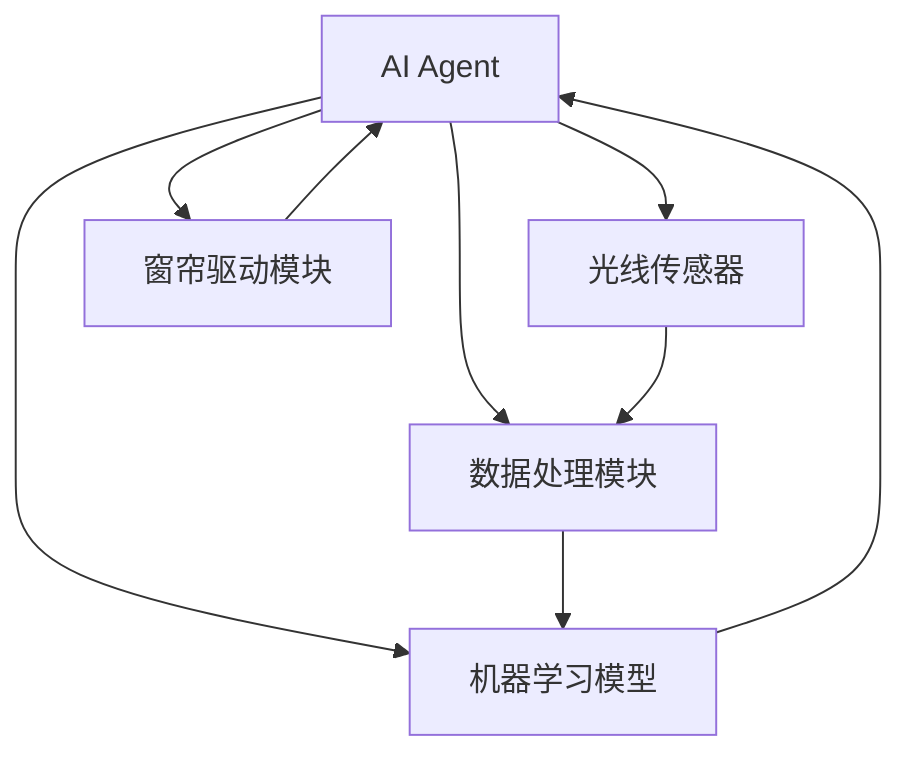
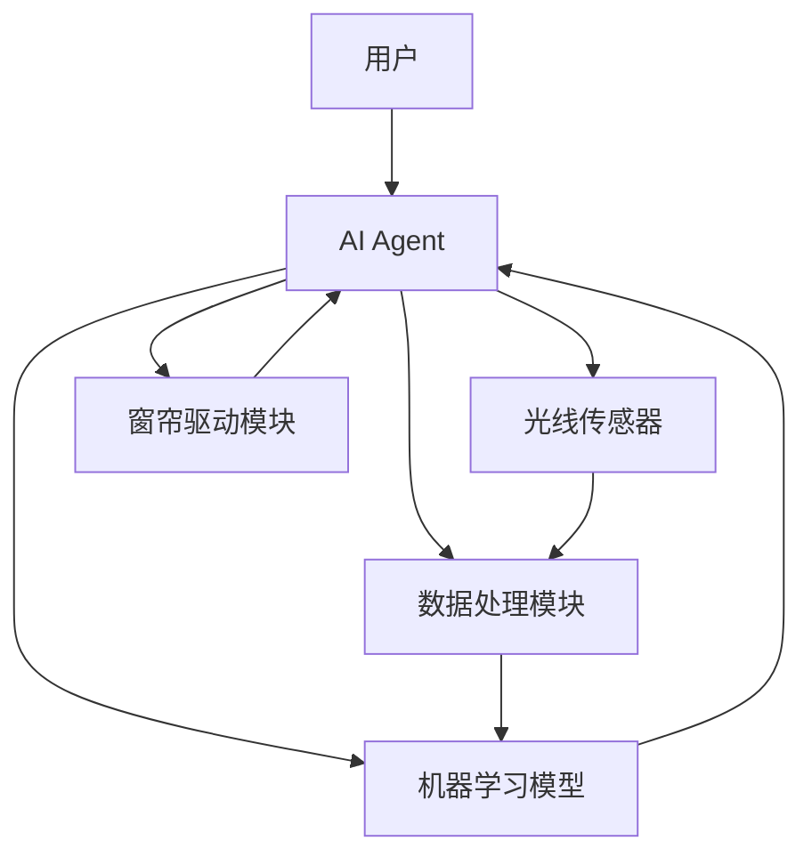

                 


# 智能窗帘：AI Agent的日光利用优化系统

## 关键词：智能窗帘，AI Agent，日光优化，物联网，机器学习，智能家居

## 摘要：  
本文深入探讨了智能窗帘系统中AI Agent的日光利用优化技术。通过结合物联网和人工智能技术，AI Agent能够实时感知环境光线变化，并通过优化算法和系统架构设计，实现对窗帘的智能控制，从而最大化日光利用效率，提升用户舒适度并降低能源消耗。本文从系统背景、核心原理、算法实现、系统架构、项目实战等多方面展开，详细讲解了AI Agent在智能窗帘中的应用，为读者提供了从理论到实践的全面指导。

---

# 第1章 智能窗帘的背景与目标

## 1.1 问题背景  
### 1.1.1 传统窗帘的局限性  
传统窗帘主要依赖手动操作，无法根据光照强度和用户需求自动调整，存在以下问题：  
- 无法实时感知光照变化，导致能源浪费。  
- 用户舒适度难以保证，尤其是在光照强度变化较大的场景中。  
- 维护成本高，需要定期清洁和维修。  

### 1.1.2 智能家居的兴起  
随着物联网技术的快速发展，智能家居设备逐渐普及，用户对智能窗帘的需求也在不断增加。智能窗帘可以通过与智能家居系统的集成，实现远程控制和自动化管理。  

### 1.1.3 AI技术在智能家居中的应用  
人工智能技术的快速发展为智能家居设备的智能化提供了技术支持。通过AI Agent，智能窗帘能够实现更复杂的决策和控制功能，例如动态调整窗帘开合程度以优化日光利用。

## 1.2 日光利用优化的必要性  
### 1.2.1 环境效益  
合理利用日光可以减少对人工照明的依赖，降低能源消耗，从而减少碳排放，保护环境。  

### 1.2.2 经济效益  
通过最大化日光利用，可以降低电力消耗，节省能源成本。  

### 1.2.3 用户舒适度的提升  
智能窗帘可以根据用户需求和光照条件，动态调整开合程度，营造更舒适的室内环境。  

## 1.3 AI Agent在智能窗帘中的作用  
### 1.3.1 AI Agent的基本概念  
AI Agent是一种能够感知环境、做出决策并执行动作的智能实体。在智能窗帘系统中，AI Agent负责采集光照数据、分析用户需求并控制窗帘的开合。  

### 1.3.2 AI Agent的核心功能  
- 光线感知与数据采集。  
- 用户需求分析与预测。  
- 窗帘开合策略优化与执行。  

### 1.3.3 AI Agent的优势与挑战  
优势：  
- 高度智能化，能够实时感知和响应环境变化。  
- 可以通过机器学习不断优化日光利用策略。  

挑战：  
- 如何保证AI Agent的决策准确性。  
- 如何处理复杂的光照变化和用户需求。  

## 1.4 本书的目标与结构  
### 1.4.1 本书的核心目标  
通过系统化的理论分析和实践指导，帮助读者掌握AI Agent在智能窗帘中的设计与实现方法。  

### 1.4.2 本书的章节安排  
- 第2章：AI Agent的核心原理与系统架构。  
- 第3章：日光利用优化算法的实现。  
- 第4章：系统架构设计与功能实现。  
- 第5章：项目实战与代码实现。  
- 第6章：系统优化与拓展应用。  

### 1.4.3 本书的适用读者  
本书适用于对智能家居、人工智能和物联网技术感兴趣的读者，尤其是从事智能窗帘系统设计与开发的工程师和技术爱好者。

---

# 第2章 AI Agent的核心原理与系统架构

## 2.1 AI Agent的基本原理  
### 2.1.1 AI Agent的感知机制  
AI Agent通过光线传感器实时采集光照强度、色温和方向等信息。  

### 2.1.2 AI Agent的决策机制  
基于机器学习模型，AI Agent可以根据光照数据和用户需求，制定窗帘的开合策略。  

### 2.1.3 AI Agent的执行机制  
通过与窗帘驱动系统的接口通信，AI Agent可以精确控制窗帘的开合程度。  

## 2.2 AI Agent的系统架构  
### 2.2.1 系统组件设计  
- 光线传感器模块：负责采集光照数据。  
- 数据处理模块：对光照数据进行预处理和特征提取。  
- 机器学习模型：基于特征数据进行日光利用优化决策。  
- 窗帘驱动模块：根据决策结果控制窗帘的开合。  

### 2.2.2 系统架构图  


---

# 第3章 日光利用优化算法的实现

## 3.1 算法原理  
### 3.1.1 算法目标  
最大化日光利用效率，同时满足用户舒适度需求。  

### 3.1.2 算法模型  
基于回归分析的日光强度预测模型，以及基于强化学习的窗帘开合策略优化模型。  

### 3.1.3 算法实现步骤  
1. 数据采集与预处理。  
2. 特征提取与模型训练。  
3. 窗帘开合策略生成与执行。  

## 3.2 机器学习模型的实现  
### 3.2.1 回归分析模型  
$$ y = \beta_0 + \beta_1x + \epsilon $$  
其中，$y$ 是预测的日光强度，$x$ 是时间变量，$\beta_0$ 和 $\beta_1$ 是回归系数。  

### 3.2.2 强化学习模型  
基于Q-learning算法，通过状态-动作-奖励机制优化窗帘开合策略。  

---

## 3.3 算法实现的代码示例  
```python
import numpy as np
from sklearn.linear_model import LinearRegression

# 数据预处理
X = np.array([i for i in range(100)]).reshape(-1, 1)
y = np.array([2*i + 1 for i in range(100)])

# 模型训练
model = LinearRegression()
model.fit(X, y)

# 模型预测
predicted_y = model.predict(X)
```

---

# 第4章 系统架构设计与功能实现

## 4.1 系统功能设计  
### 4.1.1 功能模块划分  
- 光线传感器模块：采集光照数据。  
- 数据处理模块：对光照数据进行预处理和特征提取。  
- 机器学习模型：基于特征数据进行日光利用优化决策。  
- 窗帘驱动模块：根据决策结果控制窗帘的开合。  

### 4.1.2 功能实现流程  
1. 光线传感器采集光照数据。  
2. 数据处理模块对数据进行预处理和特征提取。  
3. 机器学习模型基于特征数据进行日光利用优化决策。  
4. 窗帘驱动模块根据决策结果控制窗帘的开合。  

## 4.2 系统架构图  


---

# 第5章 项目实战与代码实现

## 5.1 环境安装与配置  
### 5.1.1 系统需求  
- 操作系统：Windows/Mac/Linux  
- Python版本：3.6以上  
- 依赖库：numpy、scikit-learn、pymermaid  

### 5.1.2 环境配置  
```bash
pip install numpy scikit-learn pymermaid
```

## 5.2 核心代码实现  
### 5.2.1 光线传感器数据采集  
```python
import numpy as np
import time

# 光线传感器模拟数据生成
def get_light_intensity():
    return np.random.uniform(0, 100)
```

### 5.2.2 数据处理与特征提取  
```python
from sklearn.preprocessing import MinMaxScaler

# 数据预处理
def preprocess_data(data):
    scaler = MinMaxScaler()
    return scaler.fit_transform(data)
```

### 5.2.3 机器学习模型训练  
```python
from sklearn.linear_model import LinearRegression

# 模型训练
def train_model(X, y):
    model = LinearRegression()
    model.fit(X, y)
    return model
```

### 5.2.4 窗帘驱动模块控制  
```python
def control_curtain(action):
    # action: 0表示关闭，1表示打开
    print(f"Curtain action: {action}")
```

---

## 5.3 项目实战案例分析  
### 5.3.1 案例背景  
假设某家庭用户希望在早上8点到下午6点之间优化日光利用，其余时间保持窗帘关闭。  

### 5.3.2 数据分析与模型训练  
```python
# 模拟数据生成
data = {
    'time': [i for i in range(24)],
    'light_intensity': [60 + np.random.normal(0, 10) for _ in range(24)]
}

# 数据可视化
import matplotlib.pyplot as plt

plt.plot(data['time'], data['light_intensity'])
plt.xlabel('Time')
plt.ylabel('Light Intensity')
plt.show()
```

### 5.3.3 窗帘控制策略优化  
通过机器学习模型预测光照强度，并根据用户需求生成窗帘开合策略。  

---

## 5.4 项目小结  
通过本章的实战分析，读者可以掌握智能窗帘系统的核心实现方法，包括数据采集、特征提取、模型训练和系统控制等环节。

---

# 第6章 系统优化与拓展应用

## 6.1 系统优化建议  
### 6.1.1 算法优化  
- 引入强化学习算法，进一步优化窗帘开合策略。  
- 增加光照方向和色温的感知维度，提升模型的准确性。  

### 6.1.2 系统性能优化  
- 优化数据处理模块的效率，减少计算延迟。  
- 通过边缘计算技术，提升系统的实时性。  

## 6.2 拓展应用  
### 6.2.1 智能家居的集成  
将智能窗帘系统与其他智能家居设备（如智能灯泡、智能空调）集成，实现更复杂的场景控制。  

### 6.2.2 商业化应用  
将智能窗帘系统应用于酒店、办公室等公共场所，提升能源利用效率。  

---

# 作者：AI天才研究院 & 禅与计算机程序设计艺术

