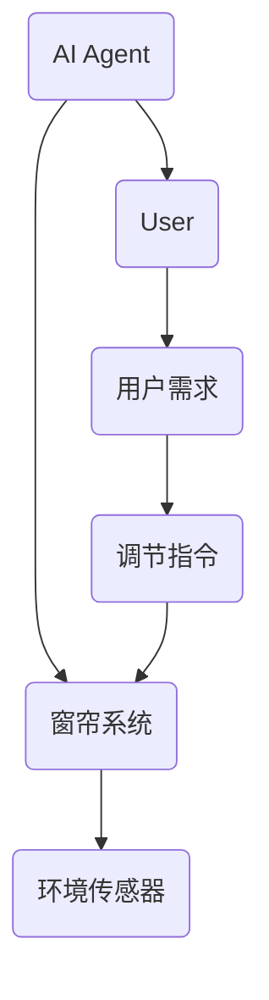
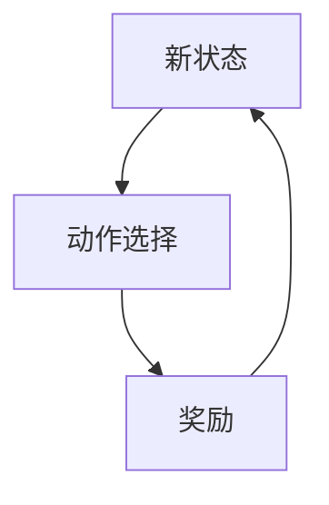
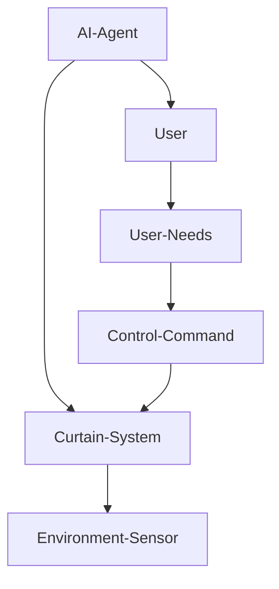
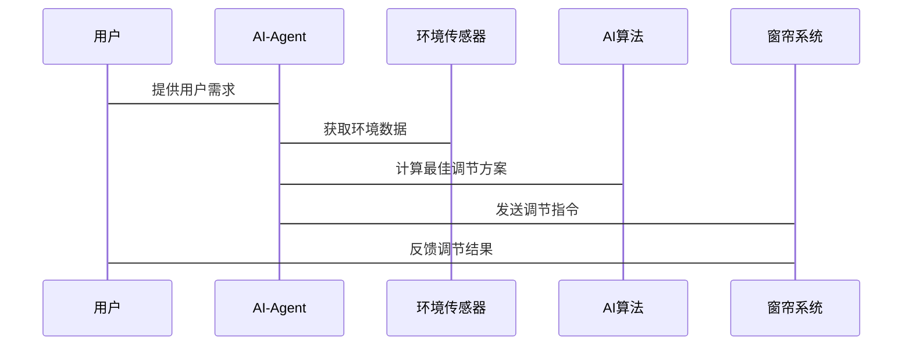

                 


# 智能窗帘：AI Agent的昼夜节律调节助手

## 关键词：智能窗帘，AI Agent，昼夜节律，人工智能，智能家居

## 摘要：  
本文详细探讨了智能窗帘与AI Agent结合的昼夜节律调节系统，分析了其背后的核心算法、系统架构和实际应用场景。文章从背景介绍、核心概念、算法原理、系统架构、项目实战到最佳实践，全面阐述了智能窗帘在调节昼夜节律中的重要作用。

---

## 第一部分：背景介绍与核心概念

### 第1章：智能窗帘的发展历程

#### 1.1 传统窗帘的局限性
- **传统窗帘的功能特点**：手动开关，仅提供遮光功能，无法根据环境或用户需求自动调整。
- **传统窗帘的使用痛点**：用户需手动操作，无法适应不同时间段的光线需求，缺乏智能化。
- **智能化转型的必要性**：通过智能技术提升用户体验，实现自动化、个性化控制。

#### 1.2 昼夜节律调节的背景
- **昼夜节律的科学原理**：生物钟调节人体生理活动，影响睡眠和觉醒周期。
- **现代人昼夜节律紊乱的现状**：长时间使用电子设备、不规律作息导致生物钟紊乱。
- **调节昼夜节律的重要性**：改善睡眠质量，提高生活质量和健康水平。

#### 1.3 AI Agent在智能窗帘中的作用
- **AI Agent的基本概念**：智能代理，通过感知环境和学习，自主决策和执行任务。
- **AI Agent在智能窗帘中的应用场景**：自动调节窗帘开合，优化室内光照，辅助用户调节昼夜节律。
- **AI Agent与昼夜节律调节的结合**：通过分析用户行为和环境数据，智能调整窗帘状态，帮助用户建立健康的昼夜节律。

---

### 第2章：智能窗帘的核心概念与联系

#### 2.1 核心概念原理
- **AI Agent的核心算法**：基于强化学习和监督学习，通过反馈机制优化决策。
- **昼夜节律调节的数学模型**：基于光照强度、时间、用户行为等因素，建立数学模型预测最佳调节方案。
- **智能窗帘的系统架构**：包括传感器、执行机构、AI算法模块和用户交互界面。

#### 2.2 核心概念属性特征对比表
| 概念       | 属性特征                  |
|------------|---------------------------|
| AI Agent   | 学习能力、自适应性、决策能力 |
| 昼夜节律   | 生物钟、睡眠周期、光照调节 |

#### 2.3 ER实体关系图


---

## 第二部分：算法原理与数学模型

### 第3章：AI Agent的算法原理

#### 3.1 强化学习算法


#### 3.2 算法实现代码
```python
class AI-Agent:
    def __init__(self):
        self.model = self.build_model()

    def build_model(self):
        model = Sequential()
        model.add(Dense(64, input_dim=4, activation='relu'))
        model.add(Dense(32, activation='relu'))
        model.add(Dense(1, activation='sigmoid'))
        model.compile(optimizer='adam', loss='binary_crossentropy', metrics=['accuracy'])
        return model

    def train(self, data):
        self.model.fit(data, epochs=10, batch_size=32)

    def predict(self, input):
        return self.model.predict(input)
```

#### 3.3 数学模型
```latex
$$ P(\text{开窗帘} | \text{时间} = t, \text{光照强度} = I) = \sigma(w_1 t + w_2 I + b) $$
其中，$\sigma$ 是sigmoid函数，$w_1, w_2$ 是权重，$b$ 是偏置。
```

---

### 第4章：智能窗帘系统的数学模型

#### 4.1 昼夜节律调节的数学模型
```latex
$$ \text{光照强度} = a \cdot t + b \cdot \sin(c t + d) $$
其中，$t$ 是时间，$a, b, c, d$ 是模型参数。

#### 4.2 模糊控制算法
```python
def fuzzy_adjust(ctime):
    if ctime < 6 or ctime > 22:
        return '关闭'
    elif 6 <= ctime < 10 or 18 <= ctime <= 22:
        return '半开'
    else:
        return '全开'
```

---

## 第三部分：系统分析与架构设计

### 第5章：系统架构设计

#### 5.1 系统功能设计
- **环境感知**：光照传感器、时间传感器。
- **用户交互**：手机APP、语音控制。
- **AI决策**：AI Agent根据环境数据和用户需求生成调节指令。
- **执行机构**：电机驱动窗帘开合。

#### 5.2 系统架构图


---

### 第6章：系统接口与交互设计

#### 6.1 系统接口设计
- **传感器接口**：I2C或UART通信。
- **用户交互接口**：蓝牙/WiFi通信。
- **AI算法接口**：RESTful API。

#### 6.2 交互序列图


---

## 第四部分：项目实战

### 第7章：环境安装与系统实现

#### 7.1 环境安装
- **硬件安装**：安装光照传感器、电机驱动模块。
- **软件安装**：安装Python环境，安装Keras和TensorFlow库。

#### 7.2 核心代码实现
```python
import numpy as np
from keras.models import Sequential
from keras.layers import Dense

model = Sequential()
model.add(Dense(64, activation='relu', input_dim=4))
model.add(Dense(32, activation='relu'))
model.add(Dense(1, activation='sigmoid'))
model.compile(optimizer='adam', loss='binary_crossentropy', metrics=['accuracy'])

# 训练模型
X_train = np.random.random((1000, 4))
y_train = np.random.randint(0, 1, (1000, 1))
model.fit(X_train, y_train, epochs=10, batch_size=32)

# 预测
X_test = np.random.random((100, 4))
y_pred = model.predict(X_test)
```

#### 7.3 案例分析
- **案例1**：早晨6点自动半开窗帘，模拟自然光照。
- **案例2**：晚上22点自动关闭窗帘，保障睡眠质量。

---

## 第五部分：最佳实践与总结

### 第8章：最佳实践

#### 8.1 实用建议
- 定期更新AI模型，保持算法准确性。
- 确保传感器和执行机构的稳定性。
- 提供用户友好的交互界面。

#### 8.2 小结
智能窗帘通过AI Agent实现昼夜节律调节，显著提升了用户体验，优化了睡眠质量。

---

## 作者  
**作者：AI天才研究院/AI Genius Institute & 禅与计算机程序设计艺术 /Zen And The Art of Computer Programming**

