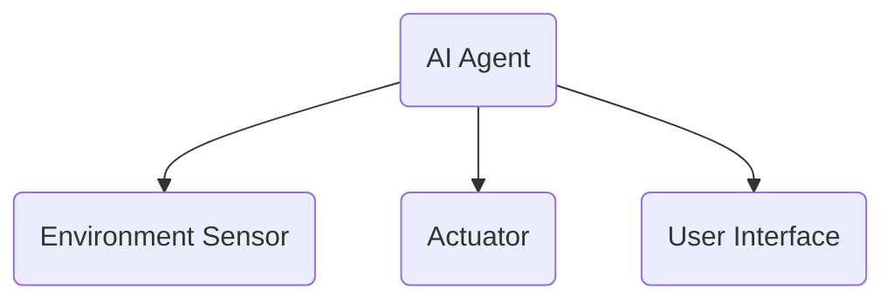
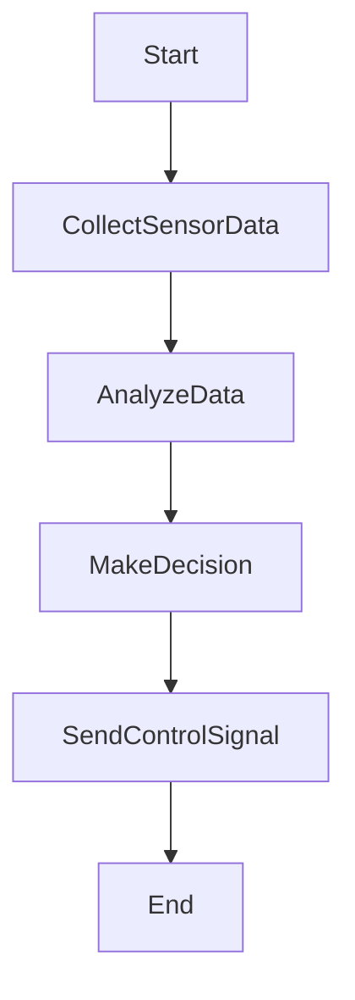
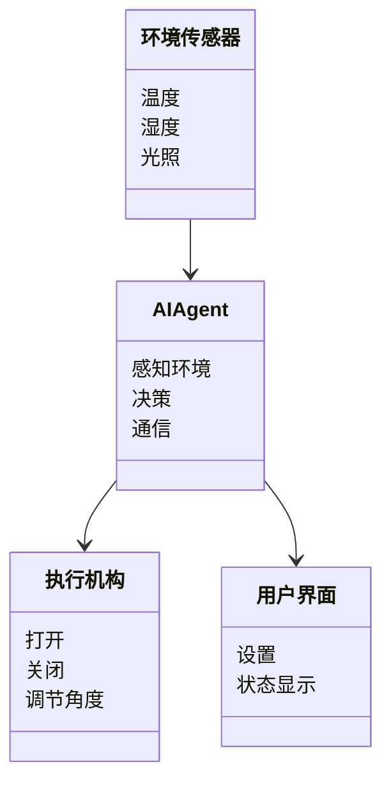
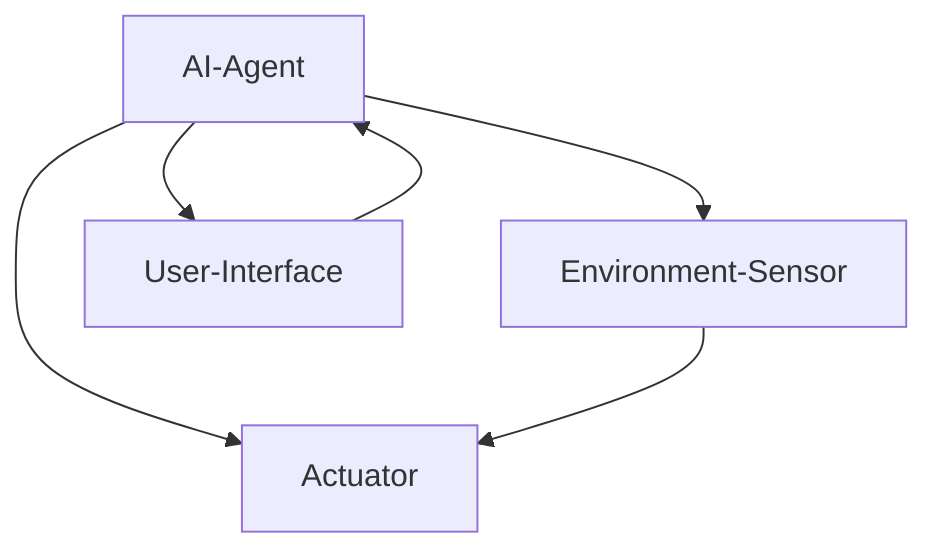
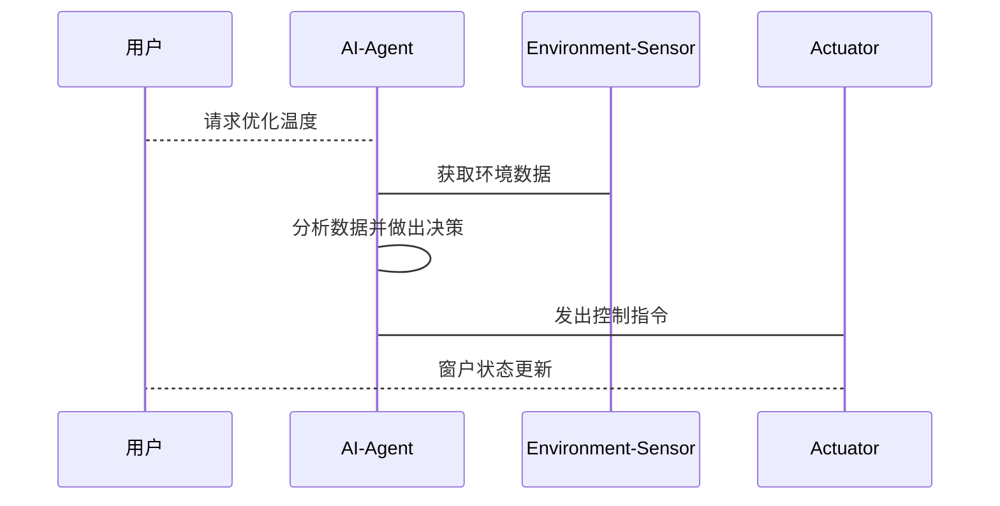

                 


# 智能窗户：AI Agent的室内温度优化控制

> 关键词：智能窗户，AI Agent，室内温度优化，强化学习，物联网，智能家居

> 摘要：本文详细探讨了智能窗户与AI Agent结合的室内温度优化控制技术。通过分析智能窗户的基本概念、AI Agent的核心原理、温度优化算法的设计与实现，以及系统的架构设计，本文为读者提供了从理论到实践的全面解读。文章最后通过一个具体的案例分析，展示了如何利用AI Agent实现智能窗户的室内温度优化控制，并提出了相应的最佳实践和注意事项。

---

# 第一部分: 智能窗户与AI Agent的背景介绍

# 第1章: 智能窗户的概念与应用背景

## 1.1 智能窗户的基本概念

### 1.1.1 智能窗户的定义
智能窗户是一种结合了物联网（IoT）和人工智能（AI）技术的智能化窗户系统。它能够通过传感器采集环境数据（如温度、湿度、光照强度等），并利用AI算法进行分析和决策，从而实现对窗户的自动控制（如开启、关闭、调节角度等），以达到优化室内环境的目的。

### 1.1.2 智能窗户的核心功能
- **环境感知**：通过传感器实时采集室内和室外的环境数据。
- **智能决策**：利用AI算法分析数据，判断是否需要调整窗户的状态。
- **自动控制**：根据决策结果，自动控制窗户的开启、关闭或角度调节。
- **用户交互**：提供用户界面，让用户可以手动或远程控制窗户状态。

### 1.1.3 智能窗户的市场现状与发展趋势
随着智能家居市场的快速发展，智能窗户作为智能家居的重要组成部分，市场需求持续增长。智能窗户不仅可以提高居住舒适度，还能有效节约能源，减少碳排放，符合绿色建筑的发展趋势。

---

## 1.2 AI Agent在智能窗户中的作用

### 1.2.1 AI Agent的基本概念
AI Agent（智能代理）是指能够感知环境、自主决策并执行任务的智能实体。它可以是一个软件程序，也可以是一个物理设备，通过与环境和其他系统交互，实现特定的目标。

### 1.2.2 AI Agent在智能窗户中的应用场景
- **环境优化**：AI Agent可以根据室内和室外的环境数据，优化窗户的开合状态，以保持室内温度、湿度和光照的舒适度。
- **能源管理**：通过分析能源消耗数据，AI Agent可以优化窗户的开合时间，减少能源浪费。
- **用户行为分析**：AI Agent可以学习用户的习惯，主动调整窗户状态以适应用户的偏好。

### 1.2.3 AI Agent与智能窗户的结合优势
- **智能化**：AI Agent能够自主学习和优化，无需人工干预。
- **实时性**：AI Agent可以实时感知环境变化，并快速做出反应。
- **高效性**：通过AI算法优化窗户的控制策略，提高能源利用效率。

---

## 1.3 室内温度优化控制的必要性

### 1.3.1 室内温度对舒适度的影响
室内温度直接影响人们的居住舒适度。过高的温度会导致燥热，过低的温度则会导致寒冷，而适度的温度则能让人感到舒适。

### 1.3.2 节能减排的重要性
建筑能耗是全球能源消耗的重要组成部分，而窗户是建筑能耗的重要来源之一。通过优化窗户的开合状态，可以有效减少能源浪费，降低碳排放。

### 1.3.3 智能窗户在温度优化中的潜力
智能窗户可以通过AI Agent实时优化窗户的开合状态，从而在保证室内舒适度的同时，最大限度地节约能源。

---

## 1.4 本章小结
本章介绍了智能窗户的基本概念、核心功能以及AI Agent在智能窗户中的作用。同时，还分析了室内温度优化控制的必要性，为后续章节的深入分析奠定了基础。

---

# 第2章: AI Agent与智能窗户的核心原理

## 2.1 AI Agent的基本原理

### 2.1.1 AI Agent的感知与决策机制
AI Agent通过传感器感知环境数据，并利用这些数据进行分析和判断，最终做出决策。例如，当室内温度过高时，AI Agent可以决定打开窗户以降低温度。

### 2.1.2 AI Agent的学习与优化算法
AI Agent可以通过强化学习或机器学习算法不断优化其决策策略。例如，强化学习可以通过奖励机制，让AI Agent学习到最优的窗户控制策略。

### 2.1.3 AI Agent的通信与交互方式
AI Agent可以通过物联网技术与智能窗户、用户终端和其他系统进行通信和交互。例如，AI Agent可以与智能家居系统联动，实现更复杂的环境优化。

---

## 2.2 智能窗户的AI Agent系统架构

### 2.2.1 系统组成与功能模块划分
智能窗户的AI Agent系统通常包括以下几个功能模块：
- **环境传感器**：采集室内和室外的环境数据。
- **AI Agent**：分析数据并做出决策。
- **执行机构**：根据决策结果控制窗户的开合。
- **用户界面**：提供人机交互界面。

### 2.2.2 AI Agent与智能窗户的实体关系图


### 2.2.3 系统架构图


---

## 2.3 系统核心算法与流程

### 2.3.1 温度预测模型
通过历史数据和当前数据，AI Agent可以预测未来的室内温度。例如，使用线性回归模型进行温度预测：
$$ T_{\text{predicted}} = a \cdot T_{\text{current}} + b \cdot T_{\text{outside}} + c $$

### 2.3.2 优化控制算法的设计
基于强化学习的优化算法可以通过以下步骤实现：
1. **状态定义**：定义窗户的开合状态（例如，开、关、半开）。
2. **动作定义**：定义窗户的控制动作（例如，打开、关闭、调整角度）。
3. **奖励机制**：定义奖励函数，奖励AI Agent做出最优决策。

### 2.3.3 算法实现的Python代码
以下是一个简单的强化学习算法实现示例：
```python
class AI-Agent:
    def __init__(self):
        self.state = "closed"
        self.reward = 0

    def感知环境(self, 温度, 光照):
        self.环境数据 = (温度, 光照)

    def决策(self):
        if self.环境数据[0] > 25:
            self.动作 = "打开"
        else:
            self.动作 = "关闭"
        return self.动作

    def学习(self, 实际动作):
        if 实际动作 == self.动作:
            self.奖励 += 1
```

---

## 2.4 本章小结
本章详细介绍了AI Agent的核心原理，包括感知与决策机制、学习与优化算法，以及系统架构设计。通过这些内容，读者可以更好地理解AI Agent在智能窗户中的具体应用。

---

# 第3章: 智能窗户AI Agent的算法原理

## 3.1 温度预测模型

### 3.1.1 温度预测的基本假设
温度预测模型假设室内温度与室外温度、光照强度等因素密切相关。

### 3.1.2 温度预测的数学公式
$$ T_{\text{predicted}} = a \cdot T_{\text{current}} + b \cdot T_{\text{outside}} + c $$

---

## 3.2 优化控制算法的设计

### 3.2.1 基于强化学习的优化算法
强化学习算法通过不断试验和错误，逐步优化窗户的控制策略。例如，使用Q-learning算法：
$$ Q(s, a) = Q(s, a) + \alpha \cdot [r + \max Q(s', a') - Q(s, a)] $$

### 3.2.2 算法的数学表达式
$$ \text{Action} = \arg\max_{a} Q(s, a) $$

---

## 3.3 算法实现的Python代码

```python
import numpy as np

class QLearning:
    def __init__(self, 状态空间, 动作空间):
        self.状态空间 = 状态空间
        self.动作空间 = 动作空间
        self.q_table = np.zeros((len(状态空间), len(动作空间)))

    def 学习(self, 当前状态, 动作, 奖励, 下一状态):
        q = self.q_table[当前状态][动作]
        max_q = np.max(self.q_table[下一状态])
        self.q_table[当前状态][动作] = q + 0.1 * (奖励 + 0.99 * max_q)

    def 决策(self, 当前状态):
        if np.random.random() < 0.9:
            return np.argmax(self.q_table[当前状态])
        else:
            return np.random.randint(len(self.动作空间))
```

---

## 3.4 本章小结
本章详细介绍了智能窗户AI Agent的算法原理，包括温度预测模型和优化控制算法的设计与实现。通过这些算法，AI Agent可以实现对窗户的智能控制，从而优化室内温度。

---

# 第4章: 智能窗户系统的架构设计

## 4.1 系统功能设计

### 4.1.1 领域模型


### 4.1.2 系统架构图


### 4.1.3 系统接口设计
- **传感器接口**：用于采集环境数据。
- **执行机构接口**：用于控制窗户的开合状态。
- **用户界面接口**：用于与用户交互。

### 4.1.4 系统交互流程图


---

## 4.2 本章小结
本章详细介绍了智能窗户系统的架构设计，包括领域模型、系统架构图、接口设计和交互流程图。通过这些设计，读者可以清晰地理解智能窗户系统的整体结构和各部分的功能。

---

# 第5章: 智能窗户AI Agent的项目实战

## 5.1 环境安装

### 5.1.1 系统环境要求
- 操作系统：Linux/Windows/MacOS
- Python版本：3.6+
- 依赖库：numpy, matplotlib, scikit-learn

### 5.1.2 环境配置
```bash
pip install numpy matplotlib scikit-learn
```

---

## 5.2 系统核心实现

### 5.2.1 AI Agent的实现
```python
class AI-Agent:
    def __init__(self):
        self.sensors = []
        self actuators = []
        self.q_table = {}

    def add_sensor(self, sensor):
        self.sensors.append(sensor)

    def add_actuator(self, actuator):
        self.actuators.append(actuator)

    def感知环境(self):
        data = [s感知() for s in self.sensors]
        return data

    def 决策(self, data):
        return self.q_table.get(data, "关闭")

    def 优化(self, data, action):
        self.q_table[data] = action
```

---

## 5.3 案例分析与实现

### 5.3.1 案例分析
假设室内温度为28℃，室外温度为32℃，光照强度为100lux。AI Agent需要决定是否打开窗户以降低室内温度。

### 5.3.2 代码实现
```python
class 温度优化系统:
    def __init__(self):
        self.ai_agent = AI-Agent()
        self.环境传感器 = 环境传感器()
        self.执行机构 = 执行机构()

    def 运行(self):
        while True:
            data = self.ai_agent.感知环境()
            action = self.ai_agent.决策(data)
            self.ai_agent.优化(data, action)
            self.执行机构.执行动作(action)
```

---

## 5.4 本章小结
本章通过一个具体的案例分析和代码实现，展示了如何利用AI Agent实现智能窗户的室内温度优化控制。通过实际操作，读者可以更好地理解智能窗户系统的实现过程。

---

# 第6章: 智能窗户AI Agent的最佳实践

## 6.1 最佳实践

### 6.1.1 系统部署建议
- 确保传感器和执行机构的安装位置合理。
- 定期更新AI Agent的算法模型，以提高优化效果。

### 6.1.2 系统维护建议
- 定期检查传感器和执行机构的状态，确保系统正常运行。
- 及时更新软件版本，修复潜在的安全漏洞。

### 6.1.3 用户使用建议
- 用户可以根据自己的习惯，调整AI Agent的优化策略。
- 学习如何通过用户界面手动控制窗户状态。

---

## 6.2 小结
本章总结了智能窗户AI Agent的最佳实践，包括系统部署、维护和用户使用的建议。这些内容可以帮助读者更好地管理和优化智能窗户系统。

---

## 6.3 注意事项

### 6.3.1 系统安全
- 确保AI Agent的通信安全，防止恶意攻击。
- 定期备份系统数据，防止数据丢失。

### 6.3.2 系统兼容性
- 确保智能窗户系统与其它智能家居设备的兼容性。
- 支持多种操作系统和硬件平台。

---

## 6.4 拓展阅读
- 《强化学习入门》
- 《物联网技术与应用》
- 《智能家居系统设计》

---

# 作者：AI天才研究院/AI Genius Institute & 禅与计算机程序设计艺术 /Zen And The Art of Computer Programming

