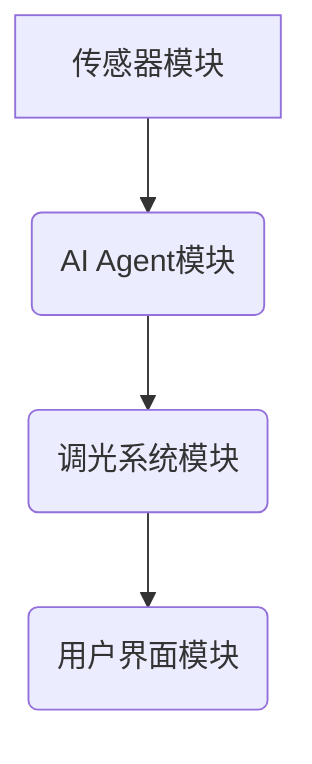
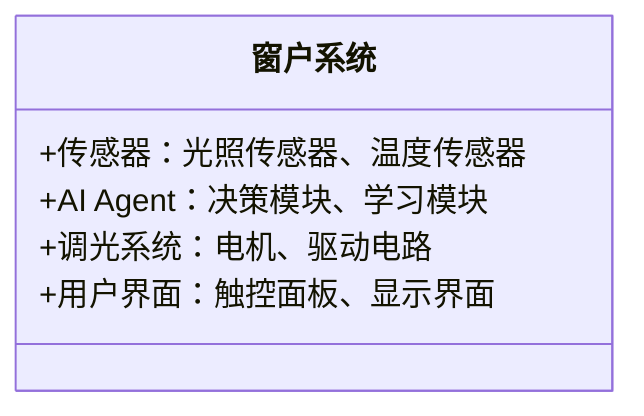

                 


# 智能窗户：AI Agent的自动调光系统

> 关键词：智能窗户，AI Agent，自动调光系统，系统架构，算法实现，项目实战，最佳实践

> 摘要：本文将详细介绍智能窗户与AI Agent结合的自动调光系统。从背景介绍、核心概念、算法原理、系统架构、项目实战到优化与性能提升，全面解析这一系统的实现过程与技术细节。

---

# 第1章: 智能窗户与AI Agent的引言

## 1.1 智能窗户的发展背景

### 1.1.1 传统窗户的功能与局限性
传统窗户主要起到采光和隔绝外界的作用，但其功能较为单一，无法根据环境变化自动调节光线强度。随着智能技术的发展，用户对窗户的智能化需求日益增加。

### 1.1.2 智能窗户的定义与特点
智能窗户是指通过传感器、执行器和智能控制系统实现自动调节的窗户。其特点包括：智能化、远程控制、节能环保、安全性高等。

### 1.1.3 AI Agent在智能窗户中的作用
AI Agent（智能代理）是一种能够感知环境并执行任务的智能实体。在智能窗户中，AI Agent负责接收传感器数据、分析环境信息并控制调光系统。

---

## 1.2 自动调光系统的基本概念

### 1.2.1 调光系统的原理
调光系统通过传感器采集环境光照强度、温度、用户需求等信息，经过分析后驱动执行机构调节窗户的透光率。

### 1.2.2 自动调光系统的分类
根据调节方式的不同，自动调光系统可以分为机械式、电控式和智能式三种类型。

### 1.2.3 智能窗户的应用场景与优势
智能窗户广泛应用于家庭、办公场所、公共场所等场景，能够有效提高能源利用效率，改善室内光照环境。

---

## 1.3 本章小结
本章主要介绍了智能窗户的发展背景、定义与特点，以及AI Agent在智能窗户中的作用。接下来将深入探讨AI Agent的核心概念与原理。

---

# 第2章: AI Agent的核心概念与原理

## 2.1 AI Agent的基本概念

### 2.1.1 AI Agent的定义
AI Agent是一种能够感知环境、自主决策并执行任务的智能实体。它能够通过传感器获取信息，利用算法进行分析，并通过执行器完成操作。

### 2.1.2 AI Agent的核心特征
- **自主性**：能够在没有外部干预的情况下自主运行。
- **反应性**：能够实时感知环境变化并做出反应。
- **主动性**：能够主动发起任务并完成目标。

### 2.1.3 AI Agent的分类与应用场景
AI Agent可以分为简单反射型、基于模型的反应型、目标驱动型和效用驱动型四种类型。在智能窗户中，AI Agent主要用于环境感知、数据处理和系统控制。

---

## 2.2 AI Agent与智能窗户的结合

### 2.2.1 AI Agent在智能窗户中的角色
AI Agent负责接收传感器数据、分析环境信息，并根据预设规则或用户需求控制调光系统。

### 2.2.2 AI Agent的感知与决策机制
AI Agent通过光照传感器、温度传感器等获取环境数据，利用机器学习算法进行分析，并根据结果做出决策。

### 2.2.3 AI Agent与调光系统的交互流程
1. 传感器采集环境数据
2. AI Agent接收数据并进行分析
3. AI Agent生成控制指令
4. 调光系统执行指令

---

## 2.3 本章小结
本章详细介绍了AI Agent的基本概念、核心特征及其在智能窗户中的应用。接下来将探讨自动调光系统的算法原理。

---

# 第3章: 自动调光系统的算法原理

## 3.1 自动调光系统的算法概述

### 3.1.1 调光算法的基本原理
调光算法通过分析环境数据，确定窗户的透光率。常见的算法包括PID控制算法、模糊控制算法和机器学习算法。

### 3.1.2 常见的调光算法类型
- **PID控制算法**：通过比例、积分、微分三个环节调节系统的输出。
- **模糊控制算法**：利用模糊逻辑进行环境分析和决策。
- **机器学习算法**：通过训练数据模型实现智能调节。

### 3.1.3 算法选择的依据与原则
算法选择主要考虑系统的实时性、准确性和稳定性。PID控制算法适用于简单的线性调节，模糊控制算法适用于复杂的非线性场景，机器学习算法适用于需要深度学习的场景。

---

## 3.2 基于AI的调光算法实现

### 3.2.1 神经网络在调光系统中的应用
神经网络可以通过训练学习光照强度与窗户透光率之间的关系，实现智能调节。

### 3.2.2 基于强化学习的调光算法
强化学习通过奖励机制训练AI Agent，使其在环境中做出最优决策。

### 3.2.3 算法实现的步骤与流程
1. 数据采集与预处理
2. 算法训练与优化
3. 系统集成与测试

---

## 3.3 算法优化与性能提升

### 3.3.1 算法优化的必要性
算法优化可以提高系统的响应速度和调节精度，降低能耗。

### 3.3.2 常见的算法优化方法
- 参数调整
- 模型压缩
- 并行计算

### 3.3.3 优化效果的评估与验证
通过对比实验可以评估算法优化的效果，包括响应时间、调节精度、能耗等指标。

---

## 3.4 本章小结
本章详细介绍了自动调光系统的算法原理和基于AI的调光算法实现。接下来将探讨系统架构与设计。

---

# 第4章: 系统架构与设计

## 4.1 系统架构的总体设计

### 4.1.1 系统模块划分
智能窗户系统主要包括传感器模块、AI Agent模块、调光系统模块和用户界面模块。

### 4.1.2 系统架构的层次结构
- **感知层**：负责数据采集
- **决策层**：负责数据处理和决策
- **执行层**：负责系统控制
- **用户层**：负责人机交互

### 4.1.3 系统架构的mermaid图


---

## 4.2 系统功能设计

### 4.2.1 领域模型的mermaid类图


---

## 4.3 系统架构设计

### 4.3.1 系统架构的mermaid架构图


---

## 4.4 系统接口设计

### 4.4.1 传感器接口设计
传感器模块通过I2C或SPI接口与AI Agent模块通信。

### 4.4.2 调光系统接口设计
调光系统通过PWM或I2C接口与AI Agent模块通信。

---

## 4.5 系统交互设计

### 4.5.1 系统交互的mermaid序列图
```mermaid
sequenceDiagram
    用户操作 --> AI Agent模块
    AI Agent模块 --> 传感器模块：获取环境数据
    AI Agent模块 --> 调光系统模块：发送控制指令
    调光系统模块 --> 用户界面模块：反馈执行结果
```

---

## 4.6 本章小结
本章详细介绍了智能窗户系统的架构设计，包括模块划分、接口设计和系统交互。接下来将探讨项目实战部分。

---

# 第5章: 项目实战

## 5.1 环境搭建

### 5.1.1 开发环境的选择
推荐使用Python和Raspberry Pi进行开发。

### 5.1.2 开发工具的安装
安装必要的库和工具，例如Raspbian OS、Python、OpenCV等。

---

## 5.2 系统核心实现

### 5.2.1 AI Agent的实现
```python
class AI-Agent:
    def __init__(self):
        self.sensor = Sensor()
        self.actuator = Actuator()
    
    def感知环境(self):
        光照强度 = self.sensor.get_light_intensity()
        return 光照强度
    
    def决策(self, 光照强度):
        如果 光照强度 > 100:
            返回 "调节为半透"
        否则:
            返回 "调节为全透"
    
    def执行(self, 指令):
        self.actuator.execute_command(指令)
```

### 5.2.2 调光系统的实现
```python
class 调光系统:
    def __init__(self):
        self.pwm = PWM(2)
    
    def调节(self, 透光率):
        self.pwm.set_duty_cycle(透光率)
```

---

## 5.3 项目小结
本章通过实际案例展示了智能窗户系统的实现过程，包括环境搭建、代码实现和系统测试。

---

# 第6章: 系统优化与性能提升

## 6.1 系统优化的必要性

### 6.1.1 系统优化的目标
提高系统的响应速度、调节精度和稳定性。

### 6.1.2 常见的优化方法
- 参数调优
- 算法优化
- 硬件升级

---

## 6.2 性能提升的具体措施

### 6.2.1 算法优化
改进AI Agent的决策算法，例如使用更高效的机器学习模型。

### 6.2.2 系统调优
优化传感器的采样频率和系统的响应时间。

---

## 6.3 优化效果的评估

### 6.3.1 响应时间的测试
通过实验测量系统的响应时间，评估优化效果。

### 6.3.2 调节精度的测试
通过实验测量系统的调节精度，评估优化效果。

---

## 6.4 本章小结
本章探讨了系统优化与性能提升的具体措施，包括算法优化和系统调优。

---

# 第7章: 总结与展望

## 7.1 本章总结
本文详细介绍了智能窗户与AI Agent结合的自动调光系统，从背景、概念、算法、架构到项目实战和优化，全面解析了系统的实现过程。

## 7.2 未来展望
未来，随着AI技术的不断发展，智能窗户将更加智能化和人性化，可能实现更复杂的环境适应和用户需求满足。

---

# 作者：AI天才研究院/AI Genius Institute & 禅与计算机程序设计艺术 /Zen And The Art of Computer Programming

