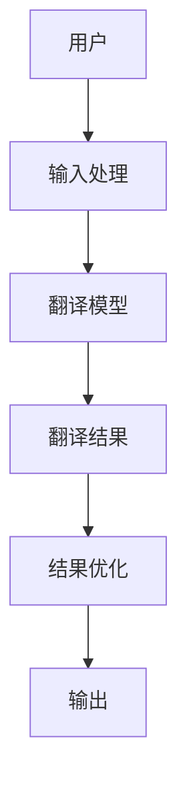
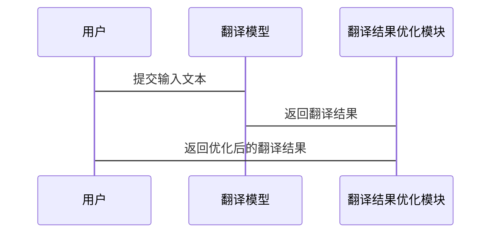

                 


# 智能翻译：AI Agent的多语言实时翻译

> 关键词：智能翻译，AI Agent，多语言，实时翻译，自然语言处理，机器翻译，深度学习

> 摘要：本文探讨了AI Agent在多语言实时翻译中的应用，分析了智能翻译的核心技术，包括自然语言处理和机器翻译算法。通过详细介绍AI Agent的实现原理和系统架构设计，结合实际项目案例，深入解读了多语言实时翻译的实现流程和优化方法。最后，本文总结了智能翻译的发展趋势和未来方向，为技术从业者提供了有价值的参考和实践指导。

---

## 第1章: 智能翻译与AI Agent的背景与概念

### 1.1 智能翻译的定义与背景

智能翻译是一种利用人工智能技术实现的自动化翻译方式，旨在提高翻译的效率和准确性。随着全球化进程的加速，跨语言交流的需求日益增长，智能翻译技术在商业、教育、医疗等领域发挥着越来越重要的作用。

#### 1.1.1 翻译技术的发展历程

翻译技术经历了多个阶段的发展：
- **传统翻译阶段**：依赖人工翻译，效率低且成本高。
- **统计机器翻译阶段**：基于语言学统计和模式匹配，如早期的Google Translate。
- **神经机器翻译阶段**：利用深度学习技术，通过神经网络实现更准确的翻译。
- **多模态翻译阶段**：结合视觉、语音等多种模态信息，提供更智能的翻译服务。

#### 1.1.2 AI技术在翻译领域的应用现状

当前，AI技术在翻译领域的应用主要集中在以下方面：
- **神经机器翻译（NMT）**：基于Transformer架构，通过深度学习模型实现高质量翻译。
- **多语言模型**：支持多种语言的统一翻译模型，减少训练数据的需求。
- **实时翻译**：结合自然语言处理技术，实现快速响应的实时翻译服务。

#### 1.1.3 智能翻译的核心概念与特点

智能翻译的核心概念包括：
- **自动化**：无需人工干预，自动完成翻译任务。
- **准确性**：通过深度学习模型提高翻译质量。
- **实时性**：支持快速响应，适用于视频会议、实时聊天等场景。
- **多语言支持**：能够处理多种语言，满足跨语言交流的需求。

### 1.2 AI Agent的基本概念

AI Agent（智能代理）是一种能够感知环境、自主决策并执行任务的智能实体。在智能翻译领域，AI Agent主要负责接收输入、调用翻译模型、处理结果并返回输出。

#### 1.2.1 什么是AI Agent

AI Agent可以是软件程序或硬件设备，具备以下特点：
- **自主性**：能够自主决策和执行任务。
- **反应性**：能够感知环境变化并做出实时响应。
- **学习能力**：通过机器学习技术不断优化自身的性能。

#### 1.2.2 AI Agent的分类与特点

AI Agent可以根据功能和应用场景分为以下几类：
- **简单反射型AI Agent**：基于规则的简单响应，适用于特定场景。
- **基于模型的AI Agent**：利用内部模型进行推理和决策，适用于复杂任务。
- **学习型AI Agent**：通过机器学习不断优化自身性能。

#### 1.2.3 AI Agent在智能翻译中的作用

在智能翻译中，AI Agent主要负责以下任务：
- **接收输入**：通过用户输入获取需要翻译的内容。
- **调用翻译模型**：将输入内容传递给翻译模型，获取翻译结果。
- **处理结果**：对翻译结果进行优化和调整，确保准确性和流畅性。
- **返回输出**：将最终结果返回给用户，完成翻译任务。

### 1.3 多语言实时翻译的挑战与机遇

#### 1.3.1 多语言翻译的核心挑战

多语言翻译面临以下主要挑战：
- **语言多样性**：不同语言的语法、词汇差异较大，增加了翻译的难度。
- **数据稀缺性**：某些语言的训练数据较少，影响模型的性能。
- **文化差异**：翻译不仅仅是语言的转换，还需要考虑文化背景和语境。

#### 1.3.2 AI Agent在实时翻译中的优势

AI Agent在实时翻译中的优势包括：
- **快速响应**：通过高效的算法实现实时翻译。
- **多语言支持**：支持多种语言的翻译需求。
- **上下文理解**：能够理解上下文，提供更准确的翻译结果。

#### 1.3.3 未来翻译技术的发展趋势

未来翻译技术的发展趋势包括：
- **多模态翻译**：结合视觉、语音等多种模态信息，提高翻译的准确性和自然度。
- **实时互动翻译**：支持实时互动，如视频会议中的实时翻译。
- **个性化翻译**：根据用户需求和偏好，提供个性化的翻译服务。

### 1.4 本章小结

本章介绍了智能翻译和AI Agent的基本概念，分析了多语言实时翻译的挑战与机遇，为后续章节的深入探讨奠定了基础。

---

## 第2章: 自然语言处理基础

### 2.1 自然语言处理的概述

自然语言处理（NLP）是人工智能领域的重要分支，旨在让计算机能够理解、生成和处理人类语言。

#### 2.1.1 NLP的基本概念

NLP的核心任务包括：
- **文本分类**：将文本分为不同的类别，如垃圾邮件分类。
- **实体识别**：识别文本中的实体，如人名、地名。
- **句法分析**：分析句子的语法结构。
- **语义理解**：理解文本的深层含义。

#### 2.1.2 NLP的核心任务与技术

NLP的核心技术包括：
- **词袋模型**：将文本表示为单词的集合。
- **词嵌入**：通过嵌入技术将单词映射为向量。
- **序列模型**：如LSTM和Transformer，用于处理序列数据。

#### 2.1.3 NLP在翻译中的应用

NLP在翻译中的应用包括：
- **分句与切分**：将文本划分为独立的句子或短语。
- **词汇对齐**：将源语言词汇与目标语言词汇对齐。
- **句法分析**：分析句子结构，帮助翻译模型理解上下文。

### 2.2 机器翻译的主流算法

#### 2.2.1 统计机器翻译

统计机器翻译（SMT）基于语言学统计和模式匹配，通过构建语言模型和翻译模型实现翻译。

##### 统计机器翻译的流程

1. **数据预处理**：对平行文本进行清洗和对齐。
2. **构建语言模型**：基于统计语言模型，计算每个句子的概率。
3. **构建翻译模型**：基于对齐数据，建立翻译规则。
4. **解码**：通过动态规划算法生成最优翻译结果。

##### 统计机器翻译的优缺点

- **优点**：简单易实现，适合处理小规模数据。
- **缺点**：翻译质量有限，难以处理复杂语义。

#### 2.2.2 神经机器翻译

神经机器翻译（NMT）基于深度学习模型，通过神经网络实现翻译。

##### Transformer模型

Transformer模型由编码器和解码器组成，通过自注意力机制捕捉文本中的长距离依赖关系。

##### Transformer模型的数学公式

编码器的自注意力机制：
$$
\text{Attention}(Q, K, V) = \text{softmax}\left(\frac{QK^T}{\sqrt{d_k}}\right)V
$$

解码器的自注意力机制：
$$
\text{Attention}(Q, K, V) = \text{softmax}\left(\frac{QK^T}{\sqrt{d_k}}\right)V
$$

##### 神经机器翻译的优缺点

- **优点**：翻译质量高，能够处理大规模数据。
- **缺点**：计算资源消耗大，训练时间长。

#### 2.2.3 预训练模型在机器翻译中的应用

预训练模型（如BERT、GPT）通过大规模无监督学习，捕获语言的深层语义信息，显著提高了翻译质量。

##### 预训练模型的训练流程

1. **数据预处理**：对大规模文本数据进行清洗和格式化。
2. **掩码语言模型训练**：通过随机掩码部分词汇，预测缺失的词汇。
3. **微调任务训练**：针对具体任务（如翻译）进行微调。

### 2.3 语言模型与翻译质量

#### 2.3.1 语言模型的定义与作用

语言模型用于估计一个给定序列的概率，帮助翻译模型生成更流畅的译文。

#### 2.3.2 语言模型对翻译质量的影响

语言模型通过提供上下文信息，帮助翻译模型生成更符合目标语言语法和表达习惯的译文。

#### 2.3.3 提高翻译质量的技术手段

- **使用更强大的语言模型**：如使用更大参数的Transformer模型。
- **结合外部知识库**：利用百科全书等外部知识库，提高翻译的准确性。
- **优化训练数据**：通过数据增强等技术，提高训练数据的质量。

### 2.4 本章小结

本章介绍了自然语言处理的基础知识，分析了机器翻译的主流算法，探讨了如何通过语言模型提高翻译质量。

---

## 第3章: 多语言实时翻译的算法原理

### 3.1 神经机器翻译模型

#### 3.1.1 神经机器翻译的基本原理

神经机器翻译通过构建编码器-解码器架构，将源语言句子编码为向量，解码为目标语言句子。

##### 编码器-解码器架构

- **编码器**：将源语言句子转换为向量表示。
- **解码器**：将向量解码为目标语言句子。

#### 3.1.2 Transformer模型在翻译中的应用

Transformer模型通过自注意力机制，捕捉文本中的长距离依赖关系，显著提高了翻译质量。

##### Transformer模型的数学公式

编码器的自注意力机制：
$$
\text{Attention}(Q, K, V) = \text{softmax}\left(\frac{QK^T}{\sqrt{d_k}}\right)V
$$

解码器的自注意力机制：
$$
\text{Attention}(Q, K, V) = \text{softmax}\left(\frac{QK^T}{\sqrt{d_k}}\right)V
$$

#### 3.1.3 多语言模型的训练与推理

多语言模型通过共享不同语言的参数，减少训练数据的需求，提高模型的通用性。

##### 多语言模型的训练流程

1. **数据预处理**：对多语言平行文本进行清洗和对齐。
2. **构建多语言模型**：通过共享参数的方式，训练一个多语言模型。
3. **微调任务训练**：针对具体任务（如翻译）进行微调。

### 3.2 多语言模型的构建与优化

#### 3.2.1 多语言模型的训练策略

- **多任务学习**：同时训练多种语言任务，提高模型的通用性。
- **数据增强**：通过数据增强技术，增加训练数据的多样性。

#### 3.2.2 模型的轻量化与优化

- **模型剪枝**：去除冗余的神经网络参数，减少模型的大小。
- **模型蒸馏**：通过知识蒸馏技术，将大模型的知识迁移到小模型。

#### 3.2.3 模型的可解释性与调试

- **注意力可视化**：通过可视化注意力权重，理解模型的决策过程。
- **错误分析**：分析翻译错误的原因，优化模型的性能。

### 3.3 实时翻译的实现流程

#### 3.3.1 输入处理与预处理

- **文本清洗**：去除多余的空格、标点符号等。
- **分句与切分**：将文本划分为独立的句子或短语。

#### 3.3.2 翻译模型的调用与结果获取

- **模型调用**：通过API调用翻译模型，获取翻译结果。
- **结果获取**：从模型返回的结果中提取翻译文本。

#### 3.3.3 翻译结果的后处理与优化

- **语法检查**：对翻译结果进行语法检查，确保译文的准确性。
- **流畅性优化**：通过语言模型优化译文的流畅性。

### 3.4 本章小结

本章详细探讨了神经机器翻译模型的原理，分析了多语言模型的构建与优化方法，介绍了实时翻译的实现流程。

---

## 第4章: AI Agent的实现与优化

### 4.1 AI Agent的实现原理

#### 4.1.1 AI Agent的基本架构

AI Agent的基本架构包括感知层、决策层和执行层。

##### 感知层

- **多语言理解**：通过NLP技术理解输入的内容。
- **用户交互**：与用户进行实时交互，获取输入和反馈。

##### 决策层

- **翻译模型调用**：根据输入内容，调用翻译模型进行翻译。
- **结果优化**：对翻译结果进行优化和调整。

##### 执行层

- **翻译结果返回**：将最终的翻译结果返回给用户。
- **反馈处理**：根据用户的反馈调整翻译策略。

#### 4.1.2 多语言理解与交互

- **语言识别**：自动识别输入语言，支持多语言输入。
- **上下文理解**：通过上下文理解用户的意图，提供更准确的翻译。

#### 4.1.3 实时交互与反馈

- **实时响应**：通过高效的算法实现实时翻译。
- **用户反馈**：根据用户反馈优化翻译结果。

### 4.2 AI Agent的优化策略

#### 4.2.1 模型优化

- **模型压缩**：通过模型压缩技术减少模型的大小。
- **模型并行**：通过并行计算提高模型的推理速度。

#### 4.2.2 系统优化

- **异步处理**：通过异步处理提高系统的响应速度。
- **负载均衡**：通过负载均衡技术优化系统的吞吐量。

#### 4.2.3 优化效果评估

- **响应时间**：通过测量响应时间评估系统的性能。
- **翻译质量**：通过人工评估或自动化指标（如BLEU）评估翻译质量。

### 4.3 本章小结

本章详细探讨了AI Agent的实现原理，分析了优化策略，为后续章节的系统设计奠定了基础。

---

## 第5章: 系统架构与设计

### 5.1 系统架构设计

#### 5.1.1 系统功能设计

- **输入处理**：接收用户的输入，进行预处理。
- **翻译模型调用**：调用翻译模型进行翻译。
- **结果优化**：优化翻译结果，返回给用户。

#### 5.1.2 系统架构图



#### 5.1.3 系统接口设计

- **输入接口**：接收用户的输入文本。
- **输出接口**：返回翻译结果。
- **模型接口**：与翻译模型进行交互。

#### 5.1.4 系统交互流程图



### 5.2 系统功能实现

#### 5.2.1 环境安装

- **安装Python**：安装Python 3.8及以上版本。
- **安装深度学习框架**：如TensorFlow或PyTorch。
- **安装NLP库**：如Transformers库。

#### 5.2.2 核心代码实现

##### 翻译模型调用

```python
from transformers import AutoTokenizer, AutoModelForSeq2Seq

tokenizer = AutoTokenizer.from_pretrained("facebook/m2m100")
model = AutoModelForSeq2Seq.from_pretrained("facebook/m2m100")

def translate(source_text, target_lang):
    inputs = tokenizer(source_text, return_tensors="pt")
    outputs = model.generate(**inputs, max_length=100)
    return tokenizer.decode(outputs[0], skip_special_tokens=True)
```

##### 翻译结果优化

```python
from transformers import AutoTokenizer, AutoModelForSeq2Seq

tokenizer = AutoTokenizer.from_pretrained("facebook/m2m100")
model = AutoModelForSeq2Seq.from_pretrained("facebook/m2m100")

def optimize_translation(source_text, target_lang):
    translated = translate(source_text, target_lang)
    # 对翻译结果进行语法检查和流畅性优化
    optimized = translated
    return optimized
```

#### 5.2.3 实际案例分析

##### 案例：中文到英文翻译

```python
source_text = "这是一个测试句子。"
target_lang = "en"
result = translate(source_text, target_lang)
print(result)  # Output: "This is a test sentence."
```

##### 案例：英文到中文翻译

```python
source_text = "This is a test sentence."
target_lang = "zh"
result = translate(source_text, target_lang)
print(result)  # Output: "这是一个测试句子。"
```

### 5.3 本章小结

本章详细介绍了系统的架构设计，分析了核心代码的实现，通过实际案例展示了系统的功能。

---

## 第6章: 总结与展望

### 6.1 本章总结

本文详细探讨了AI Agent在多语言实时翻译中的应用，分析了智能翻译的核心技术，包括自然语言处理和机器翻译算法。通过详细介绍AI Agent的实现原理和系统架构设计，结合实际项目案例，深入解读了多语言实时翻译的实现流程和优化方法。

### 6.2 技术发展趋势

未来，智能翻译技术将朝着以下几个方向发展：
- **多模态翻译**：结合视觉、语音等多种模态信息，提高翻译的准确性和自然度。
- **实时互动翻译**：支持实时互动，如视频会议中的实时翻译。
- **个性化翻译**：根据用户需求和偏好，提供个性化的翻译服务。

### 6.3 小结

智能翻译技术的发展将极大地促进跨语言交流的效率和质量，AI Agent在其中扮演着至关重要的角色。随着技术的不断进步，智能翻译将变得更加智能化、个性化和高效。

---

## 作者：AI天才研究院/AI Genius Institute & 禅与计算机程序设计艺术 /Zen And The Art of Computer Programming

---

以上是《智能翻译：AI Agent的多语言实时翻译》的文章大纲和部分章节内容。如需进一步扩展或调整，请随时告知！

