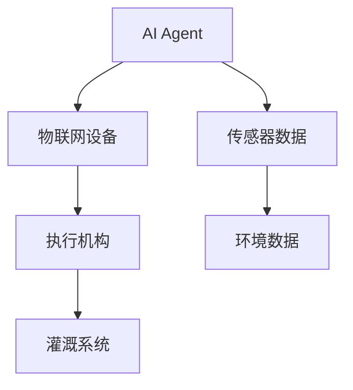
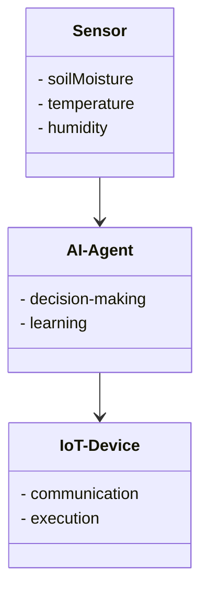
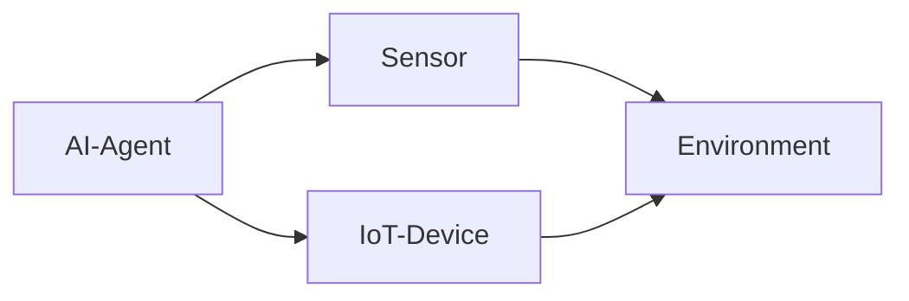

                 


# 智能花园灌溉系统：AI Agent的精准浇水控制

> 关键词：智能花园灌溉系统、AI Agent、精准浇水、物联网、强化学习、系统架构设计

> 摘要：本文详细探讨了智能花园灌溉系统的设计与实现，重点介绍了AI Agent如何通过精准浇水控制实现高效的水资源管理。文章从背景、核心概念、算法原理、系统架构到项目实战，全面解析了智能花园灌溉系统的实现过程，为读者提供了从理论到实践的详细指导。

---

## 第一章: 智能花园灌溉系统概述

### 1.1 问题背景与描述

#### 1.1.1 传统灌溉系统的不足
传统灌溉系统主要依赖人工操作或简单的定时器控制，存在以下问题：
- **水资源浪费**：无法根据土壤湿度、天气情况调整浇水频率和量。
- **效率低下**：人工操作耗时耗力，且容易出现过度或不足浇水的情况。
- **缺乏智能化**：无法实时感知环境变化，无法与物联网设备联动。

#### 1.1.2 精准灌溉的需求
精准灌溉的目标是根据植物的实际需求，提供适量的水分，减少浪费，提高作物产量和质量。实现精准灌溉需要：
- 实时监测土壤湿度、气象数据（温度、湿度、光照）等环境参数。
- 根据数据动态调整灌溉策略。

#### 1.1.3 AI Agent在灌溉控制中的作用
AI Agent（智能体）能够通过感知环境数据，学习和优化灌溉策略，实现智能化的精准浇水控制。其主要作用包括：
- **数据采集与分析**：通过物联网设备采集环境数据，分析土壤湿度、气象条件等。
- **决策与控制**：基于分析结果，制定最优灌溉计划，并通过物联网设备执行。
- **自适应优化**：通过强化学习不断优化灌溉策略，适应环境变化。

### 1.2 问题解决与边界

#### 1.2.1 精准浇水的解决方案
AI Agent结合物联网技术，通过以下步骤实现精准浇水：
1. **数据采集**：传感器采集土壤湿度、气象数据。
2. **数据传输**：通过物联网将数据传输到AI Agent。
3. **决策制定**：AI Agent根据数据和预设策略，决定是否需要浇水。
4. **执行控制**：向执行机构（如电磁阀）发送指令，启动或停止灌溉。

#### 1.2.2 系统的边界与外延
- **系统边界**：仅关注灌溉控制，不涉及施肥、病虫害防治等其他农业管理功能。
- **外延**：可扩展至更大规模的农业灌溉系统，或与其他农业管理系统集成。

#### 1.2.3 核心要素与组成结构
智能花园灌溉系统的组成包括：
- **传感器**：土壤湿度传感器、气象传感器。
- **物联网设备**：网关、通信模块。
- **AI Agent**：负责数据处理、决策制定。
- **执行机构**：电磁阀、水泵。

---

## 第二章: 核心概念与联系

### 2.1 AI Agent原理

#### 2.1.1 AI Agent的基本概念
AI Agent是一种智能实体，能够感知环境、自主决策并执行动作。在灌溉系统中，AI Agent通过感知环境数据，优化灌溉策略。

#### 2.1.2 基于模型的强化学习
AI Agent通过强化学习优化灌溉策略。强化学习的核心是通过试错学习，选择最优动作以最大化奖励。在灌溉系统中：
- **状态**：土壤湿度、气象数据。
- **动作**：启动或停止灌溉。
- **奖励**：节约用水、提高作物产量。

#### 2.1.3 AI Agent在灌溉中的应用
AI Agent通过分析历史数据，学习土壤湿度的变化规律，优化灌溉时间间隔和水量。

### 2.2 物联网与精准灌溉

#### 2.2.1 物联网在灌溉系统中的作用
物联网设备负责采集和传输环境数据，执行AI Agent的决策指令。

#### 2.2.2 精准灌溉的实现方式
通过实时数据采集和智能决策，实现按需浇水，避免浪费。

#### 2.2.3 物联网与AI Agent的结合
物联网提供数据采集和执行能力，AI Agent提供智能决策能力，二者结合实现精准灌溉。

### 2.3 核心概念对比

#### 2.3.1 AI Agent与传统自动控制的对比
| 对比维度 | AI Agent | 传统自动控制 |
|----------|-----------|--------------|
| 智能性   | 高         | 低           |
| 学习能力 | 高         | 无           |
| 灵活性   | 高         | 低           |

#### 2.3.2 精准灌溉与传统灌溉的对比
| 对比维度 | 精准灌溉 | 传统灌溉 |
|----------|----------|-----------|
| 水资源利用率 | 高       | 低         |
| 人工干预 | 低       | 高         |
| 适应性   | 高       | 低         |

#### 2.3.3 物联网技术的优劣势分析
优势：
- 数据采集实时性强。
- 支持远程控制。
劣势：
- 部署成本较高。
- 系统复杂性增加。

---

## 第三章: 核心概念与联系

### 3.1 AI Agent与物联网的实体关系图



### 3.2 算法原理与流程图

```mermaid
graph
start
    --> 感知环境数据
    --> 分析数据
    --> 制定决策
    --> 执行指令
end
```

数学模型：  
状态空间表示为 \( S \)，动作空间表示为 \( A \)，奖励函数 \( R(s, a) \)。  
策略函数 \( \pi(s) \) 表示在状态 \( s \) 下选择动作 \( a \) 的概率。  
目标是通过强化学习最大化累积奖励 \( J \)：
$$ J = \mathbb{E}[\sum_{t=0}^{\infty} \gamma^t R(s_t, a_t)] $$
其中，\( \gamma \) 是折扣因子。

---

## 第四章: 系统分析与架构设计

### 4.1 项目背景与需求

#### 4.1.1 项目背景
本项目旨在设计一个基于AI Agent的智能花园灌溉系统，实现精准浇水控制。

#### 4.1.2 系统功能需求
- 实时监测土壤湿度、气象数据。
- AI Agent动态调整灌溉策略。
- 通过物联网设备执行灌溉指令。

### 4.2 系统功能设计

#### 4.2.1 领域模型


#### 4.2.2 系统架构设计


#### 4.2.3 接口设计
- AI-Agent与Sensor的接口：数据采集。
- AI-Agent与IoT-Device的接口：控制指令。

### 4.3 系统交互流程图

```mermaid
graph LR
A[AI-Agent] --> B[Sensor]: 请求数据
B --> A: 返回数据
A --> C[IoT-Device]: 发送控制指令
C --> D[执行机构]: 执行灌溉
```

---

## 第五章: 项目实战

### 5.1 环境安装与配置

#### 5.1.1 系统环境
- 操作系统：Linux（推荐）
- 开发工具：Python、TensorFlow、Raspberry Pi
- 物联网设备：传感器模块、Wi-Fi模块

#### 5.1.2 安装依赖
```bash
pip install tensorflow scikit-learn
```

### 5.2 系统核心实现

#### 5.2.1 AI Agent实现
```python
import numpy as np
from tensorflow.keras import layers

# 定义强化学习模型
model = Sequential()
model.add(layers.Dense(64, activation='relu', input_dim=4))
model.add(layers.Dense(1, activation='sigmoid'))
model.compile(optimizer='adam', loss='binary_crossentropy')
```

#### 5.2.2 物联网通信实现
```python
import serial

ser = serial.Serial('/dev/ttyUSB0', 9600)
def send_command(command):
    ser.write(command.encode())
```

### 5.3 实际案例分析

#### 5.3.1 数据采集与分析
假设传感器采集到土壤湿度为60%，温度为25℃，湿度为60%。AI Agent分析后决定启动灌溉。

#### 5.3.2 灌溉执行
IoT-Device接收启动指令，打开电磁阀，开始灌溉。

---

## 第六章: 最佳实践与小结

### 6.1 最佳实践
- 定期校准传感器，确保数据准确性。
- 定期更新AI Agent模型，优化灌溉策略。

### 6.2 小结
本文详细介绍了智能花园灌溉系统的实现过程，从背景、核心概念、算法原理到系统架构和项目实战，全面解析了AI Agent在精准浇水控制中的应用。

### 6.3 注意事项
- 确保物联网设备的通信稳定性。
- 定期维护系统，防止硬件故障。

### 6.4 拓展阅读
- 加强学习在农业自动化中的应用。
- 基于边缘计算的智能灌溉系统设计。

---

## 作者

作者：AI天才研究院（AI Genius Institute）  
联系邮箱：contact@aiguru.com  
文章版权归作者所有，转载请注明出处。

---

这篇文章详细探讨了智能花园灌溉系统的实现过程，结合理论与实践，为读者提供了全面的指导。

