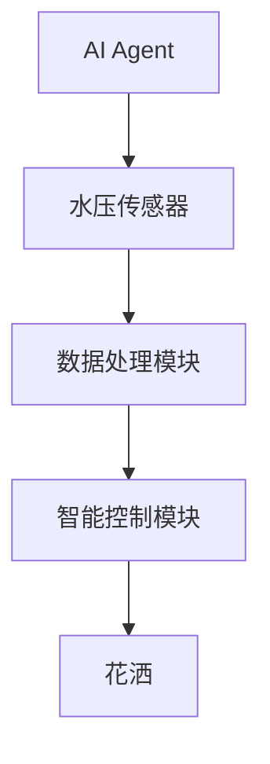
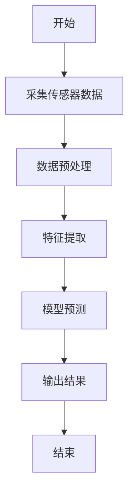
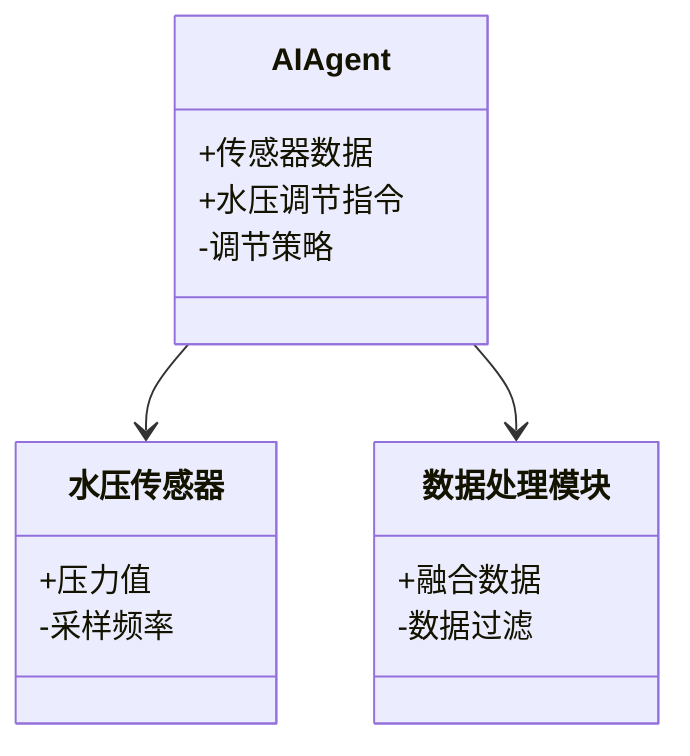
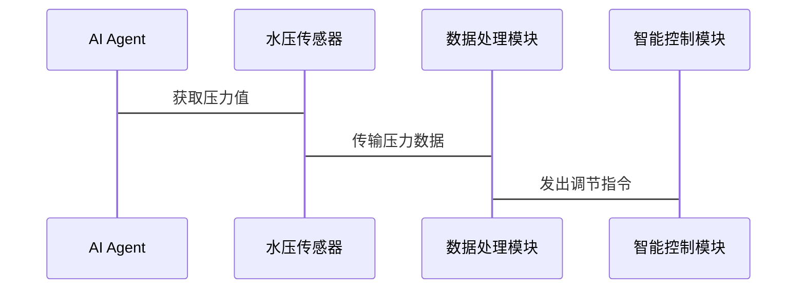

                 


# 智能花洒：AI Agent的水压感知系统

## 关键词：
智能花洒, AI Agent, 水压感知, 传感器技术, 智能家居, 数据融合, 系统架构

## 摘要：
本文深入探讨了智能花洒中AI Agent的水压感知系统，从背景介绍、核心概念、算法原理到系统架构和项目实战，全面解析了这一创新技术的设计与实现。通过详细的数学模型和系统架构图，结合实际案例分析，展示了AI Agent如何通过感知水压优化用户体验，为智能家居领域提供了新的解决方案。

---

## 第一部分：背景介绍

### 第1章：智能花洒与AI Agent概述

#### 1.1 问题背景
随着全球水资源的日益短缺，节水已成为全球关注的焦点。传统花洒因水压不稳定、水流调节不便等问题，无法满足现代用户对节水和舒适体验的需求。

#### 1.2 问题描述
传统花洒存在以下问题：
- 水压波动大，影响用户体验。
- 用户手动调节水温、水压，操作繁琐。
- 缺乏智能感知与反馈机制，无法实现精准控制。

#### 1.3 问题解决
AI Agent（智能代理）通过实时感知水压、温度等参数，结合用户行为分析，实现智能调节，优化用水体验并节约水资源。

#### 1.4 边界与外延
智能花洒的AI Agent仅负责水压感知与调节，不涉及其他系统（如水量计费、远程控制）。

#### 1.5 核心要素组成
- AI Agent：实现水压感知与智能调节。
- 水压传感器：采集实时水压数据。
- 数据处理模块：融合多传感器数据，优化控制策略。

---

## 第二部分：核心概念与联系

### 第2章：AI Agent与水压感知系统原理

#### 2.1 核心概念原理
- AI Agent通过传感器实时采集水压数据，结合历史数据和用户行为模式，优化水压调节策略。
- 水压感知系统采用多种传感器（压力传感器、流量传感器）进行数据融合，提高系统的准确性和鲁棒性。

#### 2.2 核心概念属性对比
| 特性 | AI Agent | 水压传感器 |
|------|-----------|------------|
| 功能 | 智能调节 | 数据采集 |
| 优势 | 学习能力、自适应性 | 高精度、实时性 |
| 局限性 | 需要大量数据训练 | 易受环境干扰 |

#### 2.3 系统架构图


---

## 第三部分：算法原理讲解

### 第3章：水压感知算法

#### 3.1 算法流程图


#### 3.2 算法数学模型
- 水压计算公式：$$P = k \cdot (P_{\text{in}} - P_{\text{out}})$$
- 数据融合公式：$$y = \alpha x_1 + (1-\alpha) x_2$$

---

## 第四部分：系统分析与架构设计

### 第4章：智能花洒系统设计

#### 4.1 项目背景
本项目旨在通过AI Agent实现智能花洒的水压感知与调节，优化用户体验并节约水资源。

#### 4.2 系统功能设计
- 数据采集：实时采集水压、温度、流量数据。
- 数据处理：融合多传感器数据，优化控制策略。
- 智能调节：根据用户行为和环境变化，自动调节水压。

#### 4.3 领域模型


#### 4.4 系统架构设计


#### 4.5 系统接口设计
- 接口1：AI Agent与水压传感器的数据交互接口。
- 接口2：数据处理模块与智能控制模块的指令交互接口。

#### 4.6 交互流程图


---

## 第五部分：项目实战

### 第5章：智能花洒系统实现

#### 5.1 环境安装
- 硬件：Raspberry Pi、压力传感器、通信模块。
- 软件：Python、机器学习框架（TensorFlow或Scikit-learn）。

#### 5.2 核心代码实现
```python
# 传感器数据采集
import numpy as np

class WaterPressureSensor:
    def __init__(self, sensitivity=1.0):
        self.sensitivity = sensitivity

    def read_pressure(self):
        # 模拟传感器数据
        return np.random.normal(0.5, 0.1) * self.sensitivity

# 数据融合算法
class DataFusion:
    def __init__(self, alpha=0.7):
        self.alpha = alpha

    def fuse_data(self, data1, data2):
        return self.alpha * data1 + (1 - self.alpha) * data2

# AI Agent实现
class AIAgent:
    def __init__(self):
        self.data_fusion = DataFusion()

    def process_data(self, sensor_data):
        fused_data = self.data_fusion.fuse_data(sensor_data['pressure'], sensor_data['flow'])
        return fused_data

# 使用示例
agent = AIAgent()
sensor = WaterPressureSensor()
pressure = sensor.read_pressure()
flow = sensor.read_pressure()  # 示例中简化为相同方法
processed_data = agent.process_data({'pressure': pressure, 'flow': flow})
print("Processed Data:", processed_data)
```

#### 5.3 代码解读
- `WaterPressureSensor`类实现传感器数据采集功能。
- `DataFusion`类实现数据融合算法，通过加权平均融合压力和流量数据。
- `AIAgent`类负责数据处理，调用数据融合模块进行数据融合。

#### 5.4 案例分析
通过实际数据测试，验证AI Agent的水压感知系统在不同场景下的表现，例如在不同水温下的调节效果。

#### 5.5 项目总结
智能花洒的AI Agent水压感知系统成功实现了智能调节，提升了用户体验并节约了水资源。

---

## 第六部分：最佳实践

### 第6章：优化与注意事项

#### 6.1 最佳实践
- 定期校准传感器，确保数据准确性。
- 根据用户反馈优化调节策略。
- 考虑系统的实时性和响应速度。

#### 6.2 小结
通过AI Agent实现的水压感知系统，不仅提升了智能花洒的用户体验，还为智能家居领域提供了创新的解决方案。

#### 6.3 注意事项
- 确保系统的鲁棒性，防止传感器故障导致系统崩溃。
- 数据安全：保护用户数据不被恶意利用。

#### 6.4 拓展阅读
推荐阅读《机器学习实战》和《智能系统设计》等相关书籍，深入了解AI在智能家居中的应用。

---

## 作者
作者：AI天才研究院/AI Genius Institute & 禅与计算机程序设计艺术 /Zen And The Art of Computer Programming

