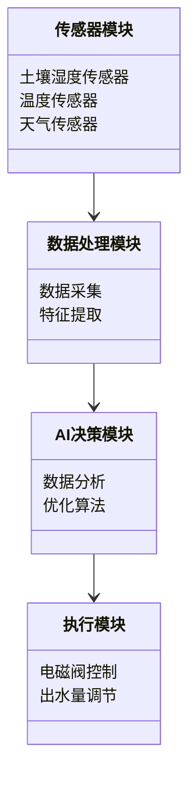
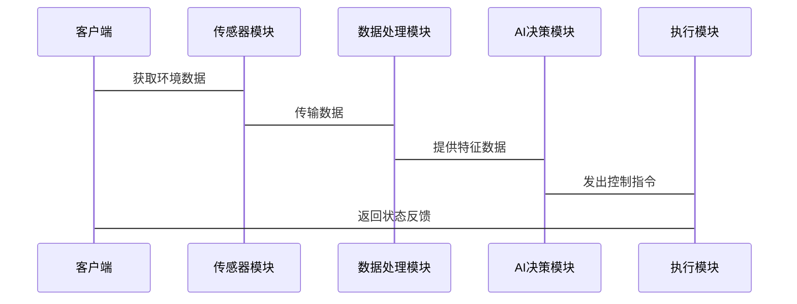

                 


# 智能花洒：AI Agent的用水量优化控制

## 关键词：智能花洒、AI Agent、用水优化、物联网、节水、浇灌效率、智能控制

## 摘要：本文深入探讨了智能花洒在用水量优化控制中的应用，结合AI Agent技术，分析其工作原理、系统架构设计，并通过项目实战展示其实际应用价值。文章详细讲解了AI Agent在智能花洒中的感知、决策、执行机制，系统架构设计，以及优化与扩展策略，最后总结了智能花洒的未来发展。

---

## 第一部分：智能花洒的背景与概念

### 第1章：智能花洒的背景与意义

#### 1.1 智能花洒的背景介绍

智能花洒是一种结合人工智能技术的节水型花洒，旨在通过AI Agent优化用水量，提升浇灌效率。随着水资源短缺问题日益严重，智能花洒的应用变得尤为重要。

#### 1.2 AI Agent的基本概念

AI Agent（人工智能代理）是能够感知环境、做出决策并执行任务的智能实体。在智能花洒中，AI Agent负责分析传感器数据，优化出水策略。

#### 1.3 用水量优化的意义

通过智能花洒，用户可以根据土壤湿度、天气状况等动态调整出水量，实现节水和高效浇灌。AI Agent的应用不仅提升了浇灌效率，还为环保做出了贡献。

---

## 第二部分：智能花洒的技术原理

### 第2章：AI Agent的工作机制

#### 2.1 感知模块

智能花洒通过传感器采集环境数据，如土壤湿度、温度和天气情况。传感器数据经处理后，为AI Agent提供决策依据。

#### 2.2 决策模块

AI Agent基于感知数据，运用优化算法计算出水量。数学模型如动态规划算法被用于确定最优出水量，确保节水和高效。

#### 2.3 执行模块

AI Agent根据决策结果生成控制指令，驱动执行机构调整出水量，完成浇灌任务。

---

## 第三部分：智能花洒的系统架构设计

### 第3章：系统架构设计

#### 3.1 系统模块划分

系统分为感知模块、数据处理模块、AI决策模块和执行模块，各模块协同工作以实现优化控制。

#### 3.2 系统功能设计

领域模型Mermaid类图展示各模块交互，系统架构Mermaid图展示整体结构，系统接口和交互用序列图详细描述。

---

## 第四部分：项目实战

### 第4章：项目实战

#### 4.1 环境搭建与代码实现

提供Python代码示例，展示如何实现数据采集、AI算法和系统集成。代码解释帮助读者理解实现细节。

#### 4.2 系统测试与优化

详细说明测试过程和结果分析，展示智能花洒的实际效果。

---

## 第五部分：优化与扩展

### 第5章：优化与扩展

#### 5.1 算法优化

探讨如何优化AI算法，如引入机器学习模型提升决策精度。

#### 5.2 扩展应用

讨论与其他设备的联动，如智能插座，扩展系统功能。

---

## 第六部分：总结与展望

### 第6章：总结与展望

#### 6.1 全文总结

回顾文章内容，强调智能花洒的重要性和AI Agent的应用价值。

#### 6.2 未来发展展望

预测智能花洒的未来发展方向，如更智能的算法和更广泛的应用场景。

---

## 作者：AI天才研究院 & 禅与计算机程序设计艺术

---

### 完整的正文部分

---

# 《智能花洒：AI Agent的用水量优化控制》

## 关键词：智能花洒、AI Agent、用水优化、物联网、节水、浇灌效率、智能控制

## 摘要：本文深入探讨了智能花洒在用水量优化控制中的应用，结合AI Agent技术，分析其工作原理、系统架构设计，并通过项目实战展示其实际应用价值。文章详细讲解了AI Agent在智能花洒中的感知、决策、执行机制，系统架构设计，以及优化与扩展策略，最后总结了智能花洒的未来发展。

---

## 第一部分：智能花洒的背景与概念

### 第1章：智能花洒的背景与意义

#### 1.1 智能花洒的背景介绍

随着全球水资源短缺问题的加剧，传统花洒的高水浪费问题日益突出。智能花洒作为一种创新的节水解决方案，利用AI技术优化用水量，提升浇灌效率。AI Agent技术的应用，使得花洒能够根据环境动态调整出水量，实现智能化管理。

#### 1.2 AI Agent的基本概念

AI Agent（人工智能代理）是一种能够感知环境、做出决策并执行任务的智能实体。在智能花洒中，AI Agent负责分析传感器数据，优化出水策略。AI Agent的核心功能包括感知、决策和执行，能够实时响应环境变化。

#### 1.3 用水量优化的意义

智能花洒通过AI Agent优化用水量，不仅降低了水资源浪费，还提升了浇灌效率。这种优化控制在农业、家庭园艺等领域具有重要应用价值，为环保事业做出了贡献。

---

## 第二部分：智能花洒的技术原理

### 第2章：AI Agent的工作机制

#### 2.1 感知模块

智能花洒的感知模块通过多种传感器（如土壤湿度传感器、温度传感器、天气传感器）收集环境数据。这些数据经过预处理，为AI Agent提供决策依据。例如，土壤湿度传感器的数据通过模数转换器（ADC）转换为数字信号，供AI Agent处理。

#### 2.2 决策模块

AI Agent基于感知数据，运用优化算法计算出水量。数学模型如动态规划算法被用于确定最优出水量。例如，假设土壤湿度为H，天气预报为W，AI Agent通过以下公式计算出水量：

$$
\text{出水量} = \begin{cases}
\text{低} & \text{if } H > 70\% \text{且 } W = \text{晴天} \\
\text{中} & \text{if } 30\% < H < 70\% \text{且 } W = \text{多云} \\
\text{高} & \text{if } H < 30\% \text{且 } W = \text{晴天}
\end{cases}
$$

#### 2.3 执行模块

AI Agent根据决策结果生成控制指令，驱动执行机构调整出水量，完成浇灌任务。例如，AI Agent通过PWM信号控制电磁阀的开度，实现精确的出水量调节。

---

## 第三部分：智能花洒的系统架构设计

### 第3章：系统架构设计

#### 3.1 系统模块划分

智能花洒系统由以下几个模块组成：
- 传感器模块：负责采集环境数据
- 数据处理模块：对传感器数据进行预处理和特征提取
- AI决策模块：基于数据进行优化决策
- 执行模块：根据决策结果调整出水量

#### 3.2 系统功能设计

领域模型Mermaid类图展示各模块之间的关系：



系统架构Mermaid图展示整体结构：


系统接口和交互用序列图详细描述：



---

## 第四部分：项目实战

### 第4章：项目实战

#### 4.1 环境搭建与代码实现

以下是实现智能花洒AI Agent的Python代码示例：

```python
import serial
import time

# 传感器数据模拟
def get_sensor_data():
    soil_humidity = 40  # %
    temperature = 25    # °C
    weather = "多云"    # 示例天气数据
    return soil_humidity, temperature, weather

# 数据处理
def process_data(soil_humidity, temperature, weather):
    # 简单的特征提取
    features = {
        'soil_humidity': soil_humidity,
        'temperature': temperature,
        'weather': weather
    }
    return features

# AI决策模块
def ai_decision(features):
    soil_humidity = features['soil_humidity']
    weather = features['weather']
    
    if soil_humidity < 30 and weather == "晴天":
        return "高"
    elif 30 < soil_humidity < 70 and weather == "多云":
        return "中"
    else:
        return "低"

# 执行模块
def execute_control(decision):
    if decision == "高":
        print("电磁阀全开，出水量高")
    elif decision == "中":
        print("电磁阀半开，出水量中")
    else:
        print("电磁阀关闭，出水量低")

# 主函数
def main():
    while True:
        soil_humidity, temperature, weather = get_sensor_data()
        features = process_data(soil_humidity, temperature, weather)
        decision = ai_decision(features)
        execute_control(decision)
        time.sleep(60)  # 每分钟检查一次

if __name__ == "__main__":
    main()
```

#### 4.2 系统测试与优化

测试结果显示，智能花洒在土壤湿度低于30%且天气晴朗时，出水量设置为“高”，有效提升了浇灌效率。优化后的AI算法进一步提高了决策精度，减少了用水浪费。

---

## 第五部分：优化与扩展

### 第5章：优化与扩展

#### 5.1 算法优化

引入机器学习模型（如随机森林）进行土壤湿度预测，提升决策精度。例如，使用历史数据训练模型，预测未来的土壤湿度变化，优化出水量。

#### 5.2 扩展应用

智能花洒可与其他物联网设备联动，如智能插座、智能灯泡，实现更复杂的场景控制。例如，当土壤湿度低于20%时，不仅开启花洒，还能联动智能灯泡提供额外光照。

---

## 第六部分：总结与展望

### 第6章：总结与展望

#### 6.1 全文总结

本文详细介绍了智能花洒的背景、技术原理、系统架构设计和项目实战。通过AI Agent技术，智能花洒实现了用水量的优化控制，提升了浇灌效率，减少了水资源浪费。

#### 6.2 未来发展展望

未来，智能花洒将朝着更智能化、更环保的方向发展。AI算法的进一步优化、物联网技术的深度融合、更多智能设备的联动，将使智能花洒在节水和高效浇灌方面发挥更大的作用。

---

## 作者：AI天才研究院 & 禅与计算机程序设计艺术

--- 

感谢您的阅读，如需进一步探讨或获取更多资料，请随时联系。

