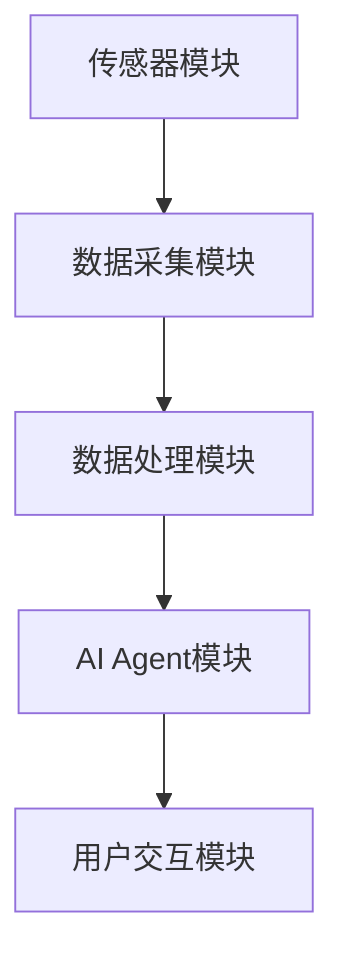

                 


# 智能花瓶：AI Agent的室内空气净化监测

> 关键词：智能花瓶, AI Agent, 室内空气质量, 环境监测, 智能家居

> 摘要：智能花瓶通过AI Agent实现室内空气质量的实时监测与净化控制，结合传感器技术、机器学习算法和智能家居系统，为用户提供智能化的空气质量管理解决方案。本文详细阐述了智能花瓶的设计原理、关键技术、系统架构及实现过程。

---

## 第一章：智能花瓶的概念与应用

### 1.1 智能花瓶的定义与背景

智能花瓶是一种结合了物联网、人工智能和环境监测技术的智能家居设备。它不仅是一个装饰品，更是一个能够实时监测室内空气质量并采取相应措施的智能装置。随着人们对生活环境质量要求的提高，智能花瓶逐渐成为家庭和办公场所提升空气质量的重要工具。

#### 1.1.1 智能花瓶的概念

智能花瓶通过内置的传感器实时监测空气中的PM2.5、甲醛、CO2、温湿度等指标，并通过AI Agent进行数据分析和决策，实现空气净化设备的智能控制。它能够联动智能净化器、加湿器、空调等设备，为用户提供一个健康舒适的室内环境。

#### 1.1.2 智能花瓶的应用场景

智能花瓶适用于家庭、办公室、酒店等多种场景。在家庭中，它可以帮助用户实时了解空气质量，特别是在儿童、老人或有呼吸系统疾病的家庭成员中，智能花瓶能够提供及时的空气质量预警和改善建议。在办公环境中，智能花瓶可以有效监测并改善封闭空间的空气质量，提升员工健康和工作效率。

#### 1.1.3 智能花瓶的市场潜力

随着人们对健康的关注不断增加，智能家居设备的普及率也在快速提升。智能花瓶作为智能家居生态中的一员，具有广阔的市场前景。预计未来几年，随着技术的进步和成本的降低，智能花瓶将会成为更多家庭的选择。

### 1.2 AI Agent与室内空气净化监测的结合

AI Agent（人工智能代理）是一种能够感知环境、自主决策并执行任务的智能系统。在智能花瓶中，AI Agent负责接收传感器数据，分析空气质量状况，并根据预设的规则或模型做出相应的控制决策。

#### 1.2.1 AI Agent的基本概念

AI Agent通过传感器数据输入，结合历史数据和环境模型，利用机器学习算法进行分析和预测，最终做出是否开启净化设备、调整净化强度等决策。AI Agent的核心在于其智能算法和数据处理能力。

#### 1.2.2 室内空气净化监测的重要性

室内空气质量直接影响人们的健康。长期处于空气质量不佳的环境中，容易引发呼吸道疾病、过敏反应等问题。通过智能花瓶实时监测和改善空气质量，可以有效预防这些健康问题。

#### 1.2.3 AI Agent在空气净化监测中的作用

AI Agent在智能花瓶中的作用主要体现在以下几个方面：
1. **实时监测**：通过传感器实时采集空气质量数据。
2. **智能决策**：基于传感器数据和历史数据，分析当前空气质量状况，决定是否启动净化设备。
3. **联动控制**：与智能家居系统联动，调节空调、加湿器等设备，优化室内环境。

### 1.3 智能花瓶的核心功能与技术

智能花瓶的核心功能包括空气质量监测、智能净化控制和与智能家居的联动。其实现依赖于传感器技术、AI算法和物联网通信技术。

#### 1.3.1 空气质量监测功能

智能花瓶通过内置的空气质量传感器，实时监测PM2.5、甲醛、CO2等指标，并通过AI Agent进行数据分析。

#### 1.3.2 AI Agent的智能决策机制

AI Agent通过机器学习算法对传感器数据进行分析，结合预设的空气质量标准，决定是否启动净化设备或调整净化强度。

#### 1.3.3 与智能家居系统的联动

智能花瓶可以通过Wi-Fi或蓝牙连接到智能家居系统，与其他设备协同工作，实现更高效的环境优化。

---

## 第二章：智能花瓶的核心技术与原理

### 2.1 AI Agent的原理与实现

#### 2.1.1 AI Agent的基本原理

AI Agent通过传感器数据输入，结合机器学习算法进行分析和预测，做出相应的决策。其核心在于数据的采集、处理和分析能力。

#### 2.1.2 智能花瓶中的AI Agent实现

在智能花瓶中，AI Agent负责接收传感器数据，分析空气质量状况，并根据预设的规则或模型做出是否开启净化设备的决策。

#### 2.1.3 AI Agent的核心算法

常用的算法包括支持向量机（SVM）、随机森林（Random Forest）和神经网络（Neural Network）。这些算法可以帮助AI Agent更准确地预测空气质量变化趋势。

### 2.2 空气质量监测技术

#### 2.2.1 空气质量监测的原理

空气质量监测通过传感器采集数据，结合环境模型进行分析。常用的传感器包括PM2.5传感器、甲醛传感器和CO2传感器。

#### 2.2.2 传感器的选择与配置

在选择传感器时，需要考虑其灵敏度、精度和响应时间。合理的传感器配置可以提高监测的准确性。

#### 2.2.3 数据采集与处理

传感器数据采集后，需要进行预处理，包括数据清洗和特征提取。预处理后的数据可以更有效地用于AI Agent的分析。

---

## 第三章：智能花瓶的系统架构与实现

### 3.1 系统架构设计

智能花瓶的系统架构包括传感器模块、数据采集模块、数据处理模块、AI Agent模块和用户交互模块。每个模块之间通过标准化接口进行通信。

#### 3.1.1 系统功能设计

系统功能包括实时监测、智能决策、设备控制和用户交互。用户可以通过手机APP或语音助手查看空气质量并进行手动控制。

#### 3.1.2 系统架构图



### 3.2 系统实现细节

#### 3.2.1 传感器模块

传感器模块负责采集空气质量数据，并通过UART或I2C接口将数据传递给数据采集模块。

#### 3.2.2 数据采集模块

数据采集模块将传感器数据进行初步处理，并通过Wi-Fi或蓝牙传输到数据处理模块。

#### 3.2.3 数据处理模块

数据处理模块对采集到的数据进行清洗和特征提取，并将结果传递给AI Agent模块。

#### 3.2.4 AI Agent模块

AI Agent模块基于机器学习模型对数据进行分析，并做出是否启动净化设备的决策。

#### 3.2.5 用户交互模块

用户可以通过手机APP或语音助手查看空气质量数据，并进行手动控制。

---

## 第四章：智能花瓶的算法实现

### 4.1 数据预处理

#### 4.1.1 数据清洗

数据清洗包括去除噪声数据、填补缺失值和标准化处理。

#### 4.1.2 特征提取

特征提取是通过主成分分析（PCA）等方法，从原始数据中提取出对空气质量影响最大的特征。

### 4.2 机器学习模型训练

#### 4.2.1 模型选择

常用的模型包括随机森林和神经网络。随机森林适用于特征较多的场景，而神经网络适合处理复杂的非线性关系。

#### 4.2.2 模型训练

模型训练包括数据的划分、特征工程和模型调优。训练好的模型可以用来预测未来的空气质量状况。

#### 4.2.3 模型评估

模型评估通过准确率、召回率和F1值等指标进行。评估结果可以用来优化模型和调整参数。

### 4.3 算法实现代码

```python
import numpy as np
from sklearn.ensemble import RandomForestRegressor
from sklearn.metrics import mean_squared_error

# 数据预处理
def preprocess(data):
    # 去除噪声数据
    cleaned_data = data.dropna()
    # 特征提取
    features = cleaned_data.drop(columns=['air_quality_index'])
    target = cleaned_data['air_quality_index']
    return features, target

# 模型训练
def train_model(features, target):
    model = RandomForestRegressor(n_estimators=100, random_state=42)
    model.fit(features, target)
    return model

# 模型评估
def evaluate(model, features, target):
    predictions = model.predict(features)
    mse = mean_squared_error(target, predictions)
    rmse = np.sqrt(mse)
    return rmse

# 主程序
if __name__ == "__main__":
    data = pd.read_csv('air_quality_data.csv')
    features, target = preprocess(data)
    model = train_model(features, target)
    rmse = evaluate(model, features, target)
    print(f"模型RMSE: {rmse}")
```

---

## 第五章：智能花瓶的系统优化与实际应用

### 5.1 系统优化

#### 5.1.1 传感器优化

选择更高精度的传感器，减少数据采集误差。

#### 5.1.2 算法优化

通过超参数调优和模型融合，提高空气质量预测的准确性。

### 5.2 实际应用案例

#### 5.2.1 案例分析

某家庭安装智能花瓶后，空气质量得到了显著提升，家庭成员的健康状况也有所改善。

#### 5.2.2 数据分析

通过长期数据分析，智能花瓶能够有效预测空气质量变化，并提前采取措施。

---

## 第六章：总结与展望

### 6.1 项目总结

智能花瓶通过AI Agent实现了室内空气质量的实时监测与智能控制，为用户提供了一个健康舒适的室内环境。

### 6.2 未来展望

未来，随着人工智能和物联网技术的进一步发展，智能花瓶的功能将更加智能化和多样化。

### 6.3 注意事项

在实际应用中，需要注意传感器的校准和维护，确保数据的准确性。

### 6.4 拓展阅读

推荐读者阅读《机器学习实战》和《物联网开发入门》等书籍，深入了解相关技术。

---

## 作者

作者：AI天才研究院/AI Genius Institute & 禅与计算机程序设计艺术 /Zen And The Art of Computer Programming

